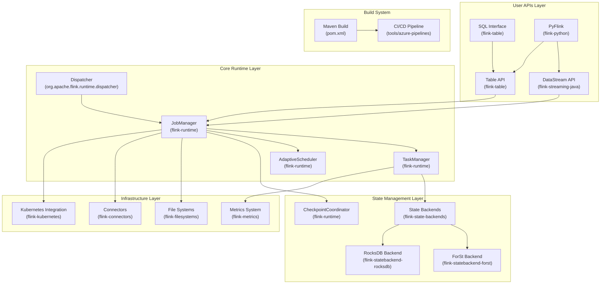
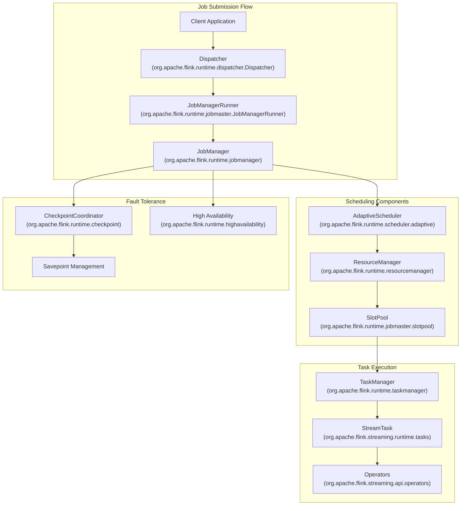
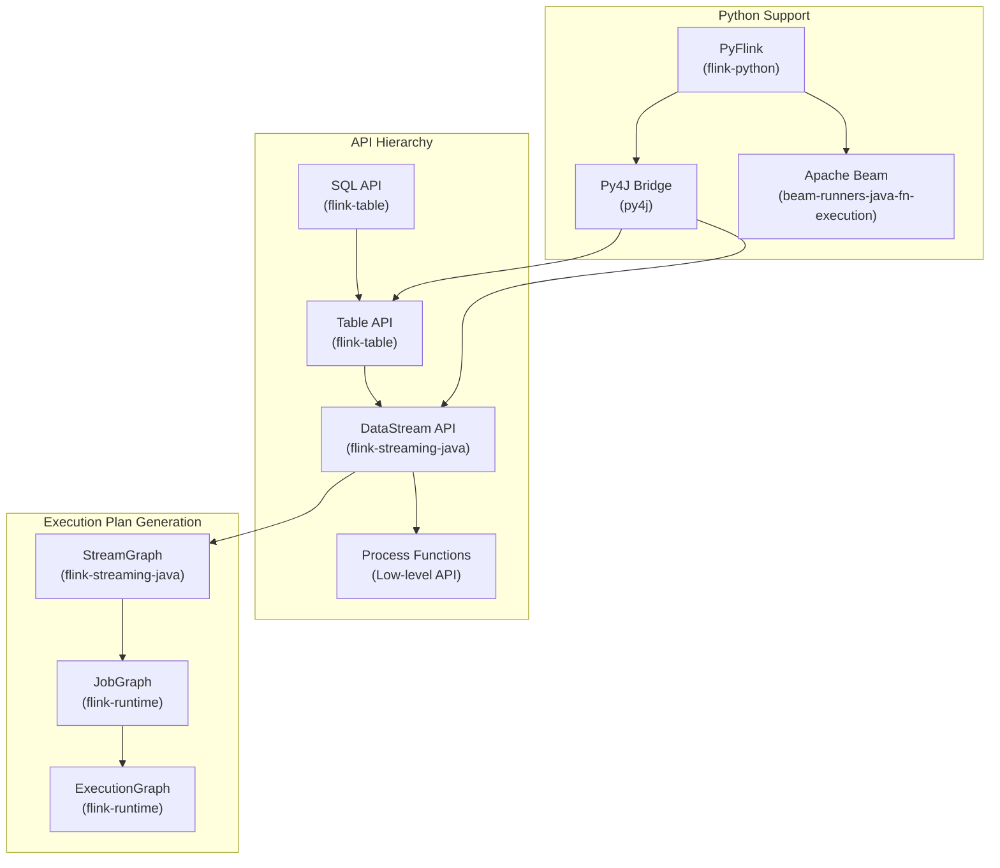
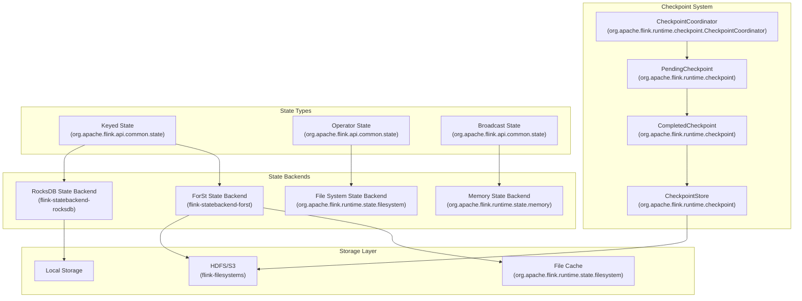
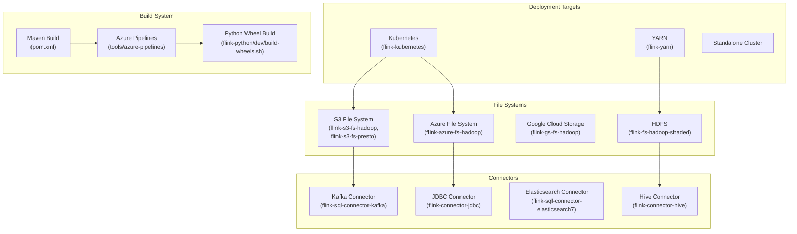
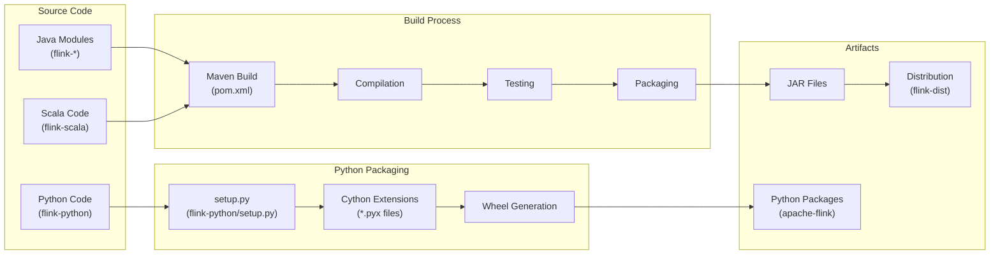

# Apache Flink Overview

Relevant source files

The following files were used as context for generating this wiki page:

- [docs/content.zh/docs/dev/python/datastream_tutorial.md](docs/content.zh/docs/dev/python/datastream_tutorial.md)
- [docs/content.zh/docs/dev/python/installation.md](docs/content.zh/docs/dev/python/installation.md)
- [docs/content.zh/docs/dev/python/table_api_tutorial.md](docs/content.zh/docs/dev/python/table_api_tutorial.md)
- [docs/content.zh/docs/flinkDev/building.md](docs/content.zh/docs/flinkDev/building.md)
- [docs/content.zh/docs/try-flink/local_installation.md](docs/content.zh/docs/try-flink/local_installation.md)
- [docs/content/docs/dev/python/datastream_tutorial.md](docs/content/docs/dev/python/datastream_tutorial.md)
- [docs/content/docs/dev/python/installation.md](docs/content/docs/dev/python/installation.md)
- [docs/content/docs/dev/python/table_api_tutorial.md](docs/content/docs/dev/python/table_api_tutorial.md)
- [docs/content/docs/flinkDev/building.md](docs/content/docs/flinkDev/building.md)
- [docs/content/docs/try-flink/local_installation.md](docs/content/docs/try-flink/local_installation.md)
- [flink-clients/src/main/java/org/apache/flink/client/deployment/application/ApplicationDispatcherGatewayServiceFactory.java](flink-clients/src/main/java/org/apache/flink/client/deployment/application/ApplicationDispatcherGatewayServiceFactory.java)
- [flink-dist/src/main/resources/META-INF/NOTICE](flink-dist/src/main/resources/META-INF/NOTICE)
- [flink-end-to-end-tests/test-scripts/test_kubernetes_application.sh](flink-end-to-end-tests/test-scripts/test_kubernetes_application.sh)
- [flink-filesystems/flink-azure-fs-hadoop/src/main/resources/META-INF/NOTICE](flink-filesystems/flink-azure-fs-hadoop/src/main/resources/META-INF/NOTICE)
- [flink-filesystems/flink-fs-hadoop-shaded/src/main/resources/META-INF/NOTICE](flink-filesystems/flink-fs-hadoop-shaded/src/main/resources/META-INF/NOTICE)
- [flink-filesystems/flink-gs-fs-hadoop/src/main/resources/META-INF/NOTICE](flink-filesystems/flink-gs-fs-hadoop/src/main/resources/META-INF/NOTICE)
- [flink-filesystems/flink-s3-fs-hadoop/src/main/resources/META-INF/NOTICE](flink-filesystems/flink-s3-fs-hadoop/src/main/resources/META-INF/NOTICE)
- [flink-filesystems/flink-s3-fs-presto/src/main/resources/META-INF/NOTICE](flink-filesystems/flink-s3-fs-presto/src/main/resources/META-INF/NOTICE)
- [flink-formats/flink-sql-avro-confluent-registry/src/main/resources/META-INF/NOTICE](flink-formats/flink-sql-avro-confluent-registry/src/main/resources/META-INF/NOTICE)
- [flink-formats/flink-sql-avro/src/main/resources/META-INF/NOTICE](flink-formats/flink-sql-avro/src/main/resources/META-INF/NOTICE)
- [flink-kubernetes/pom.xml](flink-kubernetes/pom.xml)
- [flink-kubernetes/src/main/resources/META-INF/NOTICE](flink-kubernetes/src/main/resources/META-INF/NOTICE)
- [flink-kubernetes/src/test/java/org/apache/flink/kubernetes/highavailability/KubernetesLeaderRetrievalDriverTest.java](flink-kubernetes/src/test/java/org/apache/flink/kubernetes/highavailability/KubernetesLeaderRetrievalDriverTest.java)
- [flink-python/README.md](flink-python/README.md)
- [flink-python/apache-flink-libraries/setup.py](flink-python/apache-flink-libraries/setup.py)
- [flink-python/dev/build-wheels.sh](flink-python/dev/build-wheels.sh)
- [flink-python/dev/dev-requirements.txt](flink-python/dev/dev-requirements.txt)
- [flink-python/dev/lint-python.sh](flink-python/dev/lint-python.sh)
- [flink-python/pom.xml](flink-python/pom.xml)
- [flink-python/pyflink/fn_execution/formats/avro.py](flink-python/pyflink/fn_execution/formats/avro.py)
- [flink-python/pyflink/gen_protos.py](flink-python/pyflink/gen_protos.py)
- [flink-python/pyproject.toml](flink-python/pyproject.toml)
- [flink-python/setup.py](flink-python/setup.py)
- [flink-python/src/main/resources/META-INF/NOTICE](flink-python/src/main/resources/META-INF/NOTICE)
- [flink-python/tox.ini](flink-python/tox.ini)
- [flink-runtime/src/main/java/org/apache/flink/runtime/dispatcher/Dispatcher.java](flink-runtime/src/main/java/org/apache/flink/runtime/dispatcher/Dispatcher.java)
- [flink-runtime/src/main/java/org/apache/flink/runtime/dispatcher/DispatcherFactory.java](flink-runtime/src/main/java/org/apache/flink/runtime/dispatcher/DispatcherFactory.java)
- [flink-runtime/src/main/java/org/apache/flink/runtime/dispatcher/DispatcherServices.java](flink-runtime/src/main/java/org/apache/flink/runtime/dispatcher/DispatcherServices.java)
- [flink-runtime/src/main/java/org/apache/flink/runtime/dispatcher/PartialDispatcherServices.java](flink-runtime/src/main/java/org/apache/flink/runtime/dispatcher/PartialDispatcherServices.java)
- [flink-runtime/src/main/java/org/apache/flink/runtime/dispatcher/PartialDispatcherServicesWithJobPersistenceComponents.java](flink-runtime/src/main/java/org/apache/flink/runtime/dispatcher/PartialDispatcherServicesWithJobPersistenceComponents.java)
- [flink-runtime/src/main/java/org/apache/flink/runtime/dispatcher/SessionDispatcherFactory.java](flink-runtime/src/main/java/org/apache/flink/runtime/dispatcher/SessionDispatcherFactory.java)
- [flink-runtime/src/main/java/org/apache/flink/runtime/dispatcher/StandaloneDispatcher.java](flink-runtime/src/main/java/org/apache/flink/runtime/dispatcher/StandaloneDispatcher.java)
- [flink-runtime/src/main/java/org/apache/flink/runtime/dispatcher/runner/AbstractDispatcherLeaderProcess.java](flink-runtime/src/main/java/org/apache/flink/runtime/dispatcher/runner/AbstractDispatcherLeaderProcess.java)
- [flink-runtime/src/main/java/org/apache/flink/runtime/dispatcher/runner/DefaultDispatcherGatewayServiceFactory.java](flink-runtime/src/main/java/org/apache/flink/runtime/dispatcher/runner/DefaultDispatcherGatewayServiceFactory.java)
- [flink-runtime/src/main/java/org/apache/flink/runtime/jobmaster/JobResult.java](flink-runtime/src/main/java/org/apache/flink/runtime/jobmaster/JobResult.java)
- [flink-runtime/src/test/java/org/apache/flink/runtime/checkpoint/ZKCheckpointIDCounterMultiServersTest.java](flink-runtime/src/test/java/org/apache/flink/runtime/checkpoint/ZKCheckpointIDCounterMultiServersTest.java)
- [flink-runtime/src/test/java/org/apache/flink/runtime/checkpoint/ZooKeeperCompletedCheckpointStoreTest.java](flink-runtime/src/test/java/org/apache/flink/runtime/checkpoint/ZooKeeperCompletedCheckpointStoreTest.java)
- [flink-runtime/src/test/java/org/apache/flink/runtime/dispatcher/AbstractDispatcherTest.java](flink-runtime/src/test/java/org/apache/flink/runtime/dispatcher/AbstractDispatcherTest.java)
- [flink-runtime/src/test/java/org/apache/flink/runtime/dispatcher/DispatcherCleanupITCase.java](flink-runtime/src/test/java/org/apache/flink/runtime/dispatcher/DispatcherCleanupITCase.java)
- [flink-runtime/src/test/java/org/apache/flink/runtime/dispatcher/DispatcherResourceCleanupTest.java](flink-runtime/src/test/java/org/apache/flink/runtime/dispatcher/DispatcherResourceCleanupTest.java)
- [flink-runtime/src/test/java/org/apache/flink/runtime/dispatcher/DispatcherTest.java](flink-runtime/src/test/java/org/apache/flink/runtime/dispatcher/DispatcherTest.java)
- [flink-runtime/src/test/java/org/apache/flink/runtime/dispatcher/TestingDispatcher.java](flink-runtime/src/test/java/org/apache/flink/runtime/dispatcher/TestingDispatcher.java)
- [flink-runtime/src/test/java/org/apache/flink/runtime/dispatcher/TestingJobManagerRunnerFactory.java](flink-runtime/src/test/java/org/apache/flink/runtime/dispatcher/TestingJobManagerRunnerFactory.java)
- [flink-runtime/src/test/java/org/apache/flink/runtime/dispatcher/TestingPartialDispatcherServices.java](flink-runtime/src/test/java/org/apache/flink/runtime/dispatcher/TestingPartialDispatcherServices.java)
- [flink-runtime/src/test/java/org/apache/flink/runtime/dispatcher/runner/DefaultDispatcherRunnerITCase.java](flink-runtime/src/test/java/org/apache/flink/runtime/dispatcher/runner/DefaultDispatcherRunnerITCase.java)
- [flink-runtime/src/test/java/org/apache/flink/runtime/dispatcher/runner/ZooKeeperDefaultDispatcherRunnerTest.java](flink-runtime/src/test/java/org/apache/flink/runtime/dispatcher/runner/ZooKeeperDefaultDispatcherRunnerTest.java)
- [flink-runtime/src/test/java/org/apache/flink/runtime/jobmaster/TestUtils.java](flink-runtime/src/test/java/org/apache/flink/runtime/jobmaster/TestUtils.java)
- [flink-runtime/src/test/java/org/apache/flink/runtime/jobmaster/TestingJobManagerRunner.java](flink-runtime/src/test/java/org/apache/flink/runtime/jobmaster/TestingJobManagerRunner.java)
- [flink-runtime/src/test/java/org/apache/flink/runtime/leaderelection/LeaderChangeClusterComponentsTest.java](flink-runtime/src/test/java/org/apache/flink/runtime/leaderelection/LeaderChangeClusterComponentsTest.java)
- [flink-runtime/src/test/java/org/apache/flink/runtime/leaderelection/StandaloneLeaderElectionTest.java](flink-runtime/src/test/java/org/apache/flink/runtime/leaderelection/StandaloneLeaderElectionTest.java)
- [flink-runtime/src/test/java/org/apache/flink/runtime/leaderelection/TestingRetrievalBase.java](flink-runtime/src/test/java/org/apache/flink/runtime/leaderelection/TestingRetrievalBase.java)
- [flink-runtime/src/test/java/org/apache/flink/runtime/leaderretrieval/DefaultLeaderRetrievalServiceTest.java](flink-runtime/src/test/java/org/apache/flink/runtime/leaderretrieval/DefaultLeaderRetrievalServiceTest.java)
- [flink-runtime/src/test/java/org/apache/flink/runtime/leaderretrieval/SettableLeaderRetrievalServiceTest.java](flink-runtime/src/test/java/org/apache/flink/runtime/leaderretrieval/SettableLeaderRetrievalServiceTest.java)
- [flink-state-backends/flink-statebackend-forst/pom.xml](flink-state-backends/flink-statebackend-forst/pom.xml)
- [flink-state-backends/flink-statebackend-forst/src/test/resources/log4j2-test.properties](flink-state-backends/flink-statebackend-forst/src/test/resources/log4j2-test.properties)
- [flink-state-backends/pom.xml](flink-state-backends/pom.xml)
- [pom.xml](pom.xml)
- [tools/azure-pipelines/build-python-wheels.yml](tools/azure-pipelines/build-python-wheels.yml)
- [tools/releasing/create_binary_release.sh](tools/releasing/create_binary_release.sh)

## Purpose and Scope

This document provides a comprehensive overview of Apache Flink as a distributed stream processing framework, covering its core architecture, key components, and programming interfaces. It introduces the fundamental concepts and system design that enable Flink to process both bounded and unbounded data streams with low latency and high throughput.

This overview focuses on the overall system architecture and major components. For detailed information about specific subsystems, see: Core Runtime Architecture ([2](#2)), Programming APIs ([3](#3)), System Management & Monitoring ([4](#4)), Connectors & External Integrations ([5](#5)), and Development & Build Infrastructure ([6](#6)).

## What is Apache Flink

Apache Flink is a distributed stream processing framework designed for stateful computations over unbounded and bounded data streams. It provides unified APIs for both batch and stream processing, enabling developers to build scalable data processing applications with exactly-once semantics and low-latency processing capabilities.

The framework operates on the principle of treating batch processing as a special case of stream processing, where bounded datasets are processed using the same runtime and APIs as unbounded streams. This approach provides consistency across different workload types while maintaining high performance.

Sources: [pom.xml:33-36](), [flink-dist/src/main/resources/META-INF/NOTICE:1-6]()

## Overall System Architecture

Flink's architecture consists of several interconnected layers that work together to provide a complete data processing platform:

This architecture provides a layered approach where each layer has specific responsibilities:
- **User APIs Layer**: Provides different programming interfaces for various use cases
- **Core Runtime Layer**: Manages job execution, scheduling, and cluster coordination
- **State Management Layer**: Handles fault tolerance and stateful computations
- **Infrastructure Layer**: Provides connectivity and deployment capabilities

Sources: [pom.xml:71-109](), [flink-runtime/src/main/java/org/apache/flink/runtime/dispatcher/Dispatcher.java:137-142]()

## Core Runtime Components

The core runtime forms the heart of Flink's execution engine, consisting of several key components that coordinate job execution:

The `Dispatcher` serves as the entry point for job submissions and manages the lifecycle of jobs within the cluster. It coordinates with the `JobManagerRunner` to spawn individual job execution instances and handles resource cleanup when jobs terminate.

Sources: [flink-runtime/src/main/java/org/apache/flink/runtime/dispatcher/Dispatcher.java:136-140](), [flink-runtime/src/test/java/org/apache/flink/runtime/dispatcher/DispatcherTest.java:153-163]()

## Programming APIs and Execution Plans

Flink provides multiple programming APIs that cater to different use cases and levels of abstraction:

The Python API (`PyFlink`) provides a bridge to Flink's Java runtime through the `Py4J` library, enabling Python developers to leverage Flink's capabilities while maintaining the performance characteristics of the underlying Java execution engine.

Sources: [flink-python/pom.xml:32-34](), [flink-python/setup.py:319-330](), [flink-python/dev/dev-requirements.txt:18-36]()

## State Management Architecture

Flink's state management system provides fault tolerance and enables stateful stream processing through a sophisticated checkpointing mechanism:

The ForSt state backend, implemented in `flink-statebackend-forst`, provides high-performance state storage with support for incremental checkpoints and efficient state access patterns.

Sources: [flink-state-backends/flink-statebackend-forst/pom.xml:33-67](), [flink-dist/src/main/resources/META-INF/NOTICE:10-11]()

## Infrastructure and Deployment

Flink's infrastructure layer supports various deployment environments and external integrations:

The Kubernetes integration, provided by the `flink-kubernetes` module, enables native deployment of Flink clusters on Kubernetes with support for dynamic resource allocation and container orchestration.

Sources: [flink-kubernetes/pom.xml:29-31](), [flink-kubernetes/src/main/resources/META-INF/NOTICE:1-5](), [tools/azure-pipelines/build-python-wheels.yml:1-2]()

## Build System and Development Workflow

Flink uses a comprehensive Maven-based build system that supports multiple programming languages and deployment targets:

The build system supports both traditional Java/Scala components and Python extensions, with specialized handling for PyFlink's native extensions and dependency management.

Sources: [pom.xml:18-31](), [flink-python/setup.py:102-171](), [flink-python/pyproject.toml:18-37](), [flink-python/dev/build-wheels.sh:1-10]()
