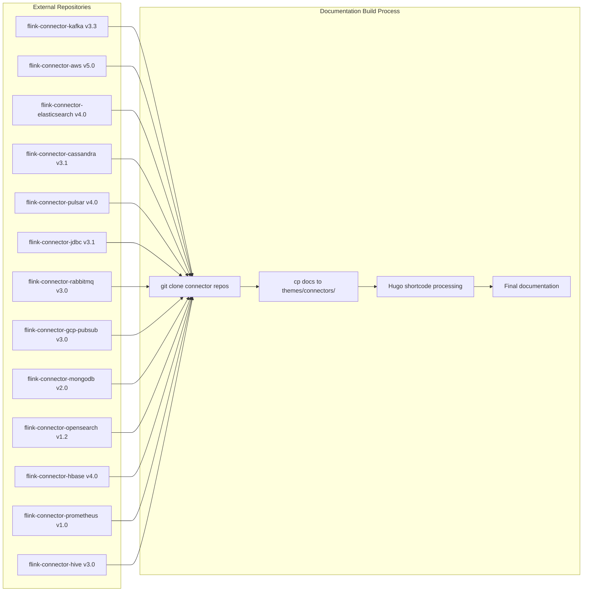
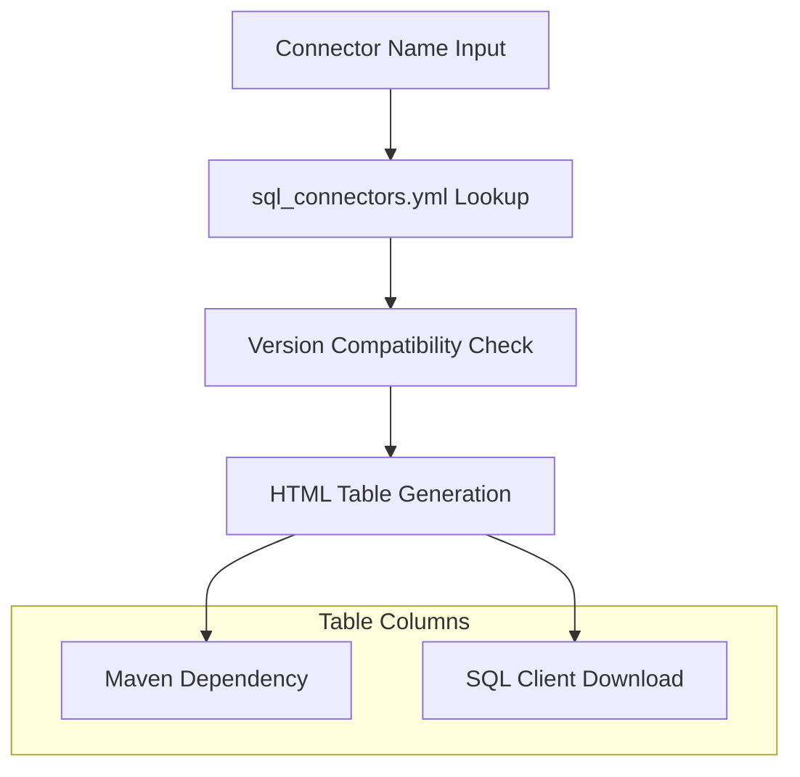
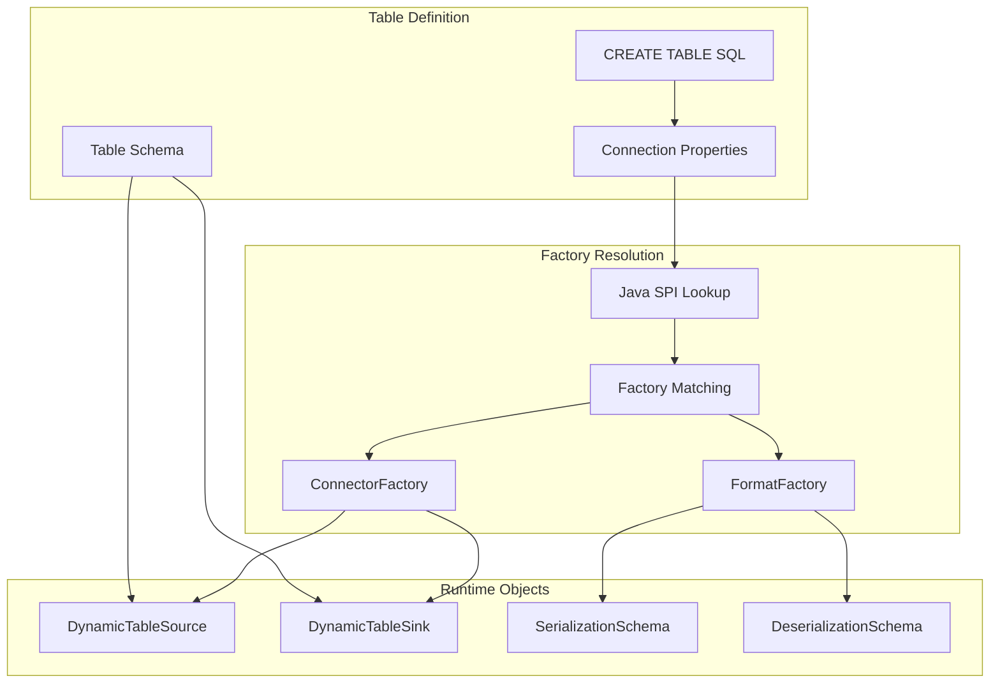

# Connector System

Relevant source files

The following files were used as context for generating this wiki page:

- [docs/content.zh/docs/connectors/datastream/guarantees.md](docs/content.zh/docs/connectors/datastream/guarantees.md)
- [docs/content.zh/docs/connectors/datastream/overview.md](docs/content.zh/docs/connectors/datastream/overview.md)
- [docs/content.zh/docs/connectors/table/formats/ogg.md](docs/content.zh/docs/connectors/table/formats/ogg.md)
- [docs/content.zh/docs/connectors/table/formats/orc.md](docs/content.zh/docs/connectors/table/formats/orc.md)
- [docs/content.zh/docs/connectors/table/formats/overview.md](docs/content.zh/docs/connectors/table/formats/overview.md)
- [docs/content.zh/docs/connectors/table/formats/raw.md](docs/content.zh/docs/connectors/table/formats/raw.md)
- [docs/content.zh/docs/connectors/table/overview.md](docs/content.zh/docs/connectors/table/overview.md)
- [docs/content/docs/connectors/datastream/guarantees.md](docs/content/docs/connectors/datastream/guarantees.md)
- [docs/content/docs/connectors/datastream/overview.md](docs/content/docs/connectors/datastream/overview.md)
- [docs/content/docs/connectors/table/formats/orc.md](docs/content/docs/connectors/table/formats/orc.md)
- [docs/content/docs/connectors/table/formats/overview.md](docs/content/docs/connectors/table/formats/overview.md)
- [docs/content/docs/connectors/table/formats/raw.md](docs/content/docs/connectors/table/formats/raw.md)
- [docs/content/docs/connectors/table/overview.md](docs/content/docs/connectors/table/overview.md)
- [docs/data/sql_connectors.yml](docs/data/sql_connectors.yml)
- [docs/layouts/shortcodes/connector_artifact.html](docs/layouts/shortcodes/connector_artifact.html)
- [docs/layouts/shortcodes/py_connector_download_link.html](docs/layouts/shortcodes/py_connector_download_link.html)
- [docs/layouts/shortcodes/sql_connector_download_table.html](docs/layouts/shortcodes/sql_connector_download_table.html)
- [docs/setup_docs.sh](docs/setup_docs.sh)

This document describes Flink's connector architecture and documentation system, which enables integration with external data sources and sinks. The connector system provides a unified framework for connecting Flink applications to databases, message queues, file systems, and other external systems through both the DataStream API and Table/SQL API.

For information about specific connector implementations, see [Hive Integration](#5.2). For details about the DataStream API that connectors integrate with, see [DataStream API](#3.2). For Table API integration details, see [Table API & SQL](#3.1).

## Architecture Overview

The connector system is built around a modular architecture where individual connectors are maintained as separate projects and integrated into the main Flink ecosystem through a documentation and dependency management system.

### Connector Project Structure

```mermaid
graph TB
    subgraph "External Connector Projects"
        KafkaRepo["flink-connector-kafka"]
        ESRepo["flink-connector-elasticsearch"]
        AWSRepo["flink-connector-aws"]
        CassandraRepo["flink-connector-cassandra"]
        PulsarRepo["flink-connector-pulsar"]
        JDBCRepo["flink-connector-jdbc"]
        RabbitRepo["flink-connector-rabbitmq"]
        GCPRepo["flink-connector-gcp-pubsub"]
        MongoRepo["flink-connector-mongodb"]
        OpenRepo["flink-connector-opensearch"]
        HBaseRepo["flink-connector-hbase"]
        PrometheusRepo["flink-connector-prometheus"]
        HiveRepo["flink-connector-hive"]
    end
    
    subgraph "Main Flink Repository"
        SetupScript["setup_docs.sh"]
        ConnectorRegistry["sql_connectors.yml"]
        DocsThemes["themes/connectors/"]
        Shortcodes["layouts/shortcodes/"]
    end
    
    subgraph "Generated Documentation"
        ConnDocs["Connector Documentation"]
        DownloadTables["Download Tables"]
        ArtifactInfo["Maven Artifact Info"]
    end
    
    KafkaRepo --> SetupScript
    ESRepo --> SetupScript
    AWSRepo --> SetupScript
    CassandraRepo --> SetupScript
    PulsarRepo --> SetupScript
    JDBCRepo --> SetupScript
    RabbitRepo --> SetupScript
    GCPRepo --> SetupScript
    MongoRepo --> SetupScript
    OpenRepo --> SetupScript
    HBaseRepo --> SetupScript
    PrometheusRepo --> SetupScript
    HiveRepo --> SetupScript
    
    SetupScript --> DocsThemes
    ConnectorRegistry --> Shortcodes
    DocsThemes --> ConnDocs
    Shortcodes --> DownloadTables
    Shortcodes --> ArtifactInfo
```

**Sources:** [docs/setup_docs.sh:26-66](), [docs/data/sql_connectors.yml:18-218]()

### Documentation Integration System

The connector documentation system uses the `integrate_connector_docs` function in `setup_docs.sh` to clone external connector repositories and integrate their documentation into the main Flink documentation build.

**Sources:** [docs/setup_docs.sh:54-66](), [docs/setup_docs.sh:26-36]()

## Connector Registry and Configuration

### SQL Connectors Configuration

The `sql_connectors.yml` file serves as the central registry for all SQL connectors, defining their Maven artifacts, download URLs, and versioning information.

| Connector | Category | Maven Artifact | Versioning |
|-----------|----------|----------------|------------|
| Kafka | connector | flink-connector-kafka | Universal |
| Elasticsearch | connector | flink-connector-elasticsearch6/7 | 6.x, 7.x+ |
| JDBC | connector | flink-connector-jdbc | Single version |
| HBase | connector | flink-connector-hbase-1.4/2.2 | 1.4.x, 2.2.x |
| Files | connector | flink-connector-files | Single version |
| Avro | format | flink-avro | Single version |
| Parquet | format | flink-parquet | Single version |
| ORC | format | flink-orc | Single version |

**Sources:** [docs/data/sql_connectors.yml:153-175](), [docs/data/sql_connectors.yml:125-151](), [docs/data/sql_connectors.yml:39-83]()

### Format Integration

Formats work alongside connectors to define how binary data is mapped to table columns. The format system supports both built-in and external formats:

```mermaid
graph TB
    subgraph "Built-in Formats"
        CSV["CSV format<br/>flink-csv"]
        JSON["JSON format<br/>flink-json"]
        RAW["RAW format<br/>flink-raw"]
    end
    
    subgraph "External Formats"
        Avro["Avro format<br/>flink-avro"]
        Parquet["Parquet format<br/>flink-parquet"]
        ORC["ORC format<br/>flink-orc"]
        Protobuf["Protobuf format<br/>flink-protobuf"]
        AvroConfluent["Avro Confluent<br/>flink-avro-confluent-registry"]
    end
    
    subgraph "CDC Formats"
        Debezium["Debezium CDC<br/>flink-json (builtin)"]
        Canal["Canal CDC<br/>flink-json (builtin)"]
        Maxwell["Maxwell CDC<br/>flink-json (builtin)"]
        OGG["OGG CDC<br/>flink-json (builtin)"]
    end
    
    subgraph "Supported Connectors"
        KafkaConn["Apache Kafka"]
        FilesysConn["Filesystem"]
        KinesisConn["Amazon Kinesis"]
        ElasticConn["Elasticsearch"]
    end
    
    CSV --> KafkaConn
    JSON --> KafkaConn
    JSON --> ElasticConn
    Avro --> KafkaConn
    Avro --> FilesysConn
    Parquet --> FilesysConn
    ORC --> FilesysConn
    Debezium --> KafkaConn
    Canal --> FilesysConn
```

**Sources:** [docs/data/sql_connectors.yml:39-118](), [docs/content/docs/connectors/table/formats/overview.md:33-112]()

## Documentation Generation System

### Shortcode Templates

The connector system uses Hugo shortcodes to generate consistent documentation across all connectors:

#### Connector Artifact Shortcode
The `connector_artifact.html` shortcode generates Maven dependency XML snippets for connectors:

Key functionality:
- Retrieves connector metadata from site data
- Checks Flink version compatibility using `flink_compatibility` field
- Generates Maven XML with proper `groupId`, `artifactId`, and `version`
- Supports Scala version suffixes when `withScalaVersion` flag is used

**Sources:** [docs/layouts/shortcodes/connector_artifact.html:24-73]()

#### SQL Connector Download Table
The `sql_connector_download_table.html` shortcode creates download tables for SQL connectors:

**Sources:** [docs/layouts/shortcodes/sql_connector_download_table.html:24-76]()

#### Python Connector Download Links
The `py_connector_download_link.html` shortcode handles PyFlink connector dependencies:

**Sources:** [docs/layouts/shortcodes/py_connector_download_link.html:21-75]()

## Connector APIs and Usage

### DataStream Connectors

DataStream connectors provide low-level integration for streaming applications. Available connectors include:

| Connector | Type | Fault Tolerance |
|-----------|------|-----------------|
| Apache Kafka | Source/Sink | Exactly-once |
| Apache Cassandra | Source/Sink | At-least-once/Exactly-once |
| Amazon DynamoDB | Sink | At-least-once |
| Amazon Kinesis | Source/Sink | Exactly-once/At-least-once |
| Elasticsearch | Sink | At-least-once |
| FileSystem | Source/Sink | Exactly-once |
| RabbitMQ | Source/Sink | At-most-once/Exactly-once |
| Google PubSub | Source/Sink | At-least-once |
| MongoDB | Source/Sink | Varies |
| Prometheus | Sink | At-least-once |

**Sources:** [docs/content/docs/connectors/datastream/overview.md:42-57](), [docs/content/docs/connectors/datastream/guarantees.md:47-153]()

### Table & SQL Connectors

Table connectors integrate with Flink's Table API and SQL interface, supporting both bounded and unbounded data processing:

#### Supported Table Connectors

| Connector | Source Capabilities | Sink Capabilities |
|-----------|---------------------|-------------------|
| Filesystem | Bounded/Unbounded Scan | Streaming/Batch Sink |
| Apache Kafka | Unbounded Scan | Streaming/Batch Sink |
| Apache HBase | Bounded Scan, Lookup | Streaming/Batch Sink |
| JDBC | Bounded Scan, Lookup | Streaming/Batch Sink |
| Apache Hive | Unbounded/Bounded Scan, Lookup | Streaming/Batch Sink |
| Elasticsearch | Not supported | Streaming/Batch Sink |
| MongoDB | Bounded Scan, Lookup | Streaming/Batch Sink |

**Sources:** [docs/content/docs/connectors/table/overview.md:51-117]()

#### Schema Definition and Factory System

Table connectors use the Service Provider Interface (SPI) pattern for factory discovery:

The factory system searches for implementations in `META-INF/services/org.apache.flink.table.factories.Factory` files. When building uber-jars with multiple connectors, the `ServicesResourceTransformer` Maven plugin should be used to merge these files properly.

**Sources:** [docs/content/docs/connectors/table/overview.md:156-222]()

## Build System Integration

### Maven Dependency Management

Connectors are distributed as separate Maven artifacts that users must include in their projects. The build system handles:

1. **Dependency Resolution**: Connectors specify their Maven coordinates in `sql_connectors.yml`
2. **Version Compatibility**: Each connector defines compatible Flink versions
3. **Download Generation**: Shortcodes generate appropriate download links and Maven snippets
4. **SPI Resource Merging**: Build configuration handles merging of SPI service files

### Documentation Build Process

The documentation build process integrates external connector documentation through:

1. **Repository Cloning**: `setup_docs.sh` clones connector repositories at specific versions
2. **Documentation Extraction**: Connector docs are copied to `themes/connectors/`
3. **Template Processing**: Hugo processes shortcodes to generate final documentation
4. **Artifact Generation**: Download tables and dependency information are generated

**Sources:** [docs/setup_docs.sh:47-70](), [docs/content/docs/connectors/table/overview.md:169-222]()

This connector system provides a scalable architecture for maintaining and documenting Flink's extensive ecosystem of external integrations while keeping the core framework lean and focused.
