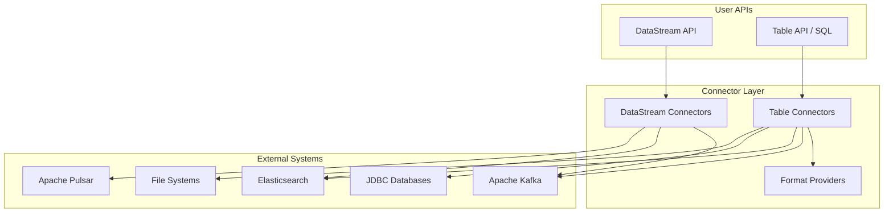
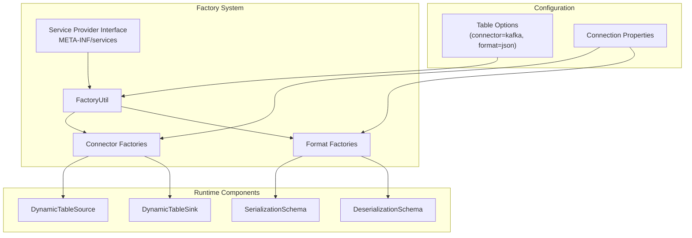
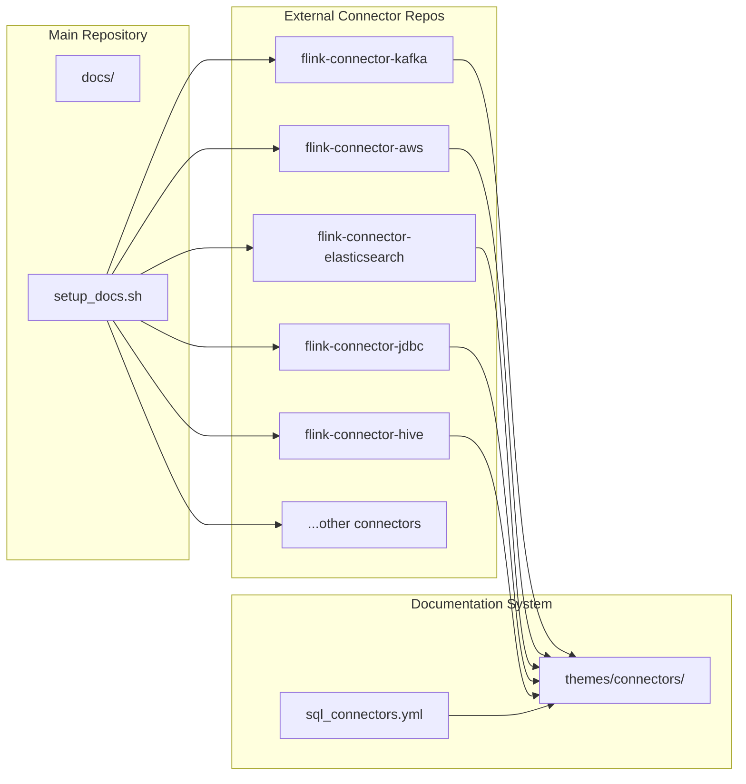
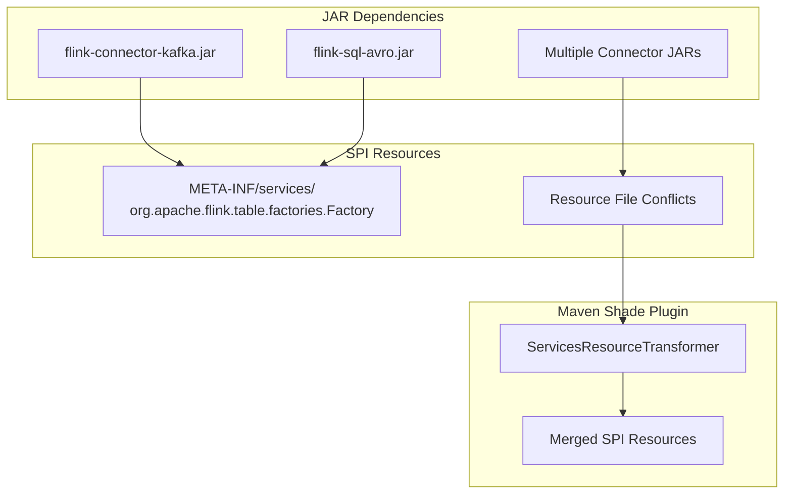
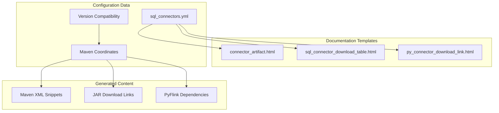

# Connectors & External Integrations

<details>
<summary>Relevant source files</summary>

The following files were used as context for generating this wiki page:

- [docs/content.zh/docs/connectors/datastream/guarantees.md](docs/content.zh/docs/connectors/datastream/guarantees.md)
- [docs/content.zh/docs/connectors/datastream/overview.md](docs/content.zh/docs/connectors/datastream/overview.md)
- [docs/content.zh/docs/connectors/table/formats/ogg.md](docs/content.zh/docs/connectors/table/formats/ogg.md)
- [docs/content.zh/docs/connectors/table/formats/orc.md](docs/content.zh/docs/connectors/table/formats/orc.md)
- [docs/content.zh/docs/connectors/table/formats/overview.md](docs/content.zh/docs/connectors/table/formats/overview.md)
- [docs/content.zh/docs/connectors/table/formats/raw.md](docs/content.zh/docs/connectors/table/formats/raw.md)
- [docs/content.zh/docs/connectors/table/overview.md](docs/content.zh/docs/connectors/table/overview.md)
- [docs/content/docs/connectors/datastream/guarantees.md](docs/content/docs/connectors/datastream/guarantees.md)
- [docs/content/docs/connectors/datastream/overview.md](docs/content/docs/connectors/datastream/overview.md)
- [docs/content/docs/connectors/table/formats/orc.md](docs/content/docs/connectors/table/formats/orc.md)
- [docs/content/docs/connectors/table/formats/overview.md](docs/content/docs/connectors/table/formats/overview.md)
- [docs/content/docs/connectors/table/formats/raw.md](docs/content/docs/connectors/table/formats/raw.md)
- [docs/content/docs/connectors/table/overview.md](docs/content/docs/connectors/table/overview.md)
- [docs/data/sql_connectors.yml](docs/data/sql_connectors.yml)
- [docs/layouts/shortcodes/connector_artifact.html](docs/layouts/shortcodes/connector_artifact.html)
- [docs/layouts/shortcodes/py_connector_download_link.html](docs/layouts/shortcodes/py_connector_download_link.html)
- [docs/layouts/shortcodes/sql_connector_download_table.html](docs/layouts/shortcodes/sql_connector_download_table.html)
- [docs/setup_docs.sh](docs/setup_docs.sh)
- [flink-table/flink-table-api-java/src/test/java/org/apache/flink/table/catalog/CatalogTestBase.java](flink-table/flink-table-api-java/src/test/java/org/apache/flink/table/catalog/CatalogTestBase.java)
- [flink-table/flink-table-api-java/src/test/java/org/apache/flink/table/catalog/GenericInMemoryCatalogTest.java](flink-table/flink-table-api-java/src/test/java/org/apache/flink/table/catalog/GenericInMemoryCatalogTest.java)
- [flink-table/flink-table-planner/src/main/java/org/apache/flink/table/planner/functions/sql/FlinkCurrentDateDynamicFunction.java](flink-table/flink-table-planner/src/main/java/org/apache/flink/table/planner/functions/sql/FlinkCurrentDateDynamicFunction.java)
- [flink-table/flink-table-planner/src/main/java/org/apache/flink/table/planner/functions/sql/FlinkCurrentRowTimestampFunction.java](flink-table/flink-table-planner/src/main/java/org/apache/flink/table/planner/functions/sql/FlinkCurrentRowTimestampFunction.java)
- [flink-table/flink-table-planner/src/main/java/org/apache/flink/table/planner/functions/sql/FlinkTimestampDynamicFunction.java](flink-table/flink-table-planner/src/main/java/org/apache/flink/table/planner/functions/sql/FlinkTimestampDynamicFunction.java)
- [flink-table/flink-table-planner/src/main/java/org/apache/flink/table/planner/functions/sql/FlinkTimestampWithPrecisionDynamicFunction.java](flink-table/flink-table-planner/src/main/java/org/apache/flink/table/planner/functions/sql/FlinkTimestampWithPrecisionDynamicFunction.java)

</details>


This page provides an overview of how Apache Flink integrates with external systems through connectors and format providers. Connectors enable Flink applications to read from and write to various data sources and sinks, while format providers handle serialization and deserialization of data between Flink's internal representation and external storage formats.

For detailed information about the connector system architecture and documentation framework, see [Connector System](#5.1). For specific details about Hive integration capabilities, see [Hive Integration](#5.2).

## Connector Architecture Overview

Flink's connector ecosystem is built around a factory-based plugin system that uses Java's Service Provider Interface (SPI) mechanism. The system separates connectors (which handle data transport) from formats (which handle data serialization).

### Connector Categories

**DataStream Connectors vs Table Connectors**



Sources: [docs/content/docs/connectors/datastream/overview.md:28-85](), [docs/content/docs/connectors/table/overview.md:27-122]()

The connector ecosystem supports two primary integration patterns:

- **DataStream Connectors**: Low-level connectors that work with the DataStream API for custom streaming logic
- **Table Connectors**: High-level connectors that integrate with Table API and SQL for declarative data processing

### Factory-Based Plugin System

**Connector Discovery and Instantiation**



Sources: [docs/content/docs/connectors/table/overview.md:156-164](), [flink-table/flink-table-api-java/src/test/java/org/apache/flink/table/catalog/CatalogTestBase.java:190-194]()

The factory system uses string-based key-value pairs to configure connectors and formats. Each connector and format implements factory interfaces that are discovered through Java's SPI mechanism stored in `META-INF/services` directories.

## Supported Connectors and Formats

### External Connector Repositories

Flink maintains connectors in separate repositories that are integrated into the documentation build process:



Sources: [docs/setup_docs.sh:26-70](), [docs/data/sql_connectors.yml:18-218]()

The build system automatically integrates connector documentation from external repositories during documentation generation. The `setup_docs.sh` script clones specific versions of connector repositories and copies their documentation into the main documentation tree.

### Format Provider System

**Built-in and External Formats**

| Format Category | Built-in | External JAR Required |
|-----------------|----------|----------------------|
| **Serialization Formats** | CSV, JSON, RAW | Avro, Parquet, ORC, Protobuf |
| **CDC Formats** | Debezium, Canal, Maxwell | Confluent Schema Registry |
| **Compression** | None | Snappy, GZIP (via formats) |

Sources: [docs/data/sql_connectors.yml:39-218](), [docs/content/docs/connectors/table/formats/overview.md:31-112]()

Format providers handle the serialization and deserialization of data between Flink's internal representation and external storage formats. Built-in formats are included in the Flink distribution, while external formats require additional JAR dependencies.

## Integration Patterns

### Table API Integration

**SQL DDL Connector Configuration**

The Table API uses declarative SQL DDL statements to configure connectors:

```sql
CREATE TABLE kafka_table (
  user_id BIGINT,
  message STRING,
  ts TIMESTAMP(3) METADATA FROM 'timestamp',
  WATERMARK FOR ts AS ts - INTERVAL '5' SECOND
) WITH (
  'connector' = 'kafka',
  'topic' = 'user_events',
  'properties.bootstrap.servers' = 'localhost:9092',
  'format' = 'json'
)
```

Sources: [docs/content/docs/connectors/table/overview.md:136-154]()

The `WITH` clause contains connector-specific configuration properties that are passed to the factory system for connector instantiation.

### Service Provider Interface Configuration

**SPI Resource Management**



Sources: [docs/content/docs/connectors/table/overview.md:166-222]()

When building uber-JARs with multiple connectors, SPI resource files can conflict. The Maven Shade Plugin's `ServicesResourceTransformer` merges these files to prevent factory loading failures.

## Fault Tolerance and Delivery Guarantees

### Source Guarantees

| Connector | Guarantee | Requirements |
|-----------|-----------|--------------|
| Apache Kafka | Exactly-once | Checkpointing enabled |
| Amazon Kinesis | Exactly-once | Checkpointing enabled |
| RabbitMQ | At-most-once (v0.10) / Exactly-once (v1.0) | Version dependent |
| Files | Exactly-once | Built-in support |
| Google PubSub | At-least-once | External acknowledgment |

Sources: [docs/content/docs/connectors/datastream/guarantees.md:38-82]()

### Sink Guarantees

| Connector | Guarantee | Notes |
|-----------|-----------|--------|
| Kafka Producer | At-least-once / Exactly-once | Exactly-once with transactional producers |
| Elasticsearch | At-least-once | No transaction support |
| File Sinks | Exactly-once | Built-in checkpoint integration |
| JDBC | At-least-once / Exactly-once | Exactly-once for idempotent operations |

Sources: [docs/content/docs/connectors/datastream/guarantees.md:89-154]()

Fault tolerance guarantees depend on both the connector implementation and the external system's capabilities. Sources must participate in Flink's checkpointing mechanism to provide exactly-once state semantics.

## Documentation and Artifact Management

### Connector Artifact Templates

The documentation system provides templates for generating Maven dependency information and download links for connectors:



Sources: [docs/layouts/shortcodes/connector_artifact.html:19-74](), [docs/layouts/shortcodes/sql_connector_download_table.html:19-78](), [docs/layouts/shortcodes/py_connector_download_link.html:18-76]()

The documentation system automatically generates Maven dependency snippets and download links based on connector metadata defined in YAML configuration files.

### External Integration Ecosystem

**Apache Bahir Connectors**

Beyond the official Flink connectors, additional connectors are available through Apache Bahir:

- Apache ActiveMQ (source/sink)
- Apache Flume (sink)
- Redis (sink)
- Akka (sink)
- Netty (source)

Sources: [docs/content/docs/connectors/datastream/overview.md:65-74]()

These connectors extend Flink's integration capabilities to additional external systems not covered by the core connector ecosystem.

This connector and integration system enables Flink to work with a wide variety of external systems while maintaining a consistent programming model and providing configurable fault tolerance guarantees. The modular design allows for easy extension and community contribution of new connectors and formats.
