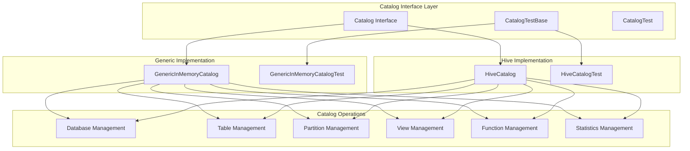
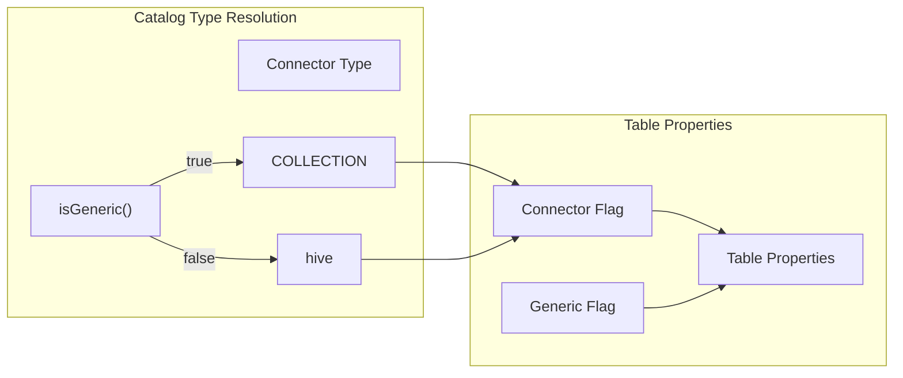
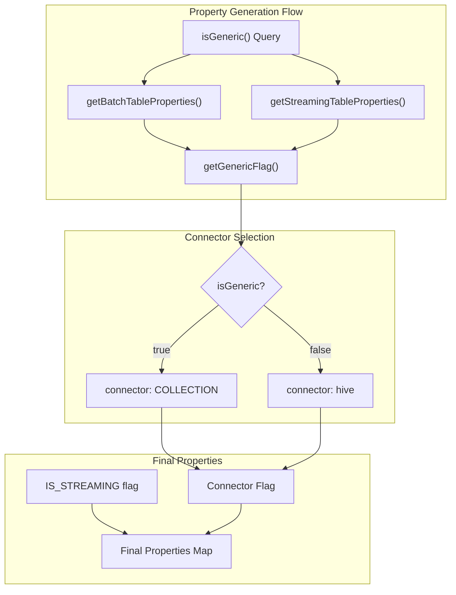
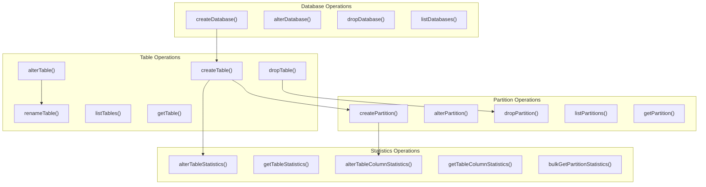
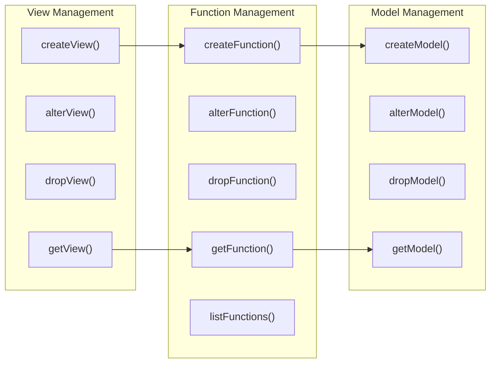
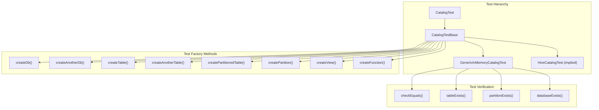
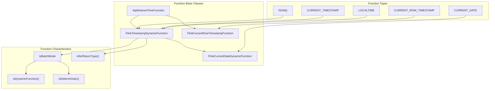
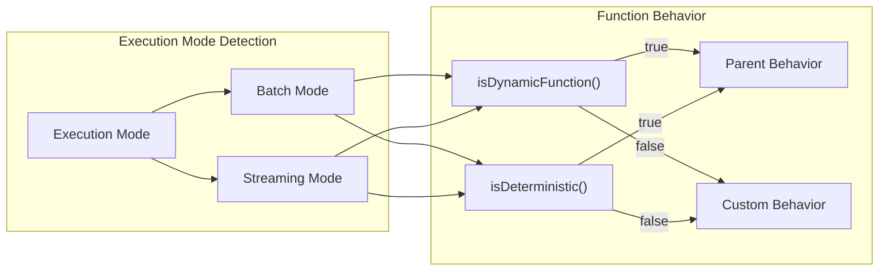

# Hive Integration

Relevant source files

The following files were used as context for generating this wiki page:

- [flink-table/flink-table-api-java/src/test/java/org/apache/flink/table/catalog/CatalogTestBase.java](flink-table/flink-table-api-java/src/test/java/org/apache/flink/table/catalog/CatalogTestBase.java)
- [flink-table/flink-table-api-java/src/test/java/org/apache/flink/table/catalog/GenericInMemoryCatalogTest.java](flink-table/flink-table-api-java/src/test/java/org/apache/flink/table/catalog/GenericInMemoryCatalogTest.java)
- [flink-table/flink-table-planner/src/main/java/org/apache/flink/table/planner/functions/sql/FlinkCurrentDateDynamicFunction.java](flink-table/flink-table-planner/src/main/java/org/apache/flink/table/planner/functions/sql/FlinkCurrentDateDynamicFunction.java)
- [flink-table/flink-table-planner/src/main/java/org/apache/flink/table/planner/functions/sql/FlinkCurrentRowTimestampFunction.java](flink-table/flink-table-planner/src/main/java/org/apache/flink/table/planner/functions/sql/FlinkCurrentRowTimestampFunction.java)
- [flink-table/flink-table-planner/src/main/java/org/apache/flink/table/planner/functions/sql/FlinkTimestampDynamicFunction.java](flink-table/flink-table-planner/src/main/java/org/apache/flink/table/planner/functions/sql/FlinkTimestampDynamicFunction.java)
- [flink-table/flink-table-planner/src/main/java/org/apache/flink/table/planner/functions/sql/FlinkTimestampWithPrecisionDynamicFunction.java](flink-table/flink-table-planner/src/main/java/org/apache/flink/table/planner/functions/sql/FlinkTimestampWithPrecisionDynamicFunction.java)

## Purpose and Scope

This document covers Flink's Hive integration capabilities, focusing on catalog integration, query processing support, and the architectural foundations that enable Hive connectivity. The Hive integration allows Flink to interact with Hive metastores, execute queries using Hive dialect, and leverage existing Hive table definitions and metadata.

For general connector architecture and implementation patterns, see [Connector System](#5.1). For broader Table API and SQL processing capabilities, see [Table API & SQL](#3.1).

## Catalog Integration Architecture

Flink's Hive integration is built on top of the catalog abstraction, which provides a unified interface for accessing metadata from different sources. The catalog system supports databases, tables, partitions, views, functions, and statistics management.

### Catalog Abstraction Layer

The catalog system provides a common interface that supports both generic in-memory catalogs and external catalog implementations like Hive:

Sources: [flink-table/flink-table-api-java/src/test/java/org/apache/flink/table/catalog/CatalogTestBase.java:29-30](), [flink-table/flink-table-api-java/src/test/java/org/apache/flink/table/catalog/GenericInMemoryCatalogTest.java:47-53]()

### Connector Type Resolution

The catalog system distinguishes between generic and Hive-specific implementations through connector type resolution:

Sources: [flink-table/flink-table-api-java/src/test/java/org/apache/flink/table/catalog/CatalogTestBase.java:187-194](), [flink-table/flink-table-api-java/src/test/java/org/apache/flink/table/catalog/GenericInMemoryCatalogTest.java:215-217]()

## Hive vs Generic Catalog Distinction

The catalog implementation provides a clear distinction between generic and Hive-specific functionality through the `isGeneric()` method pattern:

| Aspect | Generic Catalog | Hive Catalog |
|--------|----------------|--------------|
| Connector Type | `COLLECTION` | `hive` |
| Implementation | `GenericInMemoryCatalog` | `HiveCatalog` |
| Test Base | `isGeneric() → true` | `isGeneric() → false` |
| Storage | In-memory | Hive Metastore |
| Metadata Persistence | Transient | Persistent |

The table properties generation demonstrates this distinction:

Sources: [flink-table/flink-table-api-java/src/test/java/org/apache/flink/table/catalog/CatalogTestBase.java:169-194]()

## Catalog Operations Support

The Hive integration supports comprehensive catalog operations through the same interface used by generic catalogs:

### Database and Table Management

Sources: [flink-table/flink-table-api-java/src/test/java/org/apache/flink/table/catalog/GenericInMemoryCatalogTest.java:58-140](), [flink-table/flink-table-api-java/src/test/java/org/apache/flink/table/catalog/GenericInMemoryCatalogTest.java:143-210]()

### View and Function Management

The catalog system also supports views and functions, which are essential for Hive compatibility:

Sources: [flink-table/flink-table-api-java/src/test/java/org/apache/flink/table/catalog/CatalogTestBase.java:142-167](), [flink-table/flink-table-api-java/src/test/java/org/apache/flink/table/catalog/GenericInMemoryCatalogTest.java:243-261]()

## Testing Infrastructure

The Hive integration leverages a comprehensive testing framework that ensures compatibility across different catalog implementations:

### Test Base Architecture

Sources: [flink-table/flink-table-api-java/src/test/java/org/apache/flink/table/catalog/CatalogTestBase.java:30](), [flink-table/flink-table-api-java/src/test/java/org/apache/flink/table/catalog/GenericInMemoryCatalogTest.java:47]()

### Statistics Testing

The testing framework includes comprehensive statistics validation, which is crucial for Hive integration where table and partition statistics drive query optimization:

| Statistics Type | Table Level | Partition Level | Bulk Operations |
|----------------|-------------|-----------------|-----------------|
| Table Statistics | `alterTableStatistics()` | `alterPartitionStatistics()` | `bulkGetPartitionStatistics()` |
| Column Statistics | `alterTableColumnStatistics()` | `alterPartitionColumnStatistics()` | `bulkGetPartitionColumnStatistics()` |
| Validation | `getTableStatistics()` | `getPartitionStatistics()` | List-based retrieval |

Sources: [flink-table/flink-table-api-java/src/test/java/org/apache/flink/table/catalog/GenericInMemoryCatalogTest.java:96-140](), [flink-table/flink-table-api-java/src/test/java/org/apache/flink/table/catalog/GenericInMemoryCatalogTest.java:143-210]()

## SQL Function Integration

The Hive integration includes support for SQL function compatibility, particularly around timestamp and date functions that may have different semantics between Hive and Flink:

### Dynamic Function Support

Sources: [flink-table/flink-table-planner/src/main/java/org/apache/flink/table/planner/functions/sql/FlinkTimestampDynamicFunction.java:38-51](), [flink-table/flink-table-planner/src/main/java/org/apache/flink/table/planner/functions/sql/FlinkCurrentDateDynamicFunction.java:34-51](), [flink-table/flink-table-planner/src/main/java/org/apache/flink/table/planner/functions/sql/FlinkCurrentRowTimestampFunction.java:36-62]()

### Batch vs Streaming Function Behavior

The function implementations demonstrate how Hive compatibility is handled differently in batch and streaming contexts:

Sources: [flink-table/flink-table-planner/src/main/java/org/apache/flink/table/planner/functions/sql/FlinkTimestampDynamicFunction.java:49-57](), [flink-table/flink-table-planner/src/main/java/org/apache/flink/table/planner/functions/sql/FlinkCurrentDateDynamicFunction.java:43-51]()

The Hive integration provides a robust foundation for accessing Hive metastores and executing Hive-compatible queries within Flink's unified batch and streaming processing framework.
