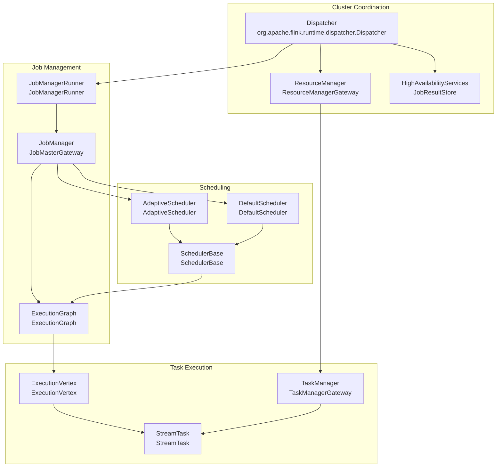
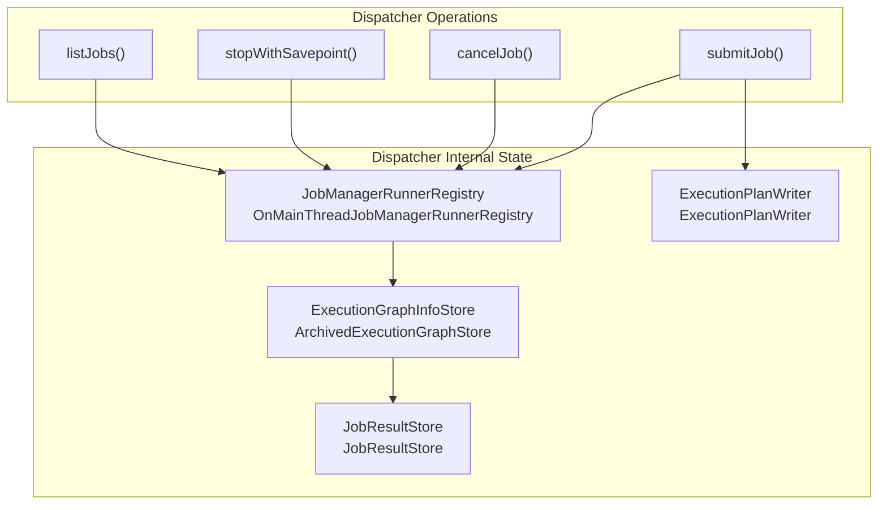
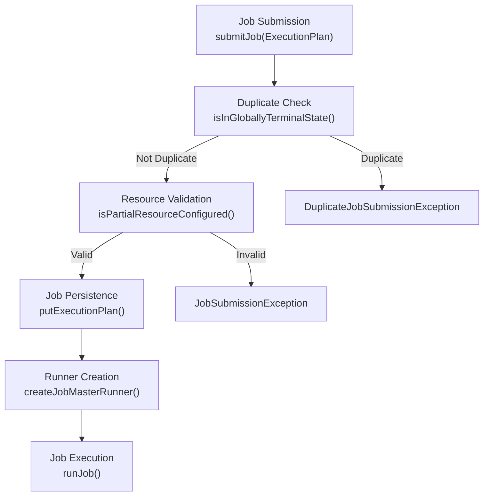
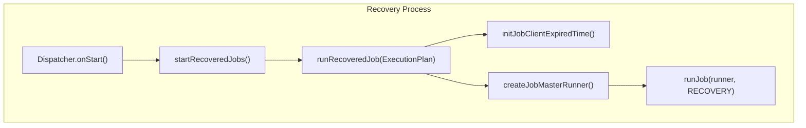
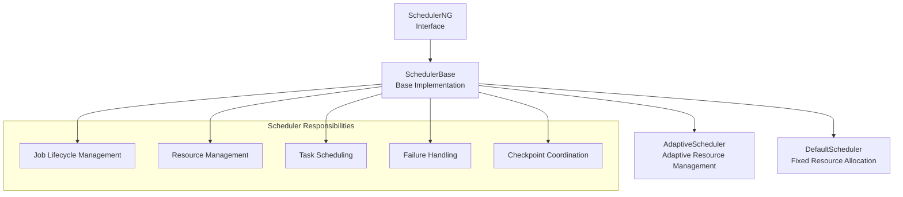
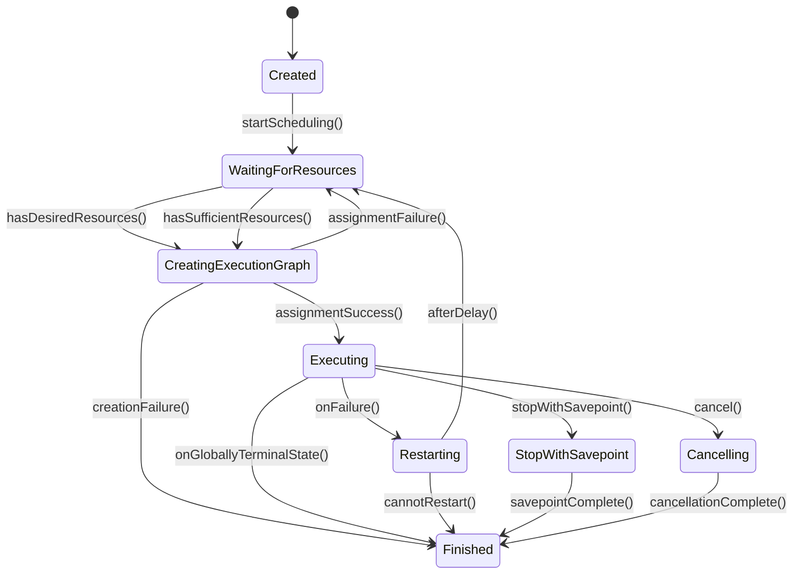
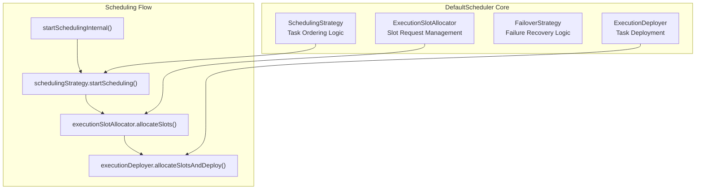
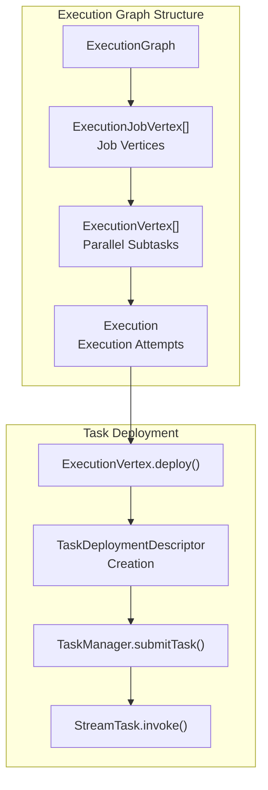
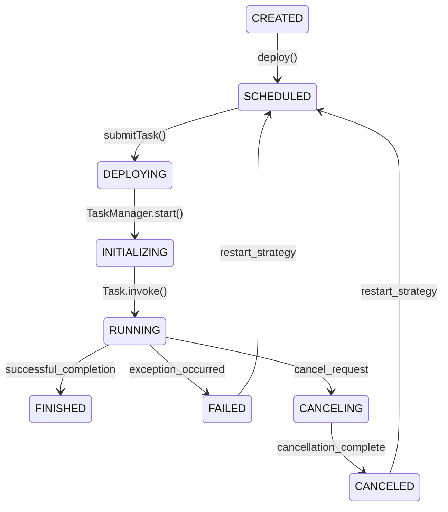
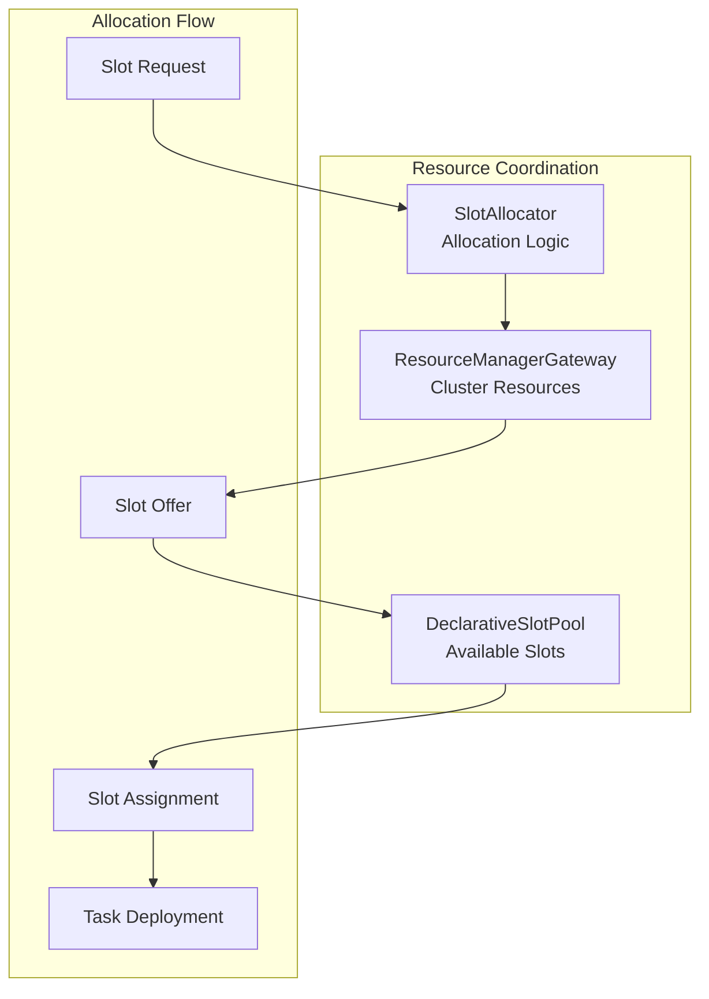

# Core Runtime Architecture

Relevant source files

The following files were used as context for generating this wiki page:

- [flink-clients/src/main/java/org/apache/flink/client/deployment/application/ApplicationDispatcherGatewayServiceFactory.java](flink-clients/src/main/java/org/apache/flink/client/deployment/application/ApplicationDispatcherGatewayServiceFactory.java)
- [flink-end-to-end-tests/test-scripts/test_kubernetes_application.sh](flink-end-to-end-tests/test-scripts/test_kubernetes_application.sh)
- [flink-kubernetes/src/test/java/org/apache/flink/kubernetes/highavailability/KubernetesLeaderRetrievalDriverTest.java](flink-kubernetes/src/test/java/org/apache/flink/kubernetes/highavailability/KubernetesLeaderRetrievalDriverTest.java)
- [flink-runtime/src/main/java/org/apache/flink/runtime/dispatcher/Dispatcher.java](flink-runtime/src/main/java/org/apache/flink/runtime/dispatcher/Dispatcher.java)
- [flink-runtime/src/main/java/org/apache/flink/runtime/dispatcher/DispatcherFactory.java](flink-runtime/src/main/java/org/apache/flink/runtime/dispatcher/DispatcherFactory.java)
- [flink-runtime/src/main/java/org/apache/flink/runtime/dispatcher/DispatcherServices.java](flink-runtime/src/main/java/org/apache/flink/runtime/dispatcher/DispatcherServices.java)
- [flink-runtime/src/main/java/org/apache/flink/runtime/dispatcher/PartialDispatcherServices.java](flink-runtime/src/main/java/org/apache/flink/runtime/dispatcher/PartialDispatcherServices.java)
- [flink-runtime/src/main/java/org/apache/flink/runtime/dispatcher/PartialDispatcherServicesWithJobPersistenceComponents.java](flink-runtime/src/main/java/org/apache/flink/runtime/dispatcher/PartialDispatcherServicesWithJobPersistenceComponents.java)
- [flink-runtime/src/main/java/org/apache/flink/runtime/dispatcher/SessionDispatcherFactory.java](flink-runtime/src/main/java/org/apache/flink/runtime/dispatcher/SessionDispatcherFactory.java)
- [flink-runtime/src/main/java/org/apache/flink/runtime/dispatcher/StandaloneDispatcher.java](flink-runtime/src/main/java/org/apache/flink/runtime/dispatcher/StandaloneDispatcher.java)
- [flink-runtime/src/main/java/org/apache/flink/runtime/dispatcher/runner/AbstractDispatcherLeaderProcess.java](flink-runtime/src/main/java/org/apache/flink/runtime/dispatcher/runner/AbstractDispatcherLeaderProcess.java)
- [flink-runtime/src/main/java/org/apache/flink/runtime/dispatcher/runner/DefaultDispatcherGatewayServiceFactory.java](flink-runtime/src/main/java/org/apache/flink/runtime/dispatcher/runner/DefaultDispatcherGatewayServiceFactory.java)
- [flink-runtime/src/main/java/org/apache/flink/runtime/jobgraph/jsonplan/JsonPlanGenerator.java](flink-runtime/src/main/java/org/apache/flink/runtime/jobgraph/jsonplan/JsonPlanGenerator.java)
- [flink-runtime/src/main/java/org/apache/flink/runtime/jobmaster/DefaultSlotPoolServiceSchedulerFactory.java](flink-runtime/src/main/java/org/apache/flink/runtime/jobmaster/DefaultSlotPoolServiceSchedulerFactory.java)
- [flink-runtime/src/main/java/org/apache/flink/runtime/jobmaster/JobResult.java](flink-runtime/src/main/java/org/apache/flink/runtime/jobmaster/JobResult.java)
- [flink-runtime/src/main/java/org/apache/flink/runtime/jobmaster/SlotPoolServiceSchedulerFactory.java](flink-runtime/src/main/java/org/apache/flink/runtime/jobmaster/SlotPoolServiceSchedulerFactory.java)
- [flink-runtime/src/main/java/org/apache/flink/runtime/scheduler/DefaultScheduler.java](flink-runtime/src/main/java/org/apache/flink/runtime/scheduler/DefaultScheduler.java)
- [flink-runtime/src/main/java/org/apache/flink/runtime/scheduler/DefaultSchedulerFactory.java](flink-runtime/src/main/java/org/apache/flink/runtime/scheduler/DefaultSchedulerFactory.java)
- [flink-runtime/src/main/java/org/apache/flink/runtime/scheduler/SchedulerBase.java](flink-runtime/src/main/java/org/apache/flink/runtime/scheduler/SchedulerBase.java)
- [flink-runtime/src/main/java/org/apache/flink/runtime/scheduler/adaptive/AdaptiveScheduler.java](flink-runtime/src/main/java/org/apache/flink/runtime/scheduler/adaptive/AdaptiveScheduler.java)
- [flink-runtime/src/main/java/org/apache/flink/runtime/scheduler/adaptive/AdaptiveSchedulerFactory.java](flink-runtime/src/main/java/org/apache/flink/runtime/scheduler/adaptive/AdaptiveSchedulerFactory.java)
- [flink-runtime/src/main/java/org/apache/flink/runtime/scheduler/adaptive/Canceling.java](flink-runtime/src/main/java/org/apache/flink/runtime/scheduler/adaptive/Canceling.java)
- [flink-runtime/src/main/java/org/apache/flink/runtime/scheduler/adaptive/Created.java](flink-runtime/src/main/java/org/apache/flink/runtime/scheduler/adaptive/Created.java)
- [flink-runtime/src/main/java/org/apache/flink/runtime/scheduler/adaptive/CreatingExecutionGraph.java](flink-runtime/src/main/java/org/apache/flink/runtime/scheduler/adaptive/CreatingExecutionGraph.java)
- [flink-runtime/src/main/java/org/apache/flink/runtime/scheduler/adaptive/DefaultStateTransitionManager.java](flink-runtime/src/main/java/org/apache/flink/runtime/scheduler/adaptive/DefaultStateTransitionManager.java)
- [flink-runtime/src/main/java/org/apache/flink/runtime/scheduler/adaptive/Executing.java](flink-runtime/src/main/java/org/apache/flink/runtime/scheduler/adaptive/Executing.java)
- [flink-runtime/src/main/java/org/apache/flink/runtime/scheduler/adaptive/Failing.java](flink-runtime/src/main/java/org/apache/flink/runtime/scheduler/adaptive/Failing.java)
- [flink-runtime/src/main/java/org/apache/flink/runtime/scheduler/adaptive/FailureResultUtil.java](flink-runtime/src/main/java/org/apache/flink/runtime/scheduler/adaptive/FailureResultUtil.java)
- [flink-runtime/src/main/java/org/apache/flink/runtime/scheduler/adaptive/Finished.java](flink-runtime/src/main/java/org/apache/flink/runtime/scheduler/adaptive/Finished.java)
- [flink-runtime/src/main/java/org/apache/flink/runtime/scheduler/adaptive/Restarting.java](flink-runtime/src/main/java/org/apache/flink/runtime/scheduler/adaptive/Restarting.java)
- [flink-runtime/src/main/java/org/apache/flink/runtime/scheduler/adaptive/State.java](flink-runtime/src/main/java/org/apache/flink/runtime/scheduler/adaptive/State.java)
- [flink-runtime/src/main/java/org/apache/flink/runtime/scheduler/adaptive/StateTransitionManager.java](flink-runtime/src/main/java/org/apache/flink/runtime/scheduler/adaptive/StateTransitionManager.java)
- [flink-runtime/src/main/java/org/apache/flink/runtime/scheduler/adaptive/StateTransitions.java](flink-runtime/src/main/java/org/apache/flink/runtime/scheduler/adaptive/StateTransitions.java)
- [flink-runtime/src/main/java/org/apache/flink/runtime/scheduler/adaptive/StateWithExecutionGraph.java](flink-runtime/src/main/java/org/apache/flink/runtime/scheduler/adaptive/StateWithExecutionGraph.java)
- [flink-runtime/src/main/java/org/apache/flink/runtime/scheduler/adaptive/StateWithoutExecutionGraph.java](flink-runtime/src/main/java/org/apache/flink/runtime/scheduler/adaptive/StateWithoutExecutionGraph.java)
- [flink-runtime/src/main/java/org/apache/flink/runtime/scheduler/adaptive/StopWithSavepoint.java](flink-runtime/src/main/java/org/apache/flink/runtime/scheduler/adaptive/StopWithSavepoint.java)
- [flink-runtime/src/main/java/org/apache/flink/runtime/scheduler/adaptive/WaitingForResources.java](flink-runtime/src/main/java/org/apache/flink/runtime/scheduler/adaptive/WaitingForResources.java)
- [flink-runtime/src/test/java/org/apache/flink/runtime/checkpoint/ZKCheckpointIDCounterMultiServersTest.java](flink-runtime/src/test/java/org/apache/flink/runtime/checkpoint/ZKCheckpointIDCounterMultiServersTest.java)
- [flink-runtime/src/test/java/org/apache/flink/runtime/checkpoint/ZooKeeperCompletedCheckpointStoreTest.java](flink-runtime/src/test/java/org/apache/flink/runtime/checkpoint/ZooKeeperCompletedCheckpointStoreTest.java)
- [flink-runtime/src/test/java/org/apache/flink/runtime/dispatcher/AbstractDispatcherTest.java](flink-runtime/src/test/java/org/apache/flink/runtime/dispatcher/AbstractDispatcherTest.java)
- [flink-runtime/src/test/java/org/apache/flink/runtime/dispatcher/DispatcherCleanupITCase.java](flink-runtime/src/test/java/org/apache/flink/runtime/dispatcher/DispatcherCleanupITCase.java)
- [flink-runtime/src/test/java/org/apache/flink/runtime/dispatcher/DispatcherResourceCleanupTest.java](flink-runtime/src/test/java/org/apache/flink/runtime/dispatcher/DispatcherResourceCleanupTest.java)
- [flink-runtime/src/test/java/org/apache/flink/runtime/dispatcher/DispatcherTest.java](flink-runtime/src/test/java/org/apache/flink/runtime/dispatcher/DispatcherTest.java)
- [flink-runtime/src/test/java/org/apache/flink/runtime/dispatcher/TestingDispatcher.java](flink-runtime/src/test/java/org/apache/flink/runtime/dispatcher/TestingDispatcher.java)
- [flink-runtime/src/test/java/org/apache/flink/runtime/dispatcher/TestingJobManagerRunnerFactory.java](flink-runtime/src/test/java/org/apache/flink/runtime/dispatcher/TestingJobManagerRunnerFactory.java)
- [flink-runtime/src/test/java/org/apache/flink/runtime/dispatcher/TestingPartialDispatcherServices.java](flink-runtime/src/test/java/org/apache/flink/runtime/dispatcher/TestingPartialDispatcherServices.java)
- [flink-runtime/src/test/java/org/apache/flink/runtime/dispatcher/runner/DefaultDispatcherRunnerITCase.java](flink-runtime/src/test/java/org/apache/flink/runtime/dispatcher/runner/DefaultDispatcherRunnerITCase.java)
- [flink-runtime/src/test/java/org/apache/flink/runtime/dispatcher/runner/ZooKeeperDefaultDispatcherRunnerTest.java](flink-runtime/src/test/java/org/apache/flink/runtime/dispatcher/runner/ZooKeeperDefaultDispatcherRunnerTest.java)
- [flink-runtime/src/test/java/org/apache/flink/runtime/jobgraph/jsonplan/JsonGeneratorTest.java](flink-runtime/src/test/java/org/apache/flink/runtime/jobgraph/jsonplan/JsonGeneratorTest.java)
- [flink-runtime/src/test/java/org/apache/flink/runtime/jobmaster/DefaultSlotPoolServiceSchedulerFactoryTest.java](flink-runtime/src/test/java/org/apache/flink/runtime/jobmaster/DefaultSlotPoolServiceSchedulerFactoryTest.java)
- [flink-runtime/src/test/java/org/apache/flink/runtime/jobmaster/JobMasterExecutionDeploymentReconciliationTest.java](flink-runtime/src/test/java/org/apache/flink/runtime/jobmaster/JobMasterExecutionDeploymentReconciliationTest.java)
- [flink-runtime/src/test/java/org/apache/flink/runtime/jobmaster/JobMasterQueryableStateTest.java](flink-runtime/src/test/java/org/apache/flink/runtime/jobmaster/JobMasterQueryableStateTest.java)
- [flink-runtime/src/test/java/org/apache/flink/runtime/jobmaster/JobMasterSchedulerTest.java](flink-runtime/src/test/java/org/apache/flink/runtime/jobmaster/JobMasterSchedulerTest.java)
- [flink-runtime/src/test/java/org/apache/flink/runtime/jobmaster/TestUtils.java](flink-runtime/src/test/java/org/apache/flink/runtime/jobmaster/TestUtils.java)
- [flink-runtime/src/test/java/org/apache/flink/runtime/jobmaster/TestingJobManagerRunner.java](flink-runtime/src/test/java/org/apache/flink/runtime/jobmaster/TestingJobManagerRunner.java)
- [flink-runtime/src/test/java/org/apache/flink/runtime/leaderelection/LeaderChangeClusterComponentsTest.java](flink-runtime/src/test/java/org/apache/flink/runtime/leaderelection/LeaderChangeClusterComponentsTest.java)
- [flink-runtime/src/test/java/org/apache/flink/runtime/leaderelection/StandaloneLeaderElectionTest.java](flink-runtime/src/test/java/org/apache/flink/runtime/leaderelection/StandaloneLeaderElectionTest.java)
- [flink-runtime/src/test/java/org/apache/flink/runtime/leaderelection/TestingRetrievalBase.java](flink-runtime/src/test/java/org/apache/flink/runtime/leaderelection/TestingRetrievalBase.java)
- [flink-runtime/src/test/java/org/apache/flink/runtime/leaderretrieval/DefaultLeaderRetrievalServiceTest.java](flink-runtime/src/test/java/org/apache/flink/runtime/leaderretrieval/DefaultLeaderRetrievalServiceTest.java)
- [flink-runtime/src/test/java/org/apache/flink/runtime/leaderretrieval/SettableLeaderRetrievalServiceTest.java](flink-runtime/src/test/java/org/apache/flink/runtime/leaderretrieval/SettableLeaderRetrievalServiceTest.java)
- [flink-runtime/src/test/java/org/apache/flink/runtime/scheduler/DefaultSchedulerTest.java](flink-runtime/src/test/java/org/apache/flink/runtime/scheduler/DefaultSchedulerTest.java)
- [flink-runtime/src/test/java/org/apache/flink/runtime/scheduler/SchedulerTestingUtils.java](flink-runtime/src/test/java/org/apache/flink/runtime/scheduler/SchedulerTestingUtils.java)
- [flink-runtime/src/test/java/org/apache/flink/runtime/scheduler/TestingSchedulerNGFactory.java](flink-runtime/src/test/java/org/apache/flink/runtime/scheduler/TestingSchedulerNGFactory.java)
- [flink-runtime/src/test/java/org/apache/flink/runtime/scheduler/adaptive/AdaptiveSchedulerBuilder.java](flink-runtime/src/test/java/org/apache/flink/runtime/scheduler/adaptive/AdaptiveSchedulerBuilder.java)
- [flink-runtime/src/test/java/org/apache/flink/runtime/scheduler/adaptive/AdaptiveSchedulerClusterITCase.java](flink-runtime/src/test/java/org/apache/flink/runtime/scheduler/adaptive/AdaptiveSchedulerClusterITCase.java)
- [flink-runtime/src/test/java/org/apache/flink/runtime/scheduler/adaptive/AdaptiveSchedulerSimpleITCase.java](flink-runtime/src/test/java/org/apache/flink/runtime/scheduler/adaptive/AdaptiveSchedulerSimpleITCase.java)
- [flink-runtime/src/test/java/org/apache/flink/runtime/scheduler/adaptive/AdaptiveSchedulerSlotSharingITCase.java](flink-runtime/src/test/java/org/apache/flink/runtime/scheduler/adaptive/AdaptiveSchedulerSlotSharingITCase.java)
- [flink-runtime/src/test/java/org/apache/flink/runtime/scheduler/adaptive/AdaptiveSchedulerTest.java](flink-runtime/src/test/java/org/apache/flink/runtime/scheduler/adaptive/AdaptiveSchedulerTest.java)
- [flink-runtime/src/test/java/org/apache/flink/runtime/scheduler/adaptive/CancelingTest.java](flink-runtime/src/test/java/org/apache/flink/runtime/scheduler/adaptive/CancelingTest.java)
- [flink-runtime/src/test/java/org/apache/flink/runtime/scheduler/adaptive/CreatedTest.java](flink-runtime/src/test/java/org/apache/flink/runtime/scheduler/adaptive/CreatedTest.java)
- [flink-runtime/src/test/java/org/apache/flink/runtime/scheduler/adaptive/CreatingExecutionGraphTest.java](flink-runtime/src/test/java/org/apache/flink/runtime/scheduler/adaptive/CreatingExecutionGraphTest.java)
- [flink-runtime/src/test/java/org/apache/flink/runtime/scheduler/adaptive/DefaultStateTransitionManagerTest.java](flink-runtime/src/test/java/org/apache/flink/runtime/scheduler/adaptive/DefaultStateTransitionManagerTest.java)
- [flink-runtime/src/test/java/org/apache/flink/runtime/scheduler/adaptive/ExecutingTest.java](flink-runtime/src/test/java/org/apache/flink/runtime/scheduler/adaptive/ExecutingTest.java)
- [flink-runtime/src/test/java/org/apache/flink/runtime/scheduler/adaptive/FailingTest.java](flink-runtime/src/test/java/org/apache/flink/runtime/scheduler/adaptive/FailingTest.java)
- [flink-runtime/src/test/java/org/apache/flink/runtime/scheduler/adaptive/MockRestartingContext.java](flink-runtime/src/test/java/org/apache/flink/runtime/scheduler/adaptive/MockRestartingContext.java)
- [flink-runtime/src/test/java/org/apache/flink/runtime/scheduler/adaptive/MockStateWithoutExecutionGraphContext.java](flink-runtime/src/test/java/org/apache/flink/runtime/scheduler/adaptive/MockStateWithoutExecutionGraphContext.java)
- [flink-runtime/src/test/java/org/apache/flink/runtime/scheduler/adaptive/RestartingTest.java](flink-runtime/src/test/java/org/apache/flink/runtime/scheduler/adaptive/RestartingTest.java)
- [flink-runtime/src/test/java/org/apache/flink/runtime/scheduler/adaptive/StateTest.java](flink-runtime/src/test/java/org/apache/flink/runtime/scheduler/adaptive/StateTest.java)
- [flink-runtime/src/test/java/org/apache/flink/runtime/scheduler/adaptive/StateWithExecutionGraphTest.java](flink-runtime/src/test/java/org/apache/flink/runtime/scheduler/adaptive/StateWithExecutionGraphTest.java)
- [flink-runtime/src/test/java/org/apache/flink/runtime/scheduler/adaptive/StateWithoutExecutionGraphTest.java](flink-runtime/src/test/java/org/apache/flink/runtime/scheduler/adaptive/StateWithoutExecutionGraphTest.java)
- [flink-runtime/src/test/java/org/apache/flink/runtime/scheduler/adaptive/StopWithSavepointTest.java](flink-runtime/src/test/java/org/apache/flink/runtime/scheduler/adaptive/StopWithSavepointTest.java)
- [flink-runtime/src/test/java/org/apache/flink/runtime/scheduler/adaptive/TestingStateTransitionManager.java](flink-runtime/src/test/java/org/apache/flink/runtime/scheduler/adaptive/TestingStateTransitionManager.java)
- [flink-runtime/src/test/java/org/apache/flink/runtime/scheduler/adaptive/WaitingForResourcesTest.java](flink-runtime/src/test/java/org/apache/flink/runtime/scheduler/adaptive/WaitingForResourcesTest.java)
- [flink-tests/src/test/java/org/apache/flink/test/scheduling/ReactiveModeITCase.java](flink-tests/src/test/java/org/apache/flink/test/scheduling/ReactiveModeITCase.java)

This document covers the fundamental runtime components that make up a Flink cluster, including job management, scheduling, and task execution coordination. These components work together to receive job submissions, manage resources, schedule tasks, and coordinate distributed execution.

For information about specific programming APIs, see [Programming APIs](#3). For details about state management and checkpointing mechanisms, see [Fault Tolerance & Checkpointing](#2.3) and [State Management](#2.4). For system management and monitoring capabilities, see [System Management & Monitoring](#4).

## Core Runtime Components

The Flink runtime architecture is built around several key components that coordinate to execute distributed streaming jobs. The central coordination happens through the `Dispatcher`, `JobManager`, and `TaskManager` components.

### Runtime Component Architecture

Sources: [flink-runtime/src/main/java/org/apache/flink/runtime/dispatcher/Dispatcher.java:137-142](), [flink-runtime/src/main/java/org/apache/flink/runtime/scheduler/adaptive/AdaptiveScheduler.java:179-188](), [flink-runtime/src/main/java/org/apache/flink/runtime/scheduler/SchedulerBase.java:139]()

### Dispatcher - Central Job Coordination

The `Dispatcher` serves as the primary entry point for job submissions and coordinates the overall job lifecycle. It receives job submissions, persists them, spawns `JobManagerRunner` instances to execute jobs, and manages recovery in case of failures.

| Component | Responsibility | Key Interface |
|-----------|---------------|---------------|
| Job Submission | Receives and validates job submissions | `submitJob(ExecutionPlan, Duration)` |
| Job Persistence | Stores job graphs via `ExecutionPlanWriter` | `persistAndRunJob(ExecutionPlan)` |
| Job Recovery | Recovers jobs from `HighAvailabilityServices` | `runRecoveredJob(ExecutionPlan)` |
| Runner Management | Creates and manages `JobManagerRunner` instances | `createJobMasterRunner(ExecutionPlan)` |

The Dispatcher maintains several key registries and services:

Sources: [flink-runtime/src/main/java/org/apache/flink/runtime/dispatcher/Dispatcher.java:154-213](), [flink-runtime/src/main/java/org/apache/flink/runtime/dispatcher/Dispatcher.java:522-562]()

## Job Lifecycle Management

### Job Submission and Validation

When a job is submitted to the Dispatcher, it undergoes several validation and preparation steps:

1. **Duplicate Detection**: Checks if a job with the same `JobID` already exists or has terminated
2. **Resource Validation**: Ensures partial resource configuration is not used (currently unsupported)
3. **Persistence**: Stores the `ExecutionPlan` via `ExecutionPlanWriter`
4. **Runner Creation**: Creates a `JobManagerRunner` to manage the job execution

Sources: [flink-runtime/src/main/java/org/apache/flink/runtime/dispatcher/Dispatcher.java:592-612](), [flink-runtime/src/main/java/org/apache/flink/runtime/dispatcher/Dispatcher.java:644-648]()

### Job Recovery

During cluster recovery, the Dispatcher restores previously submitted jobs from persistent storage:

Sources: [flink-runtime/src/main/java/org/apache/flink/runtime/dispatcher/Dispatcher.java:402-424](), [flink-runtime/src/main/java/org/apache/flink/runtime/dispatcher/Dispatcher.java:348-368]()

## Scheduling Architecture

Flink provides multiple scheduler implementations that handle resource allocation and task deployment. The scheduling system is built around the `SchedulerNG` interface with `SchedulerBase` providing common functionality.

### Scheduler Hierarchy

Sources: [flink-runtime/src/main/java/org/apache/flink/runtime/scheduler/SchedulerBase.java:139](), [flink-runtime/src/main/java/org/apache/flink/runtime/scheduler/adaptive/AdaptiveScheduler.java:179-188](), [flink-runtime/src/main/java/org/apache/flink/runtime/scheduler/DefaultScheduler.java:84]()

### AdaptiveScheduler - Dynamic Resource Management

The `AdaptiveScheduler` implements FLIP-160 adaptive scheduling, automatically adjusting parallelism based on available resources. It operates through distinct states that control allowed operations and transitions.

#### AdaptiveScheduler State Machine

Sources: [flink-runtime/src/main/java/org/apache/flink/runtime/scheduler/adaptive/AdaptiveScheduler.java:179-188](), [flink-runtime/src/main/java/org/apache/flink/runtime/scheduler/adaptive/Executing.java:57-58](), [flink-runtime/src/main/java/org/apache/flink/runtime/scheduler/adaptive/WaitingForResources.java:34-36]()

#### State Contexts and Transitions

Each state implements specific context interfaces that define available operations:

| State | Context Interfaces | Key Operations |
|-------|-------------------|----------------|
| `Created` | `Created.Context` | Initial setup, transition to `WaitingForResources` |
| `WaitingForResources` | `WaitingForResources.Context` | Resource detection, timeout handling |
| `CreatingExecutionGraph` | `CreatingExecutionGraph.Context` | Graph creation, slot assignment |
| `Executing` | `Executing.Context` | Task deployment, failure handling, rescaling |
| `Restarting` | `Restarting.Context` | Restart delay, parallelism updates |

Sources: [flink-runtime/src/main/java/org/apache/flink/runtime/scheduler/adaptive/WaitingForResources.java:133-145](), [flink-runtime/src/main/java/org/apache/flink/runtime/scheduler/adaptive/Executing.java:287-316]()

### DefaultScheduler - Traditional Scheduling

The `DefaultScheduler` provides traditional fixed-resource scheduling with explicit slot requests and deployment coordination.

#### DefaultScheduler Components

Sources: [flink-runtime/src/main/java/org/apache/flink/runtime/scheduler/DefaultScheduler.java:84-114](), [flink-runtime/src/main/java/org/apache/flink/runtime/scheduler/DefaultScheduler.java:243-249]()

## Task Execution Coordination

### ExecutionGraph and Task Deployment

The `ExecutionGraph` represents the physical execution plan with concrete parallelism and resource assignments. It coordinates task deployment and tracks execution state.

Sources: [flink-runtime/src/main/java/org/apache/flink/runtime/scheduler/SchedulerBase.java:185-269](), [flink-runtime/src/main/java/org/apache/flink/runtime/scheduler/adaptive/Executing.java:196-218]()

### Task State Transitions

Tasks progress through well-defined execution states, with the scheduler coordinating transitions and handling failures:

Sources: [flink-runtime/src/main/java/org/apache/flink/runtime/scheduler/SchedulerBase.java:252-266](), [flink-runtime/src/main/java/org/apache/flink/runtime/scheduler/DefaultScheduler.java:272-286]()

### Failure Handling and Recovery

The runtime system includes comprehensive failure handling with configurable restart strategies:

| Component | Failure Scope | Recovery Mechanism |
|-----------|--------------|-------------------|
| `ExecutionFailureHandler` | Task-level failures | Restart affected tasks/regions |
| `FailoverStrategy` | Regional failures | Restart pipelined regions |
| `RestartBackoffTimeStrategy` | Job-level failures | Exponential backoff, fixed delay |
| `GlobalFailureHandler` | Cluster-level failures | Full job restart or termination |

Sources: [flink-runtime/src/main/java/org/apache/flink/runtime/scheduler/DefaultScheduler.java:187-197](), [flink-runtime/src/main/java/org/apache/flink/runtime/scheduler/SchedulerBase.java:434-474]()

## Runtime Coordination Mechanisms

### Resource Management Integration

The runtime coordinates with the `ResourceManager` to acquire and release slots for task execution:

Sources: [flink-runtime/src/main/java/org/apache/flink/runtime/scheduler/adaptive/AdaptiveScheduler.java:376-377](), [flink-runtime/src/main/java/org/apache/flink/runtime/scheduler/DefaultScheduler.java:90-91]()

### High Availability and Persistence

The runtime system ensures job persistence and recovery through `HighAvailabilityServices`:

| Service | Purpose | Implementation |
|---------|---------|----------------|
| `ExecutionPlanWriter` | Job graph persistence | Stores `ExecutionPlan` to durable storage |
| `JobResultStore` | Result tracking | Maintains job completion status |
| `CheckpointRecoveryFactory` | Checkpoint metadata | Restores checkpoint coordinator state |
| `LeaderElection` | JobManager leadership | Ensures single active JobManager per job |

Sources: [flink-runtime/src/main/java/org/apache/flink/runtime/dispatcher/Dispatcher.java:154-184](), [flink-runtime/src/main/java/org/apache/flink/runtime/scheduler/SchedulerBase.java:211-222]()
