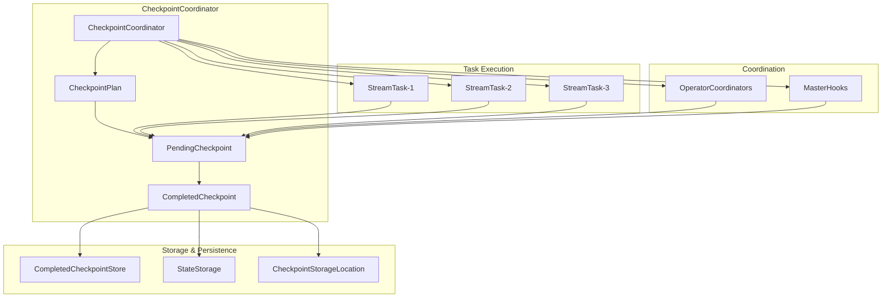
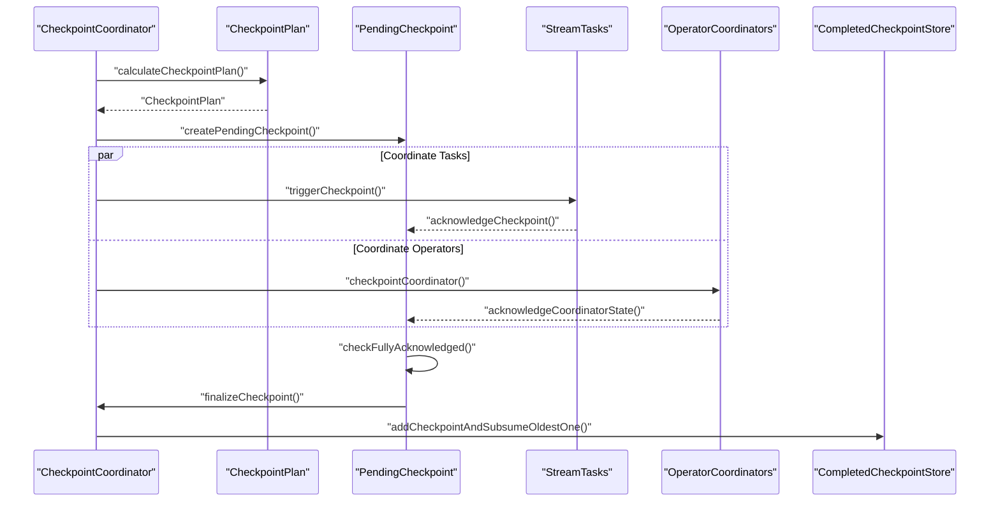
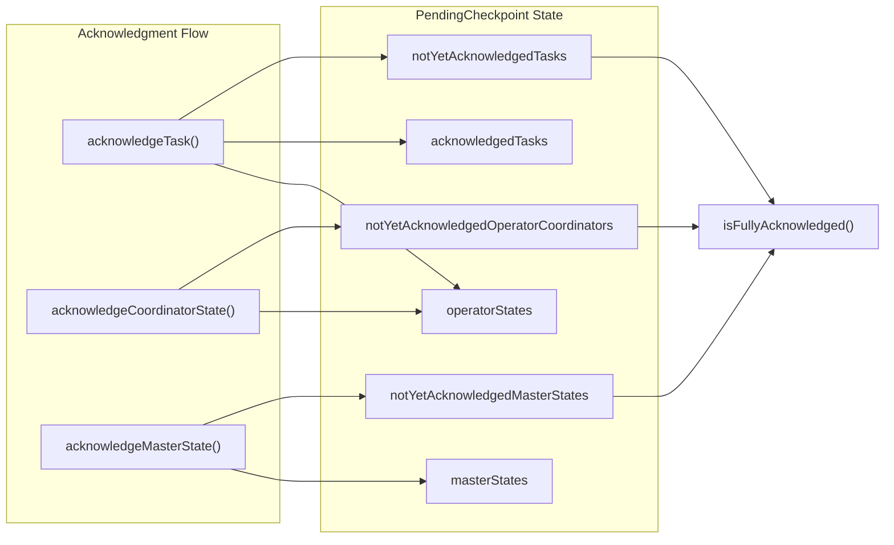
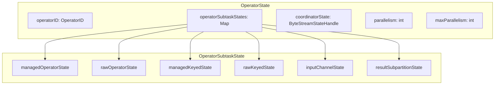
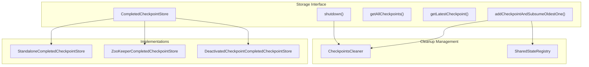
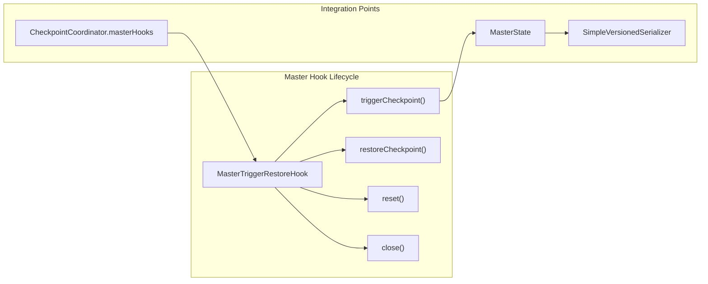
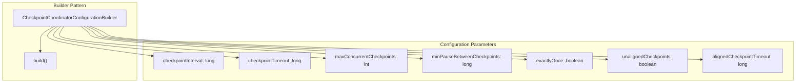

# Fault Tolerance & Checkpointing

Relevant source files

The following files were used as context for generating this wiki page:

- [flink-runtime/src/main/java/org/apache/flink/runtime/checkpoint/Checkpoint.java](flink-runtime/src/main/java/org/apache/flink/runtime/checkpoint/Checkpoint.java)
- [flink-runtime/src/main/java/org/apache/flink/runtime/checkpoint/CheckpointCoordinator.java](flink-runtime/src/main/java/org/apache/flink/runtime/checkpoint/CheckpointCoordinator.java)
- [flink-runtime/src/main/java/org/apache/flink/runtime/checkpoint/CheckpointPlan.java](flink-runtime/src/main/java/org/apache/flink/runtime/checkpoint/CheckpointPlan.java)
- [flink-runtime/src/main/java/org/apache/flink/runtime/checkpoint/CheckpointStatsSnapshot.java](flink-runtime/src/main/java/org/apache/flink/runtime/checkpoint/CheckpointStatsSnapshot.java)
- [flink-runtime/src/main/java/org/apache/flink/runtime/checkpoint/CheckpointStatsTracker.java](flink-runtime/src/main/java/org/apache/flink/runtime/checkpoint/CheckpointStatsTracker.java)
- [flink-runtime/src/main/java/org/apache/flink/runtime/checkpoint/CheckpointsCleaner.java](flink-runtime/src/main/java/org/apache/flink/runtime/checkpoint/CheckpointsCleaner.java)
- [flink-runtime/src/main/java/org/apache/flink/runtime/checkpoint/CompletedCheckpoint.java](flink-runtime/src/main/java/org/apache/flink/runtime/checkpoint/CompletedCheckpoint.java)
- [flink-runtime/src/main/java/org/apache/flink/runtime/checkpoint/CompletedCheckpointStatsSummarySnapshot.java](flink-runtime/src/main/java/org/apache/flink/runtime/checkpoint/CompletedCheckpointStatsSummarySnapshot.java)
- [flink-runtime/src/main/java/org/apache/flink/runtime/checkpoint/CompletedCheckpointStore.java](flink-runtime/src/main/java/org/apache/flink/runtime/checkpoint/CompletedCheckpointStore.java)
- [flink-runtime/src/main/java/org/apache/flink/runtime/checkpoint/DeactivatedCheckpointCompletedCheckpointStore.java](flink-runtime/src/main/java/org/apache/flink/runtime/checkpoint/DeactivatedCheckpointCompletedCheckpointStore.java)
- [flink-runtime/src/main/java/org/apache/flink/runtime/checkpoint/DefaultCheckpointPlan.java](flink-runtime/src/main/java/org/apache/flink/runtime/checkpoint/DefaultCheckpointPlan.java)
- [flink-runtime/src/main/java/org/apache/flink/runtime/checkpoint/DefaultCheckpointPlanCalculator.java](flink-runtime/src/main/java/org/apache/flink/runtime/checkpoint/DefaultCheckpointPlanCalculator.java)
- [flink-runtime/src/main/java/org/apache/flink/runtime/checkpoint/FinishedOperatorSubtaskState.java](flink-runtime/src/main/java/org/apache/flink/runtime/checkpoint/FinishedOperatorSubtaskState.java)
- [flink-runtime/src/main/java/org/apache/flink/runtime/checkpoint/FinishedTaskStateProvider.java](flink-runtime/src/main/java/org/apache/flink/runtime/checkpoint/FinishedTaskStateProvider.java)
- [flink-runtime/src/main/java/org/apache/flink/runtime/checkpoint/FullyFinishedOperatorState.java](flink-runtime/src/main/java/org/apache/flink/runtime/checkpoint/FullyFinishedOperatorState.java)
- [flink-runtime/src/main/java/org/apache/flink/runtime/checkpoint/OperatorState.java](flink-runtime/src/main/java/org/apache/flink/runtime/checkpoint/OperatorState.java)
- [flink-runtime/src/main/java/org/apache/flink/runtime/checkpoint/PendingCheckpoint.java](flink-runtime/src/main/java/org/apache/flink/runtime/checkpoint/PendingCheckpoint.java)
- [flink-runtime/src/main/java/org/apache/flink/runtime/checkpoint/RestoredCheckpointStats.java](flink-runtime/src/main/java/org/apache/flink/runtime/checkpoint/RestoredCheckpointStats.java)
- [flink-runtime/src/main/java/org/apache/flink/runtime/checkpoint/VertexFinishedStateChecker.java](flink-runtime/src/main/java/org/apache/flink/runtime/checkpoint/VertexFinishedStateChecker.java)
- [flink-runtime/src/main/java/org/apache/flink/runtime/checkpoint/metadata/ChannelStateHandleSerializer.java](flink-runtime/src/main/java/org/apache/flink/runtime/checkpoint/metadata/ChannelStateHandleSerializer.java)
- [flink-runtime/src/main/java/org/apache/flink/runtime/checkpoint/metadata/ChannelStateHandleSerializerV1.java](flink-runtime/src/main/java/org/apache/flink/runtime/checkpoint/metadata/ChannelStateHandleSerializerV1.java)
- [flink-runtime/src/main/java/org/apache/flink/runtime/checkpoint/metadata/MetadataV2Serializer.java](flink-runtime/src/main/java/org/apache/flink/runtime/checkpoint/metadata/MetadataV2Serializer.java)
- [flink-runtime/src/main/java/org/apache/flink/runtime/checkpoint/metadata/MetadataV3Serializer.java](flink-runtime/src/main/java/org/apache/flink/runtime/checkpoint/metadata/MetadataV3Serializer.java)
- [flink-runtime/src/main/java/org/apache/flink/runtime/jobgraph/tasks/CheckpointCoordinatorConfiguration.java](flink-runtime/src/main/java/org/apache/flink/runtime/jobgraph/tasks/CheckpointCoordinatorConfiguration.java)
- [flink-runtime/src/main/java/org/apache/flink/runtime/state/filemerging/DirectoryStreamStateHandle.java](flink-runtime/src/main/java/org/apache/flink/runtime/state/filemerging/DirectoryStreamStateHandle.java)
- [flink-runtime/src/main/java/org/apache/flink/runtime/state/filemerging/EmptyFileMergingOperatorStreamStateHandle.java](flink-runtime/src/main/java/org/apache/flink/runtime/state/filemerging/EmptyFileMergingOperatorStreamStateHandle.java)
- [flink-runtime/src/main/java/org/apache/flink/runtime/state/filemerging/SegmentFileStateHandle.java](flink-runtime/src/main/java/org/apache/flink/runtime/state/filemerging/SegmentFileStateHandle.java)
- [flink-runtime/src/main/java/org/apache/flink/runtime/state/filesystem/FileMergingCheckpointStateOutputStream.java](flink-runtime/src/main/java/org/apache/flink/runtime/state/filesystem/FileMergingCheckpointStateOutputStream.java)
- [flink-runtime/src/test/java/org/apache/flink/runtime/checkpoint/CheckpointCoordinatorFailureTest.java](flink-runtime/src/test/java/org/apache/flink/runtime/checkpoint/CheckpointCoordinatorFailureTest.java)
- [flink-runtime/src/test/java/org/apache/flink/runtime/checkpoint/CheckpointCoordinatorMasterHooksTest.java](flink-runtime/src/test/java/org/apache/flink/runtime/checkpoint/CheckpointCoordinatorMasterHooksTest.java)
- [flink-runtime/src/test/java/org/apache/flink/runtime/checkpoint/CheckpointCoordinatorRestoringTest.java](flink-runtime/src/test/java/org/apache/flink/runtime/checkpoint/CheckpointCoordinatorRestoringTest.java)
- [flink-runtime/src/test/java/org/apache/flink/runtime/checkpoint/CheckpointCoordinatorTest.java](flink-runtime/src/test/java/org/apache/flink/runtime/checkpoint/CheckpointCoordinatorTest.java)
- [flink-runtime/src/test/java/org/apache/flink/runtime/checkpoint/CheckpointCoordinatorTestingUtils.java](flink-runtime/src/test/java/org/apache/flink/runtime/checkpoint/CheckpointCoordinatorTestingUtils.java)
- [flink-runtime/src/test/java/org/apache/flink/runtime/checkpoint/CheckpointCoordinatorTriggeringTest.java](flink-runtime/src/test/java/org/apache/flink/runtime/checkpoint/CheckpointCoordinatorTriggeringTest.java)
- [flink-runtime/src/test/java/org/apache/flink/runtime/checkpoint/CheckpointStateRestoreTest.java](flink-runtime/src/test/java/org/apache/flink/runtime/checkpoint/CheckpointStateRestoreTest.java)
- [flink-runtime/src/test/java/org/apache/flink/runtime/checkpoint/CheckpointStatsSnapshotTest.java](flink-runtime/src/test/java/org/apache/flink/runtime/checkpoint/CheckpointStatsSnapshotTest.java)
- [flink-runtime/src/test/java/org/apache/flink/runtime/checkpoint/CheckpointsTest.java](flink-runtime/src/test/java/org/apache/flink/runtime/checkpoint/CheckpointsTest.java)
- [flink-runtime/src/test/java/org/apache/flink/runtime/checkpoint/CompletedCheckpointStoreTest.java](flink-runtime/src/test/java/org/apache/flink/runtime/checkpoint/CompletedCheckpointStoreTest.java)
- [flink-runtime/src/test/java/org/apache/flink/runtime/checkpoint/DefaultCheckpointPlanCalculatorTest.java](flink-runtime/src/test/java/org/apache/flink/runtime/checkpoint/DefaultCheckpointPlanCalculatorTest.java)
- [flink-runtime/src/test/java/org/apache/flink/runtime/checkpoint/DefaultCheckpointPlanTest.java](flink-runtime/src/test/java/org/apache/flink/runtime/checkpoint/DefaultCheckpointPlanTest.java)
- [flink-runtime/src/test/java/org/apache/flink/runtime/checkpoint/FailoverStrategyCheckpointCoordinatorTest.java](flink-runtime/src/test/java/org/apache/flink/runtime/checkpoint/FailoverStrategyCheckpointCoordinatorTest.java)
- [flink-runtime/src/test/java/org/apache/flink/runtime/checkpoint/FullyFinishedOperatorStateTest.java](flink-runtime/src/test/java/org/apache/flink/runtime/checkpoint/FullyFinishedOperatorStateTest.java)
- [flink-runtime/src/test/java/org/apache/flink/runtime/checkpoint/OperatorSubtaskStateTest.java](flink-runtime/src/test/java/org/apache/flink/runtime/checkpoint/OperatorSubtaskStateTest.java)
- [flink-runtime/src/test/java/org/apache/flink/runtime/checkpoint/PendingCheckpointTest.java](flink-runtime/src/test/java/org/apache/flink/runtime/checkpoint/PendingCheckpointTest.java)
- [flink-runtime/src/test/java/org/apache/flink/runtime/checkpoint/RestoredCheckpointStatsTest.java](flink-runtime/src/test/java/org/apache/flink/runtime/checkpoint/RestoredCheckpointStatsTest.java)
- [flink-runtime/src/test/java/org/apache/flink/runtime/checkpoint/StandaloneCompletedCheckpointStoreTest.java](flink-runtime/src/test/java/org/apache/flink/runtime/checkpoint/StandaloneCompletedCheckpointStoreTest.java)
- [flink-runtime/src/test/java/org/apache/flink/runtime/checkpoint/TestingCompletedCheckpointStore.java](flink-runtime/src/test/java/org/apache/flink/runtime/checkpoint/TestingCompletedCheckpointStore.java)
- [flink-runtime/src/test/java/org/apache/flink/runtime/checkpoint/ZooKeeperCompletedCheckpointStoreITCase.java](flink-runtime/src/test/java/org/apache/flink/runtime/checkpoint/ZooKeeperCompletedCheckpointStoreITCase.java)
- [flink-runtime/src/test/java/org/apache/flink/runtime/checkpoint/metadata/CheckpointMetadataTest.java](flink-runtime/src/test/java/org/apache/flink/runtime/checkpoint/metadata/CheckpointMetadataTest.java)
- [flink-runtime/src/test/java/org/apache/flink/runtime/checkpoint/metadata/CheckpointTestUtils.java](flink-runtime/src/test/java/org/apache/flink/runtime/checkpoint/metadata/CheckpointTestUtils.java)
- [flink-runtime/src/test/java/org/apache/flink/runtime/checkpoint/metadata/MetadataV3SerializerTest.java](flink-runtime/src/test/java/org/apache/flink/runtime/checkpoint/metadata/MetadataV3SerializerTest.java)
- [flink-runtime/src/test/java/org/apache/flink/runtime/checkpoint/metadata/MetadataV4SerializerTest.java](flink-runtime/src/test/java/org/apache/flink/runtime/checkpoint/metadata/MetadataV4SerializerTest.java)
- [flink-runtime/src/test/java/org/apache/flink/streaming/util/OperatorSnapshotUtil.java](flink-runtime/src/test/java/org/apache/flink/streaming/util/OperatorSnapshotUtil.java)

This document describes Flink's fault tolerance mechanisms, focusing on the checkpoint coordination system, state snapshots, and recovery procedures. It covers how Flink ensures exactly-once processing guarantees through coordinated checkpoints and how the system recovers from failures.

For information about state management and storage backends, see [State Management](#2.4). For details on job scheduling and resource management, see [Job Scheduling & Resource Management](#2.1).

## Overview

Flink's fault tolerance is built around the concept of **distributed snapshots** that capture the complete state of a running job at specific points in time. The checkpoint coordinator orchestrates this process across all tasks in the job, ensuring consistent state capture and enabling precise recovery from failures.

## Core Architecture

### Checkpoint Coordination System

The checkpoint coordinator manages the entire checkpoint lifecycle through several key components:

- **CheckpointCoordinator**: Central orchestrator that triggers checkpoints and coordinates acknowledgments
- **CheckpointPlan**: Determines which tasks and coordinators participate in each checkpoint  
- **PendingCheckpoint**: Tracks in-progress checkpoints waiting for task acknowledgments
- **CompletedCheckpoint**: Immutable snapshot after all participants acknowledge successfully

Sources: [flink-runtime/src/main/java/org/apache/flink/runtime/checkpoint/CheckpointCoordinator.java:97-102](), [flink-runtime/src/main/java/org/apache/flink/runtime/checkpoint/PendingCheckpoint.java:65-72](), [flink-runtime/src/main/java/org/apache/flink/runtime/checkpoint/CompletedCheckpoint.java:57-75]()

### Checkpoint Lifecycle Flow

The checkpoint process follows these steps:

1. **Trigger**: `CheckpointCoordinator` calculates which tasks to include via `CheckpointPlan`
2. **Initiate**: Creates a `PendingCheckpoint` and sends trigger requests to all participants
3. **Acknowledge**: Tasks and coordinators snapshot their state and send acknowledgments
4. **Finalize**: Once all acknowledgments received, converts to `CompletedCheckpoint`
5. **Persist**: Stores the completed checkpoint and cleans up old checkpoints

Sources: [flink-runtime/src/main/java/org/apache/flink/runtime/checkpoint/CheckpointCoordinator.java:630-786](), [flink-runtime/src/main/java/org/apache/flink/runtime/checkpoint/PendingCheckpoint.java:317-365]()

## Checkpoint Planning and Execution

### Checkpoint Plan Calculation

The `DefaultCheckpointPlanCalculator` determines which tasks participate in each checkpoint based on the job topology and task states:

| Component | Purpose | Key Method |
|-----------|---------|------------|
| `CheckpointPlanCalculator` | Interface for checkpoint planning | `calculateCheckpointPlan()` |
| `DefaultCheckpointPlanCalculator` | Default implementation | `calculateCheckpointPlan()` |
| `CheckpointPlan` | Contains tasks to trigger/wait for | `getTasksToTrigger()`, `getTasksToWaitFor()` |

The plan calculation considers:
- **Source tasks**: Usually the primary trigger points for checkpoints
- **Running tasks**: Only tasks in `RUNNING` state can participate  
- **Finished tasks**: Optionally included if `allowCheckpointsAfterTasksFinished` is enabled
- **Task dependencies**: Ensures proper coordination order

Sources: [flink-runtime/src/main/java/org/apache/flink/runtime/checkpoint/DefaultCheckpointPlanCalculator.java:51-85](), [flink-runtime/src/main/java/org/apache/flink/runtime/checkpoint/CheckpointPlan.java:20-40]()

### Pending Checkpoint Management

`PendingCheckpoint` tracks acknowledgments from three types of participants:

- **Tasks**: Regular stream processing tasks that checkpoint their operator state
- **Operator Coordinators**: Components that coordinate across multiple task instances
- **Master Hooks**: Custom user-defined checkpoint participants

Sources: [flink-runtime/src/main/java/org/apache/flink/runtime/checkpoint/PendingCheckpoint.java:100-127](), [flink-runtime/src/main/java/org/apache/flink/runtime/checkpoint/PendingCheckpoint.java:384-461]()

## State Handling and Storage

### Operator State Structure

Each `OperatorState` contains:
- **Subtask States**: Map from subtask index to `OperatorSubtaskState`
- **Coordinator State**: Optional state from the operator coordinator
- **Parallelism Info**: Current and maximum parallelism for scaling

Sources: [flink-runtime/src/main/java/org/apache/flink/runtime/checkpoint/OperatorState.java:47-96](), [flink-runtime/src/main/java/org/apache/flink/runtime/checkpoint/OperatorSubtaskState.java]()

### Checkpoint Storage and Cleanup

The `CompletedCheckpointStore` manages persistence and retention of completed checkpoints:

Key responsibilities:
- **Retention**: Maintains bounded number of checkpoints (typically 1-10)
- **Cleanup**: Automatically removes old checkpoints when adding new ones
- **Shared State**: Coordinates with `SharedStateRegistry` to handle shared state handles
- **Recovery**: Provides access to latest checkpoint for job recovery

Sources: [flink-runtime/src/main/java/org/apache/flink/runtime/checkpoint/CompletedCheckpointStore.java:33-128](), [flink-runtime/src/main/java/org/apache/flink/runtime/checkpoint/CheckpointsCleaner.java:42-70]()

## Recovery and Restoration

### Recovery Process

When a job recovers from failure, the checkpoint coordinator restores state from the latest completed checkpoint:

| Phase | Component | Key Method | Purpose |
|-------|-----------|------------|---------|
| 1. Discovery | `CompletedCheckpointStore` | `getLatestCheckpoint()` | Find most recent checkpoint |
| 2. Planning | `VertexFinishedStateChecker` | `getFinishedTasksByOperatorId()` | Determine task restoration needs |
| 3. Assignment | `StateAssignmentOperation` | `assignOperatorState()` | Distribute state to task instances |
| 4. Restoration | `ExecutionVertex` | `setInitialState()` | Apply state to individual tasks |

The recovery process handles:
- **Parallelism Changes**: Redistributes state when job parallelism differs from checkpoint
- **Finished Tasks**: Properly handles tasks that completed before checkpoint  
- **State Validation**: Ensures state compatibility and completeness
- **Shared State**: Registers shared state handles with new `SharedStateRegistry`

Sources: [flink-runtime/src/main/java/org/apache/flink/runtime/checkpoint/CheckpointCoordinator.java:1450-1600](), [flink-runtime/src/main/java/org/apache/flink/runtime/checkpoint/VertexFinishedStateChecker.java]()

### Master Hooks and Coordination

Master hooks provide extension points for custom checkpoint behavior:

Master hooks enable:
- **Custom State**: User-defined checkpoint participants beyond operators
- **External Systems**: Coordination with external databases, filesystems, etc.
- **Consistency**: Ensures external state aligns with Flink checkpoint boundaries
- **Serialization**: Custom serializers for hook-specific state formats

Sources: [flink-runtime/src/main/java/org/apache/flink/runtime/checkpoint/CheckpointCoordinator.java:403-424](), [flink-runtime/src/test/java/org/apache/flink/runtime/checkpoint/CheckpointCoordinatorMasterHooksTest.java:167-254]()

## Configuration and Monitoring

### Checkpoint Configuration

The `CheckpointCoordinatorConfiguration` encapsulates all checkpoint settings:

Key configuration aspects:
- **Timing**: Controls checkpoint frequency and timeouts
- **Concurrency**: Limits parallel checkpoint operations
- **Consistency**: Exactly-once vs at-least-once processing guarantees
- **Performance**: Unaligned checkpoints for low-latency scenarios

Sources: [flink-runtime/src/main/java/org/apache/flink/runtime/jobgraph/tasks/CheckpointCoordinatorConfiguration.java:45-200]()

### Statistics and Monitoring

The `CheckpointStatsTracker` provides comprehensive monitoring of checkpoint behavior:

| Metric Category | Key Methods | Purpose |
|----------------|-------------|---------|
| Progress Tracking | `reportPendingCheckpoint()` | Track checkpoint initiation |
| Completion Stats | `reportCompletedCheckpoint()` | Monitor successful checkpoints |
| Failure Analysis | `reportFailedCheckpoint()` | Track checkpoint failures |
| Performance Metrics | `reportIncompleteStats()` | Gather timing and size metrics |

Tracked statistics include:
- **Duration**: Time from trigger to completion
- **Size**: Total bytes persisted across all operators  
- **Alignment**: Time spent aligning input streams
- **Async Duration**: Time for asynchronous state persistence
- **Failure Reasons**: Categorized checkpoint failure causes

Sources: [flink-runtime/src/main/java/org/apache/flink/runtime/checkpoint/CheckpointStatsTracker.java:46-104](), [flink-runtime/src/main/java/org/apache/flink/runtime/checkpoint/PendingCheckpoint.java:421-457]()
