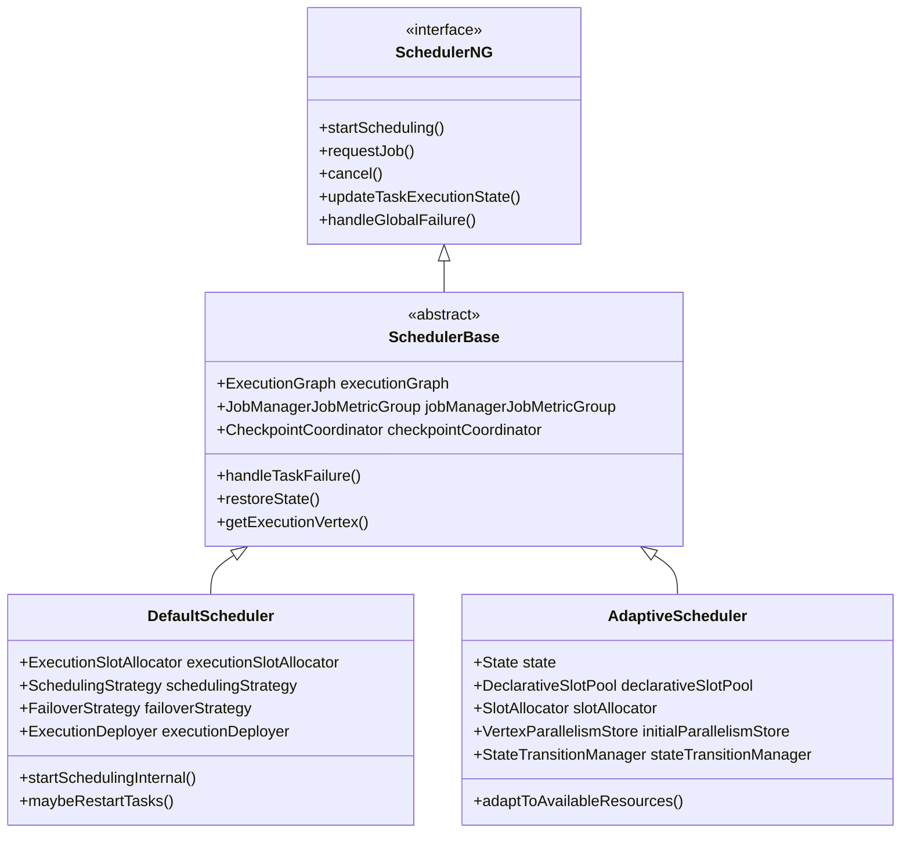
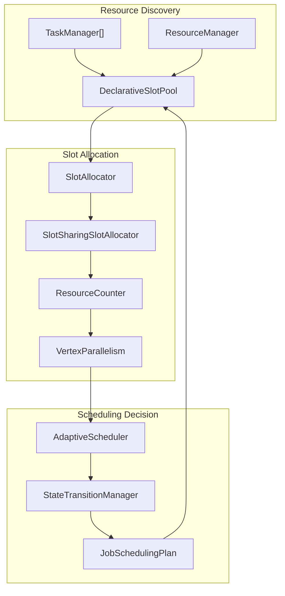
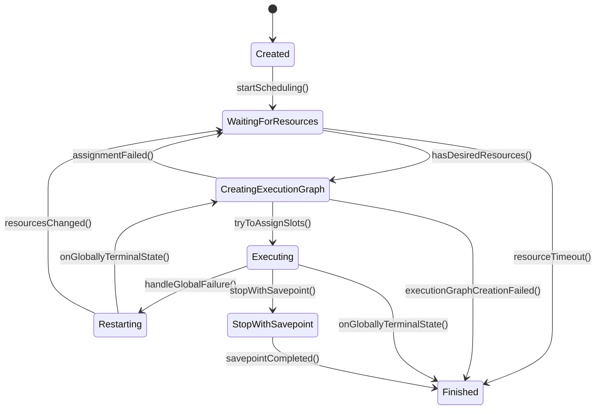
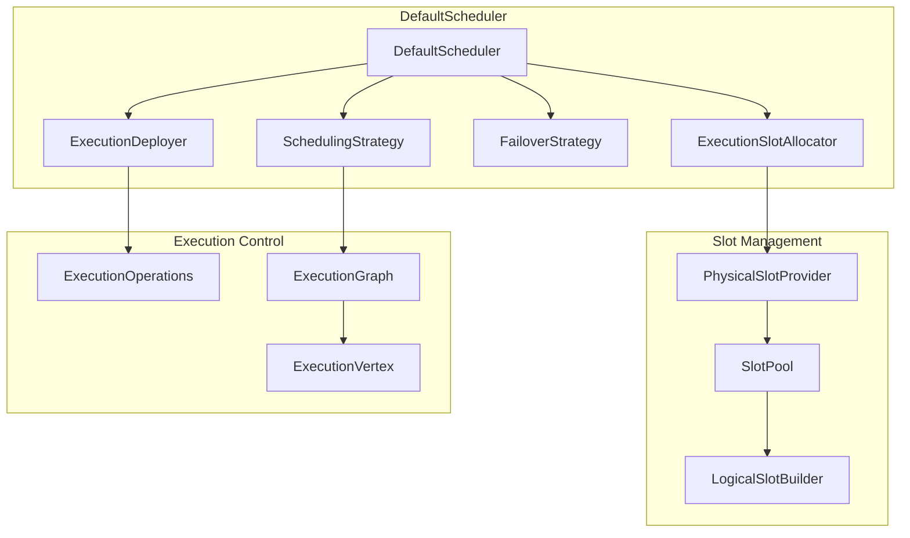
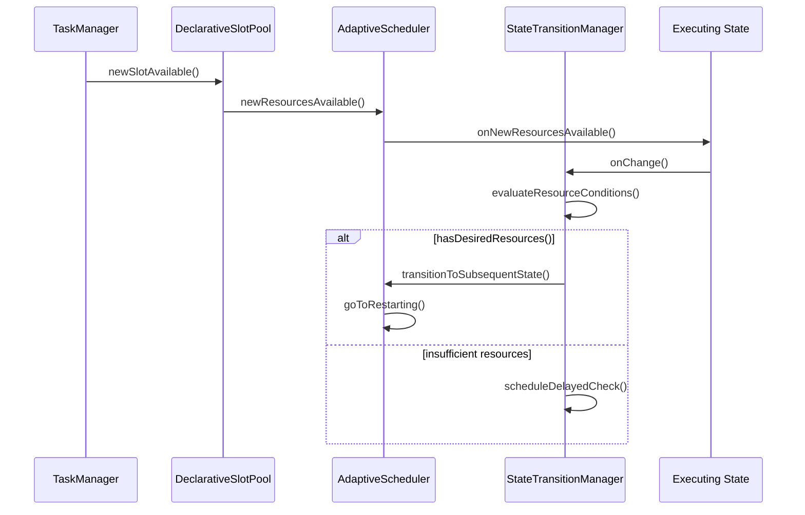

# Job Scheduling & Resource Management

Relevant source files

The following files were used as context for generating this wiki page:

- [flink-runtime/src/main/java/org/apache/flink/runtime/jobgraph/jsonplan/JsonPlanGenerator.java](flink-runtime/src/main/java/org/apache/flink/runtime/jobgraph/jsonplan/JsonPlanGenerator.java)
- [flink-runtime/src/main/java/org/apache/flink/runtime/jobmaster/DefaultSlotPoolServiceSchedulerFactory.java](flink-runtime/src/main/java/org/apache/flink/runtime/jobmaster/DefaultSlotPoolServiceSchedulerFactory.java)
- [flink-runtime/src/main/java/org/apache/flink/runtime/jobmaster/SlotPoolServiceSchedulerFactory.java](flink-runtime/src/main/java/org/apache/flink/runtime/jobmaster/SlotPoolServiceSchedulerFactory.java)
- [flink-runtime/src/main/java/org/apache/flink/runtime/scheduler/DefaultScheduler.java](flink-runtime/src/main/java/org/apache/flink/runtime/scheduler/DefaultScheduler.java)
- [flink-runtime/src/main/java/org/apache/flink/runtime/scheduler/DefaultSchedulerFactory.java](flink-runtime/src/main/java/org/apache/flink/runtime/scheduler/DefaultSchedulerFactory.java)
- [flink-runtime/src/main/java/org/apache/flink/runtime/scheduler/SchedulerBase.java](flink-runtime/src/main/java/org/apache/flink/runtime/scheduler/SchedulerBase.java)
- [flink-runtime/src/main/java/org/apache/flink/runtime/scheduler/adaptive/AdaptiveScheduler.java](flink-runtime/src/main/java/org/apache/flink/runtime/scheduler/adaptive/AdaptiveScheduler.java)
- [flink-runtime/src/main/java/org/apache/flink/runtime/scheduler/adaptive/AdaptiveSchedulerFactory.java](flink-runtime/src/main/java/org/apache/flink/runtime/scheduler/adaptive/AdaptiveSchedulerFactory.java)
- [flink-runtime/src/main/java/org/apache/flink/runtime/scheduler/adaptive/Canceling.java](flink-runtime/src/main/java/org/apache/flink/runtime/scheduler/adaptive/Canceling.java)
- [flink-runtime/src/main/java/org/apache/flink/runtime/scheduler/adaptive/Created.java](flink-runtime/src/main/java/org/apache/flink/runtime/scheduler/adaptive/Created.java)
- [flink-runtime/src/main/java/org/apache/flink/runtime/scheduler/adaptive/CreatingExecutionGraph.java](flink-runtime/src/main/java/org/apache/flink/runtime/scheduler/adaptive/CreatingExecutionGraph.java)
- [flink-runtime/src/main/java/org/apache/flink/runtime/scheduler/adaptive/DefaultStateTransitionManager.java](flink-runtime/src/main/java/org/apache/flink/runtime/scheduler/adaptive/DefaultStateTransitionManager.java)
- [flink-runtime/src/main/java/org/apache/flink/runtime/scheduler/adaptive/Executing.java](flink-runtime/src/main/java/org/apache/flink/runtime/scheduler/adaptive/Executing.java)
- [flink-runtime/src/main/java/org/apache/flink/runtime/scheduler/adaptive/Failing.java](flink-runtime/src/main/java/org/apache/flink/runtime/scheduler/adaptive/Failing.java)
- [flink-runtime/src/main/java/org/apache/flink/runtime/scheduler/adaptive/FailureResultUtil.java](flink-runtime/src/main/java/org/apache/flink/runtime/scheduler/adaptive/FailureResultUtil.java)
- [flink-runtime/src/main/java/org/apache/flink/runtime/scheduler/adaptive/Finished.java](flink-runtime/src/main/java/org/apache/flink/runtime/scheduler/adaptive/Finished.java)
- [flink-runtime/src/main/java/org/apache/flink/runtime/scheduler/adaptive/Restarting.java](flink-runtime/src/main/java/org/apache/flink/runtime/scheduler/adaptive/Restarting.java)
- [flink-runtime/src/main/java/org/apache/flink/runtime/scheduler/adaptive/State.java](flink-runtime/src/main/java/org/apache/flink/runtime/scheduler/adaptive/State.java)
- [flink-runtime/src/main/java/org/apache/flink/runtime/scheduler/adaptive/StateTransitionManager.java](flink-runtime/src/main/java/org/apache/flink/runtime/scheduler/adaptive/StateTransitionManager.java)
- [flink-runtime/src/main/java/org/apache/flink/runtime/scheduler/adaptive/StateTransitions.java](flink-runtime/src/main/java/org/apache/flink/runtime/scheduler/adaptive/StateTransitions.java)
- [flink-runtime/src/main/java/org/apache/flink/runtime/scheduler/adaptive/StateWithExecutionGraph.java](flink-runtime/src/main/java/org/apache/flink/runtime/scheduler/adaptive/StateWithExecutionGraph.java)
- [flink-runtime/src/main/java/org/apache/flink/runtime/scheduler/adaptive/StateWithoutExecutionGraph.java](flink-runtime/src/main/java/org/apache/flink/runtime/scheduler/adaptive/StateWithoutExecutionGraph.java)
- [flink-runtime/src/main/java/org/apache/flink/runtime/scheduler/adaptive/StopWithSavepoint.java](flink-runtime/src/main/java/org/apache/flink/runtime/scheduler/adaptive/StopWithSavepoint.java)
- [flink-runtime/src/main/java/org/apache/flink/runtime/scheduler/adaptive/WaitingForResources.java](flink-runtime/src/main/java/org/apache/flink/runtime/scheduler/adaptive/WaitingForResources.java)
- [flink-runtime/src/test/java/org/apache/flink/runtime/jobgraph/jsonplan/JsonGeneratorTest.java](flink-runtime/src/test/java/org/apache/flink/runtime/jobgraph/jsonplan/JsonGeneratorTest.java)
- [flink-runtime/src/test/java/org/apache/flink/runtime/jobmaster/DefaultSlotPoolServiceSchedulerFactoryTest.java](flink-runtime/src/test/java/org/apache/flink/runtime/jobmaster/DefaultSlotPoolServiceSchedulerFactoryTest.java)
- [flink-runtime/src/test/java/org/apache/flink/runtime/jobmaster/JobMasterExecutionDeploymentReconciliationTest.java](flink-runtime/src/test/java/org/apache/flink/runtime/jobmaster/JobMasterExecutionDeploymentReconciliationTest.java)
- [flink-runtime/src/test/java/org/apache/flink/runtime/jobmaster/JobMasterQueryableStateTest.java](flink-runtime/src/test/java/org/apache/flink/runtime/jobmaster/JobMasterQueryableStateTest.java)
- [flink-runtime/src/test/java/org/apache/flink/runtime/jobmaster/JobMasterSchedulerTest.java](flink-runtime/src/test/java/org/apache/flink/runtime/jobmaster/JobMasterSchedulerTest.java)
- [flink-runtime/src/test/java/org/apache/flink/runtime/scheduler/DefaultSchedulerTest.java](flink-runtime/src/test/java/org/apache/flink/runtime/scheduler/DefaultSchedulerTest.java)
- [flink-runtime/src/test/java/org/apache/flink/runtime/scheduler/SchedulerTestingUtils.java](flink-runtime/src/test/java/org/apache/flink/runtime/scheduler/SchedulerTestingUtils.java)
- [flink-runtime/src/test/java/org/apache/flink/runtime/scheduler/TestingSchedulerNGFactory.java](flink-runtime/src/test/java/org/apache/flink/runtime/scheduler/TestingSchedulerNGFactory.java)
- [flink-runtime/src/test/java/org/apache/flink/runtime/scheduler/adaptive/AdaptiveSchedulerBuilder.java](flink-runtime/src/test/java/org/apache/flink/runtime/scheduler/adaptive/AdaptiveSchedulerBuilder.java)
- [flink-runtime/src/test/java/org/apache/flink/runtime/scheduler/adaptive/AdaptiveSchedulerClusterITCase.java](flink-runtime/src/test/java/org/apache/flink/runtime/scheduler/adaptive/AdaptiveSchedulerClusterITCase.java)
- [flink-runtime/src/test/java/org/apache/flink/runtime/scheduler/adaptive/AdaptiveSchedulerSimpleITCase.java](flink-runtime/src/test/java/org/apache/flink/runtime/scheduler/adaptive/AdaptiveSchedulerSimpleITCase.java)
- [flink-runtime/src/test/java/org/apache/flink/runtime/scheduler/adaptive/AdaptiveSchedulerSlotSharingITCase.java](flink-runtime/src/test/java/org/apache/flink/runtime/scheduler/adaptive/AdaptiveSchedulerSlotSharingITCase.java)
- [flink-runtime/src/test/java/org/apache/flink/runtime/scheduler/adaptive/AdaptiveSchedulerTest.java](flink-runtime/src/test/java/org/apache/flink/runtime/scheduler/adaptive/AdaptiveSchedulerTest.java)
- [flink-runtime/src/test/java/org/apache/flink/runtime/scheduler/adaptive/CancelingTest.java](flink-runtime/src/test/java/org/apache/flink/runtime/scheduler/adaptive/CancelingTest.java)
- [flink-runtime/src/test/java/org/apache/flink/runtime/scheduler/adaptive/CreatedTest.java](flink-runtime/src/test/java/org/apache/flink/runtime/scheduler/adaptive/CreatedTest.java)
- [flink-runtime/src/test/java/org/apache/flink/runtime/scheduler/adaptive/CreatingExecutionGraphTest.java](flink-runtime/src/test/java/org/apache/flink/runtime/scheduler/adaptive/CreatingExecutionGraphTest.java)
- [flink-runtime/src/test/java/org/apache/flink/runtime/scheduler/adaptive/DefaultStateTransitionManagerTest.java](flink-runtime/src/test/java/org/apache/flink/runtime/scheduler/adaptive/DefaultStateTransitionManagerTest.java)
- [flink-runtime/src/test/java/org/apache/flink/runtime/scheduler/adaptive/ExecutingTest.java](flink-runtime/src/test/java/org/apache/flink/runtime/scheduler/adaptive/ExecutingTest.java)
- [flink-runtime/src/test/java/org/apache/flink/runtime/scheduler/adaptive/FailingTest.java](flink-runtime/src/test/java/org/apache/flink/runtime/scheduler/adaptive/FailingTest.java)
- [flink-runtime/src/test/java/org/apache/flink/runtime/scheduler/adaptive/MockRestartingContext.java](flink-runtime/src/test/java/org/apache/flink/runtime/scheduler/adaptive/MockRestartingContext.java)
- [flink-runtime/src/test/java/org/apache/flink/runtime/scheduler/adaptive/MockStateWithoutExecutionGraphContext.java](flink-runtime/src/test/java/org/apache/flink/runtime/scheduler/adaptive/MockStateWithoutExecutionGraphContext.java)
- [flink-runtime/src/test/java/org/apache/flink/runtime/scheduler/adaptive/RestartingTest.java](flink-runtime/src/test/java/org/apache/flink/runtime/scheduler/adaptive/RestartingTest.java)
- [flink-runtime/src/test/java/org/apache/flink/runtime/scheduler/adaptive/StateTest.java](flink-runtime/src/test/java/org/apache/flink/runtime/scheduler/adaptive/StateTest.java)
- [flink-runtime/src/test/java/org/apache/flink/runtime/scheduler/adaptive/StateWithExecutionGraphTest.java](flink-runtime/src/test/java/org/apache/flink/runtime/scheduler/adaptive/StateWithExecutionGraphTest.java)
- [flink-runtime/src/test/java/org/apache/flink/runtime/scheduler/adaptive/StateWithoutExecutionGraphTest.java](flink-runtime/src/test/java/org/apache/flink/runtime/scheduler/adaptive/StateWithoutExecutionGraphTest.java)
- [flink-runtime/src/test/java/org/apache/flink/runtime/scheduler/adaptive/StopWithSavepointTest.java](flink-runtime/src/test/java/org/apache/flink/runtime/scheduler/adaptive/StopWithSavepointTest.java)
- [flink-runtime/src/test/java/org/apache/flink/runtime/scheduler/adaptive/TestingStateTransitionManager.java](flink-runtime/src/test/java/org/apache/flink/runtime/scheduler/adaptive/TestingStateTransitionManager.java)
- [flink-runtime/src/test/java/org/apache/flink/runtime/scheduler/adaptive/WaitingForResourcesTest.java](flink-runtime/src/test/java/org/apache/flink/runtime/scheduler/adaptive/WaitingForResourcesTest.java)
- [flink-tests/src/test/java/org/apache/flink/test/scheduling/ReactiveModeITCase.java](flink-tests/src/test/java/org/apache/flink/test/scheduling/ReactiveModeITCase.java)

This document details how Flink schedules jobs, manages resources, and adapts to changing cluster conditions. It covers the scheduling architecture, resource allocation mechanisms, and the adaptive scheduler's state machine that enables dynamic parallelism adjustment based on available cluster resources.

For information about task execution and deployment, see [Task Execution Engine](#2.2). For details about checkpoint coordination and state snapshots, see [Fault Tolerance & Checkpointing](#2.3).

## Scheduler Architecture Overview

Flink provides two main scheduler implementations that handle job scheduling and resource management with different approaches to parallelism and resource utilization.

### Scheduler Hierarchy

Sources: [flink-runtime/src/main/java/org/apache/flink/runtime/scheduler/SchedulerBase.java:139-140](), [flink-runtime/src/main/java/org/apache/flink/runtime/scheduler/DefaultScheduler.java:84](), [flink-runtime/src/main/java/org/apache/flink/runtime/scheduler/adaptive/AdaptiveScheduler.java:179-188]()

## Resource Management Components

The resource management system coordinates slot allocation and tracks resource availability across the cluster.

### Core Resource Management Architecture

Sources: [flink-runtime/src/main/java/org/apache/flink/runtime/scheduler/adaptive/AdaptiveScheduler.java:376](), [flink-runtime/src/main/java/org/apache/flink/runtime/scheduler/adaptive/allocator/SlotAllocator.java](), [flink-runtime/src/main/java/org/apache/flink/runtime/util/ResourceCounter.java]()

### Resource Requirements and Allocation

The system tracks resource requirements using several key abstractions:

| Component | Purpose | Key Methods |
|-----------|---------|-------------|
| `ResourceCounter` | Tracks resource requirements by profile | `withResource()`, `getResourcesWithCount()` |
| `VertexParallelism` | Maps job vertices to parallelism | `getParallelism()`, `getVertices()` |
| `DeclarativeSlotPool` | Manages available slots | `reserveFreeSlot()`, `freeReservedSlot()` |
| `SlotAllocator` | Allocates slots to execution vertices | `reserveResources()`, `tryReserveResources()` |

Sources: [flink-runtime/src/main/java/org/apache/flink/runtime/util/ResourceCounter.java](), [flink-runtime/src/main/java/org/apache/flink/runtime/scheduler/adaptive/allocator/VertexParallelism.java](), [flink-runtime/src/main/java/org/apache/flink/runtime/jobmaster/slotpool/DeclarativeSlotPool.java]()

## Adaptive Scheduler State Machine

The `AdaptiveScheduler` uses a state machine to manage job lifecycle and adapt to resource changes dynamically.

### State Transition Flow

Sources: [flink-runtime/src/main/java/org/apache/flink/runtime/scheduler/adaptive/AdaptiveScheduler.java:402](), [flink-runtime/src/main/java/org/apache/flink/runtime/scheduler/adaptive/Created.java](), [flink-runtime/src/main/java/org/apache/flink/runtime/scheduler/adaptive/WaitingForResources.java](), [flink-runtime/src/main/java/org/apache/flink/runtime/scheduler/adaptive/Executing.java]()

### State Implementations and Responsibilities

| State | File | Key Responsibilities |
|-------|------|---------------------|
| `Created` | `Created.java` | Initial state, transitions to `WaitingForResources` |
| `WaitingForResources` | `WaitingForResources.java` | Waits for sufficient resources, handles timeout |
| `CreatingExecutionGraph` | `CreatingExecutionGraph.java` | Creates ExecutionGraph and assigns slots |
| `Executing` | `Executing.java` | Runs job, monitors resources, handles rescaling |
| `Restarting` | `Restarting.java` | Cancels current execution, prepares restart |
| `StopWithSavepoint` | `StopWithSavepoint.java` | Coordinates savepoint creation and job termination |
| `Finished` | `Finished.java` | Terminal state for completed/failed jobs |

Sources: [flink-runtime/src/main/java/org/apache/flink/runtime/scheduler/adaptive/]()

## Default Scheduler Architecture

The `DefaultScheduler` provides traditional scheduling with fixed parallelism and established scheduling strategies.

### Default Scheduler Components

Sources: [flink-runtime/src/main/java/org/apache/flink/runtime/scheduler/DefaultScheduler.java:115-141](), [flink-runtime/src/main/java/org/apache/flink/runtime/scheduler/ExecutionSlotAllocator.java](), [flink-runtime/src/main/java/org/apache/flink/runtime/scheduler/strategy/SchedulingStrategy.java]()

### Scheduling Strategy Types

The `DefaultScheduler` supports multiple scheduling strategies:

- **`PipelinedRegionSchedulingStrategy`**: Schedules tasks in pipelined regions, enabling efficient streaming execution
- **`EagerSchedulingStrategy`**: Schedules all tasks immediately when resources are available
- **`LazyFromSourcesSchedulingStrategy`**: Schedules tasks lazily starting from source operators

Sources: [flink-runtime/src/main/java/org/apache/flink/runtime/scheduler/strategy/PipelinedRegionSchedulingStrategy.java](), [flink-runtime/src/main/java/org/apache/flink/runtime/scheduler/DefaultScheduler.java:199-200]()

## Resource Adaptation and Scaling

The adaptive scheduler continuously monitors resource availability and can trigger rescaling operations.

### Resource Change Detection and Response

Sources: [flink-runtime/src/main/java/org/apache/flink/runtime/scheduler/adaptive/AdaptiveScheduler.java:542](), [flink-runtime/src/main/java/org/apache/flink/runtime/scheduler/adaptive/Executing.java:221-224](), [flink-runtime/src/main/java/org/apache/flink/runtime/scheduler/adaptive/DefaultStateTransitionManager.java]()

### Parallelism Calculation and Vertex Scaling

The system determines optimal parallelism based on available resources:

Sources: [flink-runtime/src/main/java/org/apache/flink/runtime/scheduler/adaptive/allocator/VertexParallelism.java](), [flink-runtime/src/main/java/org/apache/flink/runtime/scheduler/adaptive/JobSchedulingPlan.java](), [flink-runtime/src/main/java/org/apache/flink/runtime/scheduler/ExecutionGraphFactory.java]()

## Configuration and Tuning

Key configuration options control scheduler behavior and resource management:

| Configuration Option | Purpose | Default Value |
|---------------------|---------|---------------|
| `jobmanager.scheduler` | Selects scheduler type (Adaptive/Default) | `Default` |
| `jobmanager.adaptive-scheduler.resource-wait-timeout` | Time to wait for resources before failing | `5min` |
| `jobmanager.adaptive-scheduler.resource-stabilization-timeout` | Wait time before scaling decisions | `10s` |
| `jobmanager.adaptive-scheduler.max-delay-for-scale-trigger` | Maximum delay before forced scaling | Based on checkpoint interval |

Sources: [flink-runtime/src/main/java/org/apache/flink/runtime/scheduler/adaptive/AdaptiveScheduler.java:215-304](), [flink-runtime/src/main/java/org/apache/flink/configuration/JobManagerOptions.java]()

The scheduler architecture provides both traditional fixed-parallelism scheduling through `DefaultScheduler` and dynamic resource adaptation through `AdaptiveScheduler`, enabling Flink to handle varying cluster conditions and optimize resource utilization based on workload requirements.
