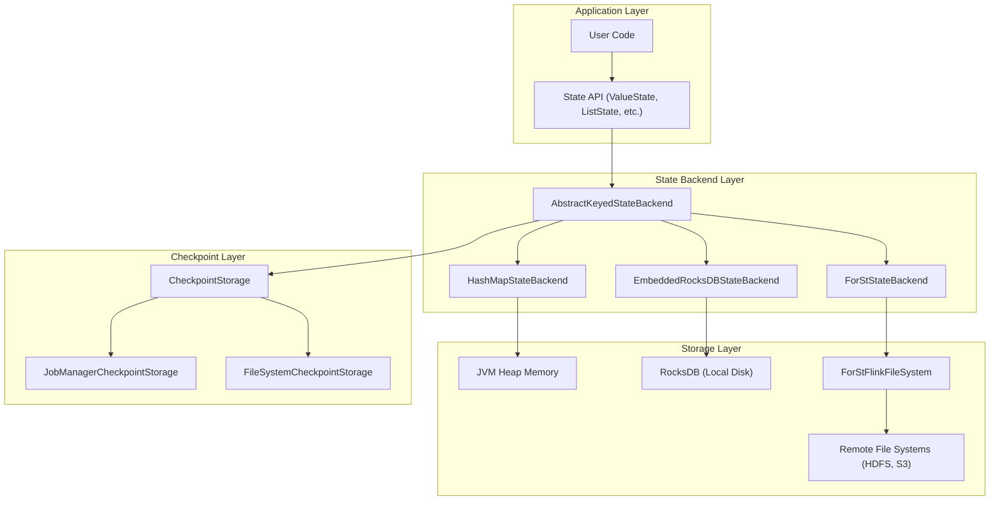
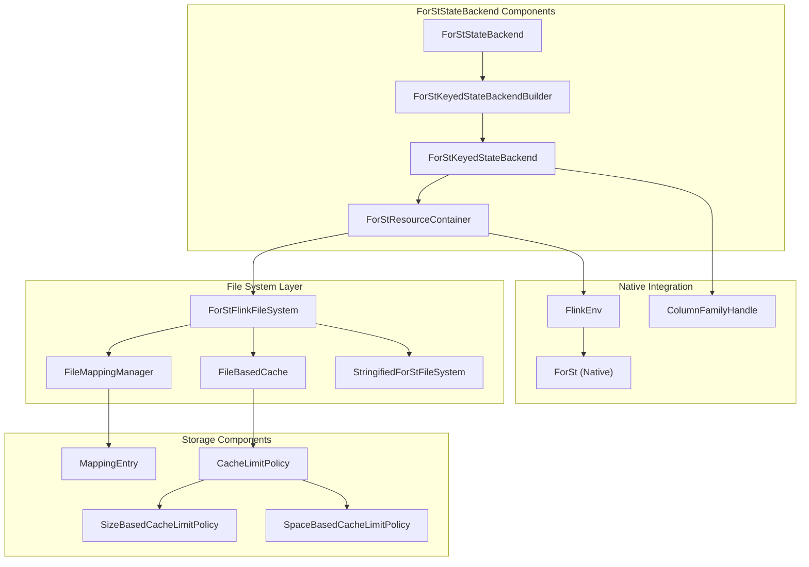
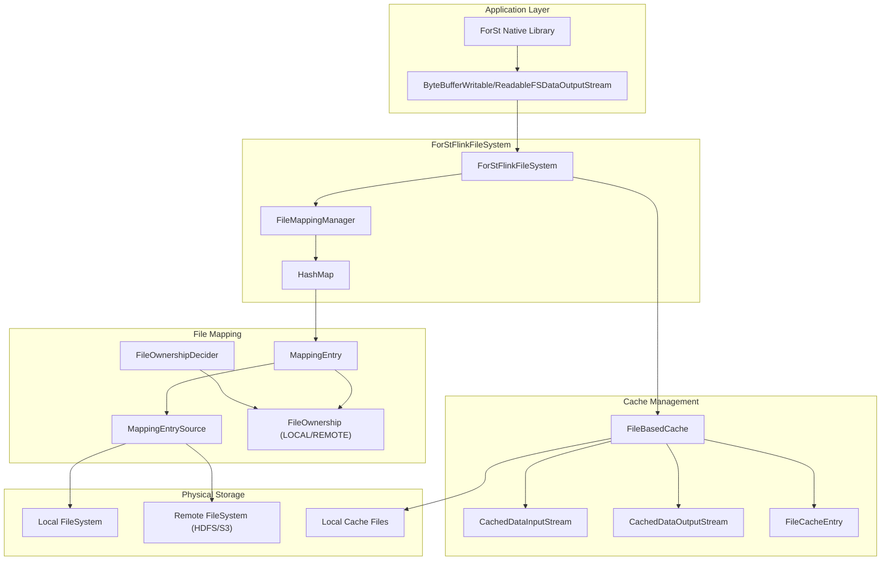

# State Management

<details>
<summary>Relevant source files</summary>

The following files were used as context for generating this wiki page:

- [docs/content.zh/docs/deployment/config.md](docs/content.zh/docs/deployment/config.md)
- [docs/content.zh/docs/ops/metrics.md](docs/content.zh/docs/ops/metrics.md)
- [docs/content.zh/docs/ops/state/state_backends.md](docs/content.zh/docs/ops/state/state_backends.md)
- [docs/content/docs/deployment/config.md](docs/content/docs/deployment/config.md)
- [docs/content/docs/ops/metrics.md](docs/content/docs/ops/metrics.md)
- [docs/content/docs/ops/state/state_backends.md](docs/content/docs/ops/state/state_backends.md)
- [docs/layouts/shortcodes/generated/expert_forst_section.html](docs/layouts/shortcodes/generated/expert_forst_section.html)
- [docs/layouts/shortcodes/generated/forst_configuration.html](docs/layouts/shortcodes/generated/forst_configuration.html)
- [docs/layouts/shortcodes/generated/fs_state_changelog_configuration.html](docs/layouts/shortcodes/generated/fs_state_changelog_configuration.html)
- [docs/layouts/shortcodes/generated/influxdb_reporter_configuration.html](docs/layouts/shortcodes/generated/influxdb_reporter_configuration.html)
- [docs/layouts/shortcodes/generated/slow_task_detector_configuration.html](docs/layouts/shortcodes/generated/slow_task_detector_configuration.html)
- [docs/layouts/shortcodes/generated/state_backend_forst_section.html](docs/layouts/shortcodes/generated/state_backend_forst_section.html)
- [docs/layouts/shortcodes/generated/state_changelog_section.html](docs/layouts/shortcodes/generated/state_changelog_section.html)
- [flink-annotations/src/main/java/org/apache/flink/annotation/docs/Documentation.java](flink-annotations/src/main/java/org/apache/flink/annotation/docs/Documentation.java)
- [flink-clients/src/main/java/org/apache/flink/client/cli/ArtifactFetchOptions.java](flink-clients/src/main/java/org/apache/flink/client/cli/ArtifactFetchOptions.java)
- [flink-core/src/main/java/org/apache/flink/configuration/AlgorithmOptions.java](flink-core/src/main/java/org/apache/flink/configuration/AlgorithmOptions.java)
- [flink-core/src/main/java/org/apache/flink/configuration/SlowTaskDetectorOptions.java](flink-core/src/main/java/org/apache/flink/configuration/SlowTaskDetectorOptions.java)
- [flink-docs/pom.xml](flink-docs/pom.xml)
- [flink-docs/src/main/java/org/apache/flink/docs/configuration/ConfigOptionsDocGenerator.java](flink-docs/src/main/java/org/apache/flink/docs/configuration/ConfigOptionsDocGenerator.java)
- [flink-docs/src/main/java/org/apache/flink/docs/util/ConfigurationOptionLocator.java](flink-docs/src/main/java/org/apache/flink/docs/util/ConfigurationOptionLocator.java)
- [flink-docs/src/test/java/org/apache/flink/docs/configuration/ConfigOptionsDocGeneratorTest.java](flink-docs/src/test/java/org/apache/flink/docs/configuration/ConfigOptionsDocGeneratorTest.java)
- [flink-docs/src/test/java/org/apache/flink/docs/configuration/ConfigOptionsDocsCompletenessITCase.java](flink-docs/src/test/java/org/apache/flink/docs/configuration/ConfigOptionsDocsCompletenessITCase.java)
- [flink-docs/src/test/resources/META-INF/services/org.junit.jupiter.api.extension.Extension](flink-docs/src/test/resources/META-INF/services/org.junit.jupiter.api.extension.Extension)
- [flink-libraries/flink-cep/src/main/java/org/apache/flink/cep/configuration/CEPCacheOptions.java](flink-libraries/flink-cep/src/main/java/org/apache/flink/cep/configuration/CEPCacheOptions.java)
- [flink-metrics/flink-metrics-influxdb/src/main/java/org/apache/flink/metrics/influxdb/InfluxdbReporterOptions.java](flink-metrics/flink-metrics-influxdb/src/main/java/org/apache/flink/metrics/influxdb/InfluxdbReporterOptions.java)
- [flink-runtime/src/main/java/org/apache/flink/runtime/highavailability/JobResultStoreOptions.java](flink-runtime/src/main/java/org/apache/flink/runtime/highavailability/JobResultStoreOptions.java)
- [flink-runtime/src/main/java/org/apache/flink/runtime/metrics/MetricNames.java](flink-runtime/src/main/java/org/apache/flink/runtime/metrics/MetricNames.java)
- [flink-runtime/src/main/java/org/apache/flink/runtime/metrics/util/MetricUtils.java](flink-runtime/src/main/java/org/apache/flink/runtime/metrics/util/MetricUtils.java)
- [flink-runtime/src/main/java/org/apache/flink/runtime/shuffle/ShuffleServiceOptions.java](flink-runtime/src/main/java/org/apache/flink/runtime/shuffle/ShuffleServiceOptions.java)
- [flink-runtime/src/main/java/org/apache/flink/runtime/state/RegisteredBroadcastStateBackendMetaInfo.java](flink-runtime/src/main/java/org/apache/flink/runtime/state/RegisteredBroadcastStateBackendMetaInfo.java)
- [flink-runtime/src/main/java/org/apache/flink/runtime/state/RegisteredKeyValueStateBackendMetaInfo.java](flink-runtime/src/main/java/org/apache/flink/runtime/state/RegisteredKeyValueStateBackendMetaInfo.java)
- [flink-runtime/src/main/java/org/apache/flink/runtime/state/RegisteredStateMetaInfoBase.java](flink-runtime/src/main/java/org/apache/flink/runtime/state/RegisteredStateMetaInfoBase.java)
- [flink-runtime/src/main/java/org/apache/flink/runtime/state/RegisteredStateMetaInfoUtils.java](flink-runtime/src/main/java/org/apache/flink/runtime/state/RegisteredStateMetaInfoUtils.java)
- [flink-runtime/src/main/java/org/apache/flink/runtime/state/metainfo/StateMetaInfoSnapshot.java](flink-runtime/src/main/java/org/apache/flink/runtime/state/metainfo/StateMetaInfoSnapshot.java)
- [flink-runtime/src/main/java/org/apache/flink/runtime/state/v2/RegisteredKeyAndUserKeyValueStateBackendMetaInfo.java](flink-runtime/src/main/java/org/apache/flink/runtime/state/v2/RegisteredKeyAndUserKeyValueStateBackendMetaInfo.java)
- [flink-runtime/src/main/java/org/apache/flink/runtime/state/v2/RegisteredKeyValueStateBackendMetaInfo.java](flink-runtime/src/main/java/org/apache/flink/runtime/state/v2/RegisteredKeyValueStateBackendMetaInfo.java)
- [flink-runtime/src/test/java/org/apache/flink/runtime/metrics/util/MetricUtilsTest.java](flink-runtime/src/test/java/org/apache/flink/runtime/metrics/util/MetricUtilsTest.java)
- [flink-runtime/src/test/java/org/apache/flink/runtime/state/metainfo/StateMetaInfoSnapshotEnumConstantsTest.java](flink-runtime/src/test/java/org/apache/flink/runtime/state/metainfo/StateMetaInfoSnapshotEnumConstantsTest.java)
- [flink-runtime/src/test/java/org/apache/flink/runtime/state/v2/RegisteredKeyValueStateBackendMetaInfoV2Test.java](flink-runtime/src/test/java/org/apache/flink/runtime/state/v2/RegisteredKeyValueStateBackendMetaInfoV2Test.java)
- [flink-runtime/src/test/java/org/apache/flink/runtime/state/v2/StateBackendTestV2Base.java](flink-runtime/src/test/java/org/apache/flink/runtime/state/v2/StateBackendTestV2Base.java)
- [flink-state-backends/flink-statebackend-forst/src/main/java/org/apache/flink/state/forst/ConfigurableForStOptionsFactory.java](flink-state-backends/flink-statebackend-forst/src/main/java/org/apache/flink/state/forst/ConfigurableForStOptionsFactory.java)
- [flink-state-backends/flink-statebackend-forst/src/main/java/org/apache/flink/state/forst/ForStConfigurableOptions.java](flink-state-backends/flink-statebackend-forst/src/main/java/org/apache/flink/state/forst/ForStConfigurableOptions.java)
- [flink-state-backends/flink-statebackend-forst/src/main/java/org/apache/flink/state/forst/ForStKeyedStateBackend.java](flink-state-backends/flink-statebackend-forst/src/main/java/org/apache/flink/state/forst/ForStKeyedStateBackend.java)
- [flink-state-backends/flink-statebackend-forst/src/main/java/org/apache/flink/state/forst/ForStKeyedStateBackendBuilder.java](flink-state-backends/flink-statebackend-forst/src/main/java/org/apache/flink/state/forst/ForStKeyedStateBackendBuilder.java)
- [flink-state-backends/flink-statebackend-forst/src/main/java/org/apache/flink/state/forst/ForStNativeMetricMonitor.java](flink-state-backends/flink-statebackend-forst/src/main/java/org/apache/flink/state/forst/ForStNativeMetricMonitor.java)
- [flink-state-backends/flink-statebackend-forst/src/main/java/org/apache/flink/state/forst/ForStNativeMetricOptions.java](flink-state-backends/flink-statebackend-forst/src/main/java/org/apache/flink/state/forst/ForStNativeMetricOptions.java)
- [flink-state-backends/flink-statebackend-forst/src/main/java/org/apache/flink/state/forst/ForStOperationUtils.java](flink-state-backends/flink-statebackend-forst/src/main/java/org/apache/flink/state/forst/ForStOperationUtils.java)
- [flink-state-backends/flink-statebackend-forst/src/main/java/org/apache/flink/state/forst/ForStOptions.java](flink-state-backends/flink-statebackend-forst/src/main/java/org/apache/flink/state/forst/ForStOptions.java)
- [flink-state-backends/flink-statebackend-forst/src/main/java/org/apache/flink/state/forst/ForStOptionsFactory.java](flink-state-backends/flink-statebackend-forst/src/main/java/org/apache/flink/state/forst/ForStOptionsFactory.java)
- [flink-state-backends/flink-statebackend-forst/src/main/java/org/apache/flink/state/forst/ForStProperty.java](flink-state-backends/flink-statebackend-forst/src/main/java/org/apache/flink/state/forst/ForStProperty.java)
- [flink-state-backends/flink-statebackend-forst/src/main/java/org/apache/flink/state/forst/ForStResourceContainer.java](flink-state-backends/flink-statebackend-forst/src/main/java/org/apache/flink/state/forst/ForStResourceContainer.java)
- [flink-state-backends/flink-statebackend-forst/src/main/java/org/apache/flink/state/forst/ForStStateBackend.java](flink-state-backends/flink-statebackend-forst/src/main/java/org/apache/flink/state/forst/ForStStateBackend.java)
- [flink-state-backends/flink-statebackend-forst/src/main/java/org/apache/flink/state/forst/fs/ForStFlinkFileSystem.java](flink-state-backends/flink-statebackend-forst/src/main/java/org/apache/flink/state/forst/fs/ForStFlinkFileSystem.java)
- [flink-state-backends/flink-statebackend-forst/src/main/java/org/apache/flink/state/forst/fs/cache/BundledCacheLimitPolicy.java](flink-state-backends/flink-statebackend-forst/src/main/java/org/apache/flink/state/forst/fs/cache/BundledCacheLimitPolicy.java)
- [flink-state-backends/flink-statebackend-forst/src/main/java/org/apache/flink/state/forst/fs/cache/CacheLimitPolicy.java](flink-state-backends/flink-statebackend-forst/src/main/java/org/apache/flink/state/forst/fs/cache/CacheLimitPolicy.java)
- [flink-state-backends/flink-statebackend-forst/src/main/java/org/apache/flink/state/forst/fs/cache/CachedDataInputStream.java](flink-state-backends/flink-statebackend-forst/src/main/java/org/apache/flink/state/forst/fs/cache/CachedDataInputStream.java)
- [flink-state-backends/flink-statebackend-forst/src/main/java/org/apache/flink/state/forst/fs/cache/CachedDataOutputStream.java](flink-state-backends/flink-statebackend-forst/src/main/java/org/apache/flink/state/forst/fs/cache/CachedDataOutputStream.java)
- [flink-state-backends/flink-statebackend-forst/src/main/java/org/apache/flink/state/forst/fs/cache/FileBasedCache.java](flink-state-backends/flink-statebackend-forst/src/main/java/org/apache/flink/state/forst/fs/cache/FileBasedCache.java)
- [flink-state-backends/flink-statebackend-forst/src/main/java/org/apache/flink/state/forst/fs/cache/FileCacheEntry.java](flink-state-backends/flink-statebackend-forst/src/main/java/org/apache/flink/state/forst/fs/cache/FileCacheEntry.java)
- [flink-state-backends/flink-statebackend-forst/src/main/java/org/apache/flink/state/forst/fs/cache/SizeBasedCacheLimitPolicy.java](flink-state-backends/flink-statebackend-forst/src/main/java/org/apache/flink/state/forst/fs/cache/SizeBasedCacheLimitPolicy.java)
- [flink-state-backends/flink-statebackend-forst/src/main/java/org/apache/flink/state/forst/fs/cache/SpaceBasedCacheLimitPolicy.java](flink-state-backends/flink-statebackend-forst/src/main/java/org/apache/flink/state/forst/fs/cache/SpaceBasedCacheLimitPolicy.java)
- [flink-state-backends/flink-statebackend-forst/src/main/java/org/apache/flink/state/forst/fs/filemapping/FSDataOutputStreamWithEntry.java](flink-state-backends/flink-statebackend-forst/src/main/java/org/apache/flink/state/forst/fs/filemapping/FSDataOutputStreamWithEntry.java)
- [flink-state-backends/flink-statebackend-forst/src/main/java/org/apache/flink/state/forst/fs/filemapping/FileMappingManager.java](flink-state-backends/flink-statebackend-forst/src/main/java/org/apache/flink/state/forst/fs/filemapping/FileMappingManager.java)
- [flink-state-backends/flink-statebackend-forst/src/main/java/org/apache/flink/state/forst/fs/filemapping/MappingEntry.java](flink-state-backends/flink-statebackend-forst/src/main/java/org/apache/flink/state/forst/fs/filemapping/MappingEntry.java)
- [flink-state-backends/flink-statebackend-forst/src/main/java/org/apache/flink/state/forst/restore/ForStHandle.java](flink-state-backends/flink-statebackend-forst/src/main/java/org/apache/flink/state/forst/restore/ForStHandle.java)
- [flink-state-backends/flink-statebackend-forst/src/main/java/org/apache/flink/state/forst/restore/ForStHeapTimersFullRestoreOperation.java](flink-state-backends/flink-statebackend-forst/src/main/java/org/apache/flink/state/forst/restore/ForStHeapTimersFullRestoreOperation.java)
- [flink-state-backends/flink-statebackend-forst/src/main/java/org/apache/flink/state/forst/restore/ForStIncrementalRestoreOperation.java](flink-state-backends/flink-statebackend-forst/src/main/java/org/apache/flink/state/forst/restore/ForStIncrementalRestoreOperation.java)
- [flink-state-backends/flink-statebackend-forst/src/main/java/org/apache/flink/state/forst/restore/ForStNoneRestoreOperation.java](flink-state-backends/flink-statebackend-forst/src/main/java/org/apache/flink/state/forst/restore/ForStNoneRestoreOperation.java)
- [flink-state-backends/flink-statebackend-forst/src/main/java/org/apache/flink/state/forst/sync/ForStSyncKeyedStateBackendBuilder.java](flink-state-backends/flink-statebackend-forst/src/main/java/org/apache/flink/state/forst/sync/ForStSyncKeyedStateBackendBuilder.java)
- [flink-state-backends/flink-statebackend-forst/src/test/java/org/apache/flink/state/forst/ForStAsyncAndSyncCompatibilityTest.java](flink-state-backends/flink-statebackend-forst/src/test/java/org/apache/flink/state/forst/ForStAsyncAndSyncCompatibilityTest.java)
- [flink-state-backends/flink-statebackend-forst/src/test/java/org/apache/flink/state/forst/ForStExtension.java](flink-state-backends/flink-statebackend-forst/src/test/java/org/apache/flink/state/forst/ForStExtension.java)
- [flink-state-backends/flink-statebackend-forst/src/test/java/org/apache/flink/state/forst/ForStNativeMetricMonitorTest.java](flink-state-backends/flink-statebackend-forst/src/test/java/org/apache/flink/state/forst/ForStNativeMetricMonitorTest.java)
- [flink-state-backends/flink-statebackend-forst/src/test/java/org/apache/flink/state/forst/ForStNativeMetricOptionsTest.java](flink-state-backends/flink-statebackend-forst/src/test/java/org/apache/flink/state/forst/ForStNativeMetricOptionsTest.java)
- [flink-state-backends/flink-statebackend-forst/src/test/java/org/apache/flink/state/forst/ForStPropertyTest.java](flink-state-backends/flink-statebackend-forst/src/test/java/org/apache/flink/state/forst/ForStPropertyTest.java)
- [flink-state-backends/flink-statebackend-forst/src/test/java/org/apache/flink/state/forst/ForStResourceContainerTest.java](flink-state-backends/flink-statebackend-forst/src/test/java/org/apache/flink/state/forst/ForStResourceContainerTest.java)
- [flink-state-backends/flink-statebackend-forst/src/test/java/org/apache/flink/state/forst/ForStStateBackendConfigTest.java](flink-state-backends/flink-statebackend-forst/src/test/java/org/apache/flink/state/forst/ForStStateBackendConfigTest.java)
- [flink-state-backends/flink-statebackend-forst/src/test/java/org/apache/flink/state/forst/ForStStateBackendTest.java](flink-state-backends/flink-statebackend-forst/src/test/java/org/apache/flink/state/forst/ForStStateBackendTest.java)
- [flink-state-backends/flink-statebackend-forst/src/test/java/org/apache/flink/state/forst/ForStStateMigrationTest.java](flink-state-backends/flink-statebackend-forst/src/test/java/org/apache/flink/state/forst/ForStStateMigrationTest.java)
- [flink-state-backends/flink-statebackend-forst/src/test/java/org/apache/flink/state/forst/ForStStateTestBase.java](flink-state-backends/flink-statebackend-forst/src/test/java/org/apache/flink/state/forst/ForStStateTestBase.java)
- [flink-state-backends/flink-statebackend-forst/src/test/java/org/apache/flink/state/forst/ForStTestUtils.java](flink-state-backends/flink-statebackend-forst/src/test/java/org/apache/flink/state/forst/ForStTestUtils.java)
- [flink-state-backends/flink-statebackend-forst/src/test/java/org/apache/flink/state/forst/fs/FileMappingManagerTest.java](flink-state-backends/flink-statebackend-forst/src/test/java/org/apache/flink/state/forst/fs/FileMappingManagerTest.java)
- [flink-state-backends/flink-statebackend-forst/src/test/java/org/apache/flink/state/forst/fs/ForStFlinkFileSystemTest.java](flink-state-backends/flink-statebackend-forst/src/test/java/org/apache/flink/state/forst/fs/ForStFlinkFileSystemTest.java)

</details>


This section covers Flink's state management capabilities, including the different state backend implementations, their architecture, configuration options, and the experimental ForSt state backend for disaggregated state storage. For information about checkpointing and fault tolerance mechanisms, see [Fault Tolerance & Checkpointing](#2.3).

State management in Flink handles the persistent storage and retrieval of operator state during stream processing. The state backend determines how state is stored internally, how it's serialized during checkpoints, and where checkpoint data is persisted. Flink provides multiple state backend implementations optimized for different use cases, from in-memory storage for low-latency access to disk-based and remote storage for large state scenarios.

## State Backend Architecture

Flink's state management system is built around the `StateBackend` interface, which provides abstractions for both local state storage and checkpoint persistence. The architecture separates concerns between state access patterns, serialization strategies, and storage locations.

**State Backend Architecture Overview**



**Sources:** [docs/content/docs/ops/state/state_backends.md:28-149](), [flink-state-backends/flink-statebackend-forst/src/main/java/org/apache/flink/state/forst/ForStStateBackend.java:90-107]()

## Available State Backends

Flink provides three main state backend implementations, each optimized for different performance and scalability requirements:

| State Backend | Storage Location | Use Case | Key Characteristics |
|---------------|------------------|----------|-------------------|
| `HashMapStateBackend` | JVM Heap | Fast access, limited by memory | In-memory hash tables, fastest access |
| `EmbeddedRocksDBStateBackend` | Local disk (RocksDB) | Large state, disk-bound | Serialized storage, incremental checkpoints |
| `ForStStateBackend` | Remote storage | Very large state, cloud-native | Disaggregated storage, async access |

### HashMapStateBackend

The `HashMapStateBackend` stores state as Java objects directly in the JVM heap using hash tables. This provides the fastest state access but limits state size to available cluster memory.

**Key Features:**
- Direct object storage on heap
- Fast state access through `hashCode()` and `equals()`
- Synchronous snapshots
- Not safe for object reuse

**Sources:** [docs/content/docs/ops/state/state_backends.md:51-65]()

### EmbeddedRocksDBStateBackend

The `EmbeddedRocksDBStateBackend` uses RocksDB as an embedded key-value store, storing state as serialized byte arrays on local disk. This enables much larger state sizes while providing reasonable performance.

**Key Features:**
- Serialized byte array storage
- Asynchronous snapshots
- Incremental checkpoints supported
- Byte-wise key comparisons
- Memory management through managed memory

**Sources:** [docs/content/docs/ops/state/state_backends.md:66-96]()

### ForStStateBackend (Experimental)

The `ForStStateBackend` represents Flink's experimental approach to disaggregated state management, storing SST files on remote file systems while maintaining local caches for performance.

**Key Features:**
- Remote storage (HDFS, S3, etc.)
- Local disk caching
- Asynchronous state access (State API V2)
- File mapping management
- Cloud-native scaling

**Sources:** [docs/content/docs/ops/state/state_backends.md:98-133](), [flink-state-backends/flink-statebackend-forst/src/main/java/org/apache/flink/state/forst/ForStStateBackend.java:91-119]()

## State Backend Core Components

**State Backend Implementation Architecture**



**Sources:** [flink-state-backends/flink-statebackend-forst/src/main/java/org/apache/flink/state/forst/ForStKeyedStateBackend.java:92-130](), [flink-state-backends/flink-statebackend-forst/src/main/java/org/apache/flink/state/forst/fs/ForStFlinkFileSystem.java:68-91](), [flink-state-backends/flink-statebackend-forst/src/main/java/org/apache/flink/state/forst/ForStResourceContainer.java:73-124]()

## Configuration and Setup

State backends can be configured globally in the Flink configuration file or per-job through the `StreamExecutionEnvironment`. The key configuration patterns include:

### Global Configuration

```yaml
# State backend type
state.backend.type: hashmap  # or rocksdb, forst

# Checkpoint directory  
execution.checkpointing.dir: hdfs://namenode:port/flink/checkpoints

# ForSt-specific configuration
state.backend.forst.primary-dir: s3://bucket/forst-data
state.backend.forst.local-dir: /tmp/forst-local
state.backend.forst.cache.dir: /tmp/forst-cache
```

### ForSt Configuration Options

The ForSt state backend provides extensive configuration options for tuning remote storage, caching, and performance:

| Configuration Key | Default | Description |
|-------------------|---------|-------------|
| `state.backend.forst.primary-dir` | checkpoint-dir | Primary directory for SST files |
| `state.backend.forst.local-dir` | `<WORKING_DIR>/tmp` | Local metadata directory |
| `state.backend.forst.cache.dir` | `(none)` | Cache directory for SST files |
| `state.backend.forst.cache.capacity` | 256 MB | Cache size limit |
| `state.backend.forst.cache.reserve-size` | 256 MB | Reserved disk space |

**Sources:** [docs/content/docs/deployment/config.md:157-161](), [flink-state-backends/flink-statebackend-forst/src/main/java/org/apache/flink/state/forst/ForStOptions.java:39-67]()

## ForSt File System Implementation

The ForSt state backend implements a specialized file system layer that manages the mapping between logical database files and physical storage locations, supporting both local caching and remote storage.

**ForSt File System Architecture**



**Sources:** [flink-state-backends/flink-statebackend-forst/src/main/java/org/apache/flink/state/forst/fs/ForStFlinkFileSystem.java:68-91](), [flink-state-backends/flink-statebackend-forst/src/main/java/org/apache/flink/state/forst/fs/filemapping/FileMappingManager.java:46-62]()

### File Mapping Management

The `FileMappingManager` maintains a mapping table that tracks the relationship between logical ForSt file paths and their physical storage locations. This enables transparent access to files regardless of whether they're stored locally or remotely.

**Key Components:**
- **Mapping Table**: `HashMap<String, MappingEntry>` tracking file locations
- **File Ownership**: Determines whether files should be `LOCAL` or `REMOTE`
- **UUID-based Paths**: Generates unique paths to avoid conflicts
- **File Linking**: Supports hard linking for efficient file reuse

**Sources:** [flink-state-backends/flink-statebackend-forst/src/main/java/org/apache/flink/state/forst/fs/filemapping/FileMappingManager.java:46-78]()

### Cache Management

The ForSt implementation includes a sophisticated caching system with multiple eviction policies:

**Cache Limit Policies:**
- `SizeBasedCacheLimitPolicy`: Limits cache by total size
- `SpaceBasedCacheLimitPolicy`: Limits cache by available disk space  
- `BundledCacheLimitPolicy`: Combines multiple policies

The cache system uses LRU eviction with configurable promotion thresholds and access tracking.

**Sources:** [flink-state-backends/flink-statebackend-forst/src/main/java/org/apache/flink/state/forst/fs/ForStFlinkFileSystem.java:114-167]()

## State Backend Selection and Migration

Choosing the appropriate state backend depends on several factors:

**Selection Criteria:**
- **State Size**: HashMapStateBackend for small state, RocksDB for large state, ForSt for very large state
- **Performance Requirements**: HashMapStateBackend for lowest latency, RocksDB for balanced performance
- **Infrastructure**: ForSt for cloud-native deployments with remote storage
- **Memory Availability**: RocksDB when heap memory is limited

**Migration Support:**
Starting from Flink 1.13, savepoints use a unified binary format, enabling migration between different state backends by taking a savepoint and restoring with a different backend configuration.

**Sources:** [docs/content/docs/ops/state/state_backends.md:134-147]()

## State Metrics and Monitoring

Flink exposes comprehensive metrics for monitoring state backend performance and resource usage:

**Key State Metrics:**
- Memory usage metrics for managed memory
- RocksDB native metrics (when enabled)
- Cache hit rates and eviction statistics for ForSt
- Checkpoint duration and size metrics
- State access latency and throughput

**Sources:** [docs/content/docs/ops/metrics.md:614-625](), [flink-runtime/src/main/java/org/apache/flink/runtime/metrics/MetricNames.java:74-78]()
