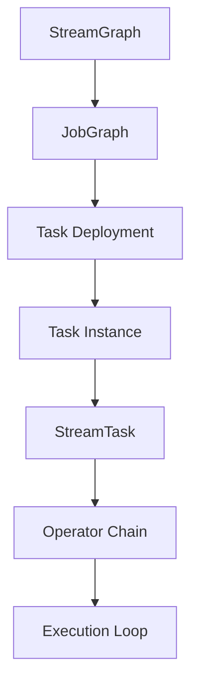
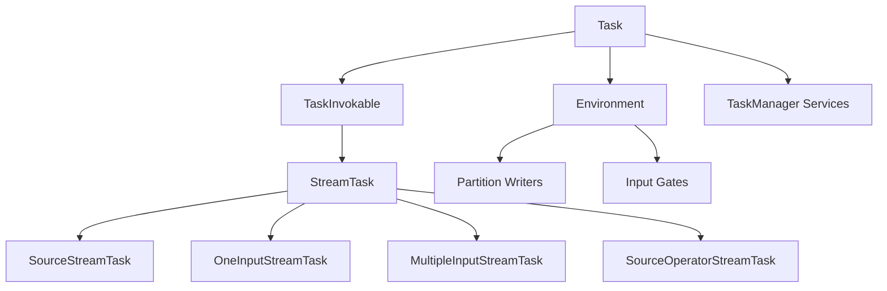
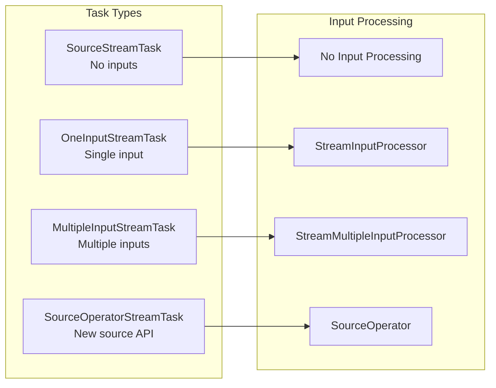
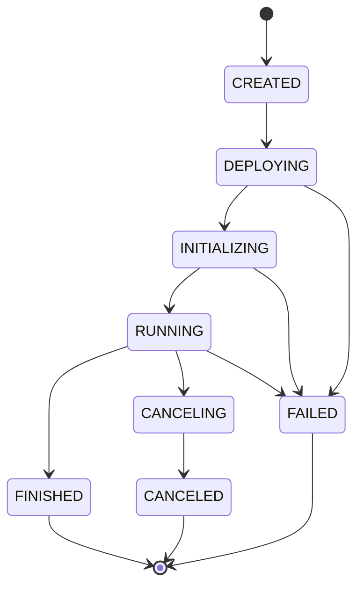
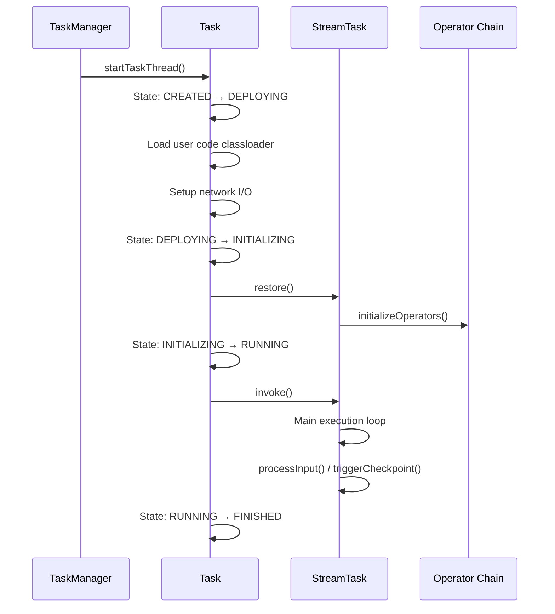
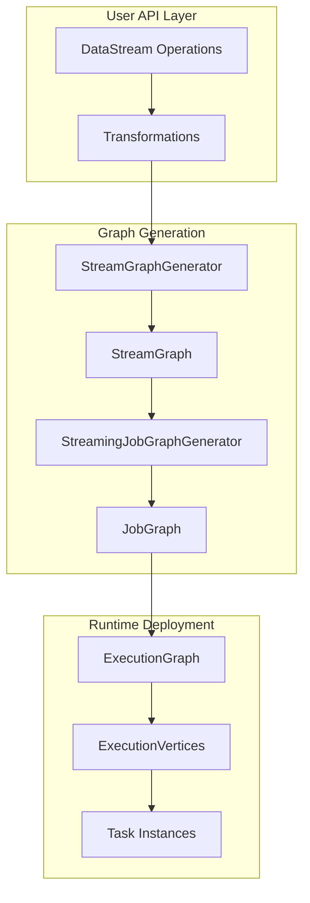
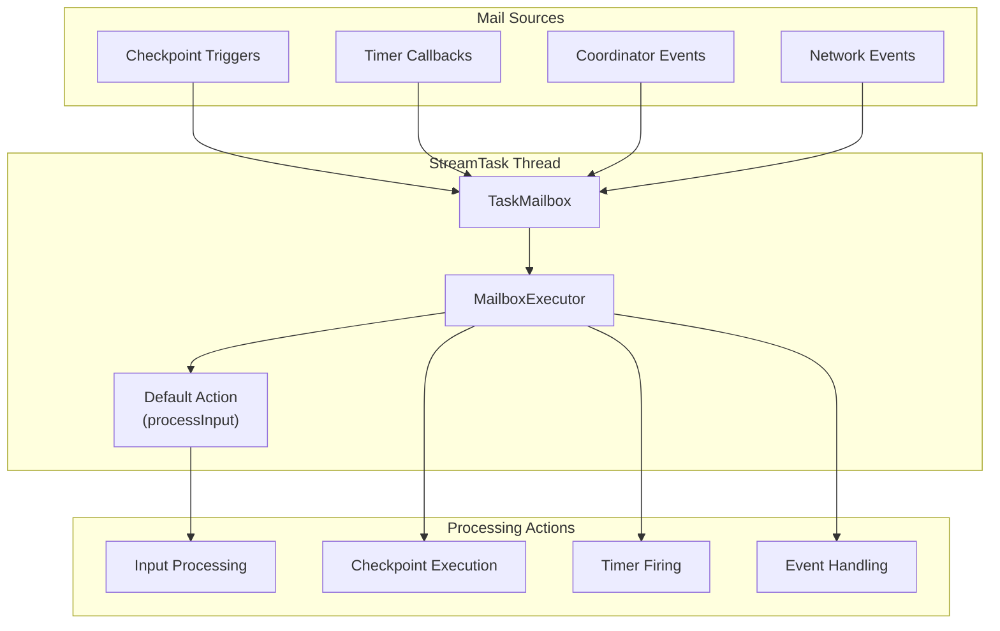
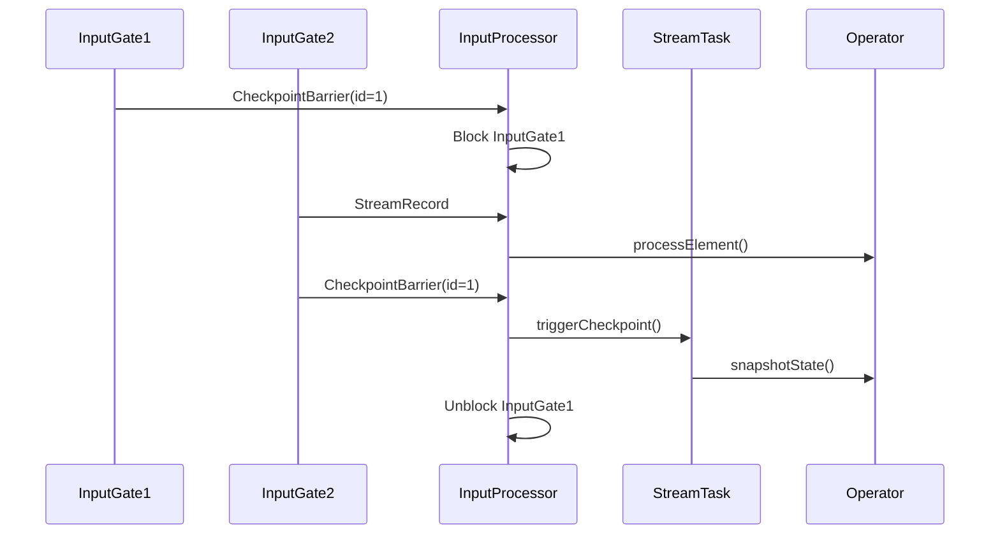
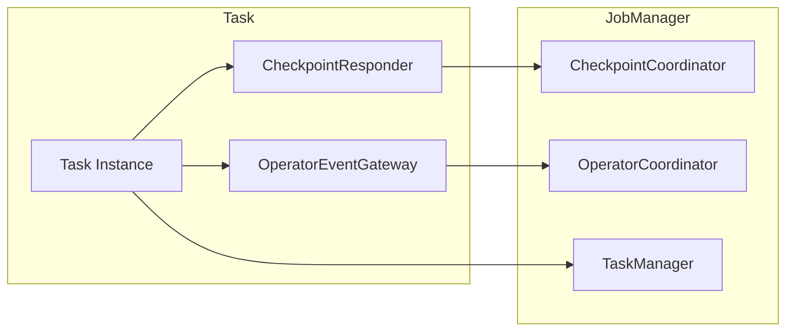

# Task Execution Engine

Relevant source files

The following files were used as context for generating this wiki page:

- [docs/layouts/shortcodes/generated/execution_configuration.html](docs/layouts/shortcodes/generated/execution_configuration.html)
- [flink-connectors/flink-connector-base/src/test/java/org/apache/flink/connector/base/sink/writer/AsyncSinkWriterThrottlingTest.java](flink-connectors/flink-connector-base/src/test/java/org/apache/flink/connector/base/sink/writer/AsyncSinkWriterThrottlingTest.java)
- [flink-core/src/main/java/org/apache/flink/api/common/BatchShuffleMode.java](flink-core/src/main/java/org/apache/flink/api/common/BatchShuffleMode.java)
- [flink-core/src/main/java/org/apache/flink/api/dag/Transformation.java](flink-core/src/main/java/org/apache/flink/api/dag/Transformation.java)
- [flink-core/src/main/java/org/apache/flink/configuration/ExecutionOptions.java](flink-core/src/main/java/org/apache/flink/configuration/ExecutionOptions.java)
- [flink-core/src/test/java/org/apache/flink/api/dag/TransformationTest.java](flink-core/src/test/java/org/apache/flink/api/dag/TransformationTest.java)
- [flink-libraries/flink-state-processing-api/src/main/java/org/apache/flink/state/api/runtime/SavepointEnvironment.java](flink-libraries/flink-state-processing-api/src/main/java/org/apache/flink/state/api/runtime/SavepointEnvironment.java)
- [flink-python/pyflink/datastream/tests/test_stream_execution_environment_completeness.py](flink-python/pyflink/datastream/tests/test_stream_execution_environment_completeness.py)
- [flink-python/src/main/java/org/apache/flink/streaming/api/operators/python/embedded/EmbeddedPythonBatchKeyedCoBroadcastProcessOperator.java](flink-python/src/main/java/org/apache/flink/streaming/api/operators/python/embedded/EmbeddedPythonBatchKeyedCoBroadcastProcessOperator.java)
- [flink-python/src/main/java/org/apache/flink/streaming/api/operators/python/process/ExternalPythonBatchKeyedCoBroadcastProcessOperator.java](flink-python/src/main/java/org/apache/flink/streaming/api/operators/python/process/ExternalPythonBatchKeyedCoBroadcastProcessOperator.java)
- [flink-python/src/main/java/org/apache/flink/streaming/api/transformations/python/DelegateOperatorTransformation.java](flink-python/src/main/java/org/apache/flink/streaming/api/transformations/python/DelegateOperatorTransformation.java)
- [flink-python/src/main/java/org/apache/flink/streaming/api/transformations/python/PythonBroadcastStateTransformation.java](flink-python/src/main/java/org/apache/flink/streaming/api/transformations/python/PythonBroadcastStateTransformation.java)
- [flink-python/src/main/java/org/apache/flink/streaming/api/transformations/python/PythonKeyedBroadcastStateTransformation.java](flink-python/src/main/java/org/apache/flink/streaming/api/transformations/python/PythonKeyedBroadcastStateTransformation.java)
- [flink-python/src/main/java/org/apache/flink/streaming/runtime/translators/python/PythonBroadcastStateTransformationTranslator.java](flink-python/src/main/java/org/apache/flink/streaming/runtime/translators/python/PythonBroadcastStateTransformationTranslator.java)
- [flink-python/src/main/java/org/apache/flink/streaming/runtime/translators/python/PythonKeyedBroadcastStateTransformationTranslator.java](flink-python/src/main/java/org/apache/flink/streaming/runtime/translators/python/PythonKeyedBroadcastStateTransformationTranslator.java)
- [flink-runtime/src/main/java/org/apache/flink/runtime/execution/Environment.java](flink-runtime/src/main/java/org/apache/flink/runtime/execution/Environment.java)
- [flink-runtime/src/main/java/org/apache/flink/runtime/io/network/partition/ResultPartitionType.java](flink-runtime/src/main/java/org/apache/flink/runtime/io/network/partition/ResultPartitionType.java)
- [flink-runtime/src/main/java/org/apache/flink/runtime/jobgraph/tasks/AbstractInvokable.java](flink-runtime/src/main/java/org/apache/flink/runtime/jobgraph/tasks/AbstractInvokable.java)
- [flink-runtime/src/main/java/org/apache/flink/runtime/jobgraph/tasks/TaskInvokable.java](flink-runtime/src/main/java/org/apache/flink/runtime/jobgraph/tasks/TaskInvokable.java)
- [flink-runtime/src/main/java/org/apache/flink/runtime/scheduler/ExecutionVertexVersioner.java](flink-runtime/src/main/java/org/apache/flink/runtime/scheduler/ExecutionVertexVersioner.java)
- [flink-runtime/src/main/java/org/apache/flink/runtime/taskmanager/RuntimeEnvironment.java](flink-runtime/src/main/java/org/apache/flink/runtime/taskmanager/RuntimeEnvironment.java)
- [flink-runtime/src/main/java/org/apache/flink/runtime/taskmanager/Task.java](flink-runtime/src/main/java/org/apache/flink/runtime/taskmanager/Task.java)
- [flink-runtime/src/main/java/org/apache/flink/streaming/api/datastream/AllWindowedStream.java](flink-runtime/src/main/java/org/apache/flink/streaming/api/datastream/AllWindowedStream.java)
- [flink-runtime/src/main/java/org/apache/flink/streaming/api/datastream/SingleOutputStreamOperator.java](flink-runtime/src/main/java/org/apache/flink/streaming/api/datastream/SingleOutputStreamOperator.java)
- [flink-runtime/src/main/java/org/apache/flink/streaming/api/datastream/WindowedStream.java](flink-runtime/src/main/java/org/apache/flink/streaming/api/datastream/WindowedStream.java)
- [flink-runtime/src/test/java/org/apache/flink/runtime/operators/coordination/CoordinatorEventsExactlyOnceITCase.java](flink-runtime/src/test/java/org/apache/flink/runtime/operators/coordination/CoordinatorEventsExactlyOnceITCase.java)
- [flink-runtime/src/test/java/org/apache/flink/runtime/operators/testutils/DummyEnvironment.java](flink-runtime/src/test/java/org/apache/flink/runtime/operators/testutils/DummyEnvironment.java)
- [flink-runtime/src/test/java/org/apache/flink/runtime/operators/testutils/MockEnvironment.java](flink-runtime/src/test/java/org/apache/flink/runtime/operators/testutils/MockEnvironment.java)
- [flink-runtime/src/test/java/org/apache/flink/runtime/operators/testutils/MockEnvironmentBuilder.java](flink-runtime/src/test/java/org/apache/flink/runtime/operators/testutils/MockEnvironmentBuilder.java)
- [flink-runtime/src/test/java/org/apache/flink/runtime/taskmanager/TaskTest.java](flink-runtime/src/test/java/org/apache/flink/runtime/taskmanager/TaskTest.java)
- [flink-runtime/src/test/java/org/apache/flink/streaming/runtime/operators/windowing/TimeWindowTranslationTest.java](flink-runtime/src/test/java/org/apache/flink/streaming/runtime/operators/windowing/TimeWindowTranslationTest.java)
- [flink-streaming-java/src/test/java/org/apache/flink/streaming/api/graph/StreamGraphGeneratorBatchExecutionTest.java](flink-streaming-java/src/test/java/org/apache/flink/streaming/api/graph/StreamGraphGeneratorBatchExecutionTest.java)
- [flink-streaming-java/src/test/java/org/apache/flink/streaming/api/graph/StreamGraphGeneratorExecutionModeDetectionTest.java](flink-streaming-java/src/test/java/org/apache/flink/streaming/api/graph/StreamGraphGeneratorExecutionModeDetectionTest.java)
- [flink-streaming-java/src/test/java/org/apache/flink/streaming/api/graph/StreamGraphGeneratorTest.java](flink-streaming-java/src/test/java/org/apache/flink/streaming/api/graph/StreamGraphGeneratorTest.java)
- [flink-streaming-java/src/test/java/org/apache/flink/streaming/api/graph/StreamingJobGraphGeneratorTest.java](flink-streaming-java/src/test/java/org/apache/flink/streaming/api/graph/StreamingJobGraphGeneratorTest.java)
- [flink-streaming-java/src/test/java/org/apache/flink/streaming/runtime/operators/windowing/AllWindowTranslationTest.java](flink-streaming-java/src/test/java/org/apache/flink/streaming/runtime/operators/windowing/AllWindowTranslationTest.java)
- [flink-streaming-java/src/test/java/org/apache/flink/streaming/runtime/operators/windowing/WindowTranslationTest.java](flink-streaming-java/src/test/java/org/apache/flink/streaming/runtime/operators/windowing/WindowTranslationTest.java)
- [flink-streaming-java/src/test/java/org/apache/flink/streaming/runtime/tasks/MultipleInputStreamTaskChainedSourcesCheckpointingTest.java](flink-streaming-java/src/test/java/org/apache/flink/streaming/runtime/tasks/MultipleInputStreamTaskChainedSourcesCheckpointingTest.java)
- [flink-streaming-java/src/test/java/org/apache/flink/streaming/runtime/tasks/MultipleInputStreamTaskTest.java](flink-streaming-java/src/test/java/org/apache/flink/streaming/runtime/tasks/MultipleInputStreamTaskTest.java)
- [flink-streaming-java/src/test/java/org/apache/flink/streaming/runtime/tasks/SourceOperatorStreamTaskTest.java](flink-streaming-java/src/test/java/org/apache/flink/streaming/runtime/tasks/SourceOperatorStreamTaskTest.java)
- [flink-streaming-java/src/test/java/org/apache/flink/streaming/runtime/tasks/SourceStreamTaskTest.java](flink-streaming-java/src/test/java/org/apache/flink/streaming/runtime/tasks/SourceStreamTaskTest.java)
- [flink-streaming-java/src/test/java/org/apache/flink/streaming/runtime/tasks/SourceStreamTaskTestBase.java](flink-streaming-java/src/test/java/org/apache/flink/streaming/runtime/tasks/SourceStreamTaskTestBase.java)
- [flink-streaming-java/src/test/java/org/apache/flink/streaming/runtime/tasks/StreamTaskFinalCheckpointsTest.java](flink-streaming-java/src/test/java/org/apache/flink/streaming/runtime/tasks/StreamTaskFinalCheckpointsTest.java)
- [flink-streaming-java/src/test/java/org/apache/flink/streaming/runtime/tasks/StreamTaskMailboxTestHarnessBuilder.java](flink-streaming-java/src/test/java/org/apache/flink/streaming/runtime/tasks/StreamTaskMailboxTestHarnessBuilder.java)
- [flink-streaming-java/src/test/java/org/apache/flink/streaming/runtime/tasks/StreamTaskTest.java](flink-streaming-java/src/test/java/org/apache/flink/streaming/runtime/tasks/StreamTaskTest.java)
- [flink-streaming-java/src/test/java/org/apache/flink/streaming/runtime/tasks/SynchronousCheckpointTest.java](flink-streaming-java/src/test/java/org/apache/flink/streaming/runtime/tasks/SynchronousCheckpointTest.java)
- [flink-streaming-java/src/test/java/org/apache/flink/streaming/util/TestExpandingSink.java](flink-streaming-java/src/test/java/org/apache/flink/streaming/util/TestExpandingSink.java)
- [flink-tests/src/test/java/org/apache/flink/test/checkpointing/ProcessingTimeWindowCheckpointingITCase.java](flink-tests/src/test/java/org/apache/flink/test/checkpointing/ProcessingTimeWindowCheckpointingITCase.java)
- [flink-tests/src/test/java/org/apache/flink/test/state/ManualWindowSpeedITCase.java](flink-tests/src/test/java/org/apache/flink/test/state/ManualWindowSpeedITCase.java)
- [flink-tests/src/test/java/org/apache/flink/test/streaming/api/datastream/FinishedSourcesWatermarkITCase.java](flink-tests/src/test/java/org/apache/flink/test/streaming/api/datastream/FinishedSourcesWatermarkITCase.java)
- [flink-tests/src/test/java/org/apache/flink/test/streaming/api/datastream/ReinterpretDataStreamAsKeyedStreamITCase.java](flink-tests/src/test/java/org/apache/flink/test/streaming/api/datastream/ReinterpretDataStreamAsKeyedStreamITCase.java)
- [flink-tests/src/test/java/org/apache/flink/test/streaming/runtime/CacheITCase.java](flink-tests/src/test/java/org/apache/flink/test/streaming/runtime/CacheITCase.java)
- [flink-tests/src/test/java/org/apache/flink/test/streaming/runtime/TimestampITCase.java](flink-tests/src/test/java/org/apache/flink/test/streaming/runtime/TimestampITCase.java)
- [flink-tests/src/test/java/org/apache/flink/test/windowing/sessionwindows/SessionWindowITCase.java](flink-tests/src/test/java/org/apache/flink/test/windowing/sessionwindows/SessionWindowITCase.java)

## Purpose and Scope

The Task Execution Engine is responsible for the actual execution of individual tasks within a Flink cluster. This document covers how logical job graphs are transformed into executing tasks, the lifecycle of task execution, and the various types of streaming tasks that handle different operator patterns. 

For information about how tasks are scheduled and resources are allocated, see [Job Scheduling & Resource Management](#2.1). For details on checkpoint coordination and fault tolerance mechanisms, see [Fault Tolerance & Checkpointing](#2.3). For state backend management, see [State Management](#2.4).

## Task Execution Overview

The task execution engine transforms logical `StreamGraph` representations into physical execution through a hierarchy of task implementations. Each task represents one execution of a parallel subtask on a TaskManager and wraps Flink operators to provide necessary runtime services.

**Task Execution Flow Overview**

The execution proceeds through distinct phases: job graph generation, task deployment, task initialization, and the main execution loop with mailbox-based processing.

Sources: [flink-runtime/src/main/java/org/apache/flink/runtime/taskmanager/Task.java:127-142](), [flink-streaming-java/src/test/java/org/apache/flink/streaming/api/graph/StreamingJobGraphGeneratorTest.java:26-33]()

## Core Task Components

### Task Class Hierarchy

The task execution system is built around a two-level hierarchy:

**Task Component Architecture**

The `Task` class provides the runtime container and services, while `StreamTask` implementations handle specific operator execution patterns.

| Component | Responsibility | Key Methods |
|-----------|---------------|-------------|
| `Task` | Runtime container, lifecycle management | `run()`, `cancelExecution()`, `startTaskThread()` |
| `StreamTask` | Operator execution, checkpointing | `invoke()`, `restore()`, `performCheckpoint()` |
| `Environment` | I/O access, metrics, configuration | Network partition access, state managers |

Sources: [flink-runtime/src/main/java/org/apache/flink/runtime/taskmanager/Task.java:144-146](), [flink-streaming-java/src/test/java/org/apache/flink/streaming/runtime/tasks/StreamTaskTest.java:216-217]()

### StreamTask Specializations

Different `StreamTask` implementations handle varying input/output patterns:

**StreamTask Type Specializations**

Each task type is optimized for specific operator input patterns and uses corresponding input processors.

Sources: [flink-streaming-java/src/test/java/org/apache/flink/streaming/runtime/tasks/MultipleInputStreamTaskTest.java:137-142](), [flink-streaming-java/src/test/java/org/apache/flink/streaming/runtime/tasks/SourceStreamTaskTest.java:104]()

## Task Lifecycle

### Execution State Transitions

Tasks progress through well-defined states during their lifecycle:

**Task State Machine**

The task execution follows a strict state machine with specific transition rules and failure handling paths.

### Task Execution Phases

The main execution sequence in the `Task.run()` method:

**Task Execution Sequence**

The execution involves careful coordination between the `Task` container and the `StreamTask` implementation.

Sources: [flink-runtime/src/main/java/org/apache/flink/runtime/taskmanager/Task.java:574-609](), [flink-streaming-java/src/test/java/org/apache/flink/streaming/runtime/tasks/StreamTaskTest.java:194-220]()

## Job Graph to Task Transformation

### StreamGraph Generation

The transformation from user API calls to executing tasks involves multiple stages:

**Graph Transformation Pipeline**

The logical operator graph undergoes multiple transformations before becoming executable tasks.

### Task Configuration Generation

Each task receives a `StreamConfig` containing its execution parameters:

| Configuration Element | Purpose | Source |
|----------------------|---------|---------|
| `OperatorID` | Unique operator identification | `StreamNode` |
| `TypeSerializer` | Data serialization | Type information |
| `StateKeySelector` | State partitioning | Keyed operations |
| `ChainedOperators` | Operator chaining configuration | Chaining optimization |
| `CheckpointConfig` | Checkpoint behavior | Job configuration |

Sources: [flink-streaming-java/src/test/java/org/apache/flink/streaming/api/graph/StreamingJobGraphGeneratorTest.java:28-57](), [flink-streaming-java/src/test/java/org/apache/flink/streaming/runtime/tasks/StreamTaskMailboxTestHarnessBuilder.java:89-93]()

## Mailbox Execution Model

### Mailbox-Based Processing

StreamTasks use a mailbox execution model for coordinated processing:

**Mailbox Execution Architecture**

The mailbox ensures serialized execution of all task operations while maintaining responsiveness to control events.

### Mail Priority and Scheduling

Different types of mail have different priorities:

| Priority Level | Mail Type | Example Operations |
|---------------|-----------|-------------------|
| `MAX_PRIORITY` | Checkpoint barriers | `triggerCheckpointOnBarrier()` |
| High | Timer callbacks | Processing time triggers |
| Medium | Coordination events | Split assignments |
| Low | Default processing | `processInput()` |

Sources: [flink-streaming-java/src/test/java/org/apache/flink/streaming/runtime/tasks/StreamTaskTest.java:198-199](), [flink-streaming-java/src/test/java/org/apache/flink/streaming/runtime/tasks/StreamTaskMailboxTestHarnessBuilder.java:325-327]()

## Task Input Processing

### Input Processing Patterns

Different task types implement distinct input processing strategies:

```mermaid
graph TB
    subgraph "OneInputStreamTask"
        OIP["StreamOneInputProcessor"]
        OIGATE["Single InputGate"]
        OISEL["InputSelection.ALL"]
    end
    
    subgraph "MultipleInputStreamTask"  
        MIP["StreamMultipleInputProcessor"]
        MIGATES["Multiple InputGates"]
        MISEL["InputSelection Logic"]
    end
    
    subgraph "SourceStreamTask"
        SRC["SourceFunction"]
        SRCCTX["SourceContext"]
        SRCLOOP["run() Loop"]
    end
    
    OIGATE --> OIP
    OIP --> OISEL
    
    MIGATES --> MIP
    MIP --> MISEL
    
    SRC --> SRCCTX
    SRCCTX --> SRCLOOP
```

**Input Processing Architectures**

Each task type optimizes input processing for its specific operator pattern and input configuration.

### Network Input Coordination

For tasks with network inputs, coordination ensures proper barrier alignment:

**Checkpoint Barrier Alignment**

Input processors coordinate barrier alignment across multiple input channels to ensure exactly-once semantics.

Sources: [flink-streaming-java/src/test/java/org/apache/flink/streaming/runtime/tasks/MultipleInputStreamTaskTest.java:215-284]()

## Task Coordination and Communication

### Task-JobManager Communication

Tasks communicate with the JobManager for coordination and reporting:

**Task Communication Channels**

Tasks use multiple channels for different types of coordination with the JobManager.

### Exception Handling and Failure Reporting

Task failures are propagated through structured exception handling:

| Exception Type | Handling Strategy | Recovery Action |
|---------------|------------------|-----------------|
| `CancelTaskException` | Clean shutdown | Task marked CANCELED |
| `ExpectedTestException` | Test scenarios | Controlled failure |
| `AsynchronousException` | Async operation failures | Task marked FAILED |
| User exceptions | Wrapped and reported | JobManager notified |

Sources: [flink-streaming-java/src/test/java/org/apache/flink/streaming/runtime/tasks/StreamTaskTest.java:404-439](), [flink-runtime/src/main/java/org/apache/flink/runtime/taskmanager/Task.java:286-300]()
