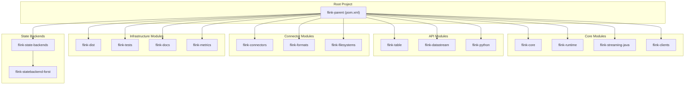
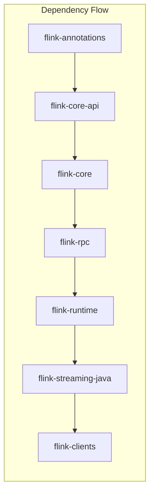
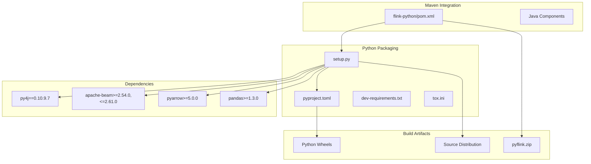
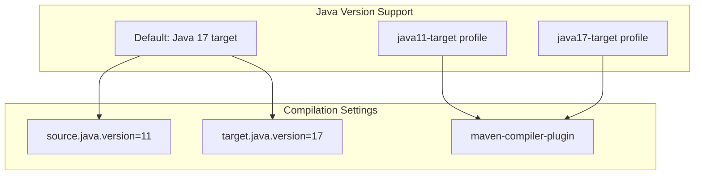
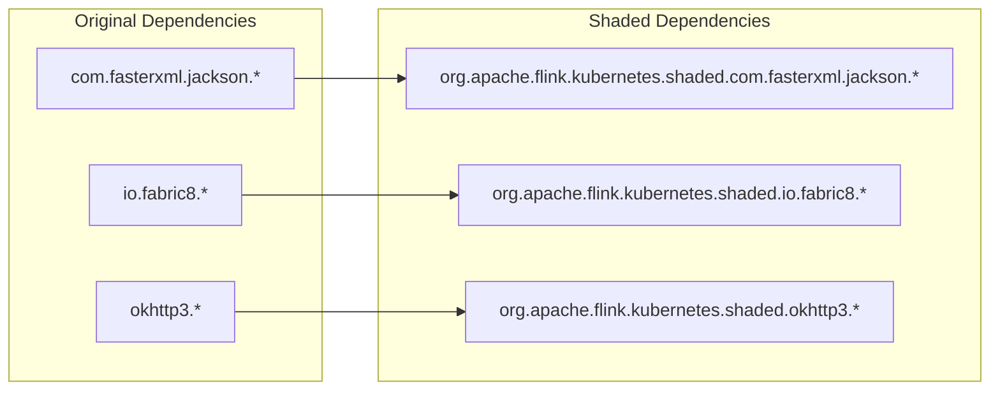
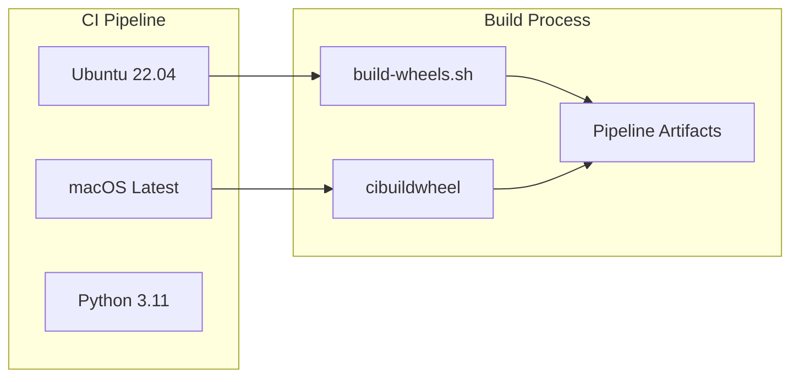

# Build System & Dependencies

<details>
<summary>Relevant source files</summary>

The following files were used as context for generating this wiki page:

- [docs/content.zh/docs/dev/python/datastream_tutorial.md](docs/content.zh/docs/dev/python/datastream_tutorial.md)
- [docs/content.zh/docs/dev/python/installation.md](docs/content.zh/docs/dev/python/installation.md)
- [docs/content.zh/docs/dev/python/table_api_tutorial.md](docs/content.zh/docs/dev/python/table_api_tutorial.md)
- [docs/content.zh/docs/flinkDev/building.md](docs/content.zh/docs/flinkDev/building.md)
- [docs/content.zh/docs/try-flink/local_installation.md](docs/content.zh/docs/try-flink/local_installation.md)
- [docs/content/docs/dev/python/datastream_tutorial.md](docs/content/docs/dev/python/datastream_tutorial.md)
- [docs/content/docs/dev/python/installation.md](docs/content/docs/dev/python/installation.md)
- [docs/content/docs/dev/python/table_api_tutorial.md](docs/content/docs/dev/python/table_api_tutorial.md)
- [docs/content/docs/flinkDev/building.md](docs/content/docs/flinkDev/building.md)
- [docs/content/docs/try-flink/local_installation.md](docs/content/docs/try-flink/local_installation.md)
- [flink-dist/src/main/resources/META-INF/NOTICE](flink-dist/src/main/resources/META-INF/NOTICE)
- [flink-filesystems/flink-azure-fs-hadoop/src/main/resources/META-INF/NOTICE](flink-filesystems/flink-azure-fs-hadoop/src/main/resources/META-INF/NOTICE)
- [flink-filesystems/flink-fs-hadoop-shaded/src/main/resources/META-INF/NOTICE](flink-filesystems/flink-fs-hadoop-shaded/src/main/resources/META-INF/NOTICE)
- [flink-filesystems/flink-gs-fs-hadoop/src/main/resources/META-INF/NOTICE](flink-filesystems/flink-gs-fs-hadoop/src/main/resources/META-INF/NOTICE)
- [flink-filesystems/flink-s3-fs-hadoop/src/main/resources/META-INF/NOTICE](flink-filesystems/flink-s3-fs-hadoop/src/main/resources/META-INF/NOTICE)
- [flink-filesystems/flink-s3-fs-presto/src/main/resources/META-INF/NOTICE](flink-filesystems/flink-s3-fs-presto/src/main/resources/META-INF/NOTICE)
- [flink-formats/flink-sql-avro-confluent-registry/src/main/resources/META-INF/NOTICE](flink-formats/flink-sql-avro-confluent-registry/src/main/resources/META-INF/NOTICE)
- [flink-formats/flink-sql-avro/src/main/resources/META-INF/NOTICE](flink-formats/flink-sql-avro/src/main/resources/META-INF/NOTICE)
- [flink-kubernetes/pom.xml](flink-kubernetes/pom.xml)
- [flink-kubernetes/src/main/resources/META-INF/NOTICE](flink-kubernetes/src/main/resources/META-INF/NOTICE)
- [flink-python/README.md](flink-python/README.md)
- [flink-python/apache-flink-libraries/setup.py](flink-python/apache-flink-libraries/setup.py)
- [flink-python/dev/build-wheels.sh](flink-python/dev/build-wheels.sh)
- [flink-python/dev/dev-requirements.txt](flink-python/dev/dev-requirements.txt)
- [flink-python/dev/lint-python.sh](flink-python/dev/lint-python.sh)
- [flink-python/pom.xml](flink-python/pom.xml)
- [flink-python/pyflink/fn_execution/formats/avro.py](flink-python/pyflink/fn_execution/formats/avro.py)
- [flink-python/pyflink/gen_protos.py](flink-python/pyflink/gen_protos.py)
- [flink-python/pyproject.toml](flink-python/pyproject.toml)
- [flink-python/setup.py](flink-python/setup.py)
- [flink-python/src/main/resources/META-INF/NOTICE](flink-python/src/main/resources/META-INF/NOTICE)
- [flink-python/tox.ini](flink-python/tox.ini)
- [flink-state-backends/flink-statebackend-forst/pom.xml](flink-state-backends/flink-statebackend-forst/pom.xml)
- [flink-state-backends/flink-statebackend-forst/src/test/resources/log4j2-test.properties](flink-state-backends/flink-statebackend-forst/src/test/resources/log4j2-test.properties)
- [flink-state-backends/pom.xml](flink-state-backends/pom.xml)
- [pom.xml](pom.xml)
- [tools/azure-pipelines/build-python-wheels.yml](tools/azure-pipelines/build-python-wheels.yml)
- [tools/releasing/create_binary_release.sh](tools/releasing/create_binary_release.sh)

</details>


This document covers the build system architecture, dependency management, and packaging infrastructure for Apache Flink. It focuses on the Maven-based build system for Java/Scala components and the specialized Python packaging for PyFlink.

For information about testing infrastructure, see [Testing Infrastructure](#6.2). For CI/CD pipeline details, see [CI/CD & Documentation Pipeline](#6.3).

## Maven Build System Overview

Apache Flink uses Apache Maven as its primary build system, organized as a multi-module project with a hierarchical parent-child POM structure. The root [pom.xml:18-109]() defines the parent project and lists all modules.

### Build System Architecture



Sources: [pom.xml:71-109]()

### Maven Coordinates and Properties

The project uses consistent Maven coordinates with version management centralized in the parent POM:

| Property | Value | Purpose |
|----------|-------|---------|
| `groupId` | `org.apache.flink` | Maven group identifier |
| `artifactId` | `flink-parent` | Root artifact name |
| `version` | `2.1-SNAPSHOT` | Current development version |
| `target.java.version` | `17` | Target Java compilation version |
| `source.java.version` | `11` | Minimum Java source version |

Sources: [pom.xml:29-31](), [pom.xml:133-141]()

## Module Structure and Dependencies

### Core Module Dependencies



Sources: [pom.xml:71-84]()

### Dependency Management Strategy

Flink uses centralized dependency management through [pom.xml:325-944]() with version properties defined in [pom.xml:111-221](). Key dependency categories include:

- **Shaded Dependencies**: Managed through `flink.shaded.version` property
- **Logging**: SLF4J API with Log4j2 implementation
- **Testing**: JUnit 5, Mockito, AssertJ, TestContainers
- **Serialization**: Kryo, Avro, Jackson
- **Hadoop Integration**: Hadoop common, HDFS, YARN components

Sources: [pom.xml:325-944](), [pom.xml:129-131](), [pom.xml:135-136]()

## Python Packaging (PyFlink)

PyFlink has a specialized build system that integrates with the Maven build while maintaining Python packaging standards.

### Python Build Architecture



Sources: [flink-python/pom.xml](), [flink-python/setup.py](), [flink-python/pyproject.toml](), [flink-python/dev/dev-requirements.txt]()

### Python Build Process

The PyFlink build process involves several stages coordinated between Maven and Python tooling:

1. **Maven Phase**: [flink-python/pom.xml:434-488]() generates `pyflink.zip` containing Python source code
2. **Dependency Management**: [flink-python/pom.xml:529-632]() copies required JAR dependencies
3. **Wheel Building**: [flink-python/setup.py:105-171]() handles Cython extension compilation
4. **Testing Integration**: [flink-python/tox.ini:24-40]() provides multi-Python version testing

The build supports optional Cython extensions for performance optimization, with fallback to pure Python implementation:

```python
# Cython extension handling in setup.py
try:
    from Cython.Build import cythonize
    extensions = cythonize([...])
except ImportError:
    if os.path.exists("pyflink/fn_execution/coder_impl_fast.c"):
        extensions = ([...])  # Use pre-compiled C files
    else:
        extensions = ([])     # Pure Python fallback
```

Sources: [flink-python/setup.py:105-171]()

### Python Dependencies

PyFlink maintains strict dependency versioning for compatibility:

| Package | Version Constraint | Purpose |
|---------|-------------------|---------|
| `py4j` | `==0.10.9.7` | Java-Python bridge |
| `apache-beam` | `>=2.54.0,<=2.61.0` | Beam compatibility |
| `pandas` | `>=1.3.0` | DataFrame operations |
| `pyarrow` | `>=5.0.0` | Arrow format support |
| `numpy` | `>=1.22.4` | Numerical operations |

Sources: [flink-python/setup.py:319-330](), [flink-python/dev/dev-requirements.txt:15-36]()

## Build Profiles and Configuration

### Java Version Profiles

Flink supports multiple Java versions through Maven profiles:



Sources: [pom.xml:1084-1103](), [pom.xml:1134-1159]()

### Scala Version Management

The project defaults to Scala 2.12 with profile-based version switching:

- **Default Profile**: `scala-2.12` [pom.xml:962-999]()
- **Version Properties**: `scala.version=2.12.20`, `scala.binary.version=2.12` [pom.xml:143-144]()
- **Dependency Enforcement**: Prevents mixing Scala versions [pom.xml:974-996]()

Sources: [pom.xml:962-999](), [pom.xml:143-144]()

### Build Optimization Profiles

| Profile | Purpose | Key Features |
|---------|---------|--------------|
| `fast` | Quick builds | Skips QA plugins and JavaDoc |
| `skip-webui-build` | Faster iteration | Skips WebUI compilation |
| `intellij` | IDE support | Sets `flink.markBundledAsOptional=false` |

Sources: [pom.xml:947-960](), documentation references

## Dependency Shading and Relocation

Flink uses extensive dependency shading to avoid classpath conflicts, particularly in the `flink-kubernetes` and `flink-python` modules.

### Kubernetes Module Shading Example



The shading configuration in [flink-kubernetes/pom.xml:153-199]() relocates dependencies to prevent conflicts with user code.

Sources: [flink-kubernetes/pom.xml:100-204]()

## Build Tools and Scripts

### Python Development Tools

PyFlink includes comprehensive development tooling:

- **Linting Script**: [flink-python/dev/lint-python.sh]() provides unified Python development environment setup
- **UV Package Manager**: Used for fast Python environment management [flink-python/dev/lint-python.sh:182-216]()
- **Wheel Building**: [flink-python/dev/build-wheels.sh]() automates multi-Python version wheel creation
- **Testing Integration**: [flink-python/tox.ini]() coordinates testing across Python versions

### CI/CD Integration

The build system integrates with Azure Pipelines for automated wheel building:



Sources: [tools/azure-pipelines/build-python-wheels.yml](), [flink-python/dev/build-wheels.sh]()

## Packaging and Distribution

### Binary Distribution Creation

The `flink-dist` module creates the final binary distribution, coordinated through [tools/releasing/create_binary_release.sh](). The distribution includes:

- All compiled JAR files
- Configuration templates from [flink-dist/src/main/flink-bin]()
- License and notice files
- Startup scripts and utilities

### Maven Artifact Publishing

Flink publishes artifacts to Maven Central with consistent versioning:
- **Group ID**: `org.apache.flink`
- **Version Scheme**: `${project.version}` managed centrally
- **Artifact Types**: JAR, POM, source, test-jar

Sources: [pom.xml:29-31](), [tools/releasing/create_binary_release.sh]()
