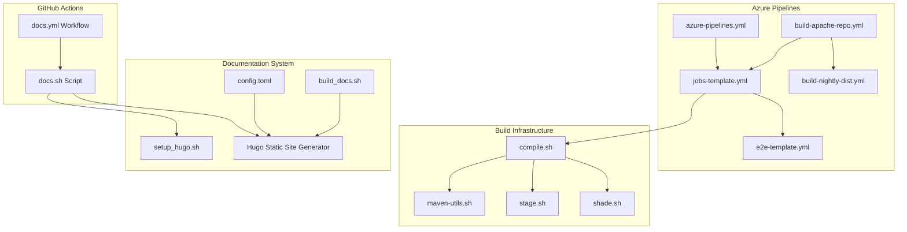
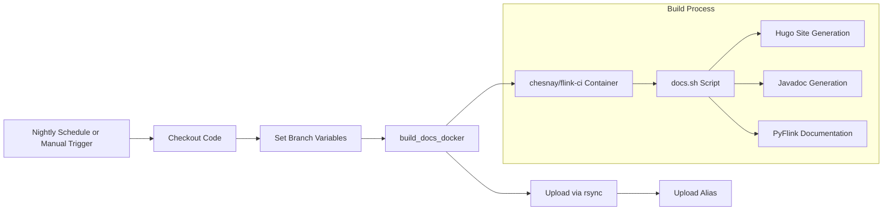
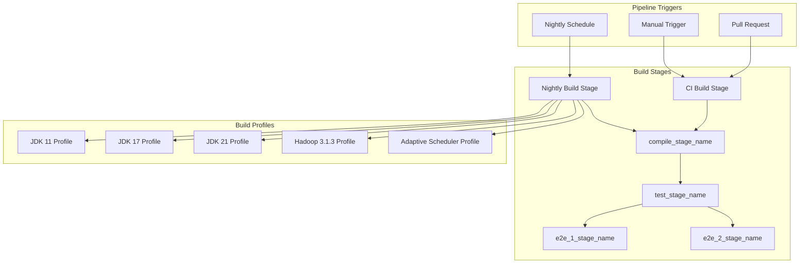
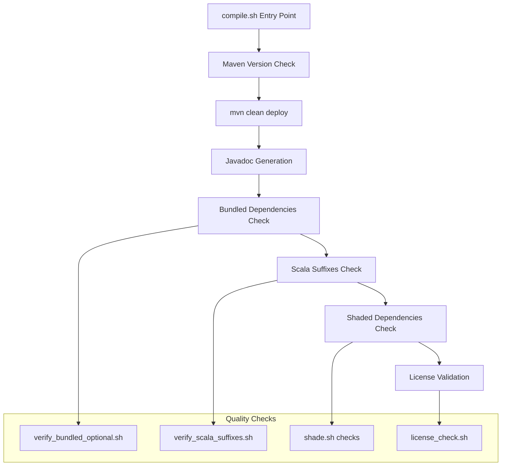
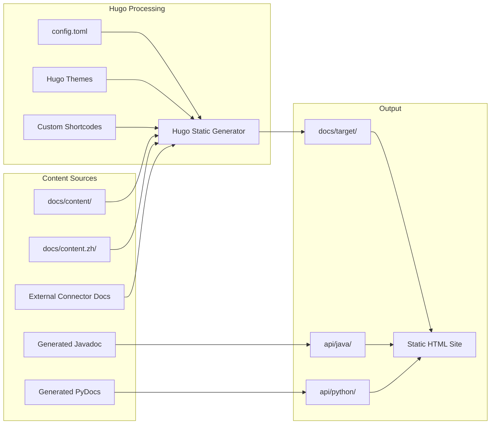
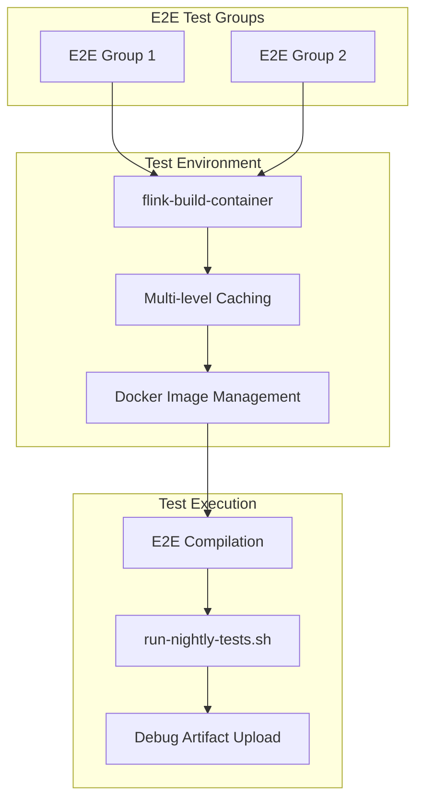
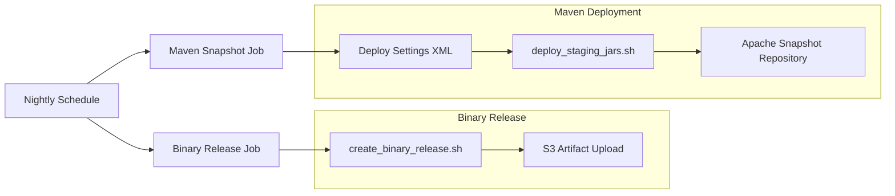

# CI/CD & Documentation Pipeline

Relevant source files

The following files were used as context for generating this wiki page:

- [.github/workflows/docs.sh](.github/workflows/docs.sh)
- [.github/workflows/docs.yml](.github/workflows/docs.yml)
- [.gitignore](.gitignore)
- [.idea/icon.png](.idea/icon.png)
- [.mvn/wrapper/maven-wrapper.properties](.mvn/wrapper/maven-wrapper.properties)
- [azure-pipelines.yml](azure-pipelines.yml)
- [docs/README.md](docs/README.md)
- [docs/build_docs.sh](docs/build_docs.sh)
- [docs/config.toml](docs/config.toml)
- [docs/content.zh/release-notes/flink-1.8.md](docs/content.zh/release-notes/flink-1.8.md)
- [docs/content.zh/release-notes/flink-1.9.md](docs/content.zh/release-notes/flink-1.9.md)
- [docs/content/release-notes/flink-1.8.md](docs/content/release-notes/flink-1.8.md)
- [docs/content/release-notes/flink-1.9.md](docs/content/release-notes/flink-1.9.md)
- [docs/setup_hugo.sh](docs/setup_hugo.sh)
- [docs/themes/.gitignore](docs/themes/.gitignore)
- [flink-architecture-tests/flink-architecture-tests-production/pom.xml](flink-architecture-tests/flink-architecture-tests-production/pom.xml)
- [flink-architecture-tests/pom.xml](flink-architecture-tests/pom.xml)
- [flink-end-to-end-tests/test-scripts/common_kubernetes.sh](flink-end-to-end-tests/test-scripts/common_kubernetes.sh)
- [flink-end-to-end-tests/test-scripts/container-scripts/kubernetes-pod-template.yaml](flink-end-to-end-tests/test-scripts/container-scripts/kubernetes-pod-template.yaml)
- [flink-end-to-end-tests/test-scripts/test_kubernetes_application_ha.sh](flink-end-to-end-tests/test-scripts/test_kubernetes_application_ha.sh)
- [flink-yarn/pom.xml](flink-yarn/pom.xml)
- [mvnw](mvnw)
- [mvnw.cmd](mvnw.cmd)
- [tools/azure-pipelines/build-apache-repo.yml](tools/azure-pipelines/build-apache-repo.yml)
- [tools/azure-pipelines/build-nightly-dist.yml](tools/azure-pipelines/build-nightly-dist.yml)
- [tools/azure-pipelines/e2e-template.yml](tools/azure-pipelines/e2e-template.yml)
- [tools/azure-pipelines/jobs-template.yml](tools/azure-pipelines/jobs-template.yml)
- [tools/ci/alibaba-mirror-settings.xml](tools/ci/alibaba-mirror-settings.xml)
- [tools/ci/compile.sh](tools/ci/compile.sh)
- [tools/ci/compile_ci.sh](tools/ci/compile_ci.sh)
- [tools/ci/docs.sh](tools/ci/docs.sh)
- [tools/ci/google-mirror-settings.xml](tools/ci/google-mirror-settings.xml)
- [tools/ci/license_check.sh](tools/ci/license_check.sh)
- [tools/ci/maven-utils.sh](tools/ci/maven-utils.sh)
- [tools/ci/shade.sh](tools/ci/shade.sh)
- [tools/ci/stage.sh](tools/ci/stage.sh)
- [tools/ci/ubuntu-mirror-list.txt](tools/ci/ubuntu-mirror-list.txt)
- [tools/ci/verify_bundled_optional.sh](tools/ci/verify_bundled_optional.sh)
- [tools/ci/verify_scala_suffixes.sh](tools/ci/verify_scala_suffixes.sh)

This document describes the continuous integration, continuous deployment, and documentation generation infrastructure for Apache Flink. It covers the automated build, test, and deployment processes that ensure code quality and maintain up-to-date documentation.

For information about the build system and dependency management, see [Build System & Dependencies](#6.1). For details about testing infrastructure, see [Testing Infrastructure](#6.2).

## Pipeline Architecture Overview

Flink's CI/CD infrastructure consists of multiple interconnected systems that handle different aspects of the development lifecycle. The primary components include GitHub Actions for documentation builds, Azure Pipelines for comprehensive testing and releases, and a Maven-based build system with extensive quality checks.

Sources: [.github/workflows/docs.yml:1-75](), [azure-pipelines.yml:1-101](), [tools/azure-pipelines/build-apache-repo.yml:1-179](), [tools/ci/compile.sh:1-121](), [docs/config.toml:1-134]()

## GitHub Actions Workflows

### Documentation Pipeline

The documentation pipeline automatically builds and deploys Flink's documentation using GitHub Actions. The primary workflow is defined in `docs.yml` and runs on a nightly schedule.

The workflow supports multiple branches and creates aliases for different release versions:
- `master` branch → `release-2.1` alias
- `release-2.0` branch → `stable` alias  
- `release-1.20` branch → `lts` alias

Sources: [.github/workflows/docs.yml:16-74](), [.github/workflows/docs.sh:1-80]()

### Documentation Build Script

The `docs.sh` script orchestrates the complete documentation build process, including Hugo setup, external connector documentation integration, and API documentation generation.

Key operations performed by [.github/workflows/docs.sh:1-80]():
- Sets up Java 17 environment for builds
- Initializes Git submodules for external documentation
- Configures Hugo static site generator
- Builds Flink codebase for Javadoc generation
- Generates Java/Scala API documentation
- Builds PyFlink Python documentation when available

Sources: [.github/workflows/docs.sh:21-79](), [docs/setup_hugo.sh:20-43]()

## Azure Pipelines

### Main Pipeline Configuration

Azure Pipelines serves as the primary CI/CD system for comprehensive testing, nightly builds, and release processes. The pipeline system uses a templated approach to support multiple build configurations and testing scenarios.

Sources: [azure-pipelines.yml:32-101](), [tools/azure-pipelines/build-apache-repo.yml:24-179]()

### Job Template System

The `jobs-template.yml` defines reusable job configurations that support different hardware pools, environments, and test execution strategies.

Key template parameters include:
- `test_pool_definition`: Hardware configuration for compilation and unit tests
- `e2e_pool_definition`: Hardware configuration for end-to-end tests  
- `environment`: Environment variables and build profiles
- `jdk`: Java version specification
- `container`: Docker container for build environment

The template creates three main job types:
1. `compile_${stage_name}`: Compilation and build artifact creation
2. `test_${stage_name}`: Unit test execution across multiple modules
3. `e2e_${group}_${stage_name}`: End-to-end test execution

Sources: [tools/azure-pipelines/jobs-template.yml:16-198]()

### Test Module Organization

The pipeline organizes tests into logical modules to enable parallel execution and efficient resource utilization:

| Module | Components |
|--------|------------|
| `core` | Core runtime, streaming, state backends, RPC |
| `python` | PyFlink, Python API bridge |
| `table` | Table API, SQL planner, SQL client |
| `connect` | Connectors, file systems, formats |
| `tests` | Integration tests |
| `misc` | All remaining modules |

Sources: [tools/azure-pipelines/jobs-template.yml:90-103]()

## Build Infrastructure

### Compilation Process

The build infrastructure centers around the `compile.sh` script, which performs comprehensive quality assurance checks beyond basic compilation.

Sources: [tools/ci/compile.sh:55-120](), [tools/ci/compile_ci.sh:24-29]()

### Maven Utilities and Configuration

The `maven-utils.sh` script provides centralized Maven configuration and utility functions used throughout the build process.

Key functions include:
- `run_mvn`: Standardized Maven execution with logging
- `set_mirror_config`: Automatic mirror selection for faster builds
- `collect_coredumps`: Debug artifact collection for failed builds

The script automatically selects appropriate Maven mirrors based on availability:
- Alibaba mirror for faster builds in some regions
- Google mirror as fallback
- Configurable proxy settings for NPM dependencies

Sources: [tools/ci/maven-utils.sh:17-87]()

### Build Stage Organization

The `stage.sh` script defines module groupings for staged compilation and testing, enabling parallel builds and logical separation of concerns.

Module categories defined in [tools/ci/stage.sh:29-187]():
- `MODULES_CORE`: Core runtime components, state backends, RPC systems
- `MODULES_TABLE`: Table API, SQL processing, code generation
- `MODULES_CONNECTORS`: File systems, formats, connector implementations
- `MODULES_TESTS`: Integration and system tests

Functions `get_compile_modules_for_stage()` and `get_test_modules_for_stage()` provide Maven module selection logic for different build stages.

Sources: [tools/ci/stage.sh:20-187]()

## Documentation Generation Pipeline

### Hugo-Based Documentation System

Flink's documentation uses Hugo, a static site generator, configured through `config.toml` to support multiple languages and versioned documentation.

Key configuration elements in [docs/config.toml:17-134]():
- Base URL configuration for different release branches
- Version parameters for documentation referencing
- Multi-language support (English and Chinese)
- External module integration for connector documentation

Sources: [docs/config.toml:17-134](), [docs/build_docs.sh:20-43]()

### External Documentation Integration

The documentation system supports integration of external connector documentation through the `setup_docs.sh` script. This allows connector repositories to maintain their own documentation while appearing seamlessly integrated in the main Flink documentation site.

Integration process includes:
1. Cloning external connector repositories
2. Processing connector-specific documentation
3. Mounting documentation content into Hugo themes
4. Generating unified navigation and cross-references

Sources: [docs/README.md:50-64](), [docs/build_docs.sh:28-46]()

### API Documentation Generation

API documentation generation involves multiple tools and processes:

**Java/Scala Documentation:**
- Maven `javadoc:aggregate` goal with custom configuration
- Custom header injection for site navigation
- Integration with main documentation site structure

**Python Documentation:**
- Sphinx-based documentation generation for PyFlink
- Conditional generation based on PyFlink availability
- Gateway-disabled mode for isolated documentation builds

Sources: [.github/workflows/docs.sh:54-79](), [tools/ci/compile.sh:82-95]()

## Testing and Quality Assurance

### End-to-End Test Orchestration

The E2E testing system uses containerized environments and supports multiple test groups for parallel execution.

Key features of the E2E system include:
- Documentation-only change detection to skip unnecessary test runs
- Multi-level caching for Maven dependencies, E2E artifacts, and Docker images
- Kubernetes-based testing for cloud-native scenarios
- Automatic artifact upload for debugging failed tests

Sources: [tools/azure-pipelines/e2e-template.yml:24-141]()

### Quality Verification Scripts

Several specialized scripts ensure code quality and dependency management:

**Dependency Verification (`shade.sh`):**
- Validates shaded dependencies in distribution JAR
- Checks for prohibited unshaded libraries (ASM, Guava, Jackson)
- Verifies presence of required dependencies (Snappy)
- Validates S3 filesystem implementations

**License Compliance (`license_check.sh`):**
- Scans all deployed artifacts for license compliance
- Integrates with Maven build output parsing
- Ensures all distributed JARs meet Apache license requirements

**Scala Compatibility (`verify_scala_suffixes.sh`):**
- Analyzes Maven dependency trees for Scala dependencies
- Validates proper Scala version suffixes on artifacts
- Prevents Scala version conflicts in distribution

Sources: [tools/ci/shade.sh:23-151](), [tools/ci/license_check.sh:20-61](), [tools/ci/verify_scala_suffixes.sh:42-89]()

## Deployment and Release Processes

### Nightly Build System

The nightly build system creates snapshot releases and deploys them to distribution channels.

The nightly system performs two parallel operations:
1. **Binary Release Generation**: Creates distribution packages and uploads to S3
2. **Maven Snapshot Deployment**: Deploys SNAPSHOT artifacts to Apache Maven repository

Sources: [tools/azure-pipelines/build-nightly-dist.yml:19-127]()

### Container and Environment Management

The CI/CD system relies on standardized container environments to ensure reproducible builds:

**Primary Build Container:**
- `chesnay/flink-ci:java_8_11_17_21_maven_386_jammy`
- Pre-configured with multiple JDK versions (8, 11, 17, 21)
- Maven 3.8.6 installation
- Ubuntu Jammy base with necessary build tools

**Environment Configuration:**
- Automatic JDK selection based on build profile
- Maven cache management with yearly cache invalidation
- Docker image caching for E2E tests
- APT mirror configuration for faster package installation

Sources: [tools/azure-pipelines/build-apache-repo.yml:38-43](), [tools/azure-pipelines/jobs-template.yml:56-64]()
