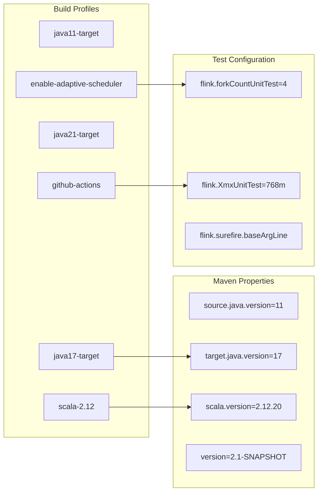
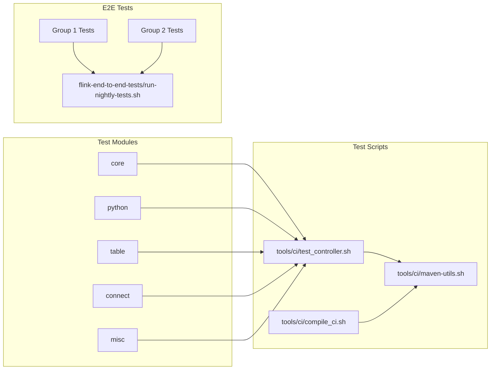
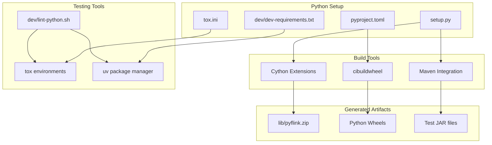
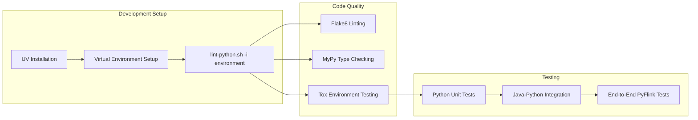
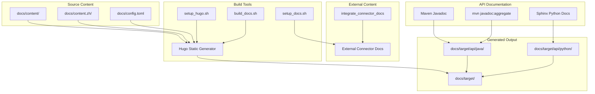
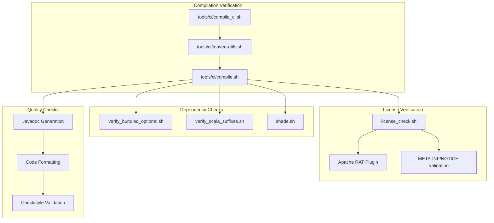
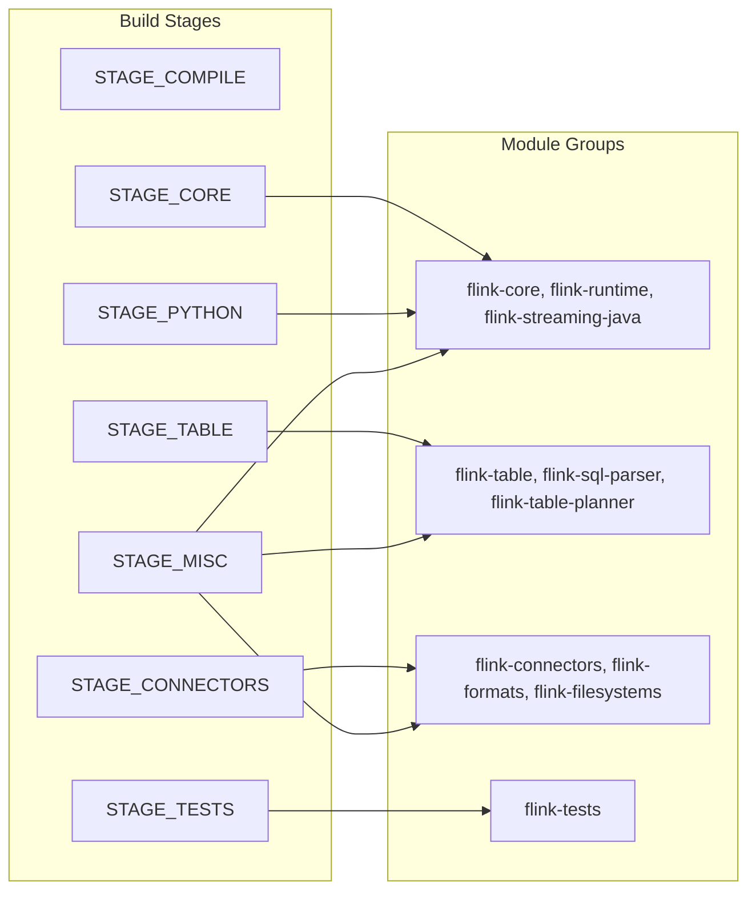

# Development & Build Infrastructure

Relevant source files

The following files were used as context for generating this wiki page:

- [.github/workflows/docs.sh](.github/workflows/docs.sh)
- [.github/workflows/docs.yml](.github/workflows/docs.yml)
- [.gitignore](.gitignore)
- [.idea/icon.png](.idea/icon.png)
- [.mvn/wrapper/maven-wrapper.properties](.mvn/wrapper/maven-wrapper.properties)
- [azure-pipelines.yml](azure-pipelines.yml)
- [docs/README.md](docs/README.md)
- [docs/build_docs.sh](docs/build_docs.sh)
- [docs/config.toml](docs/config.toml)
- [docs/content.zh/docs/dev/python/datastream_tutorial.md](docs/content.zh/docs/dev/python/datastream_tutorial.md)
- [docs/content.zh/docs/dev/python/installation.md](docs/content.zh/docs/dev/python/installation.md)
- [docs/content.zh/docs/dev/python/table_api_tutorial.md](docs/content.zh/docs/dev/python/table_api_tutorial.md)
- [docs/content.zh/docs/flinkDev/building.md](docs/content.zh/docs/flinkDev/building.md)
- [docs/content.zh/docs/try-flink/local_installation.md](docs/content.zh/docs/try-flink/local_installation.md)
- [docs/content.zh/release-notes/flink-1.8.md](docs/content.zh/release-notes/flink-1.8.md)
- [docs/content.zh/release-notes/flink-1.9.md](docs/content.zh/release-notes/flink-1.9.md)
- [docs/content/docs/dev/python/datastream_tutorial.md](docs/content/docs/dev/python/datastream_tutorial.md)
- [docs/content/docs/dev/python/installation.md](docs/content/docs/dev/python/installation.md)
- [docs/content/docs/dev/python/table_api_tutorial.md](docs/content/docs/dev/python/table_api_tutorial.md)
- [docs/content/docs/flinkDev/building.md](docs/content/docs/flinkDev/building.md)
- [docs/content/docs/try-flink/local_installation.md](docs/content/docs/try-flink/local_installation.md)
- [docs/content/release-notes/flink-1.8.md](docs/content/release-notes/flink-1.8.md)
- [docs/content/release-notes/flink-1.9.md](docs/content/release-notes/flink-1.9.md)
- [docs/setup_hugo.sh](docs/setup_hugo.sh)
- [docs/themes/.gitignore](docs/themes/.gitignore)
- [flink-architecture-tests/flink-architecture-tests-production/pom.xml](flink-architecture-tests/flink-architecture-tests-production/pom.xml)
- [flink-architecture-tests/pom.xml](flink-architecture-tests/pom.xml)
- [flink-dist/src/main/resources/META-INF/NOTICE](flink-dist/src/main/resources/META-INF/NOTICE)
- [flink-end-to-end-tests/test-scripts/common_kubernetes.sh](flink-end-to-end-tests/test-scripts/common_kubernetes.sh)
- [flink-end-to-end-tests/test-scripts/container-scripts/kubernetes-pod-template.yaml](flink-end-to-end-tests/test-scripts/container-scripts/kubernetes-pod-template.yaml)
- [flink-end-to-end-tests/test-scripts/test_kubernetes_application_ha.sh](flink-end-to-end-tests/test-scripts/test_kubernetes_application_ha.sh)
- [flink-filesystems/flink-azure-fs-hadoop/src/main/resources/META-INF/NOTICE](flink-filesystems/flink-azure-fs-hadoop/src/main/resources/META-INF/NOTICE)
- [flink-filesystems/flink-fs-hadoop-shaded/src/main/resources/META-INF/NOTICE](flink-filesystems/flink-fs-hadoop-shaded/src/main/resources/META-INF/NOTICE)
- [flink-filesystems/flink-gs-fs-hadoop/src/main/resources/META-INF/NOTICE](flink-filesystems/flink-gs-fs-hadoop/src/main/resources/META-INF/NOTICE)
- [flink-filesystems/flink-s3-fs-hadoop/src/main/resources/META-INF/NOTICE](flink-filesystems/flink-s3-fs-hadoop/src/main/resources/META-INF/NOTICE)
- [flink-filesystems/flink-s3-fs-presto/src/main/resources/META-INF/NOTICE](flink-filesystems/flink-s3-fs-presto/src/main/resources/META-INF/NOTICE)
- [flink-formats/flink-sql-avro-confluent-registry/src/main/resources/META-INF/NOTICE](flink-formats/flink-sql-avro-confluent-registry/src/main/resources/META-INF/NOTICE)
- [flink-formats/flink-sql-avro/src/main/resources/META-INF/NOTICE](flink-formats/flink-sql-avro/src/main/resources/META-INF/NOTICE)
- [flink-kubernetes/pom.xml](flink-kubernetes/pom.xml)
- [flink-kubernetes/src/main/resources/META-INF/NOTICE](flink-kubernetes/src/main/resources/META-INF/NOTICE)
- [flink-python/README.md](flink-python/README.md)
- [flink-python/apache-flink-libraries/setup.py](flink-python/apache-flink-libraries/setup.py)
- [flink-python/dev/build-wheels.sh](flink-python/dev/build-wheels.sh)
- [flink-python/dev/dev-requirements.txt](flink-python/dev/dev-requirements.txt)
- [flink-python/dev/lint-python.sh](flink-python/dev/lint-python.sh)
- [flink-python/pom.xml](flink-python/pom.xml)
- [flink-python/pyflink/fn_execution/formats/avro.py](flink-python/pyflink/fn_execution/formats/avro.py)
- [flink-python/pyflink/gen_protos.py](flink-python/pyflink/gen_protos.py)
- [flink-python/pyproject.toml](flink-python/pyproject.toml)
- [flink-python/setup.py](flink-python/setup.py)
- [flink-python/src/main/resources/META-INF/NOTICE](flink-python/src/main/resources/META-INF/NOTICE)
- [flink-python/tox.ini](flink-python/tox.ini)
- [flink-state-backends/flink-statebackend-forst/pom.xml](flink-state-backends/flink-statebackend-forst/pom.xml)
- [flink-state-backends/flink-statebackend-forst/src/test/resources/log4j2-test.properties](flink-state-backends/flink-statebackend-forst/src/test/resources/log4j2-test.properties)
- [flink-state-backends/pom.xml](flink-state-backends/pom.xml)
- [flink-yarn/pom.xml](flink-yarn/pom.xml)
- [mvnw](mvnw)
- [mvnw.cmd](mvnw.cmd)
- [pom.xml](pom.xml)
- [tools/azure-pipelines/build-apache-repo.yml](tools/azure-pipelines/build-apache-repo.yml)
- [tools/azure-pipelines/build-nightly-dist.yml](tools/azure-pipelines/build-nightly-dist.yml)
- [tools/azure-pipelines/build-python-wheels.yml](tools/azure-pipelines/build-python-wheels.yml)
- [tools/azure-pipelines/e2e-template.yml](tools/azure-pipelines/e2e-template.yml)
- [tools/azure-pipelines/jobs-template.yml](tools/azure-pipelines/jobs-template.yml)
- [tools/ci/alibaba-mirror-settings.xml](tools/ci/alibaba-mirror-settings.xml)
- [tools/ci/compile.sh](tools/ci/compile.sh)
- [tools/ci/compile_ci.sh](tools/ci/compile_ci.sh)
- [tools/ci/docs.sh](tools/ci/docs.sh)
- [tools/ci/google-mirror-settings.xml](tools/ci/google-mirror-settings.xml)
- [tools/ci/license_check.sh](tools/ci/license_check.sh)
- [tools/ci/maven-utils.sh](tools/ci/maven-utils.sh)
- [tools/ci/shade.sh](tools/ci/shade.sh)
- [tools/ci/stage.sh](tools/ci/stage.sh)
- [tools/ci/ubuntu-mirror-list.txt](tools/ci/ubuntu-mirror-list.txt)
- [tools/ci/verify_bundled_optional.sh](tools/ci/verify_bundled_optional.sh)
- [tools/ci/verify_scala_suffixes.sh](tools/ci/verify_scala_suffixes.sh)
- [tools/releasing/create_binary_release.sh](tools/releasing/create_binary_release.sh)

This document covers Flink's development workflow, build system, testing infrastructure, and documentation generation processes. It provides technical details for contributors who need to understand how Flink is built, tested, and released.

For information about the runtime execution and deployment infrastructure, see [System Management & Monitoring](#4). For details about the programming APIs themselves, see [Programming APIs](#3).

## Build System Architecture

Flink uses a Maven-based build system with a hierarchical module structure and multiple build profiles to support different deployment scenarios and development workflows.

### Maven Module Structure

```mermaid
graph TB
    subgraph "Root"
        ROOT["flink-parent (pom.xml)"]
    end
    
    subgraph "Core Modules"
        ANNOTATIONS["flink-annotations"]
        CORE["flink-core"]
        RUNTIME["flink-runtime"]
        STREAMING["flink-streaming-java"]
        CLIENTS["flink-clients"]
    end
    
    subgraph "Table & SQL"
        TABLE["flink-table"]
        TABLE_API["flink-table-api-java"]
        TABLE_PLANNER["flink-table-planner"]
        SQL_CLIENT["flink-sql-client"]
    end
    
    subgraph "State Backends"
        STATE_BACKENDS["flink-state-backends"]
        ROCKSDB["flink-statebackend-rocksdb"]
        FORST["flink-statebackend-forst"]
    end
    
    subgraph "Connectors & Formats"
        CONNECTORS["flink-connectors"]
        FORMATS["flink-formats"]
        FILESYSTEMS["flink-filesystems"]
    end
    
    subgraph "Python & Packaging"
        PYTHON["flink-python"]
        DIST["flink-dist"]
    end
    
    subgraph "Testing & Tools"
        TESTS["flink-tests"]
        E2E["flink-end-to-end-tests"]
        CI_TOOLS["tools/ci/flink-ci-tools"]
    end
    
    ROOT --> ANNOTATIONS
    ROOT --> CORE
    ROOT --> RUNTIME
    ROOT --> STREAMING
    ROOT --> CLIENTS
    ROOT --> TABLE
    ROOT --> STATE_BACKENDS
    ROOT --> CONNECTORS
    ROOT --> PYTHON
    ROOT --> TESTS
    
    TABLE --> TABLE_API
    TABLE --> TABLE_PLANNER
    TABLE --> SQL_CLIENT
    
    STATE_BACKENDS --> ROCKSDB
    STATE_BACKENDS --> FORST
    
    CONNECTORS --> FORMATS
    CONNECTORS --> FILESYSTEMS
```

The build system defines several key properties and profiles in the root `pom.xml`:

- **Java Versions**: Source version 11, target version 17 (configurable via profiles)
- **Scala Versions**: Default 2.12, with profile support for version switching
- **Test Configuration**: Memory limits, fork counts, and JVM arguments
- **Build Profiles**: Including `java11-target`, `java17-target`, `enable-adaptive-scheduler`

Sources: [pom.xml:1-221](), [pom.xml:946-1200]()

### Build Profiles and Configuration

Sources: [pom.xml:133-221](), [pom.xml:1001-1200]()

## CI/CD Pipeline Architecture

Flink's continuous integration system uses Azure Pipelines with multiple stages for compilation, testing, and end-to-end validation.

### Pipeline Structure

```mermaid
graph TB
    subgraph "Trigger Sources"
        PR["Pull Requests"]
        PUSH["Push to Branches"]
        SCHEDULE["Nightly Builds"]
        MANUAL["Manual Triggers"]
    end
    
    subgraph "Pipeline Stages"
        CI["ci stage"]
        CRON["cron_build stage"]
        DOCS["docs_404_check"]
    end
    
    subgraph "CI Jobs"
        COMPILE["compile_ci"]
        TEST_CORE["test_core"]
        TEST_PYTHON["test_python"]
        TEST_TABLE["test_table"]
        TEST_CONNECT["test_connect"]
        TEST_MISC["test_misc"]
        E2E_GROUP1["e2e_1_ci"]
        E2E_GROUP2["e2e_2_ci"]
    end
    
    subgraph "Cron Jobs"
        SNAPSHOT["cron_snapshot_deployment"]
        AZURE["cron_azure"]
        HADOOP["cron_hadoop313"]
        JDK11["cron_jdk11"]
        JDK21["cron_jdk21"]
        ADAPTIVE_SCHED["cron_adaptive_scheduler"]
        PYTHON_WHEELS["cron_python_wheels"]
    end
    
    PR --> CI
    PUSH --> CI
    SCHEDULE --> CRON
    MANUAL --> CRON
    
    CI --> COMPILE
    CI --> DOCS
    COMPILE --> TEST_CORE
    COMPILE --> TEST_PYTHON
    COMPILE --> TEST_TABLE
    COMPILE --> TEST_CONNECT
    COMPILE --> TEST_MISC
    COMPILE --> E2E_GROUP1
    COMPILE --> E2E_GROUP2
    
    CRON --> SNAPSHOT
    CRON --> AZURE
    CRON --> HADOOP
    CRON --> JDK11
    CRON --> JDK21
    CRON --> ADAPTIVE_SCHED
    CRON --> PYTHON_WHEELS
```

The pipeline configuration uses several key templates and job definitions:

- **Jobs Template**: `tools/azure-pipelines/jobs-template.yml` defines the core build and test matrix
- **E2E Template**: `tools/azure-pipelines/e2e-template.yml` handles end-to-end test execution
- **Build Scripts**: Located in `tools/ci/` for compilation, testing, and verification

Sources: [tools/azure-pipelines/build-apache-repo.yml:59-179](), [azure-pipelines.yml:66-101]()

### Test Execution Matrix

Sources: [tools/azure-pipelines/jobs-template.yml:90-103](), [tools/azure-pipelines/e2e-template.yml:123-129]()

## Python Development Infrastructure

PyFlink has its own build and packaging infrastructure that integrates with the main Flink build system while providing Python-specific development tools.

### Python Build Configuration

The Python build system includes several key components:

- **Cython Optimization**: Fast implementations for core execution paths
- **Maven Integration**: JAR dependency management and test artifact creation
- **Multi-Python Support**: Testing across Python 3.8, 3.9, 3.10, and 3.11
- **Package Dependencies**: Managed through `dev-requirements.txt` and `pyproject.toml`

Sources: [flink-python/setup.py:101-171](), [flink-python/pyproject.toml:18-37](), [flink-python/dev/dev-requirements.txt:15-36]()

### Python Development Workflow

Sources: [flink-python/dev/lint-python.sh:180-253](), [flink-python/tox.ini:1-95]()

## Documentation Generation System

Flink's documentation system uses Hugo static site generator with automated API documentation generation and multi-language support.

### Documentation Architecture

The documentation system supports:

- **Multi-language**: English and Chinese content trees
- **API Integration**: Automated Javadoc and Sphinx generation
- **External Connectors**: Integration of documentation from external repositories
- **Hugo Features**: Shortcodes for artifact references and custom styling

Sources: [docs/config.toml:17-134](), [.github/workflows/docs.sh:34-80](), [docs/README.md:9-176]()

### Documentation Build Pipeline

```mermaid
graph LR
    subgraph "GitHub Actions"
        DOCS_WORKFLOW[".github/workflows/docs.yml"]
        DOCS_SCRIPT[".github/workflows/docs.sh"]
        SCHEDULE_BUILD["Nightly Documentation Build"]
    end
    
    subgraph "Build Steps"
        SETUP_JAVA["Set JAVA_HOME_17_X64"]
        GIT_SUBMODULES["git submodule update"]
        MAVEN_BUILD["mvn clean install -DskipTests"]
        HUGO_BUILD["hugo --source docs"]
        JAVADOC_GEN["mvn javadoc:aggregate"]
        PYTHON_DOCS["PyFlink Sphinx Build"]
    end
    
    subgraph "Deployment"
        RSYNC_UPLOAD["rsync deployment"]
        NIGHTLIES_HOST["nightlies.apache.org"]
        BRANCH_ALIASES["stable/lts aliases"]
    end
    
    DOCS_WORKFLOW --> DOCS_SCRIPT
    SCHEDULE_BUILD --> DOCS_SCRIPT
    
    DOCS_SCRIPT --> SETUP_JAVA
    SETUP_JAVA --> GIT_SUBMODULES
    GIT_SUBMODULES --> MAVEN_BUILD
    MAVEN_BUILD --> HUGO_BUILD
    HUGO_BUILD --> JAVADOC_GEN
    JAVADOC_GEN --> PYTHON_DOCS
    
    PYTHON_DOCS --> RSYNC_UPLOAD
    RSYNC_UPLOAD --> NIGHTLIES_HOST
    NIGHTLIES_HOST --> BRANCH_ALIASES
```

Sources: [.github/workflows/docs.yml:16-75](), [.github/workflows/docs.sh:21-80]()

## Build Verification and Quality Assurance

Flink includes comprehensive verification scripts that ensure build quality, dependency compliance, and artifact integrity.

### Verification Scripts

Key verification processes include:

- **Shading Verification**: Ensures no unshaded dependencies leak into distributions
- **Scala Suffix Checking**: Validates Maven artifact naming conventions for Scala dependencies
- **License Compliance**: Automated checking of license headers and NOTICE file accuracy
- **Optional Dependency Marking**: Verifies bundled dependencies are marked as optional where required

Sources: [tools/ci/compile.sh:38-121](), [tools/ci/verify_bundled_optional.sh:20-67](), [tools/ci/verify_scala_suffixes.sh:42-87]()

### Build Stages and Module Organization

The build system organizes modules into logical stages for parallel execution and dependency management. Each stage can be compiled and tested independently, enabling efficient CI/CD pipeline execution.

Sources: [tools/ci/stage.sh:20-190]()
