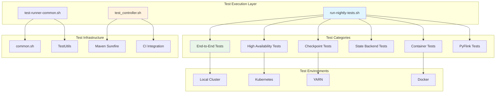
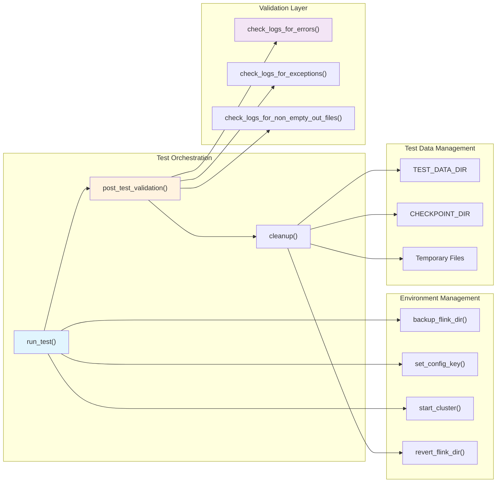
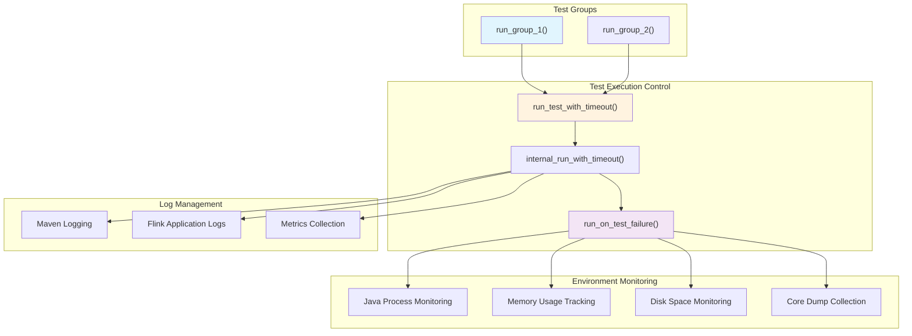
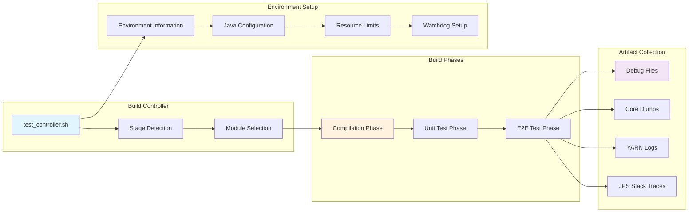
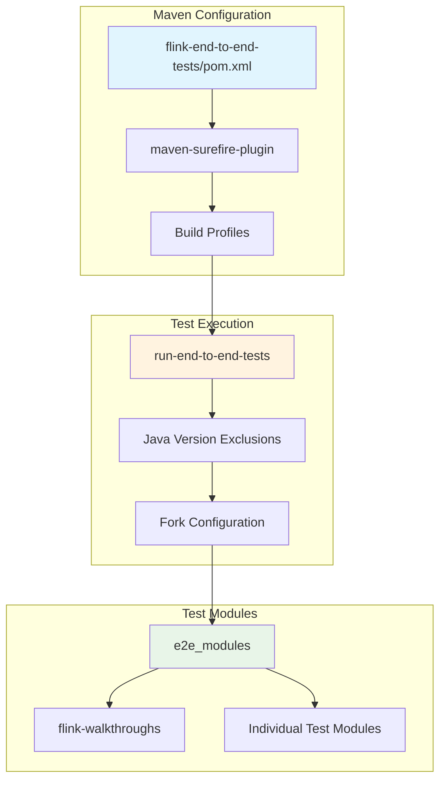

# Testing Infrastructure

<details>
<summary>Relevant source files</summary>

The following files were used as context for generating this wiki page:

- [flink-end-to-end-tests/flink-end-to-end-tests-common/src/main/java/org/apache/flink/tests/util/TestUtils.java](flink-end-to-end-tests/flink-end-to-end-tests-common/src/main/java/org/apache/flink/tests/util/TestUtils.java)
- [flink-end-to-end-tests/flink-end-to-end-tests-scala/src/test/java/org/apache/flink/tests/scala/ScalaFreeITCase.java](flink-end-to-end-tests/flink-end-to-end-tests-scala/src/test/java/org/apache/flink/tests/scala/ScalaFreeITCase.java)
- [flink-end-to-end-tests/flink-end-to-end-tests-table-api/pom.xml](flink-end-to-end-tests/flink-end-to-end-tests-table-api/pom.xml)
- [flink-end-to-end-tests/flink-end-to-end-tests-table-api/src/main/java/org/apache/flink/table/test/async/AsyncScalarFunctionExample.java](flink-end-to-end-tests/flink-end-to-end-tests-table-api/src/main/java/org/apache/flink/table/test/async/AsyncScalarFunctionExample.java)
- [flink-end-to-end-tests/flink-end-to-end-tests-table-api/src/test/java/org/apache/flink/table/test/async/AsyncScalarFunctionTest.java](flink-end-to-end-tests/flink-end-to-end-tests-table-api/src/test/java/org/apache/flink/table/test/async/AsyncScalarFunctionTest.java)
- [flink-end-to-end-tests/pom.xml](flink-end-to-end-tests/pom.xml)
- [flink-end-to-end-tests/run-nightly-tests.sh](flink-end-to-end-tests/run-nightly-tests.sh)
- [flink-end-to-end-tests/test-scripts/common.sh](flink-end-to-end-tests/test-scripts/common.sh)
- [flink-end-to-end-tests/test-scripts/common_artifact_download_cacher.sh](flink-end-to-end-tests/test-scripts/common_artifact_download_cacher.sh)
- [flink-end-to-end-tests/test-scripts/common_ha.sh](flink-end-to-end-tests/test-scripts/common_ha.sh)
- [flink-end-to-end-tests/test-scripts/common_s3.sh](flink-end-to-end-tests/test-scripts/common_s3.sh)
- [flink-end-to-end-tests/test-scripts/queryable_state_base.sh](flink-end-to-end-tests/test-scripts/queryable_state_base.sh)
- [flink-end-to-end-tests/test-scripts/test-runner-common.sh](flink-end-to-end-tests/test-scripts/test-runner-common.sh)
- [flink-end-to-end-tests/test-scripts/test_azure_fs.sh](flink-end-to-end-tests/test-scripts/test_azure_fs.sh)
- [flink-end-to-end-tests/test-scripts/test_cli.sh](flink-end-to-end-tests/test-scripts/test_cli.sh)
- [flink-end-to-end-tests/test-scripts/test_resume_externalized_checkpoints.sh](flink-end-to-end-tests/test-scripts/test_resume_externalized_checkpoints.sh)
- [flink-end-to-end-tests/test-scripts/test_resume_savepoint.sh](flink-end-to-end-tests/test-scripts/test_resume_savepoint.sh)
- [flink-end-to-end-tests/test-scripts/test_rocksdb_state_memory_control.sh](flink-end-to-end-tests/test-scripts/test_rocksdb_state_memory_control.sh)
- [flink-end-to-end-tests/test-scripts/test_stateful_stream_job_upgrade.sh](flink-end-to-end-tests/test-scripts/test_stateful_stream_job_upgrade.sh)
- [flink-end-to-end-tests/test-scripts/test_stream_state_ttl.sh](flink-end-to-end-tests/test-scripts/test_stream_state_ttl.sh)
- [flink-end-to-end-tests/test-scripts/test_tpcds.sh](flink-end-to-end-tests/test-scripts/test_tpcds.sh)
- [flink-table/flink-table-api-java/src/main/java/org/apache/flink/table/planner/loader/PlannerModule.java](flink-table/flink-table-api-java/src/main/java/org/apache/flink/table/planner/loader/PlannerModule.java)
- [flink-test-utils-parent/flink-test-utils-junit/src/main/java/org/apache/flink/testutils/junit/FailsOnJava17.java](flink-test-utils-parent/flink-test-utils-junit/src/main/java/org/apache/flink/testutils/junit/FailsOnJava17.java)
- [tools/ci/controller_utils.sh](tools/ci/controller_utils.sh)
- [tools/ci/test_controller.sh](tools/ci/test_controller.sh)

</details>


This document covers Flink's comprehensive testing infrastructure, including end-to-end test orchestration, CI/CD integration, and test framework utilities. The testing system ensures reliability across distributed stream processing, fault tolerance mechanisms, and various deployment scenarios.

For information about build system configuration and Maven module structure, see [Build System & Dependencies](#6.1). For details about CI/CD pipeline configuration and documentation generation, see [CI/CD & Documentation Pipeline](#6.3).

## Test Architecture Overview

Flink's testing infrastructure is organized into multiple layers that provide comprehensive coverage from unit tests to full end-to-end integration scenarios:



Sources: [flink-end-to-end-tests/run-nightly-tests.sh:1-271](), [tools/ci/test_controller.sh:1-130](), [flink-end-to-end-tests/test-scripts/test-runner-common.sh:1-185]()

## End-to-End Test Framework

The end-to-end test framework provides comprehensive integration testing through a structured approach that manages test execution, environment setup, and validation:



The framework provides standardized test execution through the `run_test` function which handles environment isolation, configuration management, and comprehensive validation:

| Test Phase | Function | Purpose |
|------------|----------|---------|
| Setup | `backup_flink_dir()` | Preserve original Flink configuration |
| Configuration | `set_config_key()` | Apply test-specific settings |
| Execution | Test command | Run the actual test scenario |
| Validation | `check_logs_for_*()` | Verify no errors or exceptions |
| Cleanup | `cleanup()` | Restore environment state |

Sources: [flink-end-to-end-tests/test-scripts/test-runner-common.sh:32-64](), [flink-end-to-end-tests/test-scripts/common.sh:106-128](), [flink-end-to-end-tests/test-scripts/common.sh:381-443]()

## Test Categories and Organization

Flink's test suite is organized into distinct categories that target specific aspects of the system:

### Checkpointing and State Management Tests

```mermaid
graph TB
    subgraph "Savepoint Tests"
        RESUME_SP["test_resume_savepoint.sh"]
        SP_PARAMS["Parallelism Changes"]
        SP_BACKENDS["State Backends"]
    end
    
    subgraph "External Checkpoint Tests"
        EXT_CP["test_resume_externalized_checkpoints.sh"]
        FAILURE_SIM["Failure Simulation"]
        RECOVERY["Recovery Testing"]
    end
    
    subgraph "State Backend Tests"
        ROCKS_MEM["test_rocksdb_state_memory_control.sh"]
        TTL_TEST["test_stream_state_ttl.sh"]
        STATE_UPGRADE["test_stateful_stream_job_upgrade.sh"]
    end
    
    RESUME_SP --> SP_PARAMS
    RESUME_SP --> SP_BACKENDS
    
    EXT_CP --> FAILURE_SIM
    EXT_CP --> RECOVERY
    
    ROCKS_MEM --> "Memory Limits"
    TTL_TEST --> "State Expiration"
    STATE_UPGRADE --> "Schema Evolution"
    
    style RESUME_SP fill:#e8f5e8
    style EXT_CP fill:#fff3e0
    style ROCKS_MEM fill:#f3e5f5
```

Sources: [flink-end-to-end-tests/test-scripts/test_resume_savepoint.sh:1-131](), [flink-end-to-end-tests/test-scripts/test_resume_externalized_checkpoints.sh:1-149](), [flink-end-to-end-tests/test-scripts/test_rocksdb_state_memory_control.sh:1-118]()

### High Availability and Fault Tolerance Tests

The HA testing framework uses watchdog processes to simulate failures and verify recovery mechanisms:

| Component | Function | Purpose |
|-----------|----------|---------|
| `jm_watchdog()` | Job Manager monitoring | Restart failed JobManagers |
| `ha_tm_watchdog()` | Task Manager monitoring | Kill and restart TaskManagers |
| `verify_logs()` | Log validation | Verify recovery behavior |
| `stop_watchdogs()` | Cleanup | Terminate monitoring processes |

Sources: [flink-end-to-end-tests/test-scripts/common_ha.sh:87-99](), [flink-end-to-end-tests/test-scripts/common_ha.sh:143-190](), [flink-end-to-end-tests/test-scripts/common_ha.sh:56-85]()

### Container and Deployment Tests

Tests verify deployment scenarios across different container orchestration platforms:

| Test Category | Scripts | Target Environment |
|---------------|---------|-------------------|
| Docker Tests | `test_docker_embedded_job.sh` | Docker containers |
| Kubernetes Tests | `test_kubernetes_*.sh` | Kubernetes clusters |
| YARN Tests | `test_yarn_application_*.sh` | Hadoop YARN |

Sources: [flink-end-to-end-tests/run-nightly-tests.sh:128-150]()

## Test Orchestration System

The test orchestration system manages test execution across different environments and provides comprehensive logging and monitoring:



The orchestration system provides timeout management through `internal_run_with_timeout()` which monitors test execution and triggers failure handling when timeouts occur. This includes collecting system state information and preserving debug artifacts.

Sources: [flink-end-to-end-tests/run-nightly-tests.sh:86-165](), [flink-end-to-end-tests/test-scripts/common.sh:974-1005](), [flink-end-to-end-tests/test-scripts/test-runner-common.sh:113-143]()

## CI/CD Integration

The testing infrastructure integrates with continuous integration systems through structured build phases:



The CI system uses environment variables to control test execution and artifact collection:

| Variable | Purpose | Usage |
|----------|---------|-------|
| `DEBUG_FILES_OUTPUT_DIR` | Debug artifact location | Store logs and dumps |
| `STAGE` | Test stage identifier | Control test selection |
| `PROFILE` | Maven build profile | Configure build options |
| `IS_CI` | CI environment flag | Enable CI-specific behavior |

Sources: [tools/ci/test_controller.sh:40-129](), [tools/ci/controller_utils.sh:34-42](), [tools/ci/controller_utils.sh:44-61]()

## Test Utilities and Common Infrastructure

The testing infrastructure provides extensive utility functions for common testing operations:

### Cluster Management

| Function | Purpose | Usage |
|----------|---------|-------|
| `start_cluster()` | Start Flink cluster | Initialize test environment |
| `wait_dispatcher_running()` | Wait for cluster ready | Synchronize test execution |
| `shutdown_all()` | Clean shutdown | Terminate all processes |
| `create_ha_config()` | HA configuration | Setup high availability |

### Job Management

| Function | Purpose | Parameters |
|----------|---------|------------|
| `wait_job_running()` | Wait for job start | Job ID |
| `wait_job_terminal_state()` | Wait for completion | Job ID, expected state |
| `wait_num_checkpoints()` | Wait for checkpoints | Job ID, checkpoint count |
| `cancel_job()` | Cancel running job | Job ID |

### State and Metrics

| Function | Purpose | Usage |
|----------|---------|-------|
| `take_savepoint()` | Create savepoint | Job ID, target directory |
| `find_latest_completed_checkpoint()` | Locate checkpoint | Checkpoint root directory |
| `get_job_metric()` | Retrieve job metrics | Job ID, metric name |
| `setup_flink_slf4j_metric_reporter()` | Configure metrics | Metric name pattern |

Sources: [flink-end-to-end-tests/test-scripts/common.sh:308-327](), [flink-end-to-end-tests/test-scripts/common.sh:555-612](), [flink-end-to-end-tests/test-scripts/common.sh:614-624](), [flink-end-to-end-tests/test-scripts/common.sh:894-899]()

### Maven Integration

The end-to-end tests integrate with Maven through the Surefire plugin configuration:



The Maven configuration ensures tests run sequentially (`forkCount: 1`) to prevent conflicts when accessing the Flink distribution concurrently, and supports Java version-specific exclusions through profiles.

Sources: [flink-end-to-end-tests/pom.xml:94-144](), [flink-end-to-end-tests/pom.xml:250-254](), [flink-end-to-end-tests/run-nightly-tests.sh:250-255]()
