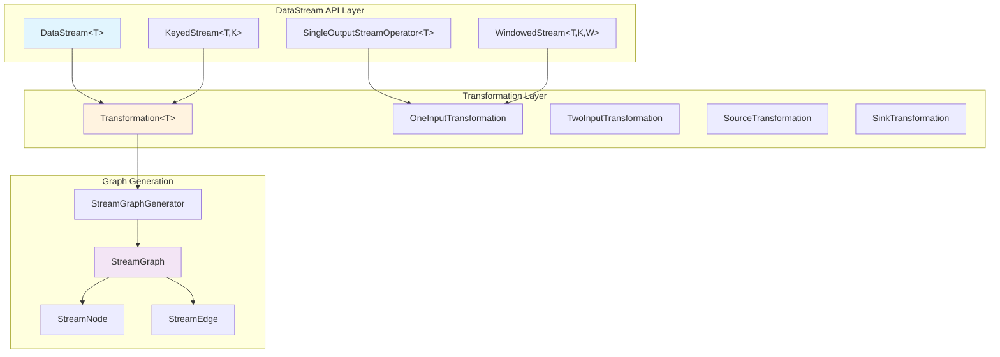
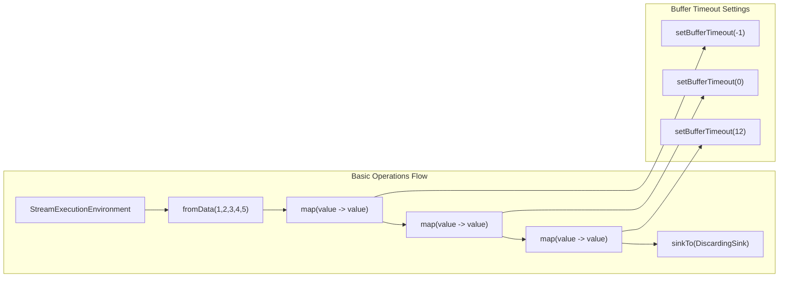
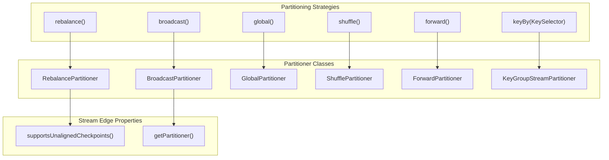
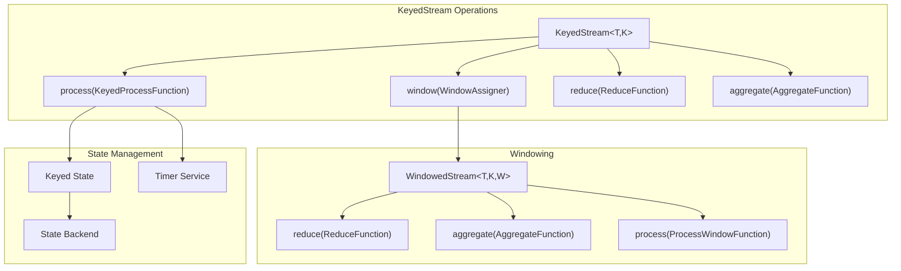
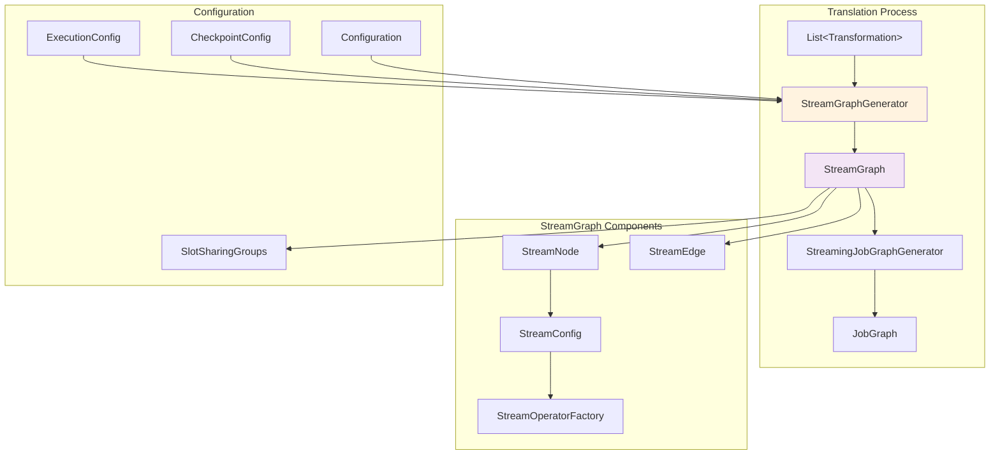
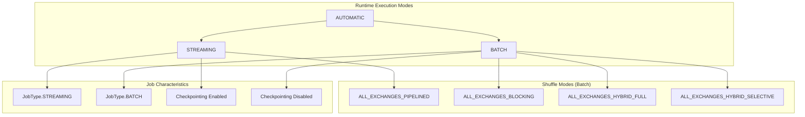
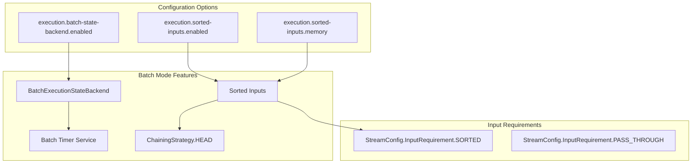
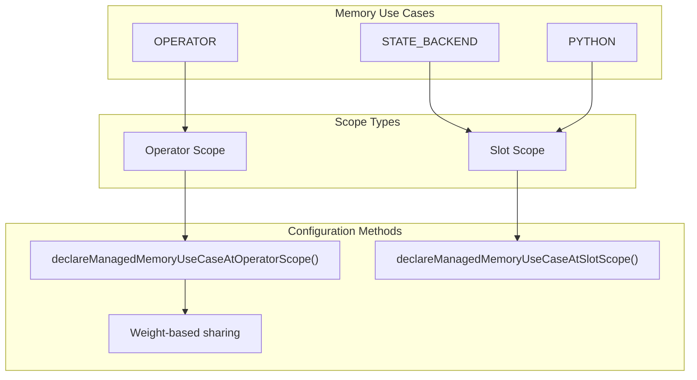
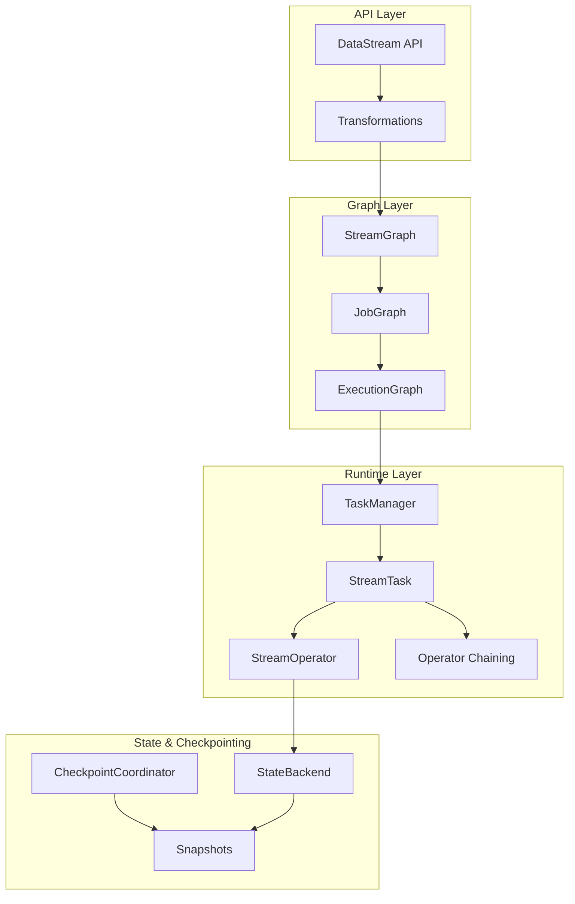

# DataStream API

Relevant source files

The following files were used as context for generating this wiki page:

- [docs/layouts/shortcodes/generated/execution_configuration.html](docs/layouts/shortcodes/generated/execution_configuration.html)
- [flink-connectors/flink-connector-base/src/test/java/org/apache/flink/connector/base/sink/writer/AsyncSinkWriterThrottlingTest.java](flink-connectors/flink-connector-base/src/test/java/org/apache/flink/connector/base/sink/writer/AsyncSinkWriterThrottlingTest.java)
- [flink-core/src/main/java/org/apache/flink/api/common/BatchShuffleMode.java](flink-core/src/main/java/org/apache/flink/api/common/BatchShuffleMode.java)
- [flink-core/src/main/java/org/apache/flink/api/dag/Transformation.java](flink-core/src/main/java/org/apache/flink/api/dag/Transformation.java)
- [flink-core/src/main/java/org/apache/flink/configuration/ExecutionOptions.java](flink-core/src/main/java/org/apache/flink/configuration/ExecutionOptions.java)
- [flink-core/src/test/java/org/apache/flink/api/dag/TransformationTest.java](flink-core/src/test/java/org/apache/flink/api/dag/TransformationTest.java)
- [flink-python/pyflink/datastream/tests/test_stream_execution_environment_completeness.py](flink-python/pyflink/datastream/tests/test_stream_execution_environment_completeness.py)
- [flink-python/src/main/java/org/apache/flink/streaming/api/operators/python/embedded/EmbeddedPythonBatchKeyedCoBroadcastProcessOperator.java](flink-python/src/main/java/org/apache/flink/streaming/api/operators/python/embedded/EmbeddedPythonBatchKeyedCoBroadcastProcessOperator.java)
- [flink-python/src/main/java/org/apache/flink/streaming/api/operators/python/process/ExternalPythonBatchKeyedCoBroadcastProcessOperator.java](flink-python/src/main/java/org/apache/flink/streaming/api/operators/python/process/ExternalPythonBatchKeyedCoBroadcastProcessOperator.java)
- [flink-python/src/main/java/org/apache/flink/streaming/api/transformations/python/DelegateOperatorTransformation.java](flink-python/src/main/java/org/apache/flink/streaming/api/transformations/python/DelegateOperatorTransformation.java)
- [flink-python/src/main/java/org/apache/flink/streaming/api/transformations/python/PythonBroadcastStateTransformation.java](flink-python/src/main/java/org/apache/flink/streaming/api/transformations/python/PythonBroadcastStateTransformation.java)
- [flink-python/src/main/java/org/apache/flink/streaming/api/transformations/python/PythonKeyedBroadcastStateTransformation.java](flink-python/src/main/java/org/apache/flink/streaming/api/transformations/python/PythonKeyedBroadcastStateTransformation.java)
- [flink-python/src/main/java/org/apache/flink/streaming/runtime/translators/python/PythonBroadcastStateTransformationTranslator.java](flink-python/src/main/java/org/apache/flink/streaming/runtime/translators/python/PythonBroadcastStateTransformationTranslator.java)
- [flink-python/src/main/java/org/apache/flink/streaming/runtime/translators/python/PythonKeyedBroadcastStateTransformationTranslator.java](flink-python/src/main/java/org/apache/flink/streaming/runtime/translators/python/PythonKeyedBroadcastStateTransformationTranslator.java)
- [flink-runtime/src/main/java/org/apache/flink/runtime/io/network/partition/ResultPartitionType.java](flink-runtime/src/main/java/org/apache/flink/runtime/io/network/partition/ResultPartitionType.java)
- [flink-runtime/src/main/java/org/apache/flink/runtime/scheduler/ExecutionVertexVersioner.java](flink-runtime/src/main/java/org/apache/flink/runtime/scheduler/ExecutionVertexVersioner.java)
- [flink-runtime/src/main/java/org/apache/flink/streaming/api/datastream/AllWindowedStream.java](flink-runtime/src/main/java/org/apache/flink/streaming/api/datastream/AllWindowedStream.java)
- [flink-runtime/src/main/java/org/apache/flink/streaming/api/datastream/SingleOutputStreamOperator.java](flink-runtime/src/main/java/org/apache/flink/streaming/api/datastream/SingleOutputStreamOperator.java)
- [flink-runtime/src/main/java/org/apache/flink/streaming/api/datastream/WindowedStream.java](flink-runtime/src/main/java/org/apache/flink/streaming/api/datastream/WindowedStream.java)
- [flink-runtime/src/test/java/org/apache/flink/streaming/runtime/operators/windowing/TimeWindowTranslationTest.java](flink-runtime/src/test/java/org/apache/flink/streaming/runtime/operators/windowing/TimeWindowTranslationTest.java)
- [flink-streaming-java/src/test/java/org/apache/flink/streaming/api/graph/StreamGraphGeneratorBatchExecutionTest.java](flink-streaming-java/src/test/java/org/apache/flink/streaming/api/graph/StreamGraphGeneratorBatchExecutionTest.java)
- [flink-streaming-java/src/test/java/org/apache/flink/streaming/api/graph/StreamGraphGeneratorExecutionModeDetectionTest.java](flink-streaming-java/src/test/java/org/apache/flink/streaming/api/graph/StreamGraphGeneratorExecutionModeDetectionTest.java)
- [flink-streaming-java/src/test/java/org/apache/flink/streaming/api/graph/StreamGraphGeneratorTest.java](flink-streaming-java/src/test/java/org/apache/flink/streaming/api/graph/StreamGraphGeneratorTest.java)
- [flink-streaming-java/src/test/java/org/apache/flink/streaming/api/graph/StreamingJobGraphGeneratorTest.java](flink-streaming-java/src/test/java/org/apache/flink/streaming/api/graph/StreamingJobGraphGeneratorTest.java)
- [flink-streaming-java/src/test/java/org/apache/flink/streaming/runtime/operators/windowing/AllWindowTranslationTest.java](flink-streaming-java/src/test/java/org/apache/flink/streaming/runtime/operators/windowing/AllWindowTranslationTest.java)
- [flink-streaming-java/src/test/java/org/apache/flink/streaming/runtime/operators/windowing/WindowTranslationTest.java](flink-streaming-java/src/test/java/org/apache/flink/streaming/runtime/operators/windowing/WindowTranslationTest.java)
- [flink-streaming-java/src/test/java/org/apache/flink/streaming/util/TestExpandingSink.java](flink-streaming-java/src/test/java/org/apache/flink/streaming/util/TestExpandingSink.java)
- [flink-tests/src/test/java/org/apache/flink/test/checkpointing/ProcessingTimeWindowCheckpointingITCase.java](flink-tests/src/test/java/org/apache/flink/test/checkpointing/ProcessingTimeWindowCheckpointingITCase.java)
- [flink-tests/src/test/java/org/apache/flink/test/state/ManualWindowSpeedITCase.java](flink-tests/src/test/java/org/apache/flink/test/state/ManualWindowSpeedITCase.java)
- [flink-tests/src/test/java/org/apache/flink/test/streaming/api/datastream/FinishedSourcesWatermarkITCase.java](flink-tests/src/test/java/org/apache/flink/test/streaming/api/datastream/FinishedSourcesWatermarkITCase.java)
- [flink-tests/src/test/java/org/apache/flink/test/streaming/api/datastream/ReinterpretDataStreamAsKeyedStreamITCase.java](flink-tests/src/test/java/org/apache/flink/test/streaming/api/datastream/ReinterpretDataStreamAsKeyedStreamITCase.java)
- [flink-tests/src/test/java/org/apache/flink/test/streaming/runtime/CacheITCase.java](flink-tests/src/test/java/org/apache/flink/test/streaming/runtime/CacheITCase.java)
- [flink-tests/src/test/java/org/apache/flink/test/streaming/runtime/TimestampITCase.java](flink-tests/src/test/java/org/apache/flink/test/streaming/runtime/TimestampITCase.java)
- [flink-tests/src/test/java/org/apache/flink/test/windowing/sessionwindows/SessionWindowITCase.java](flink-tests/src/test/java/org/apache/flink/test/windowing/sessionwindows/SessionWindowITCase.java)

The DataStream API provides a low-level programming interface for building stream processing applications in Flink. It offers fine-grained control over stream transformations, state management, windowing, and execution characteristics. This API is designed for developers who need precise control over their streaming logic and performance characteristics.

For higher-level declarative programming with automatic optimizations, see [Table API & SQL](#3.1). For Python bindings to the DataStream API, see [Python API (PyFlink)](#3.3).

## Core Concepts

### DataStream Abstraction

The `DataStream` represents an immutable stream of data elements of a specific type. All operations on a DataStream create new DataStream instances, forming a directed acyclic graph (DAG) of transformations. Each DataStream is backed by a `Transformation` that defines how the data should be processed.

Sources: [flink-core/src/main/java/org/apache/flink/api/dag/Transformation.java:49-110](), [flink-runtime/src/main/java/org/apache/flink/streaming/api/datastream/SingleOutputStreamOperator.java:42-49]()

### Transformation Hierarchy

Every DataStream operation creates a `Transformation` that encapsulates the operation logic, parallelism settings, and resource requirements. Transformations form a tree structure that gets translated into a `StreamGraph` for execution.

```mermaid
graph TB
    subgraph "Transformation Types"
        T["Transformation&lt;T&gt;"]
        OIT["OneInputTransformation&lt;IN,OUT&gt;"]
        TIT["TwoInputTransformation&lt;IN1,IN2,OUT&gt;"]
        MIT["MultipleInputTransformation&lt;OUT&gt;"]
        PT["PartitionTransformation&lt;T&gt;"]
        UT["UnionTransformation&lt;T&gt;"]
        ST["SourceTransformation&lt;T&gt;"]
        SIT["SinkTransformation&lt;T&gt;"]
    end
    
    T --> OIT
    T --> TIT
    T --> MIT
    T --> PT
    T --> UT
    T --> ST
    T --> SIT
    
    subgraph "Key Properties"
        ID["id: int"]
        NAME["name: String"]
        PAR["parallelism: int"]
        BT["bufferTimeout: long"]
        SSG["slotSharingGroup: Optional&lt;SlotSharingGroup&gt;"]
    end
    
    T --> ID
    T --> NAME
    T --> PAR
    T --> BT
    T --> SSG
```

Sources: [flink-core/src/main/java/org/apache/flink/api/dag/Transformation.java:116-189](), [flink-streaming-java/src/test/java/org/apache/flink/streaming/api/graph/StreamGraphGeneratorTest.java:26-98]()

## Key Operations

### Basic Transformations

The DataStream API provides fundamental transformation operations that create new streams from existing ones. Each operation generates a corresponding `Transformation` object.

| Operation | Transformation Type | Description |
|-----------|-------------------|-------------|
| `map()` | `OneInputTransformation` | Apply a function to each element |
| `filter()` | `OneInputTransformation` | Filter elements based on a predicate |
| `flatMap()` | `OneInputTransformation` | Apply function that returns multiple elements |
| `union()` | `UnionTransformation` | Combine multiple streams |
| `connect()` | `TwoInputTransformation` | Join two streams for co-processing |

Sources: [flink-streaming-java/src/test/java/org/apache/flink/streaming/api/graph/StreamGraphGeneratorTest.java:122-159]()

### Partitioning Operations

DataStream supports various partitioning strategies to control how data flows between parallel operator instances.

Sources: [flink-streaming-java/src/test/java/org/apache/flink/streaming/api/graph/StreamGraphGeneratorTest.java:167-235](), [flink-streaming-java/src/test/java/org/apache/flink/streaming/api/graph/StreamGraphGeneratorTest.java:375-392]()

### Keyed Stream Operations

Keyed streams enable stateful processing by partitioning data based on keys and providing access to keyed state.

Sources: [flink-runtime/src/main/java/org/apache/flink/streaming/api/datastream/WindowedStream.java:75-96](), [flink-streaming-java/src/test/java/org/apache/flink/streaming/api/graph/StreamGraphGeneratorTest.java:459-506]()

## Stream Graph Generation

The DataStream API operations are translated into an executable `StreamGraph` through the `StreamGraphGenerator`. This process converts the logical DAG of transformations into a physical execution plan.

Sources: [flink-streaming-java/src/test/java/org/apache/flink/streaming/api/graph/StreamingJobGraphGeneratorTest.java:26-57](), [flink-streaming-java/src/test/java/org/apache/flink/streaming/api/graph/StreamGraphGeneratorTest.java:110-120]()

### Buffer Timeout Configuration

The DataStream API allows fine-grained control over buffer timeouts to balance latency and throughput. Buffer timeout determines how long data can remain in buffers before being flushed downstream.

| Timeout Value | Behavior | Use Case |
|---------------|----------|-----------|
| `-1` | Use environment default | Inherit global setting |
| `0` | Flush after every record | Minimize latency |
| `> 0` | Flush after timeout (ms) | Balance latency/throughput |

Sources: [flink-streaming-java/src/test/java/org/apache/flink/streaming/api/graph/StreamGraphGeneratorTest.java:122-159](), [flink-core/src/main/java/org/apache/flink/configuration/ExecutionOptions.java:107-130]()

## Execution Modes

The DataStream API supports different execution modes that affect how the job is scheduled and executed.

Sources: [flink-core/src/main/java/org/apache/flink/configuration/ExecutionOptions.java:41-48](), [flink-core/src/main/java/org/apache/flink/api/common/BatchShuffleMode.java:41-89](), [flink-streaming-java/src/test/java/org/apache/flink/streaming/api/graph/StreamGraphGeneratorBatchExecutionTest.java:74-99]()

### Batch-Specific Optimizations

When running in `BATCH` mode, the DataStream API applies several optimizations including sorted inputs for keyed operators and specialized state backends.

Sources: [flink-streaming-java/src/test/java/org/apache/flink/streaming/api/graph/StreamGraphGeneratorBatchExecutionTest.java:155-172](), [flink-core/src/main/java/org/apache/flink/configuration/ExecutionOptions.java:152-172]()

## Resource and Memory Management

The DataStream API provides mechanisms to control resource allocation and memory usage for operators.

### Managed Memory Configuration

Operators can declare their managed memory requirements for different use cases:

Sources: [flink-core/src/main/java/org/apache/flink/api/dag/Transformation.java:334-391](), [flink-streaming-java/src/test/java/org/apache/flink/streaming/api/graph/StreamGraphGeneratorTest.java:631-651]()

### Slot Sharing and Resource Specs

The API supports slot sharing groups and resource specifications for efficient resource utilization:

| Configuration | Purpose | API Method |
|---------------|---------|------------|
| Slot Sharing Group | Co-locate operators | `setSlotSharingGroup()` |
| Resource Spec | Min/Max resources | `setResources()` |
| Co-location Group | Force same slot | `setCoLocationGroupKey()` |

Sources: [flink-streaming-java/src/test/java/org/apache/flink/streaming/api/graph/StreamGraphGeneratorTest.java:654-692](), [flink-core/src/main/java/org/apache/flink/api/dag/Transformation.java:476-520]()

## Integration with Runtime System

The DataStream API integrates with Flink's runtime system through several key components:

Sources: [flink-streaming-java/src/test/java/org/apache/flink/streaming/api/graph/StreamingJobGraphGeneratorTest.java:26-32](), [flink-core/src/main/java/org/apache/flink/api/dag/Transformation.java:49-56]()

The DataStream API serves as the foundation for building complex streaming applications with precise control over execution characteristics, state management, and resource utilization. It provides the building blocks that higher-level APIs like the Table API build upon, while offering direct access to Flink's powerful stream processing capabilities.
