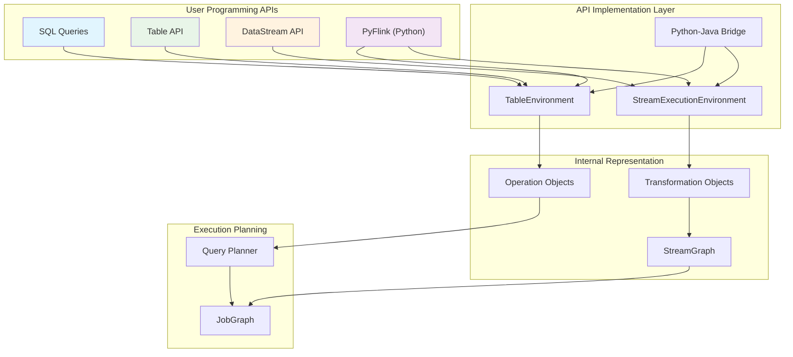
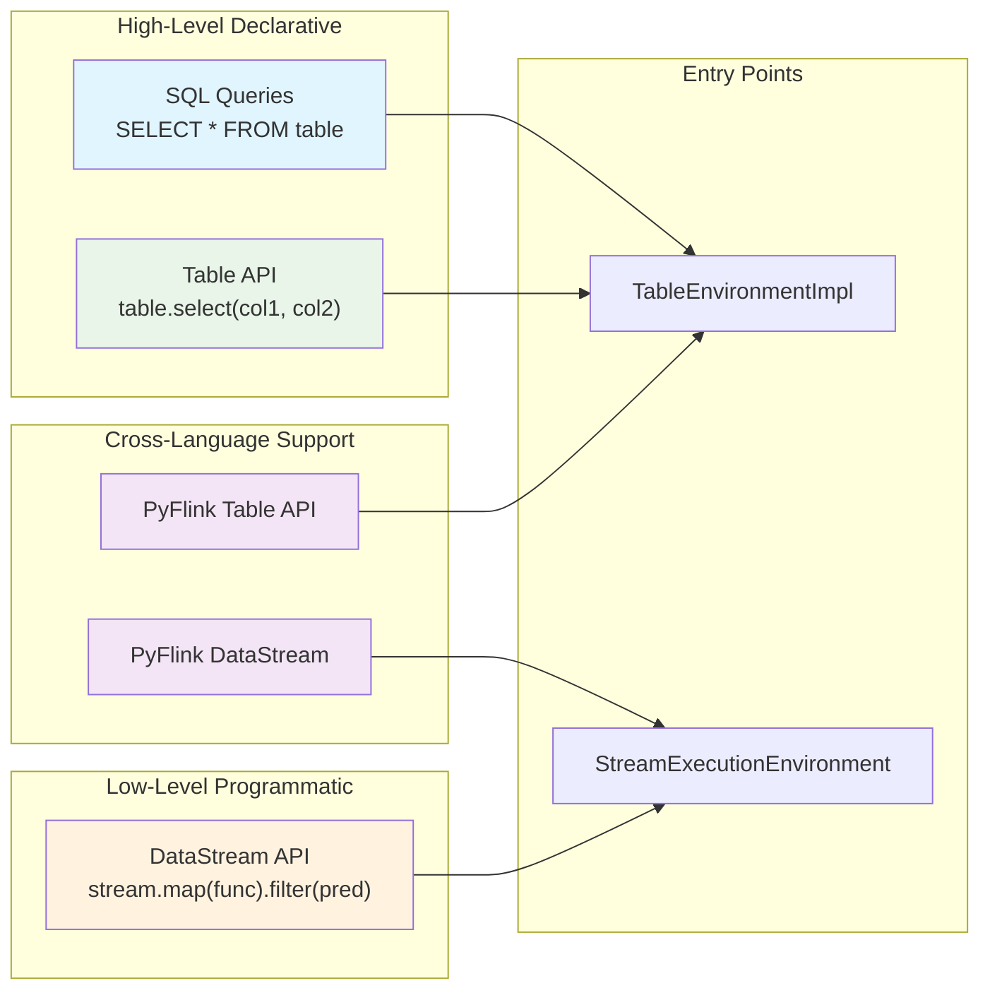
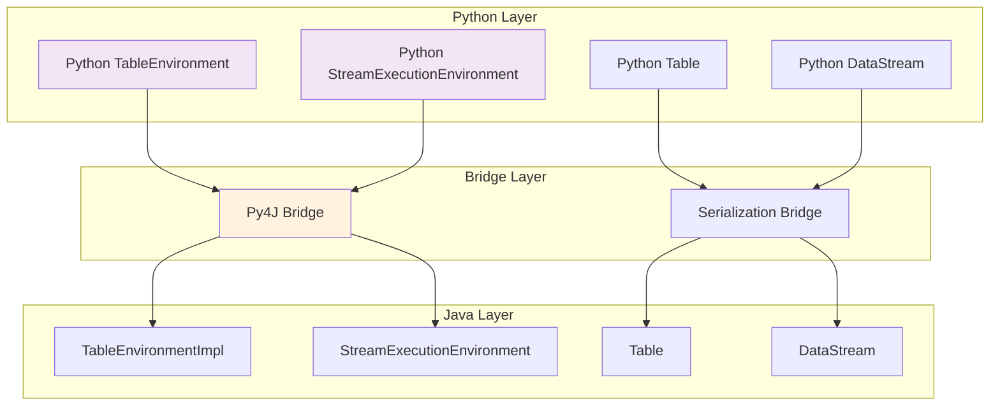
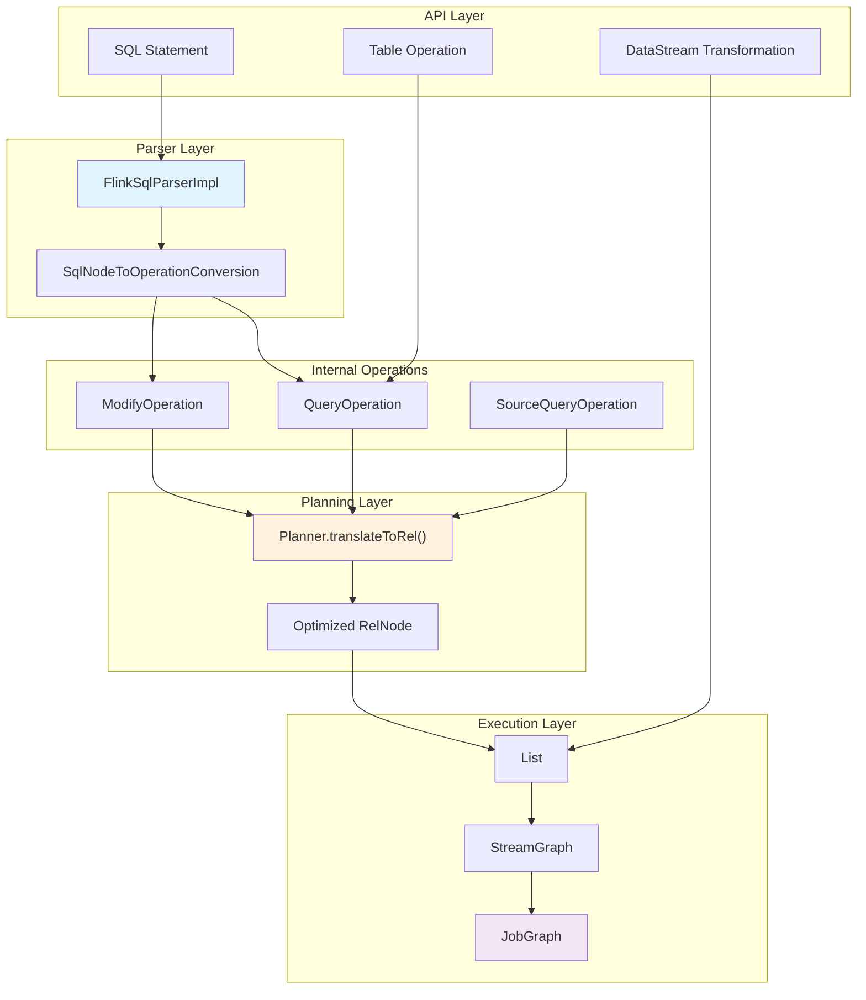

# Programming APIs

Relevant source files

The following files were used as context for generating this wiki page:

- [docs/content.zh/docs/dev/table/sql/show.md](docs/content.zh/docs/dev/table/sql/show.md)
- [docs/content/docs/dev/table/sql/show.md](docs/content/docs/dev/table/sql/show.md)
- [docs/layouts/shortcodes/generated/execution_configuration.html](docs/layouts/shortcodes/generated/execution_configuration.html)
- [flink-connectors/flink-connector-base/src/test/java/org/apache/flink/connector/base/sink/writer/AsyncSinkWriterThrottlingTest.java](flink-connectors/flink-connector-base/src/test/java/org/apache/flink/connector/base/sink/writer/AsyncSinkWriterThrottlingTest.java)
- [flink-core/src/main/java/org/apache/flink/api/common/BatchShuffleMode.java](flink-core/src/main/java/org/apache/flink/api/common/BatchShuffleMode.java)
- [flink-core/src/main/java/org/apache/flink/api/dag/Transformation.java](flink-core/src/main/java/org/apache/flink/api/dag/Transformation.java)
- [flink-core/src/main/java/org/apache/flink/configuration/ExecutionOptions.java](flink-core/src/main/java/org/apache/flink/configuration/ExecutionOptions.java)
- [flink-core/src/test/java/org/apache/flink/api/dag/TransformationTest.java](flink-core/src/test/java/org/apache/flink/api/dag/TransformationTest.java)
- [flink-python/pyflink/datastream/tests/test_stream_execution_environment_completeness.py](flink-python/pyflink/datastream/tests/test_stream_execution_environment_completeness.py)
- [flink-python/pyflink/table/tests/test_environment_completeness.py](flink-python/pyflink/table/tests/test_environment_completeness.py)
- [flink-python/src/main/java/org/apache/flink/streaming/api/operators/python/embedded/EmbeddedPythonBatchKeyedCoBroadcastProcessOperator.java](flink-python/src/main/java/org/apache/flink/streaming/api/operators/python/embedded/EmbeddedPythonBatchKeyedCoBroadcastProcessOperator.java)
- [flink-python/src/main/java/org/apache/flink/streaming/api/operators/python/process/ExternalPythonBatchKeyedCoBroadcastProcessOperator.java](flink-python/src/main/java/org/apache/flink/streaming/api/operators/python/process/ExternalPythonBatchKeyedCoBroadcastProcessOperator.java)
- [flink-python/src/main/java/org/apache/flink/streaming/api/transformations/python/DelegateOperatorTransformation.java](flink-python/src/main/java/org/apache/flink/streaming/api/transformations/python/DelegateOperatorTransformation.java)
- [flink-python/src/main/java/org/apache/flink/streaming/api/transformations/python/PythonBroadcastStateTransformation.java](flink-python/src/main/java/org/apache/flink/streaming/api/transformations/python/PythonBroadcastStateTransformation.java)
- [flink-python/src/main/java/org/apache/flink/streaming/api/transformations/python/PythonKeyedBroadcastStateTransformation.java](flink-python/src/main/java/org/apache/flink/streaming/api/transformations/python/PythonKeyedBroadcastStateTransformation.java)
- [flink-python/src/main/java/org/apache/flink/streaming/runtime/translators/python/PythonBroadcastStateTransformationTranslator.java](flink-python/src/main/java/org/apache/flink/streaming/runtime/translators/python/PythonBroadcastStateTransformationTranslator.java)
- [flink-python/src/main/java/org/apache/flink/streaming/runtime/translators/python/PythonKeyedBroadcastStateTransformationTranslator.java](flink-python/src/main/java/org/apache/flink/streaming/runtime/translators/python/PythonKeyedBroadcastStateTransformationTranslator.java)
- [flink-runtime/src/main/java/org/apache/flink/runtime/io/network/partition/ResultPartitionType.java](flink-runtime/src/main/java/org/apache/flink/runtime/io/network/partition/ResultPartitionType.java)
- [flink-runtime/src/main/java/org/apache/flink/runtime/scheduler/ExecutionVertexVersioner.java](flink-runtime/src/main/java/org/apache/flink/runtime/scheduler/ExecutionVertexVersioner.java)
- [flink-runtime/src/main/java/org/apache/flink/streaming/api/datastream/AllWindowedStream.java](flink-runtime/src/main/java/org/apache/flink/streaming/api/datastream/AllWindowedStream.java)
- [flink-runtime/src/main/java/org/apache/flink/streaming/api/datastream/SingleOutputStreamOperator.java](flink-runtime/src/main/java/org/apache/flink/streaming/api/datastream/SingleOutputStreamOperator.java)
- [flink-runtime/src/main/java/org/apache/flink/streaming/api/datastream/WindowedStream.java](flink-runtime/src/main/java/org/apache/flink/streaming/api/datastream/WindowedStream.java)
- [flink-runtime/src/test/java/org/apache/flink/streaming/runtime/operators/windowing/TimeWindowTranslationTest.java](flink-runtime/src/test/java/org/apache/flink/streaming/runtime/operators/windowing/TimeWindowTranslationTest.java)
- [flink-streaming-java/src/test/java/org/apache/flink/streaming/api/graph/StreamGraphGeneratorBatchExecutionTest.java](flink-streaming-java/src/test/java/org/apache/flink/streaming/api/graph/StreamGraphGeneratorBatchExecutionTest.java)
- [flink-streaming-java/src/test/java/org/apache/flink/streaming/api/graph/StreamGraphGeneratorExecutionModeDetectionTest.java](flink-streaming-java/src/test/java/org/apache/flink/streaming/api/graph/StreamGraphGeneratorExecutionModeDetectionTest.java)
- [flink-streaming-java/src/test/java/org/apache/flink/streaming/api/graph/StreamGraphGeneratorTest.java](flink-streaming-java/src/test/java/org/apache/flink/streaming/api/graph/StreamGraphGeneratorTest.java)
- [flink-streaming-java/src/test/java/org/apache/flink/streaming/api/graph/StreamingJobGraphGeneratorTest.java](flink-streaming-java/src/test/java/org/apache/flink/streaming/api/graph/StreamingJobGraphGeneratorTest.java)
- [flink-streaming-java/src/test/java/org/apache/flink/streaming/runtime/operators/windowing/AllWindowTranslationTest.java](flink-streaming-java/src/test/java/org/apache/flink/streaming/runtime/operators/windowing/AllWindowTranslationTest.java)
- [flink-streaming-java/src/test/java/org/apache/flink/streaming/runtime/operators/windowing/WindowTranslationTest.java](flink-streaming-java/src/test/java/org/apache/flink/streaming/runtime/operators/windowing/WindowTranslationTest.java)
- [flink-streaming-java/src/test/java/org/apache/flink/streaming/util/TestExpandingSink.java](flink-streaming-java/src/test/java/org/apache/flink/streaming/util/TestExpandingSink.java)
- [flink-table/flink-sql-client/src/test/resources/sql/catalog_database.q](flink-table/flink-sql-client/src/test/resources/sql/catalog_database.q)
- [flink-table/flink-sql-gateway/src/test/resources/sql/catalog_database.q](flink-table/flink-sql-gateway/src/test/resources/sql/catalog_database.q)
- [flink-table/flink-sql-parser/src/main/codegen/data/Parser.tdd](flink-table/flink-sql-parser/src/main/codegen/data/Parser.tdd)
- [flink-table/flink-sql-parser/src/main/codegen/includes/parserImpls.ftl](flink-table/flink-sql-parser/src/main/codegen/includes/parserImpls.ftl)
- [flink-table/flink-sql-parser/src/main/java/org/apache/flink/sql/parser/ddl/SqlAlterTableAdd.java](flink-table/flink-sql-parser/src/main/java/org/apache/flink/sql/parser/ddl/SqlAlterTableAdd.java)
- [flink-table/flink-sql-parser/src/main/java/org/apache/flink/sql/parser/ddl/SqlAlterTableDropDistribution.java](flink-table/flink-sql-parser/src/main/java/org/apache/flink/sql/parser/ddl/SqlAlterTableDropDistribution.java)
- [flink-table/flink-sql-parser/src/main/java/org/apache/flink/sql/parser/ddl/SqlAlterTableModify.java](flink-table/flink-sql-parser/src/main/java/org/apache/flink/sql/parser/ddl/SqlAlterTableModify.java)
- [flink-table/flink-sql-parser/src/main/java/org/apache/flink/sql/parser/ddl/SqlAlterTableSchema.java](flink-table/flink-sql-parser/src/main/java/org/apache/flink/sql/parser/ddl/SqlAlterTableSchema.java)
- [flink-table/flink-sql-parser/src/main/java/org/apache/flink/sql/parser/ddl/SqlCreateTable.java](flink-table/flink-sql-parser/src/main/java/org/apache/flink/sql/parser/ddl/SqlCreateTable.java)
- [flink-table/flink-sql-parser/src/main/java/org/apache/flink/sql/parser/ddl/SqlCreateTableAs.java](flink-table/flink-sql-parser/src/main/java/org/apache/flink/sql/parser/ddl/SqlCreateTableAs.java)
- [flink-table/flink-sql-parser/src/main/java/org/apache/flink/sql/parser/ddl/SqlDistribution.java](flink-table/flink-sql-parser/src/main/java/org/apache/flink/sql/parser/ddl/SqlDistribution.java)
- [flink-table/flink-sql-parser/src/main/java/org/apache/flink/sql/parser/ddl/SqlReplaceTableAs.java](flink-table/flink-sql-parser/src/main/java/org/apache/flink/sql/parser/ddl/SqlReplaceTableAs.java)
- [flink-table/flink-sql-parser/src/test/java/org/apache/flink/sql/parser/FlinkSqlParserImplTest.java](flink-table/flink-sql-parser/src/test/java/org/apache/flink/sql/parser/FlinkSqlParserImplTest.java)
- [flink-table/flink-table-api-java/src/main/java/org/apache/flink/table/api/TableEnvironment.java](flink-table/flink-table-api-java/src/main/java/org/apache/flink/table/api/TableEnvironment.java)
- [flink-table/flink-table-api-java/src/main/java/org/apache/flink/table/api/internal/TableEnvironmentImpl.java](flink-table/flink-table-api-java/src/main/java/org/apache/flink/table/api/internal/TableEnvironmentImpl.java)
- [flink-table/flink-table-api-java/src/main/java/org/apache/flink/table/catalog/CatalogManager.java](flink-table/flink-table-api-java/src/main/java/org/apache/flink/table/catalog/CatalogManager.java)
- [flink-table/flink-table-api-java/src/main/java/org/apache/flink/table/operations/ddl/AlterTableChangeOperation.java](flink-table/flink-table-api-java/src/main/java/org/apache/flink/table/operations/ddl/AlterTableChangeOperation.java)
- [flink-table/flink-table-api-java/src/main/java/org/apache/flink/table/operations/materializedtable/AlterMaterializedTableAsQueryOperation.java](flink-table/flink-table-api-java/src/main/java/org/apache/flink/table/operations/materializedtable/AlterMaterializedTableAsQueryOperation.java)
- [flink-table/flink-table-api-java/src/main/java/org/apache/flink/table/operations/materializedtable/AlterMaterializedTableChangeOperation.java](flink-table/flink-table-api-java/src/main/java/org/apache/flink/table/operations/materializedtable/AlterMaterializedTableChangeOperation.java)
- [flink-table/flink-table-api-java/src/main/java/org/apache/flink/table/operations/materializedtable/AlterMaterializedTableOperation.java](flink-table/flink-table-api-java/src/main/java/org/apache/flink/table/operations/materializedtable/AlterMaterializedTableOperation.java)
- [flink-table/flink-table-api-java/src/test/java/org/apache/flink/table/api/TableEnvironmentTest.java](flink-table/flink-table-api-java/src/test/java/org/apache/flink/table/api/TableEnvironmentTest.java)
- [flink-table/flink-table-api-java/src/test/java/org/apache/flink/table/catalog/CatalogManagerTest.java](flink-table/flink-table-api-java/src/test/java/org/apache/flink/table/catalog/CatalogManagerTest.java)
- [flink-table/flink-table-api-java/src/test/java/org/apache/flink/table/utils/CatalogManagerMocks.java](flink-table/flink-table-api-java/src/test/java/org/apache/flink/table/utils/CatalogManagerMocks.java)
- [flink-table/flink-table-api-java/src/test/java/org/apache/flink/table/utils/ParserMock.java](flink-table/flink-table-api-java/src/test/java/org/apache/flink/table/utils/ParserMock.java)
- [flink-table/flink-table-common/src/main/java/org/apache/flink/table/catalog/CatalogDescriptor.java](flink-table/flink-table-common/src/main/java/org/apache/flink/table/catalog/CatalogDescriptor.java)
- [flink-table/flink-table-common/src/main/java/org/apache/flink/table/catalog/TableChange.java](flink-table/flink-table-common/src/main/java/org/apache/flink/table/catalog/TableChange.java)
- [flink-table/flink-table-planner/src/main/java/org/apache/flink/table/planner/catalog/QueryOperationCatalogViewTable.java](flink-table/flink-table-planner/src/main/java/org/apache/flink/table/planner/catalog/QueryOperationCatalogViewTable.java)
- [flink-table/flink-table-planner/src/main/java/org/apache/flink/table/planner/expressions/ColumnReferenceFinder.java](flink-table/flink-table-planner/src/main/java/org/apache/flink/table/planner/expressions/ColumnReferenceFinder.java)
- [flink-table/flink-table-planner/src/main/java/org/apache/flink/table/planner/operations/AlterSchemaConverter.java](flink-table/flink-table-planner/src/main/java/org/apache/flink/table/planner/operations/AlterSchemaConverter.java)
- [flink-table/flink-table-planner/src/main/java/org/apache/flink/table/planner/operations/MergeTableAsUtil.java](flink-table/flink-table-planner/src/main/java/org/apache/flink/table/planner/operations/MergeTableAsUtil.java)
- [flink-table/flink-table-planner/src/main/java/org/apache/flink/table/planner/operations/MergeTableLikeUtil.java](flink-table/flink-table-planner/src/main/java/org/apache/flink/table/planner/operations/MergeTableLikeUtil.java)
- [flink-table/flink-table-planner/src/main/java/org/apache/flink/table/planner/operations/SchemaBuilderUtil.java](flink-table/flink-table-planner/src/main/java/org/apache/flink/table/planner/operations/SchemaBuilderUtil.java)
- [flink-table/flink-table-planner/src/main/java/org/apache/flink/table/planner/operations/SqlCreateTableConverter.java](flink-table/flink-table-planner/src/main/java/org/apache/flink/table/planner/operations/SqlCreateTableConverter.java)
- [flink-table/flink-table-planner/src/main/java/org/apache/flink/table/planner/operations/SqlNodeToOperationConversion.java](flink-table/flink-table-planner/src/main/java/org/apache/flink/table/planner/operations/SqlNodeToOperationConversion.java)
- [flink-table/flink-table-planner/src/main/java/org/apache/flink/table/planner/operations/converters/SqlAlterMaterializedTableAsQueryConverter.java](flink-table/flink-table-planner/src/main/java/org/apache/flink/table/planner/operations/converters/SqlAlterMaterializedTableAsQueryConverter.java)
- [flink-table/flink-table-planner/src/main/java/org/apache/flink/table/planner/operations/converters/SqlNodeConverters.java](flink-table/flink-table-planner/src/main/java/org/apache/flink/table/planner/operations/converters/SqlNodeConverters.java)
- [flink-table/flink-table-planner/src/main/java/org/apache/flink/table/planner/operations/converters/SqlReplaceTableAsConverter.java](flink-table/flink-table-planner/src/main/java/org/apache/flink/table/planner/operations/converters/SqlReplaceTableAsConverter.java)
- [flink-table/flink-table-planner/src/main/java/org/apache/flink/table/planner/utils/OperationConverterUtils.java](flink-table/flink-table-planner/src/main/java/org/apache/flink/table/planner/utils/OperationConverterUtils.java)
- [flink-table/flink-table-planner/src/main/scala/org/apache/flink/table/planner/calcite/FlinkPlannerImpl.scala](flink-table/flink-table-planner/src/main/scala/org/apache/flink/table/planner/calcite/FlinkPlannerImpl.scala)
- [flink-table/flink-table-planner/src/test/java/org/apache/flink/table/planner/expressions/ColumnReferenceFinderTest.java](flink-table/flink-table-planner/src/test/java/org/apache/flink/table/planner/expressions/ColumnReferenceFinderTest.java)
- [flink-table/flink-table-planner/src/test/java/org/apache/flink/table/planner/operations/MergeTableLikeUtilTest.java](flink-table/flink-table-planner/src/test/java/org/apache/flink/table/planner/operations/MergeTableLikeUtilTest.java)
- [flink-table/flink-table-planner/src/test/java/org/apache/flink/table/planner/operations/SqlDdlToOperationConverterTest.java](flink-table/flink-table-planner/src/test/java/org/apache/flink/table/planner/operations/SqlDdlToOperationConverterTest.java)
- [flink-table/flink-table-planner/src/test/java/org/apache/flink/table/planner/operations/SqlOtherOperationConverterTest.java](flink-table/flink-table-planner/src/test/java/org/apache/flink/table/planner/operations/SqlOtherOperationConverterTest.java)
- [flink-table/flink-table-planner/src/test/java/org/apache/flink/table/planner/operations/SqlRTASNodeToOperationConverterTest.java](flink-table/flink-table-planner/src/test/java/org/apache/flink/table/planner/operations/SqlRTASNodeToOperationConverterTest.java)
- [flink-table/flink-table-planner/src/test/java/org/apache/flink/table/planner/runtime/batch/sql/RTASITCase.java](flink-table/flink-table-planner/src/test/java/org/apache/flink/table/planner/runtime/batch/sql/RTASITCase.java)
- [flink-table/flink-table-planner/src/test/java/org/apache/flink/table/planner/runtime/stream/sql/RTASITCase.java](flink-table/flink-table-planner/src/test/java/org/apache/flink/table/planner/runtime/stream/sql/RTASITCase.java)
- [flink-table/flink-table-planner/src/test/scala/org/apache/flink/table/api/TableEnvironmentTest.scala](flink-table/flink-table-planner/src/test/scala/org/apache/flink/table/api/TableEnvironmentTest.scala)
- [flink-table/flink-table-planner/src/test/scala/org/apache/flink/table/planner/plan/stream/sql/UnionTest.scala](flink-table/flink-table-planner/src/test/scala/org/apache/flink/table/planner/plan/stream/sql/UnionTest.scala)
- [flink-tests/src/test/java/org/apache/flink/test/checkpointing/ProcessingTimeWindowCheckpointingITCase.java](flink-tests/src/test/java/org/apache/flink/test/checkpointing/ProcessingTimeWindowCheckpointingITCase.java)
- [flink-tests/src/test/java/org/apache/flink/test/state/ManualWindowSpeedITCase.java](flink-tests/src/test/java/org/apache/flink/test/state/ManualWindowSpeedITCase.java)
- [flink-tests/src/test/java/org/apache/flink/test/streaming/api/datastream/FinishedSourcesWatermarkITCase.java](flink-tests/src/test/java/org/apache/flink/test/streaming/api/datastream/FinishedSourcesWatermarkITCase.java)
- [flink-tests/src/test/java/org/apache/flink/test/streaming/api/datastream/ReinterpretDataStreamAsKeyedStreamITCase.java](flink-tests/src/test/java/org/apache/flink/test/streaming/api/datastream/ReinterpretDataStreamAsKeyedStreamITCase.java)
- [flink-tests/src/test/java/org/apache/flink/test/streaming/runtime/CacheITCase.java](flink-tests/src/test/java/org/apache/flink/test/streaming/runtime/CacheITCase.java)
- [flink-tests/src/test/java/org/apache/flink/test/streaming/runtime/TimestampITCase.java](flink-tests/src/test/java/org/apache/flink/test/streaming/runtime/TimestampITCase.java)
- [flink-tests/src/test/java/org/apache/flink/test/windowing/sessionwindows/SessionWindowITCase.java](flink-tests/src/test/java/org/apache/flink/test/windowing/sessionwindows/SessionWindowITCase.java)

This document provides an overview of the three main programming interfaces that Flink provides for building data processing applications: the Table API & SQL, the DataStream API, and the Python API (PyFlink). These APIs offer different levels of abstraction and are designed for different use cases, from high-level declarative data processing to low-level stream transformations.

For detailed information about each specific API, see [Table API & SQL](#3.1), [DataStream API](#3.2), and [Python API (PyFlink)](#3.3). For information about the core runtime execution of jobs created through these APIs, see [Core Runtime Architecture](#2).

## API Overview and Architecture

Flink provides three primary programming interfaces that cater to different user needs and levels of abstraction:

**API Abstraction Levels and Entry Points**

Sources: [flink-table/flink-table-api-java/src/main/java/org/apache/flink/table/api/internal/TableEnvironmentImpl.java:1-50](), [flink-table/flink-table-api-java/src/main/java/org/apache/flink/table/api/TableEnvironment.java:47-130]()

## Table API and SQL Interface

The Table API and SQL provide a high-level, declarative interface for data processing. Both APIs share the same underlying infrastructure and are accessed through the `TableEnvironment` class.

| Component | Class | Purpose |
|-----------|-------|---------|
| Main Entry Point | `TableEnvironment` | Unified interface for both Table API and SQL |
| Implementation | `TableEnvironmentImpl` | Core implementation handling catalogs, planning, execution |
| SQL Parser | `FlinkSqlParserImpl` | Parses SQL statements into internal operations |
| Operation Types | `Operation` subclasses | Internal representation of SQL/Table API operations |

The `TableEnvironment` serves as the central context for:
- Managing catalogs, databases, and tables
- Executing SQL statements via `executeSql()` 
- Creating and manipulating `Table` objects
- Registering user-defined functions
- Converting between Table API and SQL representations

Sources: [flink-table/flink-table-api-java/src/main/java/org/apache/flink/table/api/internal/TableEnvironmentImpl.java:141-232](), [flink-table/flink-table-api-java/src/main/java/org/apache/flink/table/api/TableEnvironment.java:75-130]()

## DataStream API Interface  

The DataStream API provides a lower-level programmatic interface for building stream processing applications with fine-grained control over state, time, and transformations.

| Component | Class | Purpose |
|-----------|-------|---------|
| Main Entry Point | `StreamExecutionEnvironment` | Environment for creating and executing DataStream programs |
| Core Abstraction | `DataStream<T>` | Represents a stream of data elements |
| Transformations | `Transformation<T>` | Internal representation of stream operations |
| Graph Generation | `StreamGraphGenerator` | Converts transformations to executable stream graph |

The `StreamExecutionEnvironment` provides methods for:
- Creating data streams from sources
- Applying transformations like `map()`, `filter()`, `keyBy()`
- Managing execution configuration and parallelism
- Triggering job execution via `execute()`

Sources: [flink-streaming-java/src/test/java/org/apache/flink/streaming/api/graph/StreamingJobGraphGeneratorTest.java:27-57](), [flink-core/src/main/java/org/apache/flink/api/dag/Transformation.java:49-155]()

## Python API (PyFlink)

PyFlink provides Python bindings for both the Table API and DataStream API, enabling Python developers to build Flink applications while leveraging the full capabilities of the Java runtime.

PyFlink supports:
- **Table API**: Full Python bindings for table operations, SQL execution, and catalog management
- **DataStream API**: Python interface for stream transformations and windowing
- **User-Defined Functions**: Python UDFs that can be called from both Python and SQL
- **Dependency Management**: Automatic handling of Python dependencies and virtual environments

Sources: [flink-python/pyflink/datastream/tests/test_stream_execution_environment_completeness.py:19-48](), [flink-python/pyflink/table/tests/test_environment_completeness.py:1-50]()

## API Interoperability and Conversion

The APIs are designed to work together, allowing developers to mix different abstraction levels within the same application:

**Table API to DataStream Conversion**
- `Table.toDataStream()` converts Table API results to DataStream for further processing
- `StreamTableEnvironment.fromDataStream()` creates tables from existing data streams

**SQL Integration**
- SQL queries can reference tables created from DataStream sources
- Results from SQL queries can be converted back to DataStream for complex processing

**Cross-Language Support**
- PyFlink can call Java UDFs and vice versa
- Python and Java code can share the same Flink cluster and catalogs

## Operation Translation Flow

All three APIs eventually translate user programs into the same internal execution representation:

Sources: [flink-table/flink-sql-parser/src/main/codegen/data/Parser.tdd:17-50](), [flink-table/flink-table-planner/src/main/java/org/apache/flink/table/planner/operations/SqlNodeToOperationConversion.java:208-232](), [flink-table/flink-table-planner/src/main/java/org/apache/flink/table/planner/operations/converters/SqlNodeConverters.java:80-135]()
