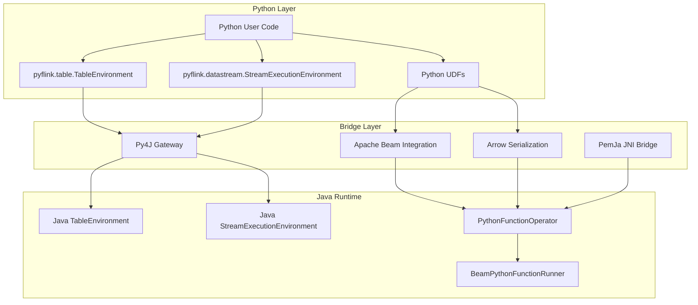
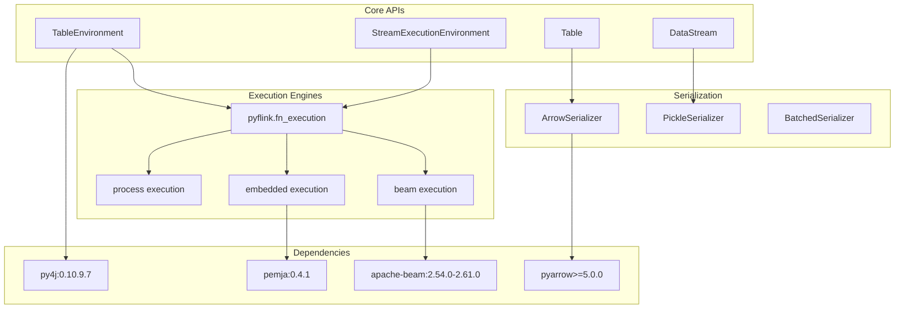
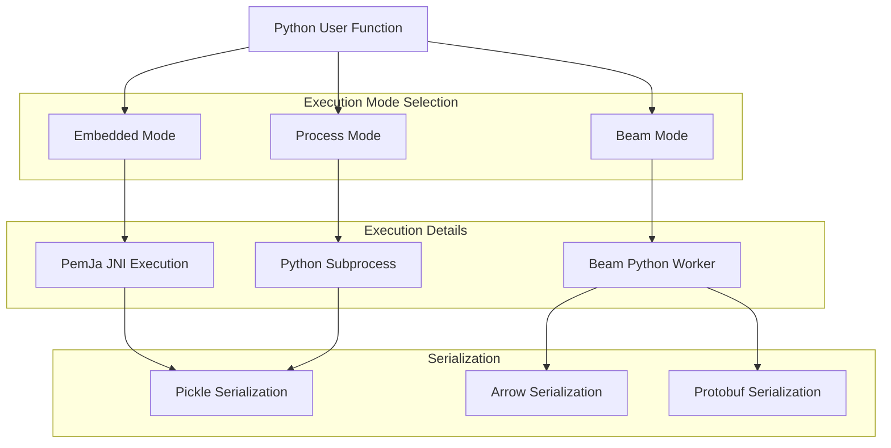

# Python API (PyFlink)

Relevant source files

The following files were used as context for generating this wiki page:

- [docs/content.zh/docs/dev/datastream/testing.md](docs/content.zh/docs/dev/datastream/testing.md)
- [docs/content.zh/docs/dev/python/datastream/data_types.md](docs/content.zh/docs/dev/python/datastream/data_types.md)
- [docs/content.zh/docs/dev/python/datastream/intro_to_datastream_api.md](docs/content.zh/docs/dev/python/datastream/intro_to_datastream_api.md)
- [docs/content.zh/docs/dev/python/datastream_tutorial.md](docs/content.zh/docs/dev/python/datastream_tutorial.md)
- [docs/content.zh/docs/dev/python/dependency_management.md](docs/content.zh/docs/dev/python/dependency_management.md)
- [docs/content.zh/docs/dev/python/installation.md](docs/content.zh/docs/dev/python/installation.md)
- [docs/content.zh/docs/dev/python/python_execution_mode.md](docs/content.zh/docs/dev/python/python_execution_mode.md)
- [docs/content.zh/docs/dev/python/table/intro_to_table_api.md](docs/content.zh/docs/dev/python/table/intro_to_table_api.md)
- [docs/content.zh/docs/dev/python/table/operations/row_based_operations.md](docs/content.zh/docs/dev/python/table/operations/row_based_operations.md)
- [docs/content.zh/docs/dev/python/table/python_table_api_connectors.md](docs/content.zh/docs/dev/python/table/python_table_api_connectors.md)
- [docs/content.zh/docs/dev/python/table/table_environment.md](docs/content.zh/docs/dev/python/table/table_environment.md)
- [docs/content.zh/docs/dev/python/table/udfs/overview.md](docs/content.zh/docs/dev/python/table/udfs/overview.md)
- [docs/content.zh/docs/dev/python/table/udfs/python_udfs.md](docs/content.zh/docs/dev/python/table/udfs/python_udfs.md)
- [docs/content.zh/docs/dev/python/table/udfs/vectorized_python_udfs.md](docs/content.zh/docs/dev/python/table/udfs/vectorized_python_udfs.md)
- [docs/content.zh/docs/dev/python/table_api_tutorial.md](docs/content.zh/docs/dev/python/table_api_tutorial.md)
- [docs/content.zh/docs/dev/table/common.md](docs/content.zh/docs/dev/table/common.md)
- [docs/content.zh/docs/dev/table/data_stream_api.md](docs/content.zh/docs/dev/table/data_stream_api.md)
- [docs/content.zh/docs/dev/table/modules.md](docs/content.zh/docs/dev/table/modules.md)
- [docs/content.zh/docs/dev/table/tableApi.md](docs/content.zh/docs/dev/table/tableApi.md)
- [docs/content.zh/docs/flinkDev/building.md](docs/content.zh/docs/flinkDev/building.md)
- [docs/content.zh/docs/try-flink/local_installation.md](docs/content.zh/docs/try-flink/local_installation.md)
- [docs/content/docs/dev/datastream/testing.md](docs/content/docs/dev/datastream/testing.md)
- [docs/content/docs/dev/python/datastream/data_types.md](docs/content/docs/dev/python/datastream/data_types.md)
- [docs/content/docs/dev/python/datastream/intro_to_datastream_api.md](docs/content/docs/dev/python/datastream/intro_to_datastream_api.md)
- [docs/content/docs/dev/python/datastream_tutorial.md](docs/content/docs/dev/python/datastream_tutorial.md)
- [docs/content/docs/dev/python/dependency_management.md](docs/content/docs/dev/python/dependency_management.md)
- [docs/content/docs/dev/python/installation.md](docs/content/docs/dev/python/installation.md)
- [docs/content/docs/dev/python/python_execution_mode.md](docs/content/docs/dev/python/python_execution_mode.md)
- [docs/content/docs/dev/python/table/intro_to_table_api.md](docs/content/docs/dev/python/table/intro_to_table_api.md)
- [docs/content/docs/dev/python/table/operations/row_based_operations.md](docs/content/docs/dev/python/table/operations/row_based_operations.md)
- [docs/content/docs/dev/python/table/python_table_api_connectors.md](docs/content/docs/dev/python/table/python_table_api_connectors.md)
- [docs/content/docs/dev/python/table/table_environment.md](docs/content/docs/dev/python/table/table_environment.md)
- [docs/content/docs/dev/python/table/udfs/overview.md](docs/content/docs/dev/python/table/udfs/overview.md)
- [docs/content/docs/dev/python/table/udfs/python_udfs.md](docs/content/docs/dev/python/table/udfs/python_udfs.md)
- [docs/content/docs/dev/python/table/udfs/vectorized_python_udfs.md](docs/content/docs/dev/python/table/udfs/vectorized_python_udfs.md)
- [docs/content/docs/dev/python/table_api_tutorial.md](docs/content/docs/dev/python/table_api_tutorial.md)
- [docs/content/docs/dev/table/common.md](docs/content/docs/dev/table/common.md)
- [docs/content/docs/dev/table/data_stream_api.md](docs/content/docs/dev/table/data_stream_api.md)
- [docs/content/docs/dev/table/modules.md](docs/content/docs/dev/table/modules.md)
- [docs/content/docs/dev/table/tableApi.md](docs/content/docs/dev/table/tableApi.md)
- [docs/content/docs/flinkDev/building.md](docs/content/docs/flinkDev/building.md)
- [docs/content/docs/try-flink/local_installation.md](docs/content/docs/try-flink/local_installation.md)
- [docs/layouts/shortcodes/artifact.html](docs/layouts/shortcodes/artifact.html)
- [docs/layouts/shortcodes/query_state_warning_zh.html](docs/layouts/shortcodes/query_state_warning_zh.html)
- [docs/static/fig/pyflink_embedded_execution_mode.png](docs/static/fig/pyflink_embedded_execution_mode.png)
- [docs/static/fig/pyflink_process_execution_mode.png](docs/static/fig/pyflink_process_execution_mode.png)
- [flink-dist/src/main/resources/META-INF/NOTICE](flink-dist/src/main/resources/META-INF/NOTICE)
- [flink-filesystems/flink-azure-fs-hadoop/src/main/resources/META-INF/NOTICE](flink-filesystems/flink-azure-fs-hadoop/src/main/resources/META-INF/NOTICE)
- [flink-filesystems/flink-fs-hadoop-shaded/src/main/resources/META-INF/NOTICE](flink-filesystems/flink-fs-hadoop-shaded/src/main/resources/META-INF/NOTICE)
- [flink-filesystems/flink-gs-fs-hadoop/src/main/resources/META-INF/NOTICE](flink-filesystems/flink-gs-fs-hadoop/src/main/resources/META-INF/NOTICE)
- [flink-filesystems/flink-s3-fs-hadoop/src/main/resources/META-INF/NOTICE](flink-filesystems/flink-s3-fs-hadoop/src/main/resources/META-INF/NOTICE)
- [flink-filesystems/flink-s3-fs-presto/src/main/resources/META-INF/NOTICE](flink-filesystems/flink-s3-fs-presto/src/main/resources/META-INF/NOTICE)
- [flink-formats/flink-sql-avro-confluent-registry/src/main/resources/META-INF/NOTICE](flink-formats/flink-sql-avro-confluent-registry/src/main/resources/META-INF/NOTICE)
- [flink-formats/flink-sql-avro/src/main/resources/META-INF/NOTICE](flink-formats/flink-sql-avro/src/main/resources/META-INF/NOTICE)
- [flink-kubernetes/pom.xml](flink-kubernetes/pom.xml)
- [flink-kubernetes/src/main/resources/META-INF/NOTICE](flink-kubernetes/src/main/resources/META-INF/NOTICE)
- [flink-python/README.md](flink-python/README.md)
- [flink-python/apache-flink-libraries/setup.py](flink-python/apache-flink-libraries/setup.py)
- [flink-python/dev/build-wheels.sh](flink-python/dev/build-wheels.sh)
- [flink-python/dev/dev-requirements.txt](flink-python/dev/dev-requirements.txt)
- [flink-python/dev/lint-python.sh](flink-python/dev/lint-python.sh)
- [flink-python/docs/reference/pyflink.table/table_environment.rst](flink-python/docs/reference/pyflink.table/table_environment.rst)
- [flink-python/pom.xml](flink-python/pom.xml)
- [flink-python/pyflink/datastream/stream_execution_environment.py](flink-python/pyflink/datastream/stream_execution_environment.py)
- [flink-python/pyflink/datastream/tests/test_stream_execution_environment.py](flink-python/pyflink/datastream/tests/test_stream_execution_environment.py)
- [flink-python/pyflink/fn_execution/formats/avro.py](flink-python/pyflink/fn_execution/formats/avro.py)
- [flink-python/pyflink/fn_execution/metrics/tests/test_metric.py](flink-python/pyflink/fn_execution/metrics/tests/test_metric.py)
- [flink-python/pyflink/gen_protos.py](flink-python/pyflink/gen_protos.py)
- [flink-python/pyflink/table/table_environment.py](flink-python/pyflink/table/table_environment.py)
- [flink-python/pyflink/table/tests/test_dependency.py](flink-python/pyflink/table/tests/test_dependency.py)
- [flink-python/pyflink/table/tests/test_environment_settings.py](flink-python/pyflink/table/tests/test_environment_settings.py)
- [flink-python/pyflink/table/tests/test_table_environment_api.py](flink-python/pyflink/table/tests/test_table_environment_api.py)
- [flink-python/pyflink/table/utils.py](flink-python/pyflink/table/utils.py)
- [flink-python/pyflink/testing/test_case_utils.py](flink-python/pyflink/testing/test_case_utils.py)
- [flink-python/pyproject.toml](flink-python/pyproject.toml)
- [flink-python/setup.py](flink-python/setup.py)
- [flink-python/src/main/java/org/apache/flink/python/env/embedded/EmbeddedPythonEnvironmentManager.java](flink-python/src/main/java/org/apache/flink/python/env/embedded/EmbeddedPythonEnvironmentManager.java)
- [flink-python/src/main/java/org/apache/flink/python/util/PythonEnvironmentManagerUtils.java](flink-python/src/main/java/org/apache/flink/python/util/PythonEnvironmentManagerUtils.java)
- [flink-python/src/main/resources/META-INF/NOTICE](flink-python/src/main/resources/META-INF/NOTICE)
- [flink-python/tox.ini](flink-python/tox.ini)
- [flink-state-backends/flink-statebackend-forst/pom.xml](flink-state-backends/flink-statebackend-forst/pom.xml)
- [flink-state-backends/flink-statebackend-forst/src/test/resources/log4j2-test.properties](flink-state-backends/flink-statebackend-forst/src/test/resources/log4j2-test.properties)
- [flink-state-backends/pom.xml](flink-state-backends/pom.xml)
- [flink-table/flink-table-api-java/src/main/java/org/apache/flink/table/api/FormatDescriptor.java](flink-table/flink-table-api-java/src/main/java/org/apache/flink/table/api/FormatDescriptor.java)
- [flink-table/flink-table-api-java/src/main/java/org/apache/flink/table/api/TableDescriptor.java](flink-table/flink-table-api-java/src/main/java/org/apache/flink/table/api/TableDescriptor.java)
- [flink-table/flink-table-api-java/src/test/java/org/apache/flink/table/api/TableDescriptorTest.java](flink-table/flink-table-api-java/src/test/java/org/apache/flink/table/api/TableDescriptorTest.java)
- [flink-table/flink-table-planner/src/test/java/org/apache/flink/table/planner/factories/TableFactoryHarness.java](flink-table/flink-table-planner/src/test/java/org/apache/flink/table/planner/factories/TableFactoryHarness.java)
- [pom.xml](pom.xml)
- [tools/azure-pipelines/build-python-wheels.yml](tools/azure-pipelines/build-python-wheels.yml)
- [tools/releasing/create_binary_release.sh](tools/releasing/create_binary_release.sh)

PyFlink provides a Python API for Apache Flink, enabling Python developers to write both Table API and DataStream API programs. It bridges Python user code with Flink's Java runtime through multiple execution modes and serialization mechanisms. For information about the underlying Table API concepts, see [Table API & SQL](#3.1). For DataStream API fundamentals, see [DataStream API](#3.2).

## Architecture Overview

PyFlink operates as a bridge between Python user code and Flink's Java runtime, supporting both Table API and DataStream API programming models.

### Python-Java Integration Architecture

Sources: [flink-python/pom.xml:49-167](), [flink-python/pyflink/table/table_environment.py:94-103](), [flink-python/pyflink/datastream/stream_execution_environment.py:48-62]()

### PyFlink Module Structure

Sources: [flink-python/setup.py:279-304](), [flink-python/setup.py:319-330](), [flink-python/pom.xml:150-167]()

## Table Environment Integration

The `TableEnvironment` serves as the primary entry point for PyFlink's Table API, providing Python bindings to Flink's Java Table API implementation.

### TableEnvironment Creation and Configuration

The Python `TableEnvironment` wraps the Java `TableEnvironment` through Py4J, automatically configuring Python-specific settings for local execution environments.

Key initialization steps include:
- Setting `python.executable` configuration for local deployments
- Configuring operator chaining optimization  
- Establishing the Py4J gateway connection

Sources: [flink-python/pyflink/table/table_environment.py:94-103](), [flink-python/pyflink/table/table_environment.py:97-102]()

### Function Registration and UDF Support

PyFlink supports registering Python user-defined functions through the `create_temporary_function` and `create_temporary_system_function` methods. These functions are automatically wrapped and integrated with Flink's function execution framework.

The system supports:
- Scalar functions via `UserDefinedFunctionWrapper`
- Aggregate functions via `AggregateFunction` 
- Table aggregate functions via `TableAggregateFunction`

Sources: [flink-python/pyflink/table/table_environment.py:228-268](), [flink-python/pyflink/table/table_environment.py:365-406]()

## DataStream Environment Integration

The `StreamExecutionEnvironment` provides Python access to Flink's DataStream API, enabling low-level stream processing operations.

### Environment Configuration

The Python `StreamExecutionEnvironment` automatically configures Python worker execution settings and provides methods to control job execution parameters such as parallelism, checkpointing, and buffer timeouts.

Key configuration capabilities:
- Parallelism and resource management via `set_parallelism()`, `set_max_parallelism()`
- Checkpointing configuration via `enable_checkpointing()`, `get_checkpoint_config()`
- Runtime execution mode via `set_runtime_mode()`

Sources: [flink-python/pyflink/datastream/stream_execution_environment.py:72-89](), [flink-python/pyflink/datastream/stream_execution_environment.py:232-257]()

### Data Source and Sink Integration

PyFlink supports various data sources and sinks through the DataStream API, including:
- Collection-based sources via `from_collection()`
- Socket-based sources via `socket_text_stream()`
- File-based sources via `read_text_file()`
- Custom sources via `add_source()`

Sources: [flink-python/pyflink/datastream/stream_execution_environment.py:310-404]()

## Python Function Execution Framework

PyFlink executes Python user code through multiple execution modes, each optimized for different use cases and performance characteristics.

### Execution Modes

Sources: [flink-python/pom.xml:132-138](), [flink-python/setup.py:286-299]()

### Performance Optimizations

PyFlink includes several performance optimizations:

- **Cython Extensions**: Optional compiled extensions for faster serialization and execution
- **Arrow Integration**: Columnar data exchange for Table API operations
- **Batched Processing**: Reduces serialization overhead through batching

The Cython extensions are conditionally compiled based on platform support and Cython availability.

Sources: [flink-python/setup.py:102-171](), [flink-python/setup.py:38-46]()

## Dependency Management and Packaging

### Maven Build Integration

The PyFlink module integrates with Flink's Maven build system, automatically packaging Python code and generating necessary JAR artifacts for distribution.

Key build artifacts:
- `pyflink.zip` containing all Python source code
- Shaded JAR with Python dependencies (py4j, beam, arrow, etc.)
- Test artifacts for integration testing

Sources: [flink-python/pom.xml:424-526](), [flink-python/pom.xml:652-774]()

### Python Package Dependencies

PyFlink requires a specific set of Python packages with version constraints to ensure compatibility:

| Package | Version Constraint | Purpose |
|---------|-------------------|---------|
| `py4j` | `==0.10.9.7` | Java-Python bridge |
| `apache-beam` | `>=2.54.0,<=2.61.0` | Python function execution |
| `pyarrow` | `>=5.0.0` | Columnar data serialization |
| `pemja` | `==0.4.1` | JNI-based Python execution |

Sources: [flink-python/setup.py:319-330](), [flink-python/dev/dev-requirements.txt:15-36]()

### Distribution and Installation

PyFlink supports multiple installation methods:
- Source distribution through `setup.py`
- Wheel distribution for different Python versions (3.8-3.11)
- Integration with Flink binary distributions

The package automatically detects whether it's being built within the Flink source tree and adjusts the build process accordingly.

Sources: [flink-python/setup.py:203-266](), [flink-python/pyproject.toml:29-36]()

## Testing Infrastructure

PyFlink includes comprehensive testing infrastructure covering unit tests, integration tests, and end-to-end testing scenarios.

### Test Execution Framework

The testing framework uses:
- **tox** for multi-version Python testing
- **pytest** for test discovery and execution  
- Custom test utilities for Flink-specific testing scenarios

Sources: [flink-python/tox.ini:19-37](), [flink-python/dev/lint-python.sh:256-278]()

### CI/CD Integration

PyFlink testing integrates with Flink's CI/CD pipeline through:
- GitHub Actions for automated testing
- Maven lifecycle integration for Java-Python coordination
- Artifact dependency management for test execution

Sources: [pom.xml:1026-1048](), [flink-python/pom.xml:529-632]()
