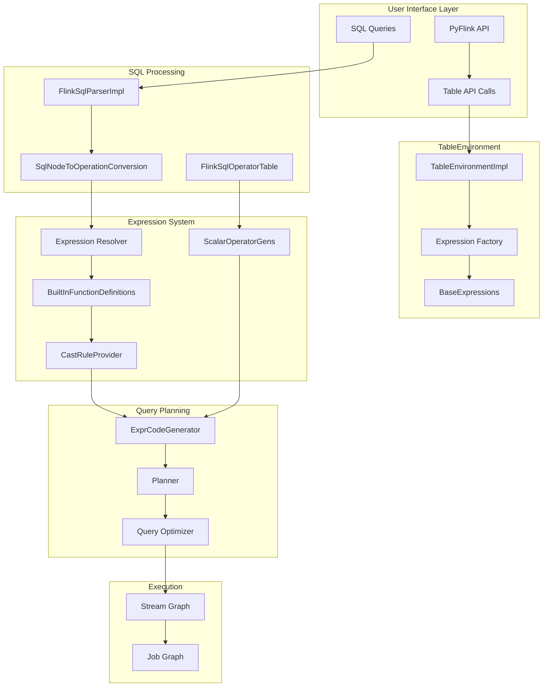
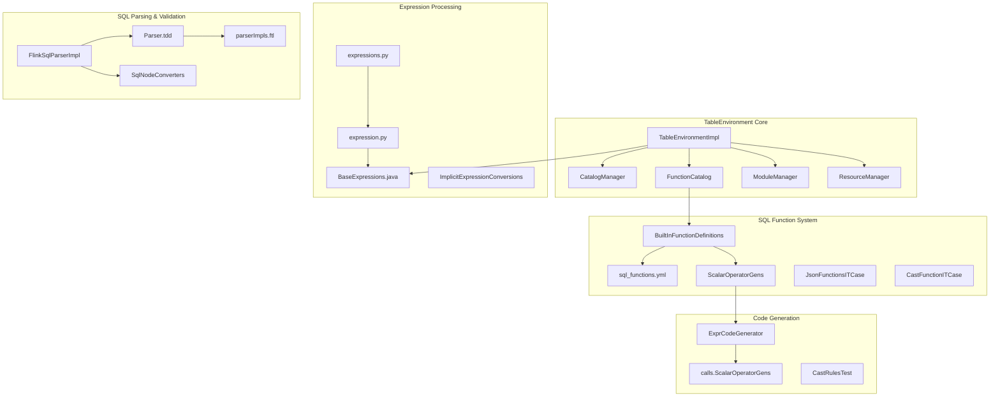
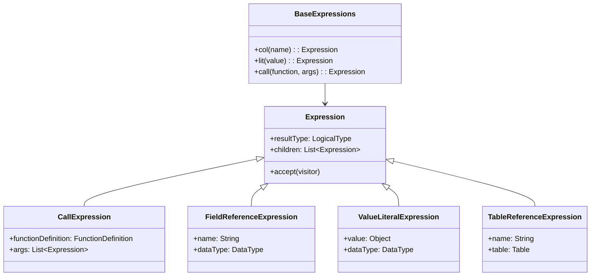

# Table API & SQL

Relevant source files

The following files were used as context for generating this wiki page:

- [docs/content.zh/docs/dev/table/sql/show.md](docs/content.zh/docs/dev/table/sql/show.md)
- [docs/content/docs/dev/table/sql/show.md](docs/content/docs/dev/table/sql/show.md)
- [docs/data/sql_functions.yml](docs/data/sql_functions.yml)
- [docs/data/sql_functions_zh.yml](docs/data/sql_functions_zh.yml)
- [flink-python/docs/reference/pyflink.table/expressions.rst](flink-python/docs/reference/pyflink.table/expressions.rst)
- [flink-python/pyflink/table/expression.py](flink-python/pyflink/table/expression.py)
- [flink-python/pyflink/table/expressions.py](flink-python/pyflink/table/expressions.py)
- [flink-python/pyflink/table/tests/test_environment_completeness.py](flink-python/pyflink/table/tests/test_environment_completeness.py)
- [flink-python/pyflink/table/tests/test_expression.py](flink-python/pyflink/table/tests/test_expression.py)
- [flink-table/flink-sql-client/src/test/resources/sql/catalog_database.q](flink-table/flink-sql-client/src/test/resources/sql/catalog_database.q)
- [flink-table/flink-sql-gateway/src/test/resources/sql/catalog_database.q](flink-table/flink-sql-gateway/src/test/resources/sql/catalog_database.q)
- [flink-table/flink-sql-parser/src/main/codegen/data/Parser.tdd](flink-table/flink-sql-parser/src/main/codegen/data/Parser.tdd)
- [flink-table/flink-sql-parser/src/main/codegen/includes/parserImpls.ftl](flink-table/flink-sql-parser/src/main/codegen/includes/parserImpls.ftl)
- [flink-table/flink-sql-parser/src/main/java/org/apache/flink/sql/parser/ddl/SqlAlterTableAdd.java](flink-table/flink-sql-parser/src/main/java/org/apache/flink/sql/parser/ddl/SqlAlterTableAdd.java)
- [flink-table/flink-sql-parser/src/main/java/org/apache/flink/sql/parser/ddl/SqlAlterTableDropDistribution.java](flink-table/flink-sql-parser/src/main/java/org/apache/flink/sql/parser/ddl/SqlAlterTableDropDistribution.java)
- [flink-table/flink-sql-parser/src/main/java/org/apache/flink/sql/parser/ddl/SqlAlterTableModify.java](flink-table/flink-sql-parser/src/main/java/org/apache/flink/sql/parser/ddl/SqlAlterTableModify.java)
- [flink-table/flink-sql-parser/src/main/java/org/apache/flink/sql/parser/ddl/SqlAlterTableSchema.java](flink-table/flink-sql-parser/src/main/java/org/apache/flink/sql/parser/ddl/SqlAlterTableSchema.java)
- [flink-table/flink-sql-parser/src/main/java/org/apache/flink/sql/parser/ddl/SqlCreateTable.java](flink-table/flink-sql-parser/src/main/java/org/apache/flink/sql/parser/ddl/SqlCreateTable.java)
- [flink-table/flink-sql-parser/src/main/java/org/apache/flink/sql/parser/ddl/SqlCreateTableAs.java](flink-table/flink-sql-parser/src/main/java/org/apache/flink/sql/parser/ddl/SqlCreateTableAs.java)
- [flink-table/flink-sql-parser/src/main/java/org/apache/flink/sql/parser/ddl/SqlDistribution.java](flink-table/flink-sql-parser/src/main/java/org/apache/flink/sql/parser/ddl/SqlDistribution.java)
- [flink-table/flink-sql-parser/src/main/java/org/apache/flink/sql/parser/ddl/SqlReplaceTableAs.java](flink-table/flink-sql-parser/src/main/java/org/apache/flink/sql/parser/ddl/SqlReplaceTableAs.java)
- [flink-table/flink-sql-parser/src/test/java/org/apache/flink/sql/parser/FlinkSqlParserImplTest.java](flink-table/flink-sql-parser/src/test/java/org/apache/flink/sql/parser/FlinkSqlParserImplTest.java)
- [flink-table/flink-table-api-java/src/main/java/org/apache/flink/table/api/Expressions.java](flink-table/flink-table-api-java/src/main/java/org/apache/flink/table/api/Expressions.java)
- [flink-table/flink-table-api-java/src/main/java/org/apache/flink/table/api/TableEnvironment.java](flink-table/flink-table-api-java/src/main/java/org/apache/flink/table/api/TableEnvironment.java)
- [flink-table/flink-table-api-java/src/main/java/org/apache/flink/table/api/internal/BaseExpressions.java](flink-table/flink-table-api-java/src/main/java/org/apache/flink/table/api/internal/BaseExpressions.java)
- [flink-table/flink-table-api-java/src/main/java/org/apache/flink/table/api/internal/TableEnvironmentImpl.java](flink-table/flink-table-api-java/src/main/java/org/apache/flink/table/api/internal/TableEnvironmentImpl.java)
- [flink-table/flink-table-api-java/src/main/java/org/apache/flink/table/catalog/CatalogManager.java](flink-table/flink-table-api-java/src/main/java/org/apache/flink/table/catalog/CatalogManager.java)
- [flink-table/flink-table-api-java/src/main/java/org/apache/flink/table/operations/ddl/AlterTableChangeOperation.java](flink-table/flink-table-api-java/src/main/java/org/apache/flink/table/operations/ddl/AlterTableChangeOperation.java)
- [flink-table/flink-table-api-java/src/main/java/org/apache/flink/table/operations/materializedtable/AlterMaterializedTableAsQueryOperation.java](flink-table/flink-table-api-java/src/main/java/org/apache/flink/table/operations/materializedtable/AlterMaterializedTableAsQueryOperation.java)
- [flink-table/flink-table-api-java/src/main/java/org/apache/flink/table/operations/materializedtable/AlterMaterializedTableChangeOperation.java](flink-table/flink-table-api-java/src/main/java/org/apache/flink/table/operations/materializedtable/AlterMaterializedTableChangeOperation.java)
- [flink-table/flink-table-api-java/src/main/java/org/apache/flink/table/operations/materializedtable/AlterMaterializedTableOperation.java](flink-table/flink-table-api-java/src/main/java/org/apache/flink/table/operations/materializedtable/AlterMaterializedTableOperation.java)
- [flink-table/flink-table-api-java/src/test/java/org/apache/flink/table/api/TableEnvironmentTest.java](flink-table/flink-table-api-java/src/test/java/org/apache/flink/table/api/TableEnvironmentTest.java)
- [flink-table/flink-table-api-java/src/test/java/org/apache/flink/table/catalog/CatalogManagerTest.java](flink-table/flink-table-api-java/src/test/java/org/apache/flink/table/catalog/CatalogManagerTest.java)
- [flink-table/flink-table-api-java/src/test/java/org/apache/flink/table/utils/CatalogManagerMocks.java](flink-table/flink-table-api-java/src/test/java/org/apache/flink/table/utils/CatalogManagerMocks.java)
- [flink-table/flink-table-api-java/src/test/java/org/apache/flink/table/utils/ParserMock.java](flink-table/flink-table-api-java/src/test/java/org/apache/flink/table/utils/ParserMock.java)
- [flink-table/flink-table-api-scala/src/main/scala/org/apache/flink/table/api/ImplicitExpressionConversions.scala](flink-table/flink-table-api-scala/src/main/scala/org/apache/flink/table/api/ImplicitExpressionConversions.scala)
- [flink-table/flink-table-common/src/main/java/org/apache/flink/table/catalog/CatalogDescriptor.java](flink-table/flink-table-common/src/main/java/org/apache/flink/table/catalog/CatalogDescriptor.java)
- [flink-table/flink-table-common/src/main/java/org/apache/flink/table/catalog/TableChange.java](flink-table/flink-table-common/src/main/java/org/apache/flink/table/catalog/TableChange.java)
- [flink-table/flink-table-common/src/main/java/org/apache/flink/table/functions/BuiltInFunctionDefinitions.java](flink-table/flink-table-common/src/main/java/org/apache/flink/table/functions/BuiltInFunctionDefinitions.java)
- [flink-table/flink-table-common/src/main/java/org/apache/flink/table/types/inference/InputTypeStrategies.java](flink-table/flink-table-common/src/main/java/org/apache/flink/table/types/inference/InputTypeStrategies.java)
- [flink-table/flink-table-common/src/main/java/org/apache/flink/table/types/inference/strategies/ArrayElementArgumentTypeStrategy.java](flink-table/flink-table-common/src/main/java/org/apache/flink/table/types/inference/strategies/ArrayElementArgumentTypeStrategy.java)
- [flink-table/flink-table-common/src/main/java/org/apache/flink/table/types/inference/strategies/IndexArgumentTypeStrategy.java](flink-table/flink-table-common/src/main/java/org/apache/flink/table/types/inference/strategies/IndexArgumentTypeStrategy.java)
- [flink-table/flink-table-common/src/main/java/org/apache/flink/table/types/inference/strategies/PercentageArgumentTypeStrategy.java](flink-table/flink-table-common/src/main/java/org/apache/flink/table/types/inference/strategies/PercentageArgumentTypeStrategy.java)
- [flink-table/flink-table-common/src/main/java/org/apache/flink/table/types/inference/strategies/PercentageArrayArgumentTypeStrategy.java](flink-table/flink-table-common/src/main/java/org/apache/flink/table/types/inference/strategies/PercentageArrayArgumentTypeStrategy.java)
- [flink-table/flink-table-common/src/main/java/org/apache/flink/table/types/inference/strategies/RowtimeTypeStrategy.java](flink-table/flink-table-common/src/main/java/org/apache/flink/table/types/inference/strategies/RowtimeTypeStrategy.java)
- [flink-table/flink-table-common/src/main/java/org/apache/flink/table/types/inference/strategies/SpecificInputTypeStrategies.java](flink-table/flink-table-common/src/main/java/org/apache/flink/table/types/inference/strategies/SpecificInputTypeStrategies.java)
- [flink-table/flink-table-common/src/main/java/org/apache/flink/table/types/inference/strategies/SpecificTypeStrategies.java](flink-table/flink-table-common/src/main/java/org/apache/flink/table/types/inference/strategies/SpecificTypeStrategies.java)
- [flink-table/flink-table-common/src/main/java/org/apache/flink/table/types/inference/strategies/WindowTimeIndictorInputTypeStrategy.java](flink-table/flink-table-common/src/main/java/org/apache/flink/table/types/inference/strategies/WindowTimeIndictorInputTypeStrategy.java)
- [flink-table/flink-table-common/src/test/java/org/apache/flink/table/types/inference/InputTypeStrategiesTest.java](flink-table/flink-table-common/src/test/java/org/apache/flink/table/types/inference/InputTypeStrategiesTest.java)
- [flink-table/flink-table-common/src/test/java/org/apache/flink/table/types/inference/strategies/RowtimeTypeStrategyTest.java](flink-table/flink-table-common/src/test/java/org/apache/flink/table/types/inference/strategies/RowtimeTypeStrategyTest.java)
- [flink-table/flink-table-planner/src/main/java/org/apache/flink/table/planner/catalog/QueryOperationCatalogViewTable.java](flink-table/flink-table-planner/src/main/java/org/apache/flink/table/planner/catalog/QueryOperationCatalogViewTable.java)
- [flink-table/flink-table-planner/src/main/java/org/apache/flink/table/planner/expressions/ColumnReferenceFinder.java](flink-table/flink-table-planner/src/main/java/org/apache/flink/table/planner/expressions/ColumnReferenceFinder.java)
- [flink-table/flink-table-planner/src/main/java/org/apache/flink/table/planner/expressions/converter/DirectConvertRule.java](flink-table/flink-table-planner/src/main/java/org/apache/flink/table/planner/expressions/converter/DirectConvertRule.java)
- [flink-table/flink-table-planner/src/main/java/org/apache/flink/table/planner/expressions/converter/converters/JsonConverterUtil.java](flink-table/flink-table-planner/src/main/java/org/apache/flink/table/planner/expressions/converter/converters/JsonConverterUtil.java)
- [flink-table/flink-table-planner/src/main/java/org/apache/flink/table/planner/expressions/converter/converters/JsonExistsConverter.java](flink-table/flink-table-planner/src/main/java/org/apache/flink/table/planner/expressions/converter/converters/JsonExistsConverter.java)
- [flink-table/flink-table-planner/src/main/java/org/apache/flink/table/planner/expressions/converter/converters/JsonQueryConverter.java](flink-table/flink-table-planner/src/main/java/org/apache/flink/table/planner/expressions/converter/converters/JsonQueryConverter.java)
- [flink-table/flink-table-planner/src/main/java/org/apache/flink/table/planner/functions/InternalFunctionDefinitions.java](flink-table/flink-table-planner/src/main/java/org/apache/flink/table/planner/functions/InternalFunctionDefinitions.java)
- [flink-table/flink-table-planner/src/main/java/org/apache/flink/table/planner/functions/casting/AbstractCastRule.java](flink-table/flink-table-planner/src/main/java/org/apache/flink/table/planner/functions/casting/AbstractCastRule.java)
- [flink-table/flink-table-planner/src/main/java/org/apache/flink/table/planner/functions/casting/AbstractCodeGeneratorCastRule.java](flink-table/flink-table-planner/src/main/java/org/apache/flink/table/planner/functions/casting/AbstractCodeGeneratorCastRule.java)
- [flink-table/flink-table-planner/src/main/java/org/apache/flink/table/planner/functions/casting/AbstractExpressionCodeGeneratorCastRule.java](flink-table/flink-table-planner/src/main/java/org/apache/flink/table/planner/functions/casting/AbstractExpressionCodeGeneratorCastRule.java)
- [flink-table/flink-table-planner/src/main/java/org/apache/flink/table/planner/functions/casting/ArrayToArrayCastRule.java](flink-table/flink-table-planner/src/main/java/org/apache/flink/table/planner/functions/casting/ArrayToArrayCastRule.java)
- [flink-table/flink-table-planner/src/main/java/org/apache/flink/table/planner/functions/casting/ArrayToStringCastRule.java](flink-table/flink-table-planner/src/main/java/org/apache/flink/table/planner/functions/casting/ArrayToStringCastRule.java)
- [flink-table/flink-table-planner/src/main/java/org/apache/flink/table/planner/functions/casting/BinaryToBinaryCastRule.java](flink-table/flink-table-planner/src/main/java/org/apache/flink/table/planner/functions/casting/BinaryToBinaryCastRule.java)
- [flink-table/flink-table-planner/src/main/java/org/apache/flink/table/planner/functions/casting/BinaryToStringCastRule.java](flink-table/flink-table-planner/src/main/java/org/apache/flink/table/planner/functions/casting/BinaryToStringCastRule.java)
- [flink-table/flink-table-planner/src/main/java/org/apache/flink/table/planner/functions/casting/CastRule.java](flink-table/flink-table-planner/src/main/java/org/apache/flink/table/planner/functions/casting/CastRule.java)
- [flink-table/flink-table-planner/src/main/java/org/apache/flink/table/planner/functions/casting/CastRuleProvider.java](flink-table/flink-table-planner/src/main/java/org/apache/flink/table/planner/functions/casting/CastRuleProvider.java)
- [flink-table/flink-table-planner/src/main/java/org/apache/flink/table/planner/functions/casting/CastRuleUtils.java](flink-table/flink-table-planner/src/main/java/org/apache/flink/table/planner/functions/casting/CastRuleUtils.java)
- [flink-table/flink-table-planner/src/main/java/org/apache/flink/table/planner/functions/casting/CharVarCharTrimPadCastRule.java](flink-table/flink-table-planner/src/main/java/org/apache/flink/table/planner/functions/casting/CharVarCharTrimPadCastRule.java)
- [flink-table/flink-table-planner/src/main/java/org/apache/flink/table/planner/functions/casting/CodeGeneratedExpressionCastExecutor.java](flink-table/flink-table-planner/src/main/java/org/apache/flink/table/planner/functions/casting/CodeGeneratedExpressionCastExecutor.java)
- [flink-table/flink-table-planner/src/main/java/org/apache/flink/table/planner/functions/casting/CodeGeneratorCastRule.java](flink-table/flink-table-planner/src/main/java/org/apache/flink/table/planner/functions/casting/CodeGeneratorCastRule.java)
- [flink-table/flink-table-planner/src/main/java/org/apache/flink/table/planner/functions/casting/MapAndMultisetToStringCastRule.java](flink-table/flink-table-planner/src/main/java/org/apache/flink/table/planner/functions/casting/MapAndMultisetToStringCastRule.java)
- [flink-table/flink-table-planner/src/main/java/org/apache/flink/table/planner/functions/casting/MapToMapAndMultisetToMultisetCastRule.java](flink-table/flink-table-planner/src/main/java/org/apache/flink/table/planner/functions/casting/MapToMapAndMultisetToMultisetCastRule.java)
- [flink-table/flink-table-planner/src/main/java/org/apache/flink/table/planner/functions/casting/RawToBinaryCastRule.java](flink-table/flink-table-planner/src/main/java/org/apache/flink/table/planner/functions/casting/RawToBinaryCastRule.java)
- [flink-table/flink-table-planner/src/main/java/org/apache/flink/table/planner/functions/casting/RawToStringCastRule.java](flink-table/flink-table-planner/src/main/java/org/apache/flink/table/planner/functions/casting/RawToStringCastRule.java)
- [flink-table/flink-table-planner/src/main/java/org/apache/flink/table/planner/functions/casting/RowDataToStringConverterImpl.java](flink-table/flink-table-planner/src/main/java/org/apache/flink/table/planner/functions/casting/RowDataToStringConverterImpl.java)
- [flink-table/flink-table-planner/src/main/java/org/apache/flink/table/planner/functions/casting/RowToRowCastRule.java](flink-table/flink-table-planner/src/main/java/org/apache/flink/table/planner/functions/casting/RowToRowCastRule.java)
- [flink-table/flink-table-planner/src/main/java/org/apache/flink/table/planner/functions/casting/RowToStringCastRule.java](flink-table/flink-table-planner/src/main/java/org/apache/flink/table/planner/functions/casting/RowToStringCastRule.java)
- [flink-table/flink-table-planner/src/main/java/org/apache/flink/table/planner/functions/casting/StringToBinaryCastRule.java](flink-table/flink-table-planner/src/main/java/org/apache/flink/table/planner/functions/casting/StringToBinaryCastRule.java)
- [flink-table/flink-table-planner/src/main/java/org/apache/flink/table/planner/functions/sql/FlinkSqlOperatorTable.java](flink-table/flink-table-planner/src/main/java/org/apache/flink/table/planner/functions/sql/FlinkSqlOperatorTable.java)
- [flink-table/flink-table-planner/src/main/java/org/apache/flink/table/planner/functions/sql/SqlTryCastFunction.java](flink-table/flink-table-planner/src/main/java/org/apache/flink/table/planner/functions/sql/SqlTryCastFunction.java)
- [flink-table/flink-table-planner/src/main/java/org/apache/flink/table/planner/operations/AlterSchemaConverter.java](flink-table/flink-table-planner/src/main/java/org/apache/flink/table/planner/operations/AlterSchemaConverter.java)
- [flink-table/flink-table-planner/src/main/java/org/apache/flink/table/planner/operations/MergeTableAsUtil.java](flink-table/flink-table-planner/src/main/java/org/apache/flink/table/planner/operations/MergeTableAsUtil.java)
- [flink-table/flink-table-planner/src/main/java/org/apache/flink/table/planner/operations/MergeTableLikeUtil.java](flink-table/flink-table-planner/src/main/java/org/apache/flink/table/planner/operations/MergeTableLikeUtil.java)
- [flink-table/flink-table-planner/src/main/java/org/apache/flink/table/planner/operations/SchemaBuilderUtil.java](flink-table/flink-table-planner/src/main/java/org/apache/flink/table/planner/operations/SchemaBuilderUtil.java)
- [flink-table/flink-table-planner/src/main/java/org/apache/flink/table/planner/operations/SqlCreateTableConverter.java](flink-table/flink-table-planner/src/main/java/org/apache/flink/table/planner/operations/SqlCreateTableConverter.java)
- [flink-table/flink-table-planner/src/main/java/org/apache/flink/table/planner/operations/SqlNodeToOperationConversion.java](flink-table/flink-table-planner/src/main/java/org/apache/flink/table/planner/operations/SqlNodeToOperationConversion.java)
- [flink-table/flink-table-planner/src/main/java/org/apache/flink/table/planner/operations/converters/SqlAlterMaterializedTableAsQueryConverter.java](flink-table/flink-table-planner/src/main/java/org/apache/flink/table/planner/operations/converters/SqlAlterMaterializedTableAsQueryConverter.java)
- [flink-table/flink-table-planner/src/main/java/org/apache/flink/table/planner/operations/converters/SqlNodeConverters.java](flink-table/flink-table-planner/src/main/java/org/apache/flink/table/planner/operations/converters/SqlNodeConverters.java)
- [flink-table/flink-table-planner/src/main/java/org/apache/flink/table/planner/operations/converters/SqlReplaceTableAsConverter.java](flink-table/flink-table-planner/src/main/java/org/apache/flink/table/planner/operations/converters/SqlReplaceTableAsConverter.java)
- [flink-table/flink-table-planner/src/main/java/org/apache/flink/table/planner/utils/OperationConverterUtils.java](flink-table/flink-table-planner/src/main/java/org/apache/flink/table/planner/utils/OperationConverterUtils.java)
- [flink-table/flink-table-planner/src/main/scala/org/apache/flink/table/planner/calcite/FlinkPlannerImpl.scala](flink-table/flink-table-planner/src/main/scala/org/apache/flink/table/planner/calcite/FlinkPlannerImpl.scala)
- [flink-table/flink-table-planner/src/main/scala/org/apache/flink/table/planner/codegen/ExprCodeGenerator.scala](flink-table/flink-table-planner/src/main/scala/org/apache/flink/table/planner/codegen/ExprCodeGenerator.scala)
- [flink-table/flink-table-planner/src/main/scala/org/apache/flink/table/planner/codegen/ExpressionReducer.scala](flink-table/flink-table-planner/src/main/scala/org/apache/flink/table/planner/codegen/ExpressionReducer.scala)
- [flink-table/flink-table-planner/src/main/scala/org/apache/flink/table/planner/codegen/JsonGenerateUtils.scala](flink-table/flink-table-planner/src/main/scala/org/apache/flink/table/planner/codegen/JsonGenerateUtils.scala)
- [flink-table/flink-table-planner/src/main/scala/org/apache/flink/table/planner/codegen/calls/BuiltInMethods.scala](flink-table/flink-table-planner/src/main/scala/org/apache/flink/table/planner/codegen/calls/BuiltInMethods.scala)
- [flink-table/flink-table-planner/src/main/scala/org/apache/flink/table/planner/codegen/calls/FunctionGenerator.scala](flink-table/flink-table-planner/src/main/scala/org/apache/flink/table/planner/codegen/calls/FunctionGenerator.scala)
- [flink-table/flink-table-planner/src/main/scala/org/apache/flink/table/planner/codegen/calls/JsonArrayCallGen.scala](flink-table/flink-table-planner/src/main/scala/org/apache/flink/table/planner/codegen/calls/JsonArrayCallGen.scala)
- [flink-table/flink-table-planner/src/main/scala/org/apache/flink/table/planner/codegen/calls/JsonObjectCallGen.scala](flink-table/flink-table-planner/src/main/scala/org/apache/flink/table/planner/codegen/calls/JsonObjectCallGen.scala)
- [flink-table/flink-table-planner/src/main/scala/org/apache/flink/table/planner/codegen/calls/JsonValueCallGen.scala](flink-table/flink-table-planner/src/main/scala/org/apache/flink/table/planner/codegen/calls/JsonValueCallGen.scala)
- [flink-table/flink-table-planner/src/main/scala/org/apache/flink/table/planner/codegen/calls/NotCallGen.scala](flink-table/flink-table-planner/src/main/scala/org/apache/flink/table/planner/codegen/calls/NotCallGen.scala)
- [flink-table/flink-table-planner/src/main/scala/org/apache/flink/table/planner/codegen/calls/ScalarOperatorGens.scala](flink-table/flink-table-planner/src/main/scala/org/apache/flink/table/planner/codegen/calls/ScalarOperatorGens.scala)
- [flink-table/flink-table-planner/src/test/java/org/apache/flink/table/planner/expressions/ColumnReferenceFinderTest.java](flink-table/flink-table-planner/src/test/java/org/apache/flink/table/planner/expressions/ColumnReferenceFinderTest.java)
- [flink-table/flink-table-planner/src/test/java/org/apache/flink/table/planner/functions/CastFunctionITCase.java](flink-table/flink-table-planner/src/test/java/org/apache/flink/table/planner/functions/CastFunctionITCase.java)
- [flink-table/flink-table-planner/src/test/java/org/apache/flink/table/planner/functions/CastFunctionMiscITCase.java](flink-table/flink-table-planner/src/test/java/org/apache/flink/table/planner/functions/CastFunctionMiscITCase.java)
- [flink-table/flink-table-planner/src/test/java/org/apache/flink/table/planner/functions/CollectionFunctionsITCase.java](flink-table/flink-table-planner/src/test/java/org/apache/flink/table/planner/functions/CollectionFunctionsITCase.java)
- [flink-table/flink-table-planner/src/test/java/org/apache/flink/table/planner/functions/JsonFunctionsITCase.java](flink-table/flink-table-planner/src/test/java/org/apache/flink/table/planner/functions/JsonFunctionsITCase.java)
- [flink-table/flink-table-planner/src/test/java/org/apache/flink/table/planner/functions/RegexpFunctionsITCase.java](flink-table/flink-table-planner/src/test/java/org/apache/flink/table/planner/functions/RegexpFunctionsITCase.java)
- [flink-table/flink-table-planner/src/test/java/org/apache/flink/table/planner/functions/StringFunctionsITCase.java](flink-table/flink-table-planner/src/test/java/org/apache/flink/table/planner/functions/StringFunctionsITCase.java)
- [flink-table/flink-table-planner/src/test/java/org/apache/flink/table/planner/functions/casting/CastRuleProviderTest.java](flink-table/flink-table-planner/src/test/java/org/apache/flink/table/planner/functions/casting/CastRuleProviderTest.java)
- [flink-table/flink-table-planner/src/test/java/org/apache/flink/table/planner/functions/casting/CastRulesTest.java](flink-table/flink-table-planner/src/test/java/org/apache/flink/table/planner/functions/casting/CastRulesTest.java)
- [flink-table/flink-table-planner/src/test/java/org/apache/flink/table/planner/operations/MergeTableLikeUtilTest.java](flink-table/flink-table-planner/src/test/java/org/apache/flink/table/planner/operations/MergeTableLikeUtilTest.java)
- [flink-table/flink-table-planner/src/test/java/org/apache/flink/table/planner/operations/SqlDdlToOperationConverterTest.java](flink-table/flink-table-planner/src/test/java/org/apache/flink/table/planner/operations/SqlDdlToOperationConverterTest.java)
- [flink-table/flink-table-planner/src/test/java/org/apache/flink/table/planner/operations/SqlOtherOperationConverterTest.java](flink-table/flink-table-planner/src/test/java/org/apache/flink/table/planner/operations/SqlOtherOperationConverterTest.java)
- [flink-table/flink-table-planner/src/test/java/org/apache/flink/table/planner/operations/SqlRTASNodeToOperationConverterTest.java](flink-table/flink-table-planner/src/test/java/org/apache/flink/table/planner/operations/SqlRTASNodeToOperationConverterTest.java)
- [flink-table/flink-table-planner/src/test/java/org/apache/flink/table/planner/runtime/batch/sql/RTASITCase.java](flink-table/flink-table-planner/src/test/java/org/apache/flink/table/planner/runtime/batch/sql/RTASITCase.java)
- [flink-table/flink-table-planner/src/test/java/org/apache/flink/table/planner/runtime/stream/sql/RTASITCase.java](flink-table/flink-table-planner/src/test/java/org/apache/flink/table/planner/runtime/stream/sql/RTASITCase.java)
- [flink-table/flink-table-planner/src/test/resources/json/json-value.json](flink-table/flink-table-planner/src/test/resources/json/json-value.json)
- [flink-table/flink-table-planner/src/test/scala/org/apache/flink/table/api/TableEnvironmentTest.scala](flink-table/flink-table-planner/src/test/scala/org/apache/flink/table/api/TableEnvironmentTest.scala)
- [flink-table/flink-table-planner/src/test/scala/org/apache/flink/table/planner/expressions/ScalarFunctionsTest.scala](flink-table/flink-table-planner/src/test/scala/org/apache/flink/table/planner/expressions/ScalarFunctionsTest.scala)
- [flink-table/flink-table-planner/src/test/scala/org/apache/flink/table/planner/expressions/ScalarOperatorsTest.scala](flink-table/flink-table-planner/src/test/scala/org/apache/flink/table/planner/expressions/ScalarOperatorsTest.scala)
- [flink-table/flink-table-planner/src/test/scala/org/apache/flink/table/planner/expressions/utils/ScalarOperatorsTestBase.scala](flink-table/flink-table-planner/src/test/scala/org/apache/flink/table/planner/expressions/utils/ScalarOperatorsTestBase.scala)
- [flink-table/flink-table-planner/src/test/scala/org/apache/flink/table/planner/expressions/validation/ScalarOperatorsValidationTest.scala](flink-table/flink-table-planner/src/test/scala/org/apache/flink/table/planner/expressions/validation/ScalarOperatorsValidationTest.scala)
- [flink-table/flink-table-planner/src/test/scala/org/apache/flink/table/planner/plan/stream/sql/UnionTest.scala](flink-table/flink-table-planner/src/test/scala/org/apache/flink/table/planner/plan/stream/sql/UnionTest.scala)
- [flink-table/flink-table-planner/src/test/scala/org/apache/flink/table/planner/runtime/batch/sql/MiscITCase.scala](flink-table/flink-table-planner/src/test/scala/org/apache/flink/table/planner/runtime/batch/sql/MiscITCase.scala)
- [flink-table/flink-table-runtime/src/main/java/org/apache/flink/table/runtime/functions/JsonPathCache.java](flink-table/flink-table-runtime/src/main/java/org/apache/flink/table/runtime/functions/JsonPathCache.java)
- [flink-table/flink-table-runtime/src/main/java/org/apache/flink/table/runtime/functions/SqlFunctionUtils.java](flink-table/flink-table-runtime/src/main/java/org/apache/flink/table/runtime/functions/SqlFunctionUtils.java)
- [flink-table/flink-table-runtime/src/main/java/org/apache/flink/table/runtime/functions/SqlJsonUtils.java](flink-table/flink-table-runtime/src/main/java/org/apache/flink/table/runtime/functions/SqlJsonUtils.java)
- [flink-table/flink-table-runtime/src/main/java/org/apache/flink/table/runtime/functions/scalar/ArrayContainsFunction.java](flink-table/flink-table-runtime/src/main/java/org/apache/flink/table/runtime/functions/scalar/ArrayContainsFunction.java)
- [flink-table/flink-table-runtime/src/main/java/org/apache/flink/table/runtime/functions/scalar/RegexpCountFunction.java](flink-table/flink-table-runtime/src/main/java/org/apache/flink/table/runtime/functions/scalar/RegexpCountFunction.java)
- [flink-table/flink-table-runtime/src/main/java/org/apache/flink/table/runtime/functions/scalar/RegexpExtractAllFunction.java](flink-table/flink-table-runtime/src/main/java/org/apache/flink/table/runtime/functions/scalar/RegexpExtractAllFunction.java)
- [flink-table/flink-table-runtime/src/main/java/org/apache/flink/table/runtime/functions/scalar/RegexpInstrFunction.java](flink-table/flink-table-runtime/src/main/java/org/apache/flink/table/runtime/functions/scalar/RegexpInstrFunction.java)

## Purpose and Scope

The Table API & SQL system provides Flink's high-level programming interfaces for stream and batch data processing. It offers two complementary APIs: a SQL interface for writing standard SQL queries, and a Table API for programmatic query construction using language-embedded DSLs. This system handles SQL parsing, query planning, optimization, and code generation to produce efficient DataStream programs.

For information about the underlying DataStream API that Table API compiles to, see [DataStream API](#3.2). For Python-specific Table API features, see [Python API (PyFlink)](#3.3).

## Architecture Overview

The Table API & SQL system consists of several interconnected components that transform high-level queries into optimized execution plans:

### Table API & SQL Processing Pipeline

Sources: [flink-table/flink-table-api-java/src/main/java/org/apache/flink/table/api/internal/TableEnvironmentImpl.java](), [flink-table/flink-sql-parser/src/test/java/org/apache/flink/sql/parser/FlinkSqlParserImplTest.java](), [flink-table/flink-table-planner/src/main/java/org/apache/flink/table/planner/operations/SqlNodeToOperationConversion.java]()

### Core Component Architecture

Sources: [flink-table/flink-table-api-java/src/main/java/org/apache/flink/table/api/internal/TableEnvironmentImpl.java](), [flink-table/flink-table-common/src/main/java/org/apache/flink/table/functions/BuiltInFunctionDefinitions.java](), [flink-python/pyflink/table/expression.py](), [flink-table/flink-sql-parser/src/main/codegen/data/Parser.tdd]()

## TableEnvironment

The `TableEnvironment` serves as the central entry point for all Table API and SQL operations. The main implementation is `TableEnvironmentImpl`, which coordinates between different subsystems.

### Core Responsibilities

| Component | Purpose | Key Classes |
|-----------|---------|-------------|
| **Catalog Management** | Manages metadata for tables, functions, and types | `CatalogManager`, `FunctionCatalog` |
| **Module System** | Handles pluggable function modules | `ModuleManager` |  
| **Resource Management** | Manages external resources and dependencies | `ResourceManager` |
| **Operation Building** | Converts API calls to internal operations | `OperationTreeBuilder` |
| **Query Execution** | Compiles and executes queries | `Planner`, `Executor` |

### TableEnvironment Creation and Configuration

The `TableEnvironmentImpl.create()` method [flink-table/flink-table-api-java/src/main/java/org/apache/flink/table/api/internal/TableEnvironmentImpl.java:234-313]() establishes the complete Table API ecosystem:

- Configures the execution environment and planner
- Initializes catalog management with built-in and external catalogs  
- Sets up function catalogs and module management
- Establishes the expression resolver and operation tree builder

### Table Operations

The environment supports multiple ways to create and manipulate tables:

- **From values**: `fromValues()` methods for creating tables from literal data
- **From external sources**: Integration with connectors via `TableDescriptor`
- **From SQL**: `sqlQuery()` and `executeSql()` for SQL-based operations
- **Programmatic**: Table API transformations and operations

Sources: [flink-table/flink-table-api-java/src/main/java/org/apache/flink/table/api/internal/TableEnvironmentImpl.java:176-232](), [flink-table/flink-table-api-java/src/main/java/org/apache/flink/table/api/TableEnvironment.java]()

## SQL Parser and Language Support

Flink's SQL parser is built on Apache Calcite and extended with Flink-specific syntax and operations.

### Parser Implementation

The SQL parsing system consists of:

- **`FlinkSqlParserImpl`**: Core parser implementation generated from grammar definitions
- **Grammar Definition**: Defined in `Parser.tdd` and `parserImpls.ftl` template files
- **Node Converters**: Transform parsed SQL nodes into Flink operations

### Supported SQL Statements

| Category | Examples | Implementation |
|----------|----------|----------------|
| **DDL Operations** | `CREATE TABLE`, `ALTER TABLE`, `DROP TABLE` | `SqlCreateTable`, `SqlAlterTable` |
| **Catalog Operations** | `CREATE CATALOG`, `USE CATALOG`, `SHOW CATALOGS` | `SqlCreateCatalog`, `SqlShowCatalogs` |
| **Query Operations** | `SELECT`, `INSERT`, `UPDATE`, `DELETE` | `SqlSelect`, `RichSqlInsert` |
| **Function Operations** | `CREATE FUNCTION`, `DROP FUNCTION` | `SqlCreateFunction`, `SqlDropFunction` |

### SQL Function Documentation

The comprehensive SQL function documentation is maintained in `sql_functions.yml` [docs/data/sql_functions.yml](), which includes:

- Function syntax for both SQL and Table API
- Descriptions and examples
- Categorization (comparison, logical, arithmetic, string, temporal, etc.)
- Cross-references between related functions

Sources: [flink-table/flink-sql-parser/src/test/java/org/apache/flink/sql/parser/FlinkSqlParserImplTest.java](), [flink-table/flink-sql-parser/src/main/codegen/data/Parser.tdd](), [flink-table/flink-sql-parser/src/main/codegen/includes/parserImpls.ftl](), [docs/data/sql_functions.yml]()

## Expression System

The expression system provides a unified way to represent computations in both Table API and SQL contexts.

### Expression Hierarchy

### Table API Expression Building

The `BaseExpressions` class [flink-table/flink-table-api-java/src/main/java/org/apache/flink/table/api/internal/BaseExpressions.java]() provides factory methods for creating expressions:

- **Column references**: `col()`, `$()` methods
- **Literals**: `lit()` for constants
- **Function calls**: `call()` for built-in and user-defined functions
- **Temporal operations**: Date/time manipulation functions
- **Mathematical operations**: Arithmetic and mathematical functions

### Python Expression API

PyFlink provides a comprehensive expression API [flink-python/pyflink/table/expression.py]() that mirrors the Java API:

- **Arithmetic operations**: Overloaded operators (`+`, `-`, `*`, `/`)
- **Logical operations**: Boolean logic with three-valued logic support  
- **String operations**: Text manipulation and pattern matching
- **Temporal operations**: Date/time functions and interval arithmetic

Sources: [flink-table/flink-table-api-java/src/main/java/org/apache/flink/table/api/internal/BaseExpressions.java](), [flink-python/pyflink/table/expression.py](), [flink-python/pyflink/table/expressions.py]()

## Built-in Function System

Flink provides an extensive library of built-in functions organized by category and functionality.

### Function Definition Architecture

The `BuiltInFunctionDefinitions` class [flink-table/flink-table-common/src/main/java/org/apache/flink/table/functions/BuiltInFunctionDefinitions.java]() serves as the central registry for all built-in functions:

### Function Categories

| Category | Count | Examples | Implementation |
|----------|-------|----------|----------------|
| **Scalar Functions** | 200+ | `ABS`, `CONCAT`, `SUBSTRING` | Individual function definitions |
| **Aggregate Functions** | 50+ | `SUM`, `COUNT`, `AVG` | Aggregate function implementations |
| **Table Functions** | 10+ | `UNNEST`, `SPLIT` | Table-valued function support |
| **Comparison** | 20+ | `EQUALS`, `LESS_THAN`, `BETWEEN` | Comparison operators |
| **Logical** | 10+ | `AND`, `OR`, `NOT` | Boolean logic operations |

### Type Inference and Validation

Each function definition includes:

- **Input Type Strategy**: Validates and infers input parameter types
- **Output Type Strategy**: Determines the result type based on inputs  
- **Argument Count**: Specifies fixed or variable argument counts
- **Nullability Handling**: Controls NULL value propagation

### Code Generation Integration

Functions integrate with Flink's code generation system through `ScalarOperatorGens` [flink-table/flink-table-planner/src/main/scala/org/apache/flink/table/planner/codegen/calls/ScalarOperatorGens.scala]():

- **Optimized implementations**: Generate efficient Java code for common operations
- **Null handling**: Automatic NULL checking and propagation
- **Type casting**: Automatic type conversions and validations

Sources: [flink-table/flink-table-common/src/main/java/org/apache/flink/table/functions/BuiltInFunctionDefinitions.java](), [flink-table/flink-table-planner/src/main/scala/org/apache/flink/table/planner/codegen/calls/ScalarOperatorGens.scala](), [docs/data/sql_functions.yml]()

## Code Generation System

The Table API & SQL system uses extensive code generation to produce efficient runtime implementations.

### Expression Code Generation

The `ExprCodeGenerator` [flink-table/flink-table-planner/src/main/scala/org/apache/flink/table/planner/codegen/ExprCodeGenerator.scala]() transforms expression trees into optimized Java code:

- **Null handling**: Generates efficient null-checking code
- **Type casting**: Implements casting rules from `CastRuleProvider`
- **Function calls**: Inlines simple operations, calls complex functions
- **Constant folding**: Evaluates constants at compile time

### Cast Rule System

Type casting between different data types is handled by `CastRuleProvider` [flink-table/flink-table-planner/src/main/java/org/apache/flink/table/planner/functions/casting/CastRuleProvider.java]():

- **Rule-based casting**: Defines conversion rules between type families
- **Code generation**: Produces efficient casting implementations
- **Safety validation**: Ensures type-safe conversions

### Operator Code Generation

`ScalarOperatorGens` provides optimized implementations for common operations:

- **Arithmetic operators**: Efficient numeric computations with overflow checking
- **Comparison operators**: Optimized comparison logic for all data types
- **String operations**: High-performance string manipulation
- **Temporal operations**: Date/time arithmetic with timezone handling

Sources: [flink-table/flink-table-planner/src/main/scala/org/apache/flink/table/planner/codegen/ExprCodeGenerator.scala](), [flink-table/flink-table-planner/src/main/scala/org/apache/flink/table/planner/codegen/calls/ScalarOperatorGens.scala](), [flink-table/flink-table-planner/src/test/java/org/apache/flink/table/planner/functions/casting/CastRulesTest.java]()

## Integration with Flink Runtime

The Table API & SQL system integrates seamlessly with Flink's core runtime components.

### Catalog Integration

The `CatalogManager` [flink-table/flink-table-api-java/src/main/java/org/apache/flink/table/catalog/CatalogManager.java]() provides metadata management:

- **Multi-catalog support**: Manages multiple catalogs with different backends
- **Temporary objects**: Handles session-scoped temporary tables and functions
- **Schema resolution**: Resolves object references across catalog hierarchy
- **Metadata listeners**: Notifies external systems of catalog changes

### Query Planning and Optimization

The Table API & SQL queries go through several optimization phases:

1. **Logical planning**: Convert operations to logical plans
2. **Rule-based optimization**: Apply optimization rules  
3. **Physical planning**: Generate physical execution plans
4. **Code generation**: Produce efficient runtime code
5. **Stream graph generation**: Convert to DataStream operations

### Runtime Execution

The optimized plans are executed using Flink's streaming runtime:

- **Operator fusion**: Combines multiple operations into single tasks
- **Parallelization**: Distributes computation across available resources
- **State management**: Handles stateful operations and checkpointing
- **Fault tolerance**: Provides exactly-once processing guarantees

Sources: [flink-table/flink-table-api-java/src/main/java/org/apache/flink/table/catalog/CatalogManager.java](), [flink-table/flink-table-planner/src/main/java/org/apache/flink/table/planner/operations/SqlNodeToOperationConversion.java](), [flink-table/flink-table-planner/src/test/scala/org/apache/flink/table/api/TableEnvironmentTest.scala]()
