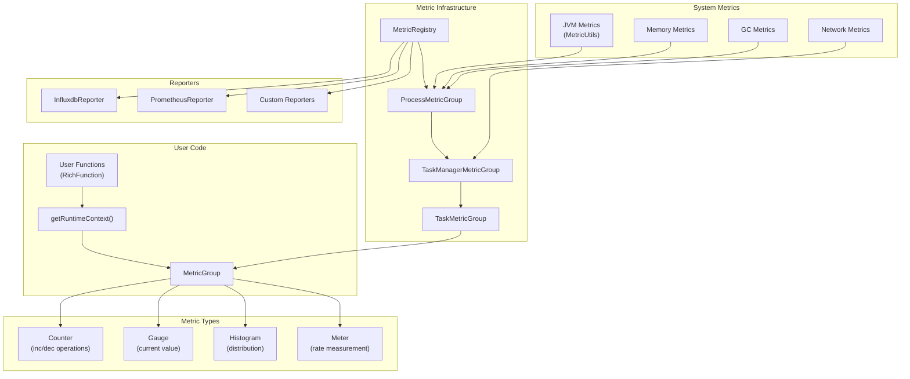
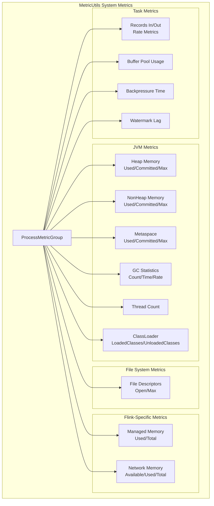
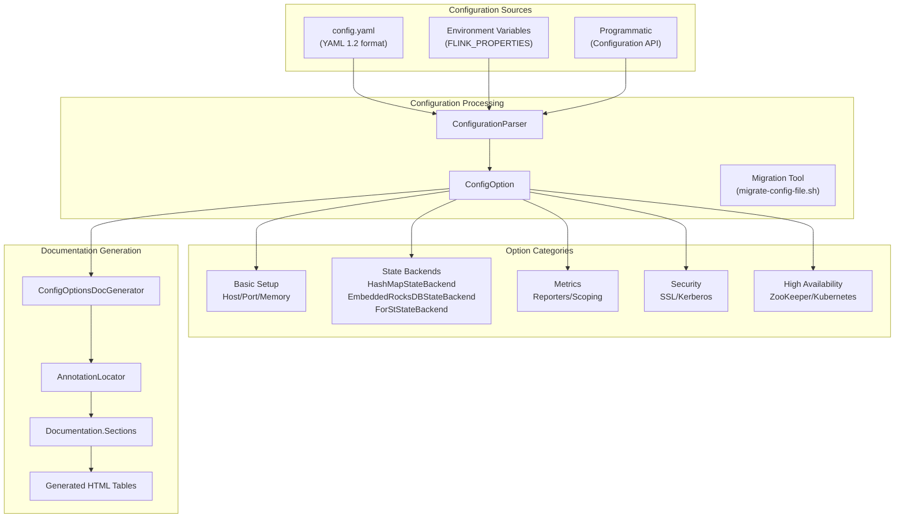
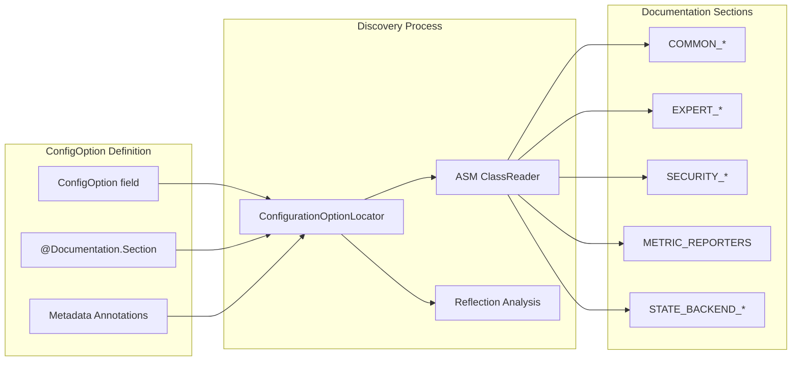
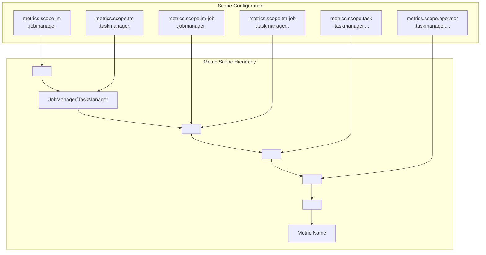

# Metrics & Configuration

<details>
<summary>Relevant source files</summary>

The following files were used as context for generating this wiki page:

- [docs/content.zh/docs/deployment/config.md](docs/content.zh/docs/deployment/config.md)
- [docs/content.zh/docs/ops/metrics.md](docs/content.zh/docs/ops/metrics.md)
- [docs/content.zh/docs/ops/state/state_backends.md](docs/content.zh/docs/ops/state/state_backends.md)
- [docs/content/docs/deployment/config.md](docs/content/docs/deployment/config.md)
- [docs/content/docs/ops/metrics.md](docs/content/docs/ops/metrics.md)
- [docs/content/docs/ops/state/state_backends.md](docs/content/docs/ops/state/state_backends.md)
- [docs/layouts/shortcodes/generated/expert_forst_section.html](docs/layouts/shortcodes/generated/expert_forst_section.html)
- [docs/layouts/shortcodes/generated/fs_state_changelog_configuration.html](docs/layouts/shortcodes/generated/fs_state_changelog_configuration.html)
- [docs/layouts/shortcodes/generated/influxdb_reporter_configuration.html](docs/layouts/shortcodes/generated/influxdb_reporter_configuration.html)
- [docs/layouts/shortcodes/generated/slow_task_detector_configuration.html](docs/layouts/shortcodes/generated/slow_task_detector_configuration.html)
- [docs/layouts/shortcodes/generated/state_changelog_section.html](docs/layouts/shortcodes/generated/state_changelog_section.html)
- [flink-annotations/src/main/java/org/apache/flink/annotation/docs/Documentation.java](flink-annotations/src/main/java/org/apache/flink/annotation/docs/Documentation.java)
- [flink-clients/src/main/java/org/apache/flink/client/cli/ArtifactFetchOptions.java](flink-clients/src/main/java/org/apache/flink/client/cli/ArtifactFetchOptions.java)
- [flink-core/src/main/java/org/apache/flink/configuration/AlgorithmOptions.java](flink-core/src/main/java/org/apache/flink/configuration/AlgorithmOptions.java)
- [flink-core/src/main/java/org/apache/flink/configuration/SlowTaskDetectorOptions.java](flink-core/src/main/java/org/apache/flink/configuration/SlowTaskDetectorOptions.java)
- [flink-docs/pom.xml](flink-docs/pom.xml)
- [flink-docs/src/main/java/org/apache/flink/docs/configuration/ConfigOptionsDocGenerator.java](flink-docs/src/main/java/org/apache/flink/docs/configuration/ConfigOptionsDocGenerator.java)
- [flink-docs/src/main/java/org/apache/flink/docs/util/ConfigurationOptionLocator.java](flink-docs/src/main/java/org/apache/flink/docs/util/ConfigurationOptionLocator.java)
- [flink-docs/src/test/java/org/apache/flink/docs/configuration/ConfigOptionsDocGeneratorTest.java](flink-docs/src/test/java/org/apache/flink/docs/configuration/ConfigOptionsDocGeneratorTest.java)
- [flink-docs/src/test/java/org/apache/flink/docs/configuration/ConfigOptionsDocsCompletenessITCase.java](flink-docs/src/test/java/org/apache/flink/docs/configuration/ConfigOptionsDocsCompletenessITCase.java)
- [flink-docs/src/test/resources/META-INF/services/org.junit.jupiter.api.extension.Extension](flink-docs/src/test/resources/META-INF/services/org.junit.jupiter.api.extension.Extension)
- [flink-libraries/flink-cep/src/main/java/org/apache/flink/cep/configuration/CEPCacheOptions.java](flink-libraries/flink-cep/src/main/java/org/apache/flink/cep/configuration/CEPCacheOptions.java)
- [flink-metrics/flink-metrics-influxdb/src/main/java/org/apache/flink/metrics/influxdb/InfluxdbReporterOptions.java](flink-metrics/flink-metrics-influxdb/src/main/java/org/apache/flink/metrics/influxdb/InfluxdbReporterOptions.java)
- [flink-runtime/src/main/java/org/apache/flink/runtime/highavailability/JobResultStoreOptions.java](flink-runtime/src/main/java/org/apache/flink/runtime/highavailability/JobResultStoreOptions.java)
- [flink-runtime/src/main/java/org/apache/flink/runtime/metrics/MetricNames.java](flink-runtime/src/main/java/org/apache/flink/runtime/metrics/MetricNames.java)
- [flink-runtime/src/main/java/org/apache/flink/runtime/metrics/util/MetricUtils.java](flink-runtime/src/main/java/org/apache/flink/runtime/metrics/util/MetricUtils.java)
- [flink-runtime/src/main/java/org/apache/flink/runtime/shuffle/ShuffleServiceOptions.java](flink-runtime/src/main/java/org/apache/flink/runtime/shuffle/ShuffleServiceOptions.java)
- [flink-runtime/src/test/java/org/apache/flink/runtime/metrics/util/MetricUtilsTest.java](flink-runtime/src/test/java/org/apache/flink/runtime/metrics/util/MetricUtilsTest.java)

</details>


This document covers Flink's metrics system and configuration management infrastructure. The metrics system enables gathering and exposing runtime statistics to external monitoring systems, while the configuration system provides centralized management of cluster and job parameters. For information about the REST API for monitoring and management, see [REST API & Web Interface](#4.1). For details about state management configuration, see [State Management](#2.4).

## Overview

Flink provides a comprehensive metrics and configuration system designed for production deployments. The metrics system allows operators to collect performance data, resource utilization statistics, and operational metrics from running jobs and cluster components. The configuration system centralizes parameter management across the entire Flink ecosystem, from basic cluster setup to advanced tuning options.

## Metrics System Architecture

The Flink metrics system is built around a plugin-based architecture that supports multiple metric types and external reporting systems.



Sources: [docs/content/docs/ops/metrics.md:1-1600](), [flink-runtime/src/main/java/org/apache/flink/runtime/metrics/util/MetricUtils.java:1-600](), [flink-runtime/src/main/java/org/apache/flink/runtime/metrics/MetricNames.java:1-161]()

### Metric Types and Registration

Flink supports four primary metric types, each accessible through the `MetricGroup` interface:

| Metric Type | Purpose | Key Methods | Usage |
|-------------|---------|-------------|--------|
| `Counter` | Count events or operations | `inc()`, `dec()` | Record number of processed records |
| `Gauge` | Snapshot of current value | `getValue()` | Monitor queue sizes, resource usage |
| `Histogram` | Value distribution measurement | `update(value)` | Latency distributions, data sizes |
| `Meter` | Rate measurement | `markEvent()` | Throughput, events per second |

Users register metrics through the `RuntimeContext` in `RichFunction` implementations:

```java
public class MyMapper extends RichMapFunction<String, String> {
    private transient Counter counter;
    
    @Override
    public void open(OpenContext ctx) {
        this.counter = getRuntimeContext()
            .getMetricGroup()
            .counter("myCounter");
    }
}
```

Sources: [docs/content/docs/ops/metrics.md:40-340](), [flink-runtime/src/main/java/org/apache/flink/runtime/metrics/MetricNames.java:22-160]()

### System Metrics Collection

Flink automatically collects comprehensive system metrics through the `MetricUtils` class:



Key metric name constants are defined in `MetricNames`:

- I/O metrics: `IO_NUM_RECORDS_IN`, `IO_NUM_RECORDS_OUT`, `IO_NUM_BYTES_IN`, `IO_NUM_BYTES_OUT`
- Memory metrics: `MEMORY_USED`, `MEMORY_COMMITTED`, `MEMORY_MAX`  
- Cluster metrics: `NUM_RUNNING_JOBS`, `TASK_SLOTS_AVAILABLE`, `NUM_REGISTERED_TASK_MANAGERS`
- Performance metrics: `TASK_IDLE_TIME`, `TASK_BUSY_TIME`, `TASK_BACK_PRESSURED_TIME`

Sources: [flink-runtime/src/main/java/org/apache/flink/runtime/metrics/util/MetricUtils.java:93-600](), [flink-runtime/src/main/java/org/apache/flink/runtime/metrics/MetricNames.java:25-160](), [docs/content/docs/ops/metrics.md:464-1600]()

## Configuration Management System

Flink's configuration system provides centralized parameter management with support for structured YAML configuration and automatic documentation generation.



Sources: [docs/content/docs/deployment/config.md:1-180](), [flink-docs/src/main/java/org/apache/flink/docs/configuration/ConfigOptionsDocGenerator.java:77-400]()

### Configuration Structure and Migration

Starting with Flink 2.0, configuration uses standard YAML 1.2 syntax in `config.yaml`. The system supports both nested and flattened key formats:

**Nested Format:**
```yaml
restart-strategy:
  type: failure-rate
  failure-rate:
    delay: 1 s
    max-failures-per-interval: 1
```

**Flattened Format:**
```yaml
restart-strategy.type: failure-rate
restart-strategy.failure-rate.delay: 1 s
restart-strategy.failure-rate.max-failures-per-interval: 1
```

Migration from legacy `flink-conf.yaml` is supported through the migration tool at `bin/migrate-config-file.sh`.

Sources: [docs/content/docs/deployment/config.md:42-117]()

### Configuration Options Discovery

The configuration system uses annotation-based discovery to automatically generate documentation:



The `ConfigurationOptionLocator` scans predefined locations for configuration classes:

- Core: `flink-core/org.apache.flink.configuration`
- Runtime: `flink-runtime/org.apache.flink.runtime.*`
- State Backends: `flink-state-backends/flink-statebackend-*/org.apache.flink.state.*`
- Metrics: `flink-metrics/flink-metrics-*/org.apache.flink.metrics.*`
- Table API: `flink-table/flink-table-api-java/org.apache.flink.table.api.config`

Sources: [flink-docs/src/main/java/org/apache/flink/docs/util/ConfigurationOptionLocator.java:50-120](), [flink-docs/src/main/java/org/apache/flink/docs/configuration/ConfigOptionsDocGenerator.java:77-250]()

## Metric Reporters and External Integration

Flink supports multiple metric reporters for integration with external monitoring systems:

### InfluxDB Reporter Configuration

The `InfluxdbReporter` provides comprehensive integration with InfluxDB time-series databases:

| Configuration Key | Default | Description |
|-------------------|---------|-------------|
| `metrics.reporter.influxdb.host` | (none) | InfluxDB server host |
| `metrics.reporter.influxdb.port` | 8086 | InfluxDB server port |
| `metrics.reporter.influxdb.scheme` | HTTP | Connection scheme (HTTP/HTTPS) |
| `metrics.reporter.influxdb.database` | (none) | Target database name |
| `metrics.reporter.influxdb.connectTimeout` | 10s | Connection timeout |
| `metrics.reporter.influxdb.writeTimeout` | 10s | Write operation timeout |

Sources: [flink-metrics/flink-metrics-influxdb/src/main/java/org/apache/flink/metrics/influxdb/InfluxdbReporterOptions.java:39-120](), [docs/layouts/shortcodes/generated/influxdb_reporter_configuration.html:1-70]()

### Metric Scoping and Naming

Flink provides configurable metric scoping to organize metrics hierarchically:



Example metric identifier: `localhost.taskmanager.1234.MyJob.MyOperator.0.MyMetric`

Sources: [docs/content/docs/ops/metrics.md:390-450]()

## State Backend Configuration Integration

The configuration system integrates closely with state backend selection and tuning:

### State Backend Types

| Backend | Configuration Value | Use Case |
|---------|---------------------|----------|
| `HashMapStateBackend` | `hashmap` | Large state in memory, high performance |
| `EmbeddedRocksDBStateBackend` | `rocksdb` | Very large state, disk-based storage |
| `ForStStateBackend` | `forst` | Disaggregated state, remote file systems |

### RocksDB-Specific Metrics

RocksDB state backend exposes native metrics through the configuration system:

```yaml
state.backend.rocksdb.metrics.enable: true
state.backend.rocksdb.metrics.column-family-as-variable: true
state.backend.rocksdb.metrics.num-levels: 7
```

Available RocksDB metrics include:
- Block cache hit/miss rates
- Compaction statistics  
- SST file counts and sizes
- Read/write amplification factors

Sources: [docs/content/docs/ops/state/state_backends.md:92-96](), [docs/layouts/shortcodes/generated/expert_forst_section.html:1-80]()

## Production Configuration Examples

### Basic Cluster Setup

```yaml
# Host and port configuration
rest.address: flink-jobmanager
rest.port: 8081
jobmanager.rpc.address: flink-jobmanager
jobmanager.rpc.port: 6123

# Memory configuration
jobmanager.memory.process.size: 1600m
taskmanager.memory.process.size: 4096m
taskmanager.numberOfTaskSlots: 2

# State backend configuration
state.backend.type: rocksdb
execution.checkpointing.dir: s3://my-bucket/checkpoints
execution.checkpointing.interval: 60s

# Metrics configuration
metrics.reporters: influxdb
metrics.reporter.influxdb.class: org.apache.flink.metrics.influxdb.InfluxdbReporter
metrics.reporter.influxdb.host: monitoring.company.com
metrics.reporter.influxdb.port: 8086
metrics.reporter.influxdb.database: flink_metrics
```

### Advanced Monitoring Setup

```yaml
# Detailed metric reporting
metrics.scope.jm: <host>.flink.jobmanager
metrics.scope.tm: <host>.flink.taskmanager.<tm_id>
metrics.scope.task: <host>.flink.taskmanager.<tm_id>.<job_name>.<task_name>.<subtask_index>

# System resource monitoring
metrics.system-resource: true
metrics.system-resource-probing-interval: 5s

# RocksDB metrics
state.backend.rocksdb.metrics.enable: true
state.backend.rocksdb.metrics.num-levels: 7
state.backend.rocksdb.metrics.column-family-as-variable: true
```

Sources: [docs/content/docs/deployment/config.md:118-180](), [flink-runtime/src/test/java/org/apache/flink/runtime/metrics/util/MetricUtilsTest.java:78-100]()
