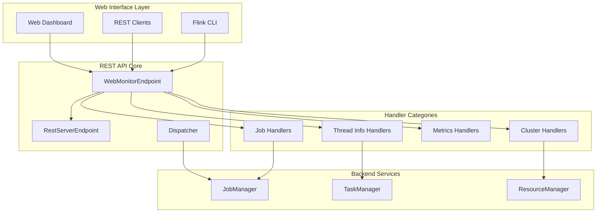
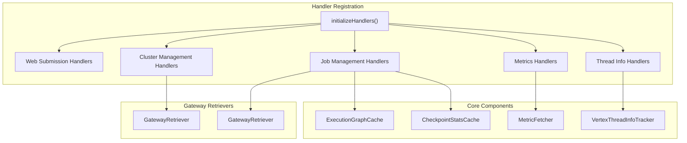
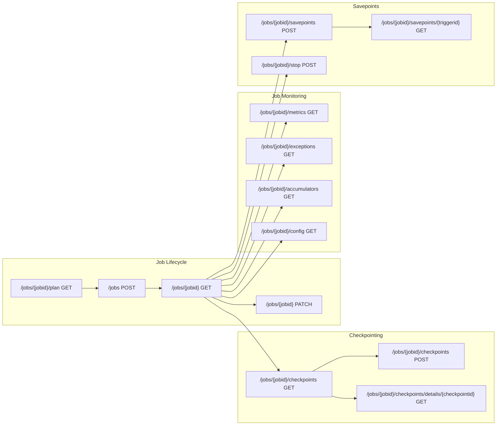
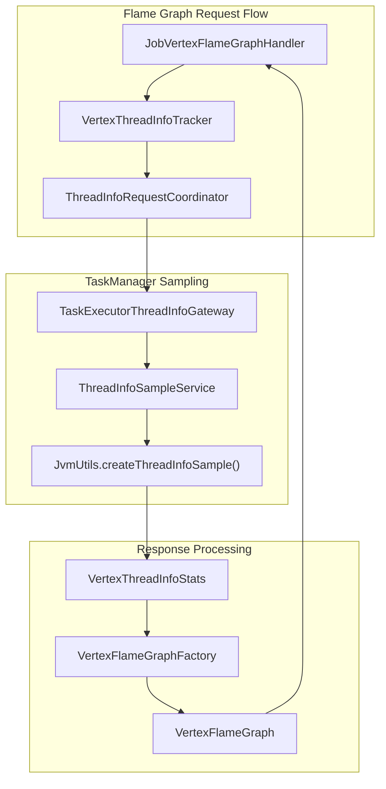
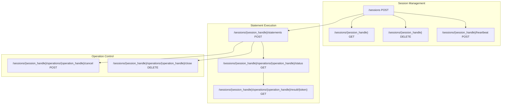
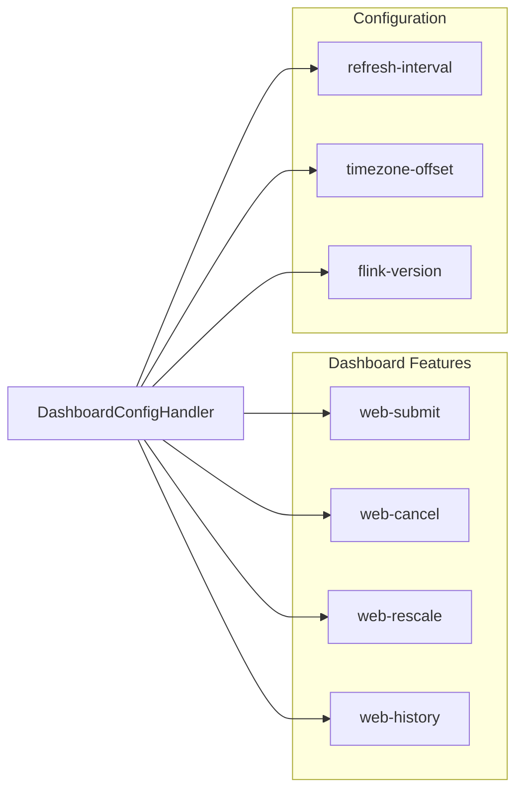

# REST API & Web Interface

Relevant source files

The following files were used as context for generating this wiki page:

- [docs/layouts/shortcodes/generated/rest_v1_dispatcher.html](docs/layouts/shortcodes/generated/rest_v1_dispatcher.html)
- [docs/static/generated/rest_v1_dispatcher.yml](docs/static/generated/rest_v1_dispatcher.yml)
- [flink-runtime-web/src/test/resources/rest_api_v1.snapshot](flink-runtime-web/src/test/resources/rest_api_v1.snapshot)
- [flink-runtime/src/main/java/org/apache/flink/runtime/messages/TaskThreadInfoResponse.java](flink-runtime/src/main/java/org/apache/flink/runtime/messages/TaskThreadInfoResponse.java)
- [flink-runtime/src/main/java/org/apache/flink/runtime/messages/ThreadInfoSample.java](flink-runtime/src/main/java/org/apache/flink/runtime/messages/ThreadInfoSample.java)
- [flink-runtime/src/main/java/org/apache/flink/runtime/rest/HttpMethodWrapper.java](flink-runtime/src/main/java/org/apache/flink/runtime/rest/HttpMethodWrapper.java)
- [flink-runtime/src/main/java/org/apache/flink/runtime/rest/handler/cluster/JobManagerEnvironmentHandler.java](flink-runtime/src/main/java/org/apache/flink/runtime/rest/handler/cluster/JobManagerEnvironmentHandler.java)
- [flink-runtime/src/main/java/org/apache/flink/runtime/rest/handler/job/JobManagerJobEnvironmentHandler.java](flink-runtime/src/main/java/org/apache/flink/runtime/rest/handler/job/JobManagerJobEnvironmentHandler.java)
- [flink-runtime/src/main/java/org/apache/flink/runtime/rest/handler/job/JobVertexFlameGraphHandler.java](flink-runtime/src/main/java/org/apache/flink/runtime/rest/handler/job/JobVertexFlameGraphHandler.java)
- [flink-runtime/src/main/java/org/apache/flink/runtime/rest/messages/EnvironmentInfo.java](flink-runtime/src/main/java/org/apache/flink/runtime/rest/messages/EnvironmentInfo.java)
- [flink-runtime/src/main/java/org/apache/flink/runtime/rest/messages/FlameGraphTypeQueryParameter.java](flink-runtime/src/main/java/org/apache/flink/runtime/rest/messages/FlameGraphTypeQueryParameter.java)
- [flink-runtime/src/main/java/org/apache/flink/runtime/rest/messages/JobManagerEnvironmentHeaders.java](flink-runtime/src/main/java/org/apache/flink/runtime/rest/messages/JobManagerEnvironmentHeaders.java)
- [flink-runtime/src/main/java/org/apache/flink/runtime/rest/messages/JobPlanInfo.java](flink-runtime/src/main/java/org/apache/flink/runtime/rest/messages/JobPlanInfo.java)
- [flink-runtime/src/main/java/org/apache/flink/runtime/rest/messages/JobVertexFlameGraphHeaders.java](flink-runtime/src/main/java/org/apache/flink/runtime/rest/messages/JobVertexFlameGraphHeaders.java)
- [flink-runtime/src/main/java/org/apache/flink/runtime/rest/messages/JobVertexFlameGraphParameters.java](flink-runtime/src/main/java/org/apache/flink/runtime/rest/messages/JobVertexFlameGraphParameters.java)
- [flink-runtime/src/main/java/org/apache/flink/runtime/rest/messages/SubtaskIndexQueryParameter.java](flink-runtime/src/main/java/org/apache/flink/runtime/rest/messages/SubtaskIndexQueryParameter.java)
- [flink-runtime/src/main/java/org/apache/flink/runtime/rest/messages/job/JobManagerJobEnvironmentHeaders.java](flink-runtime/src/main/java/org/apache/flink/runtime/rest/messages/job/JobManagerJobEnvironmentHeaders.java)
- [flink-runtime/src/main/java/org/apache/flink/runtime/taskexecutor/ThreadInfoSampleService.java](flink-runtime/src/main/java/org/apache/flink/runtime/taskexecutor/ThreadInfoSampleService.java)
- [flink-runtime/src/main/java/org/apache/flink/runtime/util/JvmUtils.java](flink-runtime/src/main/java/org/apache/flink/runtime/util/JvmUtils.java)
- [flink-runtime/src/main/java/org/apache/flink/runtime/webmonitor/WebMonitorEndpoint.java](flink-runtime/src/main/java/org/apache/flink/runtime/webmonitor/WebMonitorEndpoint.java)
- [flink-runtime/src/main/java/org/apache/flink/runtime/webmonitor/stats/VertexStatsTracker.java](flink-runtime/src/main/java/org/apache/flink/runtime/webmonitor/stats/VertexStatsTracker.java)
- [flink-runtime/src/main/java/org/apache/flink/runtime/webmonitor/threadinfo/ThreadInfoRequestCoordinator.java](flink-runtime/src/main/java/org/apache/flink/runtime/webmonitor/threadinfo/ThreadInfoRequestCoordinator.java)
- [flink-runtime/src/main/java/org/apache/flink/runtime/webmonitor/threadinfo/VertexFlameGraph.java](flink-runtime/src/main/java/org/apache/flink/runtime/webmonitor/threadinfo/VertexFlameGraph.java)
- [flink-runtime/src/main/java/org/apache/flink/runtime/webmonitor/threadinfo/VertexThreadInfoTrackerBuilder.java](flink-runtime/src/main/java/org/apache/flink/runtime/webmonitor/threadinfo/VertexThreadInfoTrackerBuilder.java)
- [flink-runtime/src/test/java/org/apache/flink/runtime/rest/compatibility/CompatibilityRoutines.java](flink-runtime/src/test/java/org/apache/flink/runtime/rest/compatibility/CompatibilityRoutines.java)
- [flink-runtime/src/test/java/org/apache/flink/runtime/rest/handler/job/JobVertexFlameGraphHandlerTest.java](flink-runtime/src/test/java/org/apache/flink/runtime/rest/handler/job/JobVertexFlameGraphHandlerTest.java)
- [flink-runtime/src/test/java/org/apache/flink/runtime/rest/messages/EnvironmentInfoTest.java](flink-runtime/src/test/java/org/apache/flink/runtime/rest/messages/EnvironmentInfoTest.java)
- [flink-runtime/src/test/java/org/apache/flink/runtime/webmonitor/threadinfo/ThreadInfoRequestCoordinatorTest.java](flink-runtime/src/test/java/org/apache/flink/runtime/webmonitor/threadinfo/ThreadInfoRequestCoordinatorTest.java)
- [flink-table/flink-sql-gateway/src/main/java/org/apache/flink/table/gateway/rest/handler/operation/AbstractOperationHandler.java](flink-table/flink-sql-gateway/src/main/java/org/apache/flink/table/gateway/rest/handler/operation/AbstractOperationHandler.java)
- [flink-table/flink-sql-gateway/src/main/java/org/apache/flink/table/gateway/rest/handler/operation/CancelOperationHandler.java](flink-table/flink-sql-gateway/src/main/java/org/apache/flink/table/gateway/rest/handler/operation/CancelOperationHandler.java)
- [flink-table/flink-sql-gateway/src/main/java/org/apache/flink/table/gateway/rest/handler/operation/CloseOperationHandler.java](flink-table/flink-sql-gateway/src/main/java/org/apache/flink/table/gateway/rest/handler/operation/CloseOperationHandler.java)
- [flink-table/flink-sql-gateway/src/main/java/org/apache/flink/table/gateway/rest/handler/operation/GetOperationStatusHandler.java](flink-table/flink-sql-gateway/src/main/java/org/apache/flink/table/gateway/rest/handler/operation/GetOperationStatusHandler.java)
- [flink-table/flink-sql-gateway/src/main/java/org/apache/flink/table/gateway/rest/header/operation/CancelOperationHeaders.java](flink-table/flink-sql-gateway/src/main/java/org/apache/flink/table/gateway/rest/header/operation/CancelOperationHeaders.java)
- [flink-table/flink-sql-gateway/src/main/java/org/apache/flink/table/gateway/rest/header/operation/CloseOperationHeaders.java](flink-table/flink-sql-gateway/src/main/java/org/apache/flink/table/gateway/rest/header/operation/CloseOperationHeaders.java)
- [flink-table/flink-sql-gateway/src/main/java/org/apache/flink/table/gateway/rest/header/operation/GetOperationStatusHeaders.java](flink-table/flink-sql-gateway/src/main/java/org/apache/flink/table/gateway/rest/header/operation/GetOperationStatusHeaders.java)
- [flink-table/flink-sql-gateway/src/main/java/org/apache/flink/table/gateway/rest/message/operation/OperationHandleIdPathParameter.java](flink-table/flink-sql-gateway/src/main/java/org/apache/flink/table/gateway/rest/message/operation/OperationHandleIdPathParameter.java)
- [flink-table/flink-sql-gateway/src/test/resources/sql_gateway_rest_api_v1.snapshot](flink-table/flink-sql-gateway/src/test/resources/sql_gateway_rest_api_v1.snapshot)

This document covers Flink's REST API and web interface components, which provide programmatic and visual access to cluster management, job control, and monitoring capabilities. The REST API serves as the primary interface for external tools and the web UI to interact with Flink clusters.

For information about the underlying metrics collection system, see [Metrics & Configuration](#4.2). For details about job scheduling and execution that these APIs expose, see [Job Scheduling & Resource Management](#2.1).

## Overview

Flink provides a comprehensive REST API through the `WebMonitorEndpoint` that exposes cluster state, job management, and monitoring functionality. The API follows OpenAPI 3.0 specifications and supports both synchronous and asynchronous operations.

Sources: [flink-runtime/src/main/java/org/apache/flink/runtime/webmonitor/WebMonitorEndpoint.java:206-267](), [docs/static/generated/rest_v1_dispatcher.yml:1-10]()

## API Architecture

The REST API is built around the `WebMonitorEndpoint` class, which extends `RestServerEndpoint` and implements the `LeaderContender` and `JsonArchivist` interfaces. The endpoint initializes multiple handler categories for different functional areas.

Sources: [flink-runtime/src/main/java/org/apache/flink/runtime/webmonitor/WebMonitorEndpoint.java:290-298](), [flink-runtime/src/main/java/org/apache/flink/runtime/webmonitor/WebMonitorEndpoint.java:216-226]()

## REST API Endpoints

### Cluster Management Endpoints

The cluster management endpoints provide access to cluster-wide configuration, status, and control operations:

| Endpoint | Method | Purpose | Handler Class |
|----------|--------|---------|---------------|
| `/cluster` | DELETE | Shutdown cluster | `ShutdownHandler` |
| `/config` | GET | Dashboard configuration | `DashboardConfigHandler` |
| `/jobmanager/config` | GET | Cluster configuration | `ClusterConfigHandler` |
| `/jobmanager/environment` | GET | JobManager environment | `JobManagerEnvironmentHandler` |
| `/jobmanager/metrics` | GET | JobManager metrics | `JobManagerMetricsHandler` |
| `/jobmanager/thread-dump` | GET | JobManager thread dump | `JobManagerThreadDumpHandler` |
| `/jobmanager/logs` | GET | JobManager log files | `JobManagerLogListHandler` |

Sources: [docs/static/generated/rest_v1_dispatcher.yml:11-310](), [flink-runtime/src/main/java/org/apache/flink/runtime/webmonitor/WebMonitorEndpoint.java:344-370]()

### Job Management Endpoints

Job management endpoints handle job lifecycle operations, monitoring, and configuration:

Sources: [docs/static/generated/rest_v1_dispatcher.yml:310-951](), [flink-runtime/src/main/java/org/apache/flink/runtime/webmonitor/WebMonitorEndpoint.java:323-342]()

### JAR Management Endpoints

The JAR management system allows uploading, managing, and executing user JAR files:

| Endpoint | Method | Purpose | Response |
|----------|--------|---------|----------|
| `/jars` | GET | List uploaded JARs | `JarListInfo` |
| `/jars/upload` | POST | Upload JAR file | `JarUploadResponseBody` |
| `/jars/{jarid}` | DELETE | Delete uploaded JAR | Empty |
| `/jars/{jarid}/plan` | POST | Generate execution plan | `JobPlanInfo` |
| `/jars/{jarid}/run` | POST | Submit job from JAR | `JarRunResponseBody` |

Sources: [docs/static/generated/rest_v1_dispatcher.yml:79-244](), [flink-runtime/src/test/resources/rest_api_v1.snapshot:176-609]()

## Thread Sampling and Flame Graph API

Flink provides advanced profiling capabilities through thread sampling and flame graph generation. The system coordinates sampling across TaskManagers and aggregates results for visualization.

The flame graph API supports three types of thread state filtering:

- `FULL`: All thread states
- `ON_CPU`: Threads in RUNNABLE and NEW states  
- `OFF_CPU`: Threads in TIMED_WAITING, BLOCKED, and WAITING states

Sources: [flink-runtime/src/main/java/org/apache/flink/runtime/rest/handler/job/JobVertexFlameGraphHandler.java:53-122](), [flink-runtime/src/main/java/org/apache/flink/runtime/webmonitor/threadinfo/ThreadInfoRequestCoordinator.java:42-117](), [flink-runtime/src/main/java/org/apache/flink/runtime/rest/messages/FlameGraphTypeQueryParameter.java:52-64]()

### Thread Sampling Process

The thread sampling process involves coordination between multiple components:

1. **Request Initiation**: `JobVertexFlameGraphHandler` receives flame graph requests
2. **Sampling Coordination**: `ThreadInfoRequestCoordinator` manages sampling across TaskManagers
3. **Sample Collection**: `ThreadInfoSampleService` collects thread dumps using `JvmUtils`
4. **Aggregation**: Results are aggregated into `VertexThreadInfoStats`
5. **Visualization**: `VertexFlameGraphFactory` generates flame graph data

Sources: [flink-runtime/src/main/java/org/apache/flink/runtime/taskexecutor/ThreadInfoSampleService.java:42-78](), [flink-runtime/src/main/java/org/apache/flink/runtime/util/JvmUtils.java:77-90]()

## SQL Gateway REST API

The SQL Gateway provides a separate REST API for table/SQL operations, following a session-based model:

### SQL Gateway Handler Architecture

The SQL Gateway uses specialized handlers for operation management:

| Handler Class | Purpose | Endpoint Pattern |
|---------------|---------|------------------|
| `CancelOperationHandler` | Cancel running operations | `/operations/{id}/cancel` |
| `CloseOperationHandler` | Close completed operations | `/operations/{id}/close` |
| `GetOperationStatusHandler` | Check operation status | `/operations/{id}/status` |

Sources: [flink-table/flink-sql-gateway/src/test/resources/sql_gateway_rest_api_v1.snapshot:1-316](), [flink-table/flink-sql-gateway/src/main/java/org/apache/flink/table/gateway/rest/header/operation/CancelOperationHeaders.java:26-60]()

## Configuration and Features

The web interface supports feature toggles controlled through `DashboardConfiguration`:

The dashboard configuration includes feature flags that control UI capabilities and system information for version compatibility.

Sources: [docs/static/generated/rest_v1_dispatcher.yml:18-100](), [flink-runtime/src/main/java/org/apache/flink/runtime/webmonitor/WebMonitorEndpoint.java:312-321]()
