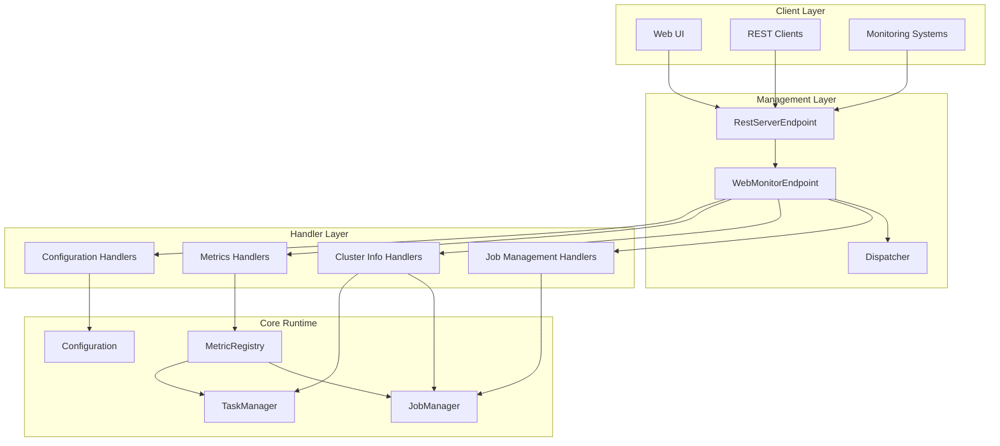
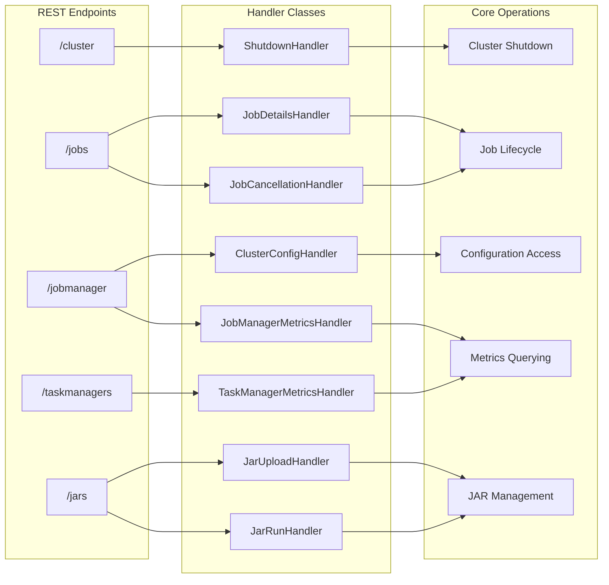
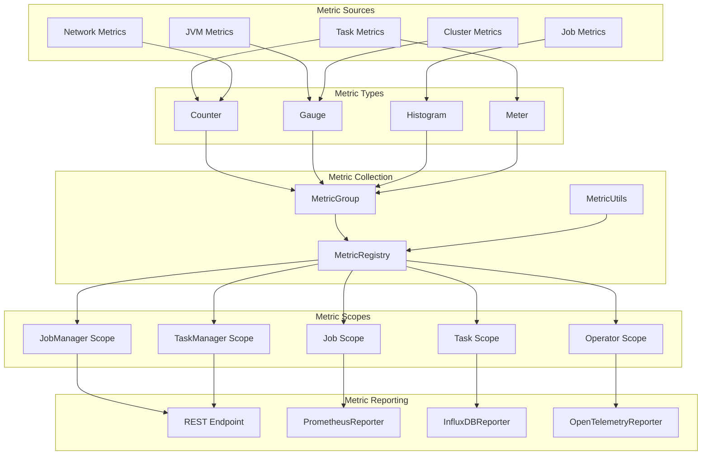

# System Management & Monitoring

<details>
<summary>Relevant source files</summary>

The following files were used as context for generating this wiki page:

- [docs/content.zh/docs/deployment/config.md](docs/content.zh/docs/deployment/config.md)
- [docs/content.zh/docs/ops/metrics.md](docs/content.zh/docs/ops/metrics.md)
- [docs/content.zh/docs/ops/state/state_backends.md](docs/content.zh/docs/ops/state/state_backends.md)
- [docs/content/docs/deployment/config.md](docs/content/docs/deployment/config.md)
- [docs/content/docs/ops/metrics.md](docs/content/docs/ops/metrics.md)
- [docs/content/docs/ops/state/state_backends.md](docs/content/docs/ops/state/state_backends.md)
- [docs/layouts/shortcodes/generated/expert_forst_section.html](docs/layouts/shortcodes/generated/expert_forst_section.html)
- [docs/layouts/shortcodes/generated/fs_state_changelog_configuration.html](docs/layouts/shortcodes/generated/fs_state_changelog_configuration.html)
- [docs/layouts/shortcodes/generated/influxdb_reporter_configuration.html](docs/layouts/shortcodes/generated/influxdb_reporter_configuration.html)
- [docs/layouts/shortcodes/generated/rest_v1_dispatcher.html](docs/layouts/shortcodes/generated/rest_v1_dispatcher.html)
- [docs/layouts/shortcodes/generated/slow_task_detector_configuration.html](docs/layouts/shortcodes/generated/slow_task_detector_configuration.html)
- [docs/layouts/shortcodes/generated/state_changelog_section.html](docs/layouts/shortcodes/generated/state_changelog_section.html)
- [docs/static/generated/rest_v1_dispatcher.yml](docs/static/generated/rest_v1_dispatcher.yml)
- [flink-annotations/src/main/java/org/apache/flink/annotation/docs/Documentation.java](flink-annotations/src/main/java/org/apache/flink/annotation/docs/Documentation.java)
- [flink-clients/src/main/java/org/apache/flink/client/cli/ArtifactFetchOptions.java](flink-clients/src/main/java/org/apache/flink/client/cli/ArtifactFetchOptions.java)
- [flink-core/src/main/java/org/apache/flink/configuration/AlgorithmOptions.java](flink-core/src/main/java/org/apache/flink/configuration/AlgorithmOptions.java)
- [flink-core/src/main/java/org/apache/flink/configuration/SlowTaskDetectorOptions.java](flink-core/src/main/java/org/apache/flink/configuration/SlowTaskDetectorOptions.java)
- [flink-docs/pom.xml](flink-docs/pom.xml)
- [flink-docs/src/main/java/org/apache/flink/docs/configuration/ConfigOptionsDocGenerator.java](flink-docs/src/main/java/org/apache/flink/docs/configuration/ConfigOptionsDocGenerator.java)
- [flink-docs/src/main/java/org/apache/flink/docs/util/ConfigurationOptionLocator.java](flink-docs/src/main/java/org/apache/flink/docs/util/ConfigurationOptionLocator.java)
- [flink-docs/src/test/java/org/apache/flink/docs/configuration/ConfigOptionsDocGeneratorTest.java](flink-docs/src/test/java/org/apache/flink/docs/configuration/ConfigOptionsDocGeneratorTest.java)
- [flink-docs/src/test/java/org/apache/flink/docs/configuration/ConfigOptionsDocsCompletenessITCase.java](flink-docs/src/test/java/org/apache/flink/docs/configuration/ConfigOptionsDocsCompletenessITCase.java)
- [flink-docs/src/test/resources/META-INF/services/org.junit.jupiter.api.extension.Extension](flink-docs/src/test/resources/META-INF/services/org.junit.jupiter.api.extension.Extension)
- [flink-libraries/flink-cep/src/main/java/org/apache/flink/cep/configuration/CEPCacheOptions.java](flink-libraries/flink-cep/src/main/java/org/apache/flink/cep/configuration/CEPCacheOptions.java)
- [flink-metrics/flink-metrics-influxdb/src/main/java/org/apache/flink/metrics/influxdb/InfluxdbReporterOptions.java](flink-metrics/flink-metrics-influxdb/src/main/java/org/apache/flink/metrics/influxdb/InfluxdbReporterOptions.java)
- [flink-runtime-web/src/test/resources/rest_api_v1.snapshot](flink-runtime-web/src/test/resources/rest_api_v1.snapshot)
- [flink-runtime/src/main/java/org/apache/flink/runtime/highavailability/JobResultStoreOptions.java](flink-runtime/src/main/java/org/apache/flink/runtime/highavailability/JobResultStoreOptions.java)
- [flink-runtime/src/main/java/org/apache/flink/runtime/messages/TaskThreadInfoResponse.java](flink-runtime/src/main/java/org/apache/flink/runtime/messages/TaskThreadInfoResponse.java)
- [flink-runtime/src/main/java/org/apache/flink/runtime/messages/ThreadInfoSample.java](flink-runtime/src/main/java/org/apache/flink/runtime/messages/ThreadInfoSample.java)
- [flink-runtime/src/main/java/org/apache/flink/runtime/metrics/MetricNames.java](flink-runtime/src/main/java/org/apache/flink/runtime/metrics/MetricNames.java)
- [flink-runtime/src/main/java/org/apache/flink/runtime/metrics/util/MetricUtils.java](flink-runtime/src/main/java/org/apache/flink/runtime/metrics/util/MetricUtils.java)
- [flink-runtime/src/main/java/org/apache/flink/runtime/rest/HttpMethodWrapper.java](flink-runtime/src/main/java/org/apache/flink/runtime/rest/HttpMethodWrapper.java)
- [flink-runtime/src/main/java/org/apache/flink/runtime/rest/handler/cluster/JobManagerEnvironmentHandler.java](flink-runtime/src/main/java/org/apache/flink/runtime/rest/handler/cluster/JobManagerEnvironmentHandler.java)
- [flink-runtime/src/main/java/org/apache/flink/runtime/rest/handler/job/JobManagerJobEnvironmentHandler.java](flink-runtime/src/main/java/org/apache/flink/runtime/rest/handler/job/JobManagerJobEnvironmentHandler.java)
- [flink-runtime/src/main/java/org/apache/flink/runtime/rest/handler/job/JobVertexFlameGraphHandler.java](flink-runtime/src/main/java/org/apache/flink/runtime/rest/handler/job/JobVertexFlameGraphHandler.java)
- [flink-runtime/src/main/java/org/apache/flink/runtime/rest/messages/EnvironmentInfo.java](flink-runtime/src/main/java/org/apache/flink/runtime/rest/messages/EnvironmentInfo.java)
- [flink-runtime/src/main/java/org/apache/flink/runtime/rest/messages/FlameGraphTypeQueryParameter.java](flink-runtime/src/main/java/org/apache/flink/runtime/rest/messages/FlameGraphTypeQueryParameter.java)
- [flink-runtime/src/main/java/org/apache/flink/runtime/rest/messages/JobManagerEnvironmentHeaders.java](flink-runtime/src/main/java/org/apache/flink/runtime/rest/messages/JobManagerEnvironmentHeaders.java)
- [flink-runtime/src/main/java/org/apache/flink/runtime/rest/messages/JobPlanInfo.java](flink-runtime/src/main/java/org/apache/flink/runtime/rest/messages/JobPlanInfo.java)
- [flink-runtime/src/main/java/org/apache/flink/runtime/rest/messages/JobVertexFlameGraphHeaders.java](flink-runtime/src/main/java/org/apache/flink/runtime/rest/messages/JobVertexFlameGraphHeaders.java)
- [flink-runtime/src/main/java/org/apache/flink/runtime/rest/messages/JobVertexFlameGraphParameters.java](flink-runtime/src/main/java/org/apache/flink/runtime/rest/messages/JobVertexFlameGraphParameters.java)
- [flink-runtime/src/main/java/org/apache/flink/runtime/rest/messages/SubtaskIndexQueryParameter.java](flink-runtime/src/main/java/org/apache/flink/runtime/rest/messages/SubtaskIndexQueryParameter.java)
- [flink-runtime/src/main/java/org/apache/flink/runtime/rest/messages/job/JobManagerJobEnvironmentHeaders.java](flink-runtime/src/main/java/org/apache/flink/runtime/rest/messages/job/JobManagerJobEnvironmentHeaders.java)
- [flink-runtime/src/main/java/org/apache/flink/runtime/shuffle/ShuffleServiceOptions.java](flink-runtime/src/main/java/org/apache/flink/runtime/shuffle/ShuffleServiceOptions.java)
- [flink-runtime/src/main/java/org/apache/flink/runtime/taskexecutor/ThreadInfoSampleService.java](flink-runtime/src/main/java/org/apache/flink/runtime/taskexecutor/ThreadInfoSampleService.java)
- [flink-runtime/src/main/java/org/apache/flink/runtime/util/JvmUtils.java](flink-runtime/src/main/java/org/apache/flink/runtime/util/JvmUtils.java)
- [flink-runtime/src/main/java/org/apache/flink/runtime/webmonitor/WebMonitorEndpoint.java](flink-runtime/src/main/java/org/apache/flink/runtime/webmonitor/WebMonitorEndpoint.java)
- [flink-runtime/src/main/java/org/apache/flink/runtime/webmonitor/stats/VertexStatsTracker.java](flink-runtime/src/main/java/org/apache/flink/runtime/webmonitor/stats/VertexStatsTracker.java)
- [flink-runtime/src/main/java/org/apache/flink/runtime/webmonitor/threadinfo/ThreadInfoRequestCoordinator.java](flink-runtime/src/main/java/org/apache/flink/runtime/webmonitor/threadinfo/ThreadInfoRequestCoordinator.java)
- [flink-runtime/src/main/java/org/apache/flink/runtime/webmonitor/threadinfo/VertexFlameGraph.java](flink-runtime/src/main/java/org/apache/flink/runtime/webmonitor/threadinfo/VertexFlameGraph.java)
- [flink-runtime/src/main/java/org/apache/flink/runtime/webmonitor/threadinfo/VertexThreadInfoTrackerBuilder.java](flink-runtime/src/main/java/org/apache/flink/runtime/webmonitor/threadinfo/VertexThreadInfoTrackerBuilder.java)
- [flink-runtime/src/test/java/org/apache/flink/runtime/metrics/util/MetricUtilsTest.java](flink-runtime/src/test/java/org/apache/flink/runtime/metrics/util/MetricUtilsTest.java)
- [flink-runtime/src/test/java/org/apache/flink/runtime/rest/compatibility/CompatibilityRoutines.java](flink-runtime/src/test/java/org/apache/flink/runtime/rest/compatibility/CompatibilityRoutines.java)
- [flink-runtime/src/test/java/org/apache/flink/runtime/rest/handler/job/JobVertexFlameGraphHandlerTest.java](flink-runtime/src/test/java/org/apache/flink/runtime/rest/handler/job/JobVertexFlameGraphHandlerTest.java)
- [flink-runtime/src/test/java/org/apache/flink/runtime/rest/messages/EnvironmentInfoTest.java](flink-runtime/src/test/java/org/apache/flink/runtime/rest/messages/EnvironmentInfoTest.java)
- [flink-runtime/src/test/java/org/apache/flink/runtime/webmonitor/threadinfo/ThreadInfoRequestCoordinatorTest.java](flink-runtime/src/test/java/org/apache/flink/runtime/webmonitor/threadinfo/ThreadInfoRequestCoordinatorTest.java)
- [flink-table/flink-sql-gateway/src/main/java/org/apache/flink/table/gateway/rest/handler/operation/AbstractOperationHandler.java](flink-table/flink-sql-gateway/src/main/java/org/apache/flink/table/gateway/rest/handler/operation/AbstractOperationHandler.java)
- [flink-table/flink-sql-gateway/src/main/java/org/apache/flink/table/gateway/rest/handler/operation/CancelOperationHandler.java](flink-table/flink-sql-gateway/src/main/java/org/apache/flink/table/gateway/rest/handler/operation/CancelOperationHandler.java)
- [flink-table/flink-sql-gateway/src/main/java/org/apache/flink/table/gateway/rest/handler/operation/CloseOperationHandler.java](flink-table/flink-sql-gateway/src/main/java/org/apache/flink/table/gateway/rest/handler/operation/CloseOperationHandler.java)
- [flink-table/flink-sql-gateway/src/main/java/org/apache/flink/table/gateway/rest/handler/operation/GetOperationStatusHandler.java](flink-table/flink-sql-gateway/src/main/java/org/apache/flink/table/gateway/rest/handler/operation/GetOperationStatusHandler.java)
- [flink-table/flink-sql-gateway/src/main/java/org/apache/flink/table/gateway/rest/header/operation/CancelOperationHeaders.java](flink-table/flink-sql-gateway/src/main/java/org/apache/flink/table/gateway/rest/header/operation/CancelOperationHeaders.java)
- [flink-table/flink-sql-gateway/src/main/java/org/apache/flink/table/gateway/rest/header/operation/CloseOperationHeaders.java](flink-table/flink-sql-gateway/src/main/java/org/apache/flink/table/gateway/rest/header/operation/CloseOperationHeaders.java)
- [flink-table/flink-sql-gateway/src/main/java/org/apache/flink/table/gateway/rest/header/operation/GetOperationStatusHeaders.java](flink-table/flink-sql-gateway/src/main/java/org/apache/flink/table/gateway/rest/header/operation/GetOperationStatusHeaders.java)
- [flink-table/flink-sql-gateway/src/main/java/org/apache/flink/table/gateway/rest/message/operation/OperationHandleIdPathParameter.java](flink-table/flink-sql-gateway/src/main/java/org/apache/flink/table/gateway/rest/message/operation/OperationHandleIdPathParameter.java)
- [flink-table/flink-sql-gateway/src/test/resources/sql_gateway_rest_api_v1.snapshot](flink-table/flink-sql-gateway/src/test/resources/sql_gateway_rest_api_v1.snapshot)

</details>


This document covers Flink's operational management and monitoring capabilities, including the REST API for cluster control, comprehensive metrics collection and reporting, and web-based interfaces for system observation. These systems provide the foundation for operating and monitoring Flink clusters in production environments.

For detailed information about specific REST API endpoints and web interface features, see [REST API & Web Interface](#4.1). For metrics configuration and monitoring setup, see [Metrics & Configuration](#4.2).

## Overview

Flink's management and monitoring system consists of three primary components that work together to provide comprehensive operational visibility and control:

- **REST API & Web Interface**: HTTP-based endpoints for cluster management, job control, and web UI
- **Metrics System**: Comprehensive metrics collection, aggregation, and reporting infrastructure  
- **Configuration Management**: Runtime configuration and operational parameter control

These systems are designed to support both human operators through web interfaces and automated systems through programmatic APIs.

## System Architecture

The management and monitoring architecture centers around the `WebMonitorEndpoint` which coordinates between REST handlers, metrics collection, and the underlying Flink runtime:



Sources: [flink-runtime/src/main/java/org/apache/flink/runtime/webmonitor/WebMonitorEndpoint.java:1-500](), [docs/static/generated/rest_v1_dispatcher.yml:1-100]()

## REST API Management Flow

The REST API provides programmatic access to all cluster management functions through a structured endpoint hierarchy:



Sources: [docs/static/generated/rest_v1_dispatcher.yml:10-50](), [flink-runtime/src/main/java/org/apache/flink/runtime/webmonitor/WebMonitorEndpoint.java:100-200]()

## Metrics Collection and Reporting

The metrics system provides comprehensive monitoring capabilities across all Flink components with multiple metric types and configurable reporting:



Sources: [flink-runtime/src/main/java/org/apache/flink/runtime/metrics/MetricNames.java:20-50](), [flink-runtime/src/main/java/org/apache/flink/runtime/metrics/util/MetricUtils.java:1-100](), [docs/content/docs/ops/metrics.md:30-100]()

## Key Management Components

### WebMonitorEndpoint

The `WebMonitorEndpoint` serves as the central coordinator for all management and monitoring operations:

| Component | Purpose | Key Methods |
|-----------|---------|-------------|
| `WebMonitorEndpoint` | Main entry point for web-based management | `start()`, `stop()`, `initializeHandlers()` |
| `RestServerEndpoint` | HTTP server implementation | `startInternal()`, `shutdownInternal()` |
| `Dispatcher` | Job lifecycle management coordinator | `submitJob()`, `cancelJob()`, `requestJobStatus()` |

Sources: [flink-runtime/src/main/java/org/apache/flink/runtime/webmonitor/WebMonitorEndpoint.java:50-150]()

### Metrics Infrastructure

The metrics system uses a hierarchical structure with scoped metric groups and centralized registry:

| Component | Purpose | Key Classes |
|-----------|---------|-------------|
| `MetricRegistry` | Central registry for all metrics | `register()`, `unregister()`, `getMetricQueryService()` |
| `MetricGroup` | Hierarchical metric organization | `counter()`, `gauge()`, `histogram()`, `meter()` |
| `MetricUtils` | Utility functions for metric creation | `instantiateSystemMetrics()`, `startMemoryReporter()` |

Sources: [flink-runtime/src/main/java/org/apache/flink/runtime/metrics/util/MetricUtils.java:50-200]()

### REST API Handlers

The REST API is implemented through specialized handler classes for different operational domains:

| Handler Category | Example Handlers | Endpoints |
|------------------|------------------|-----------|
| Job Management | `JobDetailsHandler`, `JobCancellationHandler` | `/jobs/{jobid}`, `/jobs/{jobid}/cancel` |
| Cluster Info | `ClusterConfigHandler`, `ClusterOverviewHandler` | `/jobmanager/config`, `/overview` |
| Metrics Access | `JobManagerMetricsHandler`, `TaskManagerMetricsHandler` | `/jobmanager/metrics`, `/taskmanagers/{tmid}/metrics` |
| JAR Management | `JarUploadHandler`, `JarRunHandler` | `/jars/upload`, `/jars/{jarid}/run` |

Sources: [docs/static/generated/rest_v1_dispatcher.yml:80-300](), [flink-runtime/src/main/java/org/apache/flink/runtime/webmonitor/WebMonitorEndpoint.java:200-400]()

## Configuration and Monitoring Setup

### Metrics Configuration

Flink provides extensive configuration options for metrics collection and reporting:

```yaml
# Metrics scope configuration
metrics.scope.jm: <host>.jobmanager
metrics.scope.tm: <host>.taskmanager.<tm_id>
metrics.scope.job: <host>.taskmanager.<tm_id>.<job_name>
metrics.scope.task: <host>.taskmanager.<tm_id>.<job_name>.<task_name>.<subtask_index>

# Metrics reporting
metrics.reporters: prometheus
metrics.reporter.prometheus.factory.class: org.apache.flink.metrics.prometheus.PrometheusReporterFactory
metrics.reporter.prometheus.port: 9249
```

Sources: [docs/content/docs/ops/metrics.md:350-450](), [docs/content/docs/deployment/config.md:150-200]()

### System Metrics Categories

Flink automatically collects comprehensive system metrics across multiple categories:

| Category | Metrics | Scope |
|----------|---------|-------|
| CPU | `Status.JVM.CPU.Load`, `Status.JVM.CPU.Time` | JobManager/TaskManager |
| Memory | `Status.JVM.Memory.Heap.Used`, `Status.Flink.Memory.Managed.Used` | JobManager/TaskManager |
| Network | `Status.Shuffle.Netty.AvailableMemorySegments` | TaskManager |
| Cluster | `numRegisteredTaskManagers`, `taskSlotsAvailable` | JobManager |
| Jobs | `numRunningJobs`, `numRestarts` | JobManager |

Sources: [docs/content/docs/ops/metrics.md:500-1000](), [flink-runtime/src/main/java/org/apache/flink/runtime/metrics/MetricNames.java:25-100]()

### Web Interface Configuration

The web interface can be configured for different deployment scenarios:

```yaml
# Web UI configuration
web.submit.enable: true
web.cancel.enable: true
web.upload.dir: /tmp/flink-web-uploads
rest.address: 0.0.0.0
rest.port: 8081
```

Sources: [docs/content/docs/deployment/config.md:160-170]()

This management and monitoring infrastructure provides the operational foundation for running Flink in production, enabling both human operators and automated systems to effectively manage and observe Flink clusters and applications.
