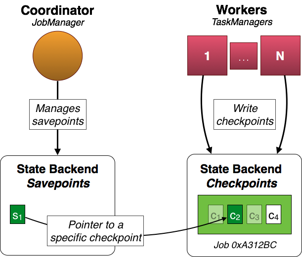

<!--
Licensed to the Apache Software Foundation (ASF) under one
or more contributor license agreements.  See the NOTICE file
distributed with this work for additional information
regarding copyright ownership.  The ASF licenses this file
to you under the Apache License, Version 2.0 (the
"License"); you may not use this file except in compliance
with the License.  You may obtain a copy of the License at

  http://www.apache.org/licenses/LICENSE-2.0

Unless required by applicable law or agreed to in writing,
software distributed under the License is distributed on an
"AS IS" BASIS, WITHOUT WARRANTIES OR CONDITIONS OF ANY
KIND, either express or implied.  See the License for the
specific language governing permissions and limitations
under the License.
-->

Programs written in the [Data Stream API]({{ site.baseurl }}/apis/streaming_guide.html) can resume execution from a **savepoint**. Savepoints allow both updating your programs and your Flink cluster without losing any state. This page covers all steps to trigger, restore, and dispose savepoints. For more details on how Flink handles state and failures, check out the [State in Streaming Programs]({{ site.baseurl }}/apis/state_backends.html) and [Fault Tolerance]({{ site.baseurl }}/apis/fault_tolerance.html) pages.

* toc
{:toc}

## Overview

Savepoints are **manually triggered checkpoints**, which take a snapshot of the program and write it out to a state backend. They rely on the regular checkpointing mechanism for this. During execution programs are periodically snapshotted on the worker nodes and produce checkpoints. For recovery only the last completed checkpoint is needed and older checkpoints can be safely discarded as soon as a new one is completed.

Savepoints are similar to these periodic checkpoints except that they are **triggered by the user** and **don't automatically expire** when newer checkpoints are completed.

In the above example the workers produce checkpoints **c1**, **c2**, **c3**, and **c4** for job *0xA312Bc*. Periodic checkpoints **c1** and **c3** have already been *discarded* and **c4** is the *latest checkpoint*. **c2 is special**. It is the state associated with the savepoint **s1** and has been triggered by the user and it doesn't expire automatically (as c1 and c3 did after the completion of newer checkpoints).

Note that **s1** is only a **pointer to the actual checkpoint data c2**. This means that the actual state is *not copied* for the savepoint and periodic checkpoint data is kept around.

## Configuration

Savepoints point to regular checkpoints and store their state in a configured [state backend]({{ site.baseurl }}/apis/state_backends.html). Currently, the supported state backends are **jobmanager** and **filesystem**. The state backend configuration for the regular periodic checkpoints is **independent** of the savepoint state backend configuration. Checkpoint data is **not copied** for savepoints, but points to the configured checkpoint state backend.

### JobManager

This is the **default backend** for savepoints.

Savepoints are stored on the heap of the job manager. They are *lost* after the job manager is shut down. This mode is only useful if you want to *stop* and *resume* your program while the **same cluster** keeps running. It is *not recommended* for production use. Savepoints are *not* part of the [job manager's highly available]({{ site.baseurl }}/setup/jobmanager_high_availability.html) state.

<pre>
savepoints.state.backend: jobmanager
</pre>

**Note**: If you don't configure a specific state backend for the savepoints, the jobmanager backend will be used.

### File system

Savepoints are stored in the configured **file system directory**. They are available between cluster instances and allow to move your program to another cluster.

<pre>
savepoints.state.backend: filesystem
savepoints.state.backend.fs.dir: hdfs:///flink/savepoints
</pre>

**Note**: If you don't configure a specific directory, the job manager backend will be used.

**Important**: A savepoint is a pointer to a completed checkpoint. That means that the state of a savepoint is not only found in the savepoint file itself, but also needs the actual checkpoint data (e.g. in a set of further files). Therefore, using the *filesystem* backend for savepoints and the *jobmanager* backend for checkpoints does not work, because the required checkpoint data won't be available after a job manager restart.

## Changes to your program

Savepoints **work out of the box**, but it is **highly recommended** that you slightly adjust your programs in order to be able to work with savepoints in future versions of your program.

For savepoints **only stateful tasks matter**. In the above example, the source and map tasks are stateful whereas the sink is not stateful. Therefore, only the state of the source and map tasks are part of the savepoint.

Each task is identified by its **generated task IDs** and **subtask index**. In the above example the state of the source (**s1**, **s2**) and map tasks (**m1**, **m2**) is identified by their respective task ID (*0xC322EC* for the source tasks and *0x27B3EF* for the map tasks) and subtask index. There is no state for the sinks (**t1**, **t2**). Their IDs therefore do not matter.

Important The IDs are generated **deterministically** from your program structure. This means that as long as your program does not change, the IDs do not change. **The only allowed changes are within the user function, e.g. you can change the implemented `MapFunction` without changing the typology**. In this case, it is straight forward to restore the state from a savepoint by mapping it back to the same task IDs and subtask indexes. This allows you to work with savepoints out of the box, but gets problematic as soon as you make changes to the topology, because they result in changed IDs and the savepoint state cannot be mapped to your program any more.

Recommended In order to be able to change your program and **have fixed IDs**, the *DataStream* API provides a method to manually specify the task IDs. Each operator provides a **`uid(String)`** method to override the generated ID. The ID is a String, which will be deterministically hashed to a 16-byte hash value. It is **important** that the specified IDs are **unique per transformation and job**. If this is not the case, job submission will fail.


DataStream<String> stream = env.
  // Stateful source (e.g. Kafka) with ID
  .addSource(new StatefulSource())
  .uid("source-id")
  .shuffle()
  // The stateful mapper with ID
  .map(new StatefulMapper())
  .uid("mapper-id")

// Stateless sink (no specific ID required)
stream.print()


## Command-line client

You control the savepoints via the [command line client]({{site.baseurl}}/apis/cli.html#savepoints).

## Current limitations

- **Parallelism**: When restoring a savepoint, the parallelism of the program has to match the parallelism of the original program from which the savepoint was drawn. There is no mechanism to re-partition the savepoint's state yet.

- **Chaining**: Chained operators are identified by the ID of the first task. It's not possible to manually assign an ID to an intermediate chained task, e.g. in the chain `[  a -> b -> c ]` only **a** can have its ID assigned manually, but not **b** or **c**. To work around this, you can [manually define the task chains](streaming_guide.html#task-chaining-and-resource-groups). If you rely on the automatic ID assignment, a change in the chaining behaviour will also change the IDs.

- **Disposing custom state handles**: Disposing an old savepoint does not work with custom state handles (if you are using a custom state backend), because the user code class loader is not available during disposal.
