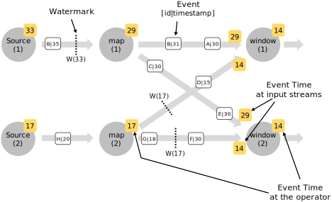

<!--
Licensed to the Apache Software Foundation (ASF) under one
or more contributor license agreements.  See the NOTICE file
distributed with this work for additional information
regarding copyright ownership.  The ASF licenses this file
to you under the Apache License, Version 2.0 (the
"License"); you may not use this file except in compliance
with the License.  You may obtain a copy of the License at

  http://www.apache.org/licenses/LICENSE-2.0

Unless required by applicable law or agreed to in writing,
software distributed under the License is distributed on an
"AS IS" BASIS, WITHOUT WARRANTIES OR CONDITIONS OF ANY
KIND, either express or implied.  See the License for the
specific language governing permissions and limitations
under the License.
-->

* toc
{:toc}

# Event Time / Processing Time / Ingestion Time

Flink supports different notions of *time* in streaming programs.

- **Processing time:** Processing time refers to the system time of the machine that is executing the
    respective operation.

    When a streaming program runs on processing time, all time-based operations (like time windows) will
    use the system clock of the machines that run the respective operator. For example, an hourly
    processing time window will include all records that arrived at a specific operator between the
    times when the system clock indicated the full hour.

    Processing time is the simplest notion of time and requires no coordination between streams and machines.
    It provides the best performance and the lowest latency. However, in distributed and asynchronous
    environments processing time does not provide determinism, because it is susceptible to the speed at which
    records arrive in the system (for example from the message queue), and to the speed at which the
    records flow between operators inside the system.

- **Event time:** Event time is the time that each individual event occurred on its producing device.
    This time is typically embedded within the records before they enter Flink and that *event timestamp*
    can be extracted from the record. An hourly event time window will contain all records that carry an
    event timestamp that falls into that hour, regardless of when the records arrive, and in what order
    they arrive.

    Event time gives correct results even on out-of-order events, late events, or on replays
    of data from backups or persistent logs. In event time, the progress of time depends on the data,
    not on any wall clocks. Event time programs must specify how to generate *Event Time Watermarks*,
    which is the mechanism that signals time progress in event time. The mechanism is
    described below.

    Event time processing often incurs a certain latency, due to it nature of waiting a certain time for
    late events and out-of-order events. Because of that, event time programs are often combined with
    *processing time* operations.

- **Ingestion time:** Ingestion time is the time that events enter Flink. At the source operator, each
    records gets the source's current time as a timestamp, and time-based operations (like time windows)
    refer to that timestamp.

    *Ingestion Time* sits conceptually in between *Event Time* and *Processing Time*. Compared to
    *Processing Time*, it is slightly more expensive, but gives more predictable results: Because
    *Ingestion Time* uses stable timestamps (assigned once at the source), different window operations
    over the records will refer to the same timestamp, whereas in *Processing Time* each window operator
    may assign the record to a different window (based on the local system clock and any transport delay).

    Compered to *Event Time*, *Ingestion Time* programs cannot handle any out-of-order events or late data,
    but the programs don't have to specify how to generate *Watermarks*.

    Internally, *Ingestion Time* is treated much like event time, with automatic timestamp assignment and
    automatic Watermark generation.

### Setting a Time Characteristic

The first part of a Flink DataStream program is usually to set the base *time characteristic*. That setting
defines how data stream sources behave (for example whether to assign timestamps), and what notion of
time the window operations like `KeyedStream.timeWindow(Time.secondss(30))` refer to.

The following example shows a Flink program that aggregates events in hourly time windows. The behavior of the
windows adapts with the time characteristic.


final StreamExecutionEnvironment env = StreamExecutionEnvironment.getExecutionEnvironment();

env.setStreamTimeCharacteristic(TimeCharacteristic.ProcessingTime);

// alternatively:
// env.setStreamTimeCharacteristic(TimeCharacteristic.IngestionTime);
// env.setStreamTimeCharacteristic(TimeCharacteristic.EventTime);

DataStream<MyEvent> stream = env.addSource(new FlinkKafkaConsumer09<MyEvent>(topic, schema, props));

stream
    .keyBy( (event) -> event.getUser() )
    .timeWindow(Time.hours(1))
    .reduce( (a, b) -> a.add(b) )
    .addSink(...);



val env = StreamExecutionEnvironment.getExecutionEnvironment

env.setStreamTimeCharacteristic(TimeCharacteristic.ProcessingTime)

// alternatively:
// env.setStreamTimeCharacteristic(TimeCharacteristic.IngestionTime)
// env.setStreamTimeCharacteristic(TimeCharacteristic.EventTime)

val stream: DataStream[MyEvent] = env.addSource(new FlinkKafkaConsumer09[MyEvent](topic, schema, props))

stream
    .keyBy( _.getUser )
    .timeWindow(Time.hours(1))
    .reduce( (a, b) => a.add(b) )
    .addSink(...)


Note that in order to run this example in *Event Time*, the program needs to use either an event time
source, or inject a *Timestamp Assigner & Watermark Generator*. Those functions describe how to access
the event timestamps, and what timely out-of-orderness the event stream exhibits.

The section below describes the general mechanism behind *Timestamps* and *Watermarks*. For a guide how
to use timestamp assignment and watermark generation in the Flink DataStream API, please refer to
[Generating Timestamps / Watermarks]({{ site.baseurl }}/apis/streaming/event_timestamps_watermarks.html)

# Event Time and Watermarks

*Note: Flink implements many techniques from the Dataflow Model. For a good introduction to Event Time and, have also a look at these articles*

  - [Streaming 101](https://www.oreilly.com/ideas/the-world-beyond-batch-streaming-101) by Tyler Akidau
  - The [Dataflow Model paper](https://static.googleusercontent.com/media/research.google.com/en//pubs/archive/43864.pdf)

A stream processor that supports *event time* needs a way to measure the progress of event time. 
For example, a window operator that builds hourly windows needs to be notified when event time has reached the
next full hour, such that the operator can close the next window.

*Event Time* can progress independently of *Processing Time* (measures by wall clocks).
For example, in one program, the current *event time* of an operator can trail slightly behind the processing time
(accounting for a delay in receiving the latest elements) and both proceed at the same speed. In another streaming
program, which reads fast-forward through some data already buffered in a Kafka topic (or another message queue), event time
can progress by weeks in seconds.

------

The mechanism in Flink to measure progress in event time are **Watermarks**.
Watermarks flow as part of the data stream and carry a timestamp *t*. A *Watermark(t)* declares that event time has reached time
*t* in that stream, meaning that all events with a timestamps *t' < t* have occurred.

The figure below shows a stream of events with (logical) timestamps, and watermarks flowing inline. The events are in order
(with respect to their timestamp), meaning that watermarks are simply periodic markers in the stream with an in-order timestamp.

Watermarks are crucial for *out-of-order* streams, as shown in the figure below, where, events do not occur ordered by their timestamp.
Watermarks establish points in the stream where all events up to a certain timestamp have occurred. Once these watermarks reach an
operator, the operator can advance its internal *event time clock* to the value of the watermark.

## Watermarks in Parallel Streams

Watermarks are generated at source functions, or directly after source functions. Each parallel subtask of a source function usually
generates its watermarks independently. These watermarks define the event time at that particular parallel source.

As the watermarks flow through the streaming program, they advance the event time at the operators where they arrive. Whenever an
operator advances its event time, it generates a new watermark downstream for its successor operators.

Operators that consume multiple input streams (e.g., after a *keyBy(...)* or *partition(...)* function, or a union) track the event time
on each of their input streams. The operator's current event time is the minimum of the input streams' event time. As the input streams
update their event time, so does the operator.

The figure below shows an example of events and watermarks flowing through parallel streams, and operators tracking event time.

## Late Elements

It is possible that certain elements violate the watermark condition, meaning that even after the *Watermark(t)* has occurred,
more elements with timestamp *t' < t* will occur. In fact, in many real world setups, certain elements can be arbitrarily
delayed, which it is impossible to define a time when all elements of a certain event timestamp have occurred.
Further more, even if the lateness can be bounded, delaying the watermarks by too much is often not desirable, because it delays
the evaluation of the event time windows by too much.

Due to that, some streaming programs will explicitly expect a number of *late* elements. Late elements are elements that
arrive after the system's event time clock (as signaled by the watermarks) has already passed the time of the late element's
timestamp.

