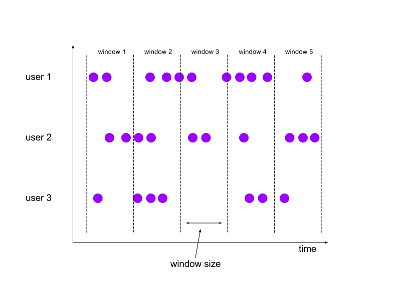
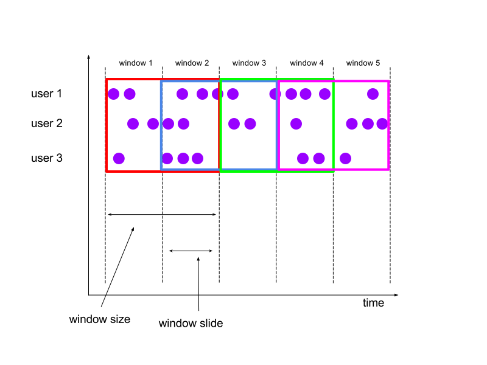
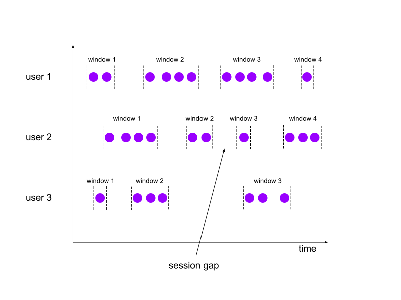

<!--
Licensed to the Apache Software Foundation (ASF) under one
or more contributor license agreements.  See the NOTICE file
distributed with this work for additional information
regarding copyright ownership.  The ASF licenses this file
to you under the Apache License, Version 2.0 (the
"License"); you may not use this file except in compliance
with the License.  You may obtain a copy of the License at

  http://www.apache.org/licenses/LICENSE-2.0

Unless required by applicable law or agreed to in writing,
software distributed under the License is distributed on an
"AS IS" BASIS, WITHOUT WARRANTIES OR CONDITIONS OF ANY
KIND, either express or implied.  See the License for the
specific language governing permissions and limitations
under the License.
-->

Flink uses a concept called *windows* to divide a (potentially) infinite `DataStream` into finite
slices based on the timestamps of elements or other criteria. This division is required when working
with infinite streams of data and performing transformations that aggregate elements.

Info We will mostly talk about *keyed windowing* here, i.e.
windows that are applied on a `KeyedStream`. Keyed windows have the advantage that elements are
subdivided based on both window and key before being given to
a user function. The work can thus be distributed across the cluster
because the elements for different keys can be processed independently. If you absolutely have to,
you can check out [non-keyed windowing](#non-keyed-windowing) where we describe how non-keyed
windows work.

* This will be replaced by the TOC
{:toc}

## Basics

For a windowed transformation you must at least specify a *key*
(see [specifying keys](/apis/common/index.html#specifying-keys)),
a *window assigner* and a *window function*. The *key* divides the infinite, non-keyed, stream
into logical keyed streams while the *window assigner* assigns elements to finite per-key windows.
Finally, the *window function* is used to process the elements of each window.

The basic structure of a windowed transformation is thus as follows:


DataStream<T> input = ...;

input
    .keyBy(<key selector>)
    .window(<window assigner>)
    .<windowed transformation>(<window function>);



val input: DataStream[T] = ...

input
    .keyBy(<key selector>)
    .window(<window assigner>)
    .<windowed transformation>(<window function>)


We will cover [window assigners](#window-assigners) in a separate section below.

The window transformation can be one of `reduce()`, `fold()` or `apply()`. Which respectively
takes a `ReduceFunction`, `FoldFunction` or `WindowFunction`. We describe each of these ways
of specifying a windowed transformation in detail below: [window functions](#window-functions).

For more advanced use cases you can also specify a `Trigger` that determines when exactly a window
is being considered as *ready for processing*. These will be covered in more detail in
[triggers](#triggers).

## Window Assigners

The window assigner specifies how elements of the stream are divided into finite slices. Flink comes
with pre-implemented window assigners for the most typical use cases, namely *tumbling windows*,
*sliding windows*, *session windows* and *global windows*, but you can implement your own by
extending the `WindowAssigner` class. All the built-in window assigners, except for the global
windows one, assign elements to windows based on time, which can either be processing time or event
time. Please take a look at our section on [event time](/apis/streaming/event_time.html) for more
information about how Flink deals with time.

Let's first look at how each of these window assigners works before looking at how they can be used
in a Flink program. We will be using abstract figures to visualize the workings of each assigner:
in the following, the purple circles are elements of the stream, they are partitioned
by some key (in this case *user 1*, *user 2* and *user 3*) and the x-axis shows the progress
of time.

### Global Windows

Global windows are a way of specifying that we don't want to subdivide our elements into windows.
Each element is assigned to one single per-key *global window*.
This windowing scheme is only useful if you also specify a custom [trigger](#triggers). Otherwise,
no computation is ever going to be performed, as the global window does not have a natural end at
which we could process the aggregated elements.

### Tumbling Windows

A *tumbling windows* assigner assigns elements to fixed length, non-overlapping windows of a
specified *window size*.. For example, if you specify a window size of 5 minutes, the window
function will get 5 minutes worth of elements in each invocation.

### Sliding Windows

The *sliding windows* assigner assigns elements to windows of fixed length equal to *window size*,
as the tumbling windows assigner, but in this case, windows can be overlapping. The size of the
overlap is defined by the user-specified parameter *window slide*. As windows are overlapping, an
element can be assigned to multiple windows

For example, you could have windows of size 10 minutes that slide by 5 minutes. With this you get 10
minutes worth of elements in each invocation of the window function and it will be invoked for every
5 minutes of data.

### Session Windows

The *session windows* assigner is ideal for cases where the window boundaries need to adjust to the
incoming data. Both the *tumbling windows* and *sliding windows* assigner assign elements to windows
that start at fixed time points and have a fixed *window size*. With session windows it is possible
to have windows that start at individual points in time for each key and that end once there has
been a certain period of inactivity. The configuration parameter is the *session gap* that specifies
how long to wait for new data before considering a session as closed.

### Specifying a Window Assigner

The built-in window assigners (except `GlobalWindows`) come in two versions. One for processing-time
windowing and one for event-time windowing. The processing-time assigners assign elements to
windows based on the current clock of the worker machines while the event-time assigners assign
windows based on the timestamps of elements. Please have a look at
[event time](/apis/streaming/event_time.html) to learn about the difference between processing time
and event time and about how timestamps can be assigned to elements.

The following code snippets show how each of the window assigners can be used in a program:


DataStream<T> input = ...;

// tumbling event-time windows
input
    .keyBy(<key selector>)
    .window(TumblingEventTimeWindows.of(Time.seconds(5)))
    .<windowed transformation>(<window function>);

// sliding event-time windows
input
    .keyBy(<key selector>)
    .window(SlidingEventTimeWindows.of(Time.seconds(10), Time.seconds(5)))
    .<windowed transformation>(<window function>);

// event-time session windows
input
    .keyBy(<key selector>)
    .window(EventTimeSessionWindows.withGap(Time.minutes(10)))
    .<windowed transformation>(<window function>);

// tumbling processing-time windows
input
    .keyBy(<key selector>)
    .window(TumblingProcessingTimeWindows.of(Time.seconds(5)))
    .<windowed transformation>(<window function>);

// sliding processing-time windows
input
    .keyBy(<key selector>)
    .window(SlidingProcessingTimeWindows.of(Time.seconds(10), Time.seconds(5)))
    .<windowed transformation>(<window function>);

// processing-time session windows
input
    .keyBy(<key selector>)
    .window(ProcessingTimeSessionWindows.withGap(Time.minutes(10)))
    .<windowed transformation>(<window function>);

// global windows
input
    .keyBy(<key selector>)
    .window(GlobalWindows.create())
    .<windowed transformation>(<window function>);



val input: DataStream[T] = ...

// tumbling event-time windows
input
    .keyBy(<key selector>)
    .window(TumblingEventTimeWindows.of(Time.seconds(5)))
    .<windowed transformation>(<window function>)

// sliding event-time windows
input
    .keyBy(<key selector>)
    .window(SlidingEventTimeWindows.of(Time.seconds(10), Time.seconds(5)))
    .<windowed transformation>(<window function>)

// event-time session windows
input
    .keyBy(<key selector>)
    .window(EventTimeSessionWindows.withGap(Time.minutes(10)))
    .<windowed transformation>(<window function>)

// tumbling processing-time windows
input
    .keyBy(<key selector>)
    .window(TumblingProcessingTimeWindows.of(Time.seconds(5)))
    .<windowed transformation>(<window function>)

// sliding processing-time windows
input
    .keyBy(<key selector>)
    .window(SlidingProcessingTimeWindows.of(Time.seconds(10), Time.seconds(5)))
    .<windowed transformation>(<window function>)

// processing-time session windows
input
    .keyBy(<key selector>)
    .window(ProcessingTimeSessionWindows.withGap(Time.minutes(10)))
    .<windowed transformation>(<window function>)

// global windows
input
    .keyBy(<key selector>)
    .window(GlobalWindows.create())


Note, how we can specify a time interval by using one of `Time.milliseconds(x)`, `Time.seconds(x)`,
`Time.minutes(x)`, and so on.

## Window Functions

The *window function* is used to process the elements of each window (and key) once the system
determines that a window is ready for processing (see [triggers](#triggers) for how the system
determines when a window is ready).

The window function can be one of `ReduceFunction`, `FoldFunction` or `WindowFunction`. The first
two can be executed more efficiently because Flink can incrementally aggregate the elements for each
window as they arrive. A `WindowFunction` gets an `Iterable` for all the elements contained in a
window and additional meta information about the window to which the elements belong.

A windowed transformation with a `WindowFunction` cannot be executed as efficiently as the other
cases because Flink has to buffer *all* elements for a window internally before invoking the function.
This can be mitigated by combining a `WindowFunction` with a `ReduceFunction` or `FoldFunction` to
get both incremental aggregation of window elements and the additional information that the
`WindowFunction` receives. We will look at examples for each of these variants.

### ReduceFunction

A reduce function specifies how two values can be combined to form one element. Flink can use this
to incrementally aggregate the elements in a window.

A `ReduceFunction` can be used in a program like this:


DataStream<Tuple2<String, Long>> input = ...;

input
    .keyBy(<key selector>)
    .window(<window assigner>)
    .reduce(new ReduceFunction<Tuple2<String, Long>> {
      public Tuple2<String, Long> reduce(Tuple2<String, Long> v1, Tuple2<String, Long> v2) {
        return new Tuple2<>(v1.f0, v1.f1 + v2.f1);
      }
    });



val input: DataStream[(String, Long)] = ...

input
    .keyBy(<key selector>)
    .window(<window assigner>)
    .reduce { (v1, v2) => (v1._1, v1._2 + v2._2) }


A `ReduceFunction` specifies how two elements from the input can be combined to produce
an output element. This example will sum up the second field of the tuple for all elements
in a window.

### FoldFunction

A fold function can be specified like this:


DataStream<Tuple2<String, Long>> input = ...;

input
    .keyBy(<key selector>)
    .window(<window assigner>)
    .fold("", new FoldFunction<Tuple2<String, Long>, String>> {
       public String fold(String acc, Tuple2<String, Long> value) {
         return acc + value.f1;
       }
    });



val input: DataStream[(String, Long)] = ...

input
    .keyBy(<key selector>)
    .window(<window assigner>)
    .fold("") { (acc, v) => acc + v._2 }


A `FoldFunction` specifies how elements from the input will be added to an initial
accumulator value (`""`, the empty string, in our example). This example will compute
a concatenation of all the `Long` fields of the input.

### WindowFunction - The Generic Case

Using a `WindowFunction` provides most flexibility, at the cost of performance. The reason for this
is that elements cannot be incrementally aggregated for a window and instead need to be buffered
internally until the window is considered ready for processing. A `WindowFunction` gets an
`Iterable` containing all the elements of the window being processed. The signature of
`WindowFunction` is this:


public interface WindowFunction<IN, OUT, KEY, W extends Window> extends Function, Serializable {

  /**
   * Evaluates the window and outputs none or several elements.
   *
   * @param key The key for which this window is evaluated.
   * @param window The window that is being evaluated.
   * @param input The elements in the window being evaluated.
   * @param out A collector for emitting elements.
   *
   * @throws Exception The function may throw exceptions to fail the program and trigger recovery.
   */
  void apply(KEY key, W window, Iterable<IN> input, Collector<OUT> out) throws Exception;
}



public interface WindowFunction<IN, OUT, KEY, W extends Window> extends Function, Serializable {

  /**
   * Evaluates the window and outputs none or several elements.
   *
   * @param key The key for which this window is evaluated.
   * @param window The window that is being evaluated.
   * @param input The elements in the window being evaluated.
   * @param out A collector for emitting elements.
   *
   * @throws Exception The function may throw exceptions to fail the program and trigger recovery.
   */
  void apply(KEY key, W window, Iterable<IN> input, Collector<OUT> out) throws Exception;
}


Here we show an example that uses a `WindowFunction` to count the elements in a window. We do this
because we want to access information about the window itself to emit it along with the count.
This is very inefficient, however, and should be implemented with a
`ReduceFunction` in practice. Below, we will see an example of how a `ReduceFunction` can
be combined with a `WindowFunction` to get both incremental aggregation and the added
information of a `WindowFunction`.


DataStream<Tuple2<String, Long>> input = ...;

input
    .keyBy(<key selector>)
    .window(<window assigner>)
    .apply(new MyWindowFunction());

/* ... */

public class MyWindowFunction implements WindowFunction<Tuple<String, Long>, String, String, TimeWindow> {

  void apply(String key, TimeWindow window, Iterable<Tuple<String, Long>> input, Collector<String> out) {
    long count = 0;
    for (Tuple<String, Long> in: input) {
      count++;
    }
    out.collect("Window: " + window + "count: " + count);
  }
}




val input: DataStream[(String, Long)] = ...

input
    .keyBy(<key selector>)
    .window(<window assigner>)
    .apply(new MyWindowFunction())

/* ... */

class MyWindowFunction extends WindowFunction[(String, Long), String, String, TimeWindow] {

  def apply(key: String, window: TimeWindow, input: Iterable[(String, Long)], out: Collector[String]): () = {
    var count = 0L
    for (in <- input) {
      count = count + 1
    }
    out.collect(s"Window $window count: $count")
  }
}


### WindowFunction with Incremental Aggregation

A `WindowFunction` can be combined with either a `ReduceFunction` or a `FoldFunction`. When doing
this, the `ReduceFunction`/`FoldFunction` will be used to incrementally aggregate elements as they
arrive while the `WindowFunction` will be provided with the aggregated result when the window is
ready for processing. This allows to get the benefit of incremental window computation and also have
the additional meta information that writing a `WindowFunction` provides.

This is an example that shows how incremental aggregation functions can be combined with
a `WindowFunction`.


DataStream<Tuple2<String, Long>> input = ...;

// for folding incremental computation
input
    .keyBy(<key selector>)
    .window(<window assigner>)
    .apply(<initial value>, new MyFoldFunction(), new MyWindowFunction());

// for reducing incremental computation
input
    .keyBy(<key selector>)
    .window(<window assigner>)
    .apply(new MyReduceFunction(), new MyWindowFunction());



val input: DataStream[(String, Long)] = ...

// for folding incremental computation
input
    .keyBy(<key selector>)
    .window(<window assigner>)
    .apply(<initial value>, new MyFoldFunction(), new MyWindowFunction())

// for reducing incremental computation
input
    .keyBy(<key selector>)
    .window(<window assigner>)
    .apply(new MyReduceFunction(), new MyWindowFunction())


## Dealing with Late Data

When working with event-time windowing it can happen that elements arrive late, i.e the
watermark that Flink uses to keep track of the progress of event-time is already past the
end timestamp of a window to which an element belongs. Please
see [event time](/apis/streaming/event_time.html) and especially
[late elements](/apis/streaming/event_time.html#late-elements) for a more thorough discussion of
how Flink deals with event time.

You can specify how a windowed transformation should deal with late elements and how much lateness
is allowed. The parameter for this is called *allowed lateness*. This specifies by how much time
elements can be late. Elements that arrive within the allowed lateness are still put into windows
and are considered when computing window results. If elements arrive after the allowed lateness they
will be dropped. Flink will also make sure that any state held by the windowing operation is garbage
collected once the watermark passes the end of a window plus the allowed lateness.

Default By default, the allowed lateness is set to
`0`. That is, elements that arrive behind the watermark will be dropped.

You can specify an allowed lateness like this:


DataStream<T> input = ...;

input
    .keyBy(<key selector>)
    .window(<window assigner>)
    .allowedLateness(<time>)
    .<windowed transformation>(<window function>);



val input: DataStream[T] = ...

input
    .keyBy(<key selector>)
    .window(<window assigner>)
    .allowedLateness(<time>)
    .<windowed transformation>(<window function>)


Note When using the `GlobalWindows` window assigner no
data is ever considered late because the end timestamp of the global window is `Long.MAX_VALUE`.

## Triggers

A `Trigger` determines when a window (as assigned by the `WindowAssigner`) is ready for being
processed by the *window function*. The trigger observes how elements are added to windows
and can also keep track of the progress of processing time and event time. Once a trigger
determines that a window is ready for processing, it fires. This is the signal for the
window operation to take the elements that are currently in the window and pass them along to
the window function to produce output for the firing window.

Each `WindowAssigner` (except `GlobalWindows`) comes with a default trigger that should be
appropriate for most use cases. For example, `TumblingEventTimeWindows` has an `EventTimeTrigger` as
default trigger. This trigger simply fires once the watermark passes the end of a window.

You can specify the trigger to be used by calling `trigger()` with a given `Trigger`. The
whole specification of the windowed transformation would then look like this:


DataStream<T> input = ...;

input
    .keyBy(<key selector>)
    .window(<window assigner>)
    .trigger(<trigger>)
    .<windowed transformation>(<window function>);



val input: DataStream[T] = ...

input
    .keyBy(<key selector>)
    .window(<window assigner>)
    .trigger(<trigger>)
    .<windowed transformation>(<window function>)


Flink comes with a few triggers out-of-box: there is the already mentioned `EventTimeTrigger` that
fires based on the progress of event-time as measured by the watermark, the `ProcessingTimeTrigger`
does the same but based on processing time and the `CountTrigger` fires once the number of elements
in a window exceeds the given limit.

Attention By specifying a trigger using `trigger()` you
are overwriting the default trigger of a `WindowAssigner`. For example, if you specify a
`CountTrigger` for `TumblingEventTimeWindows` you will no longer get window firings based on the
progress of time but only by count. Right now, you have to write your own custom trigger if
you want to react based on both time and count.

The internal `Trigger` API is still considered experimental but you can check out the code
if you want to write your own custom trigger:
.

## Non-keyed Windowing

You can also leave out the `keyBy()` when specifying a windowed transformation. This means, however,
that Flink cannot process windows for different keys in parallel, essentially turning the
transformation into a non-parallel operation.

Warning As mentioned in the introduction, non-keyed
windows have the disadvantage that work cannot be distributed in the cluster because
windows cannot be computed independently per key. This can have severe performance implications.

The basic structure of a non-keyed windowed transformation is as follows:


DataStream<T> input = ...;

input
    .windowAll(<window assigner>)
    .<windowed transformation>(<window function>);



val input: DataStream[T] = ...

input
    .windowAll(<window assigner>)
    .<windowed transformation>(<window function>)


