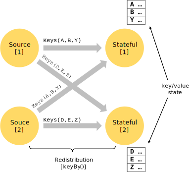

<!--
Licensed to the Apache Software Foundation (ASF) under one
or more contributor license agreements.  See the NOTICE file
distributed with this work for additional information
regarding copyright ownership.  The ASF licenses this file
to you under the Apache License, Version 2.0 (the
"License"); you may not use this file except in compliance
with the License.  You may obtain a copy of the License at

  http://www.apache.org/licenses/LICENSE-2.0

Unless required by applicable law or agreed to in writing,
software distributed under the License is distributed on an
"AS IS" BASIS, WITHOUT WARRANTIES OR CONDITIONS OF ANY
KIND, either express or implied.  See the License for the
specific language governing permissions and limitations
under the License.
-->

* This will be replaced by the TOC
{:toc}

## Programs and Dataflows

The basic building blocks of Flink programs are **streams** and **transformations** (note that a DataSet is internally
also a stream). A *stream* is an intermediate result, and a *transformation* is an operation that takes one or more streams
as input, and computes one or more result streams from them.

When executed, Flink programs are mapped to **streaming dataflows**, consisting of **streams** and transformation **operators**.
Each dataflow starts with one or more **sources** and ends in one or more **sinks**. The dataflows may resemble
arbitrary **directed acyclic graphs** *(DAGs)*. (Special forms of cycle is permitted via *iteration* constructs, we
omit this here for simplicity).

In most cases, there is a one-to-one correspondence between the transformations in the programs and the operators
in the dataflow. Sometimes, however, one transformation may consist of multiple transformation operators.



### Parallel Dataflows

Programs in Flink are inherently parallel and distributed. *Streams* are split into **stream partitions** and 
*operators* are split into **operator subtasks**. The operator subtasks execute independently from each other,
in different threads and on different machines or containers.

The number of operator subtasks is the **parallelism** of that particular operator. The parallelism of a stream
is always that of its producing operator. Different operators of the program may have a different parallelism.

Streams can transport data between two operators in a *one-to-one* (or *forwarding*) pattern, or in a *redistributing* pattern:

  - **One-to-one** streams (for example between the *source* and the *map()* operators) preserves partitioning and order of
    elements. That means that subtask[1] of the *map()* operator will see the same elements in the same order, as they
    were produced by subtask[1] of the *source* operator.

  - **Redistributing** streams (between *map()* and *keyBy/window*, as well as between *keyBy/window* and *sink*) change
    the partitioning of streams. Each *stream partition* splits itself up and sends data to different target subtasks,
    depending on the selected transformation. Examples are *keyBy()* (re-partitions by hash code), *broadcast()*, or
    *rebalance()* (random redistribution). 
    In a *redistributing* exchange, order among elements is only preserved for each pair of sending- and receiving
    task (for example subtask[1] of *map()* and subtask[2] of *keyBy/window*).



### Tasks & Operator Chains

For the distributed execution, Flink *chains* operator subtasks together into *tasks*. Each task is executed by one thread.
Chaining operators together into tasks is a useful optimization: it reduces the overhead of thread-to-thread
handover and buffering, and increases overall throughput while decreasing latency.
The chaining behavior can be configured in the APIs.

The sample dataflow in the figure below is executed with five subtasks, and hence with five parallel threads.



## Distributed Execution

**Master, Worker, Client**

The Flink runtime consists of two types of processes:

  - The **master** processes (also called *JobManagers*) coordinate the distributed execution. They schedule tasks, coordinate
    checkpoints, coordinate recovery on failures, etc.

    There is always at least one master process. A high-availability setup will have multiple master processes, out of
    which one is always the *leader*, and the others are *standby*.

  - The **worker** processes (also called *TaskManagers*) execute the *tasks* (or more specifically, the subtasks) of a dataflow,
    and buffer and exchange the data *streams*.
     
    There must always be at least one worker process.

The master and worker processes can be started in an arbitrary fashion: Directly on the machines, via containers, or via
resource frameworks like YARN. Workers connect to masters, announcing themselves as available, and get work assigned.

The **client** is not part of the runtime and program execution, but is used to prepare and send to dataflow to the master.
After that, the client can disconnect, or stay connected to receive progress reports. The client runs either as part of the
Java/Scala program that triggers the execution, or in the command line process `./bin/flink run ...`.



### Workers, Slots, Resources

Each worker (TaskManager) is a *JVM process*, and may execute one or more subtasks in separate threads.
To control how many tasks a worker accepts, a worker has so called **task slots** (at least one).

Each *task slot* is a fix subset of resources of the TaskManager. A TaskManager with three slots, for example,
will dedicate 1/3 of its managed memory to each slot. Slotting the resources means that a subtask will not
compete with subtasks from other jobs for managed memory, but that the subtask a certain amount of reserved
managed memory. Note that no CPU isolation happens here, slots currently only separate managed memory of tasks.

Adjusting the number of task slots thus allows users to define how subtasks are isolated against each other.
Having one slot per TaskManager means each task group runs in a separate JVM (which can be started in a
separate container, for example). Having multiple slots
means more subtasks share the same JVM. Tasks in the same JVM share TCP connections (via multiplexing) and
heartbeats messages, or may shared data sets and data structures, thus reducing the per-task overhead.

By default, Flink allows subtasks to share slots, if they are subtasks of different tasks, but from the same
job. The result is that one slot may hold an entire pipeline of the job. Allowing this *slot sharing*
has two main benefits:

  - A Flink cluster needs exactly as many tasks slots, as the highest parallelism used in the job.
    No need to calculate how many tasks (with varying parallelism) a program contains in total.

  - It is easier to get better resource utilization. Without slot sharing, the non-intensive
    *source/map()* subtasks would block as many resources as the resource intensive *window* subtasks.
    With slot sharing, increasing the base parallelism from two to six yields full utilization of the
    slotted resources, while still making sure that each TaskManager gets only a fair share of the
    heavy subtasks.

The slot sharing behavior can be controlled in the APIs, to prevent sharing where it is undesirable.
The mechanism for that are the *resource groups*, which define what (sub)tasks may share slots.

As a rule-of-thumb, a good default number of task slots would be the number of CPU cores.
With hyper threading, each slot then takes 2 or more hardware thread contexts.



## Time and Windows

Aggregating events (e.g., counts, sums) work slightly differently on streams than in batch processing.
For example, it is impossible to first count all elements in the stream and then return the count,
because streams are in general infinite (unbounded). Instead, aggregates on streams (counts, sums, etc),
are scoped by **windows**, such as *"count over the last 5 minutes"*, or *"sum of the last 100 elements"*.

Windows can be *time driven* (example: every 30 seconds) or *data driven* (example: every 100 elements).
One typically distinguishes different types of windows, such as *tumbling windows* (no overlap),
*sliding windows* (with overlap), and *session windows* (gap of activity).

More window examples can be found in this [blog post](https://flink.apache.org/news/2015/12/04/Introducing-windows.html).



### Time

When referring to time in a streaming program (for example to define windows), one can refer to different notions
of time:

  - **Event Time** is the time when an event was created. It is usually described by a timestamp in the events,
    for example attached by the producing sensor, or the producing service. Flink accesses event timestamps
    via [timestamp assigners]({{ site.baseurl }}/apis/streaming/event_timestamps_watermarks.html).

  - **Ingestion time** is the time when an event enters the Flink dataflow at the source operator.

  - **Processing Time** is the local time at each operator that performs a time-based operation.

More details on how to handle time are in the [event time docs]({{ site.baseurl }}/apis/streaming/event_time.html).



## State and Fault Tolerance

While many operations in a dataflow simply look at one individual *event at a time* (for example an event parser),
some operations remember information across individual events (for example window operators).
These operations are called **stateful**.

The state from stateful operation is maintained in what can be thought of as an embedded key/value store.
The state is partitioned and distributed strictly together with the streams that are read by the
stateful operators. Hence, access the key/value state is only possible on *keyed streams*, after a *keyBy()* function,
and is restricted to the values of the current event's key. Aligning the keys of streams and state
makes sure that all state updates are local operations, guaranteeing consistency without transaction overhead.
This alignment also allows Flink to redistribute the state and adjust the stream partitioning transparently.



### Checkpoints for Fault Tolerance

Flink implements fault tolerance using a combination of **stream replay** and **checkpoints**. A checkpoint
defines a consistent point in streams and state from which an streaming dataflow can resume, and maintain consistency
*(exactly-once processing semantics)*. The events and state update since the last checkpoint are replayed from the input streams.

Checkpoints interval is a means of trading off the overhead of fault tolerance during execution, with the recovery time (the amount
of events that need to be replayed).

More details on checkpoints and fault tolerance are in the [fault tolerance docs]({{ site.baseurl }}/internals/stream_checkpointing.html/).



### State Backends

The exact data structures in which the key/values indexes are stored depend on the chosen **state backend**. One state backend
stores data in an in-memory hash map, another state backend uses [RocksDB](http://rocksdb.org) as the key/value index.
In addition to defining the data structure that holds the state, the state backends also implements the logic to
take a point-in-time snapshot of the key/value state and store that snapshot as part of a checkpoint.



## Batch on Streaming

Flink executes batch programs as a special case of streaming programs, where the streams are bounded (finite number of elements).
A *DataSet* is treated internally as a stream of data. The concepts above thus apply to batch programs in the
same way as well as they apply to streaming programs, with minor exceptions:

  - Programs in the DataSet API do not use checkpoints. Recovery happens by fully replaying the streams.
    That is possible, because inputs are bounded. This pushes the cost more towards the recovery,
    but makes the regular processing cheaper, because it avoids checkpoints.

  - Stateful operation in the DataSet API use simplified in-memory/out-of-core data structures, rather than
    key/value indexes.

  - The DataSet API introduces special synchronized (superstep-based) iterations, which are only possible on
    bounded streams. For details, check out the [iteration docs]({{ site.baseurl }}/apis/batch/iterations.html).


