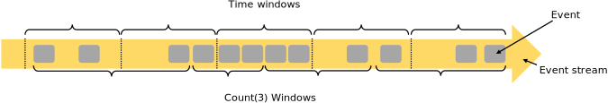

<!-- Licensed to the Apache Software Foundation (ASF) under one or more contributor license agreements. See the NOTICE file distributed with this work for additional information regarding copyright ownership. The ASF licenses this file to you under the Apache License, Version 2.0 (the "License"); you may not use this file except in compliance with the License. You may obtain a copy of the License at http://www.apache.org/licenses/LICENSE-2.0 Unless required by applicable law or agreed to in writing, software distributed under the License is distributed on an "AS IS" BASIS, WITHOUT WARRANTIES OR CONDITIONS OF ANY KIND, either express or implied. See the License for the specific language governing permissions and limitations under the License. -->

* This will be replaced by the TOC
{:toc}

## Levels of Abstraction

Flink offers different levels of abstraction to develop streaming/batch applications.

-   The lowest level abstraction offers **stateful streaming**. It is embedded into the [DataStream API]({{site.baseurl}}/dev/datastream_api.html) via the [Process Function]({{site.baseurl}}/dev/stream/operators/process_function.html). It allows users freely process events from one or more streams, and use consistent fault tolerant _state_. Users can also register event time and processing time callbacks, allowing programs to realize sophisticated computations.

-   In practice, most applications would not need the low level abstraction, but would instead program against the **Core APIs** like the [DataStream API]({{site.baseurl}}/dev/datastream_api.html) for bounded or unbounded streams, and the [DataSet API]({{site.baseurl}}/dev/batch/index.html) for bounded data sets. These fluent APIs offer the common building blocks for data processing, like forms of user-specified transformations, joins, aggregations, windows, state, etc. Each respective programming language represents data types processed by these APIs as classes.

    The low level _Process Function_ integrates with the _DataStream API_, making it possible to access the lower level abstraction for certain operations. The _DataSet API_ offers additional primitives on bounded data sets, like loops or iterations.

-   The **Table API** is a declarative DSL centered around _tables_, which may be dynamically changing tables (when representing streams). The [Table API]({{site.baseurl}}/dev/table_api.html) follows the (extended) relational model. Tables have a schema attached (similar to tables in relational databases) and the API offers comparable operations, such as select, project, join, group-by, aggregate, etc. Table API programs declaratively define _what logical operation should be performed_ rather than specifying _how the code for the operation looks_. Though the Table API is extensible by user-defined functions, it is less expressive than the _Core APIs_, but more concise to use (less code to write). In addition, Table API programs also go through an optimizer that applies optimization rules before execution.

    You can seamlessly convert between tables and _DataStream_/_DataSet_, allowing programs to mix the _Table API_ with the _DataStream_ and _DataSet_ APIs.

-   The highest level abstraction offered by Flink is **SQL**. This abstraction is similar to the _Table API_ both in semantics and expressiveness, but represents programs as SQL query expressions. The [SQL]({{site.baseurl}}/dev/table_api.html#sql) abstraction interacts closely with the Table API, and you can execute SQL queries over tables defined in the _Table API_.

## Programs and Dataflows

The basic building blocks of Flink programs are **streams** and **transformations**. The DataSets used in Flink's DataSet API are also streams internally. Conceptually a _stream_ is a (potentially never-ending) flow of data records, and a _transformation_ is an operation that takes one or more streams as input, and produces one or more output streams as a result.

When executed, Flink programs are mapped to **streaming dataflows**, consisting of **streams** and transformation **operators**. Each dataflow starts with one or more **sources** and ends in one or more **sinks**. The dataflows resemble arbitrary **directed acyclic graphs** _(DAGs)_. Although special forms of cycles are permitted via _iteration_ constructs, we will gloss over this for simplicity.

Often there is a one-to-one correspondence between the transformations in the programs and the operators in the dataflow. Sometimes, one transformation may consist of multiple transformation operators.

Read more about sources and sinks in the [streaming connectors]({{site.baseurl}}/dev/connectors/index.html) and [batch connectors]({{site.baseurl}}/dev/batch/connectors.html) documentation. Read more about transformations in the [DataStream operators]({{site.baseurl}}/dev/stream/operators/index.html) and [DataSet transformations]({{site.baseurl}}/dev/batch/dataset_transformations.html) documentation.



## Parallel Dataflows

Programs in Flink are inherently parallel and distributed. During execution, a _stream_ has one or more **stream partitions**, and each _operator_ has one or more **operator subtasks**. The operator subtasks are independent of one another, execute in different threads and possibly on different machines or containers.

The number of operator subtasks is the **parallelism** of that particular operator. The parallelism of a stream is always that of its producing operator. Different operators of the same program may have different levels of parallelism.

Streams can transport data between two operators in a _one-to-one_ (or _forwarding_) pattern, or in a _redistributing_ pattern:

-   **One-to-one** streams (for example between the _Source_ and the _map()_ operators in the figure above) preserve the partitioning and ordering of the elements. That means that subtask[1] of the _map()_ operator will see the same elements in the same order as they were produced by subtask[1] of the _Source_ operator.

-   **Redistributing** streams (as between _map()_ and _keyBy/window_ above, as well as between _keyBy/window_ and _Sink_) change the partitioning of streams. Each _operator subtask_ sends data to different target subtasks, depending on the selected transformation. Examples are _keyBy()_ (which re-partitions by hashing the key), _broadcast()_, or _rebalance()_ (which re-partitions randomly). In a _redistributing_ exchange the ordering among the elements is only preserved within each pair of sending and receiving subtasks (for example, subtask[1] of _map()_ and subtask[2] of _keyBy/window_). So in this example, the ordering within each key is preserved, but the parallelism does introduce non-determinism regarding the order in which the aggregated results for different keys arrive at the sink.

Details about configuring and controlling parallelism can be found in the docs on [parallel execution]({{site.baseurl}}/dev/parallel.html).



## Windows

Aggregating events (e.g., counts, sums) works differently on streams than in batch processing. For example, it is impossible to count all elements in a stream, because streams are typically infinite (unbounded). Instead, aggregates on streams (counts, sums, etc), are scoped by **windows**, such as _"count over the last 5 minutes"_, or _"sum of the last 100 elements"_.

Windows can be _time driven_ (example: every 30 seconds) or _data driven_ (example: every 100 elements). You typically distinguish different types of windows, such as _tumbling windows_ (no overlap), _sliding windows_ (with overlap), and _session windows_ (punctuated by a gap of inactivity).

You can find more window examples in this [blog post](https://flink.apache.org/news/2015/12/04/Introducing-windows.html), and more details are in the [window docs]({{site.baseurl}}/dev/stream/operators/windows.html).



## Time

Time in a streaming program (for example to define windows) can refer to three different notions of time:

-   **Event Time** is the time when an event was created. It is usually described by a timestamp in the events, for example attached by the producing sensor, or the producing service. Flink accesses event timestamps via [timestamp assigners]({{ site.baseurl }}/dev/event_timestamps_watermarks.html).

-   **Ingestion time** is the time when an event enters the Flink dataflow at the source operator.

-   **Processing Time** is the local time at each operator that performs a time-based operation.

You can find more details on how to handle time in the [event time]({{ site.baseurl }}/dev/event_time.html) documentation.



## Stateful Operations

While many operations in a dataflow look at one individual _event at a time_ (for example an event parser), some operations remember information across events (for example window operators). These operations are called **stateful** events.

The state of stateful operations is maintained in a form of embedded key/value store. The state is partitioned and distributed strictly together with the streams that are read by the stateful operators. Hence, access to the key/value state is only possible on _keyed streams_, after a _keyBy()_ function, and is restricted to the values associated with the current event's key. Aligning the keys of streams and state makes sure that all state updates are local operations, guaranteeing consistency without transaction overhead. This alignment also allows Flink to redistribute the state and adjust the stream partitioning transparently.

You can find more information in the [state]({{site.baseurl}}/dev/stream/state/index.html) documentation.



## Checkpoints for Fault Tolerance

Flink implements fault tolerance using a combination of **stream replay** and **checkpointing**. A checkpoint is related to a specific point in each of the input streams along with the corresponding state for each of the operators. You can resume a streaming dataflow from a checkpoint while maintaining consistency _(exactly-once processing semantics)_ by restoring the state of the operators and replaying the events from the point of the checkpoint.

The checkpoint interval is a means of trading off the overhead of fault tolerance during execution with the recovery time (the number of events that need to be replayed).

The description of the [fault tolerance internals]({{ site.baseurl }}/internals/stream_checkpointing.html) provides more information about how Flink manages checkpoints and related topics. You can find details about enabling and configuring checkpointing in the [checkpointing API]({{site.baseurl}}/dev/stream/state/checkpointing.html) documentation.



## Batch on Streaming

Flink executes [batch programs]({{site.baseurl}}/dev/batch/index.html) as a special case of streaming programs, where the streams are bounded (finite number of elements). A _DataSet_ is treated internally as a stream of data. The concepts above thus apply to batch programs in the same way as well as they apply to streaming programs, with minor exceptions:

-   [Fault tolerance for batch programs]({{site.baseurl}}/dev/batch/fault_tolerance.html) does not use checkpointing. Recovery happens by fully replaying the streams. This is possible, because inputs are bounded. This pushes the cost more towards the recovery, but makes the regular processing cheaper, because it avoids checkpoints.

-   Stateful operations in the DataSet API use simplified in-memory/out-of-core data structures, rather than key/value indexes.

-   The DataSet API introduces special synchronized (superstep-based) iterations, which are only possible on bounded streams. For details, check out the [iteration docs]({{ site.baseurl }}/dev/batch/iterations.html).



## Next Steps

Continue with the basic concepts in Flink's [Distributed Runtime](runtime.html).
