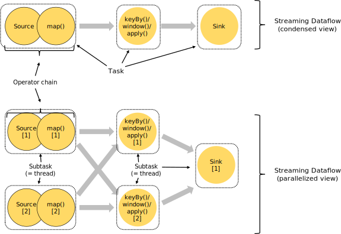
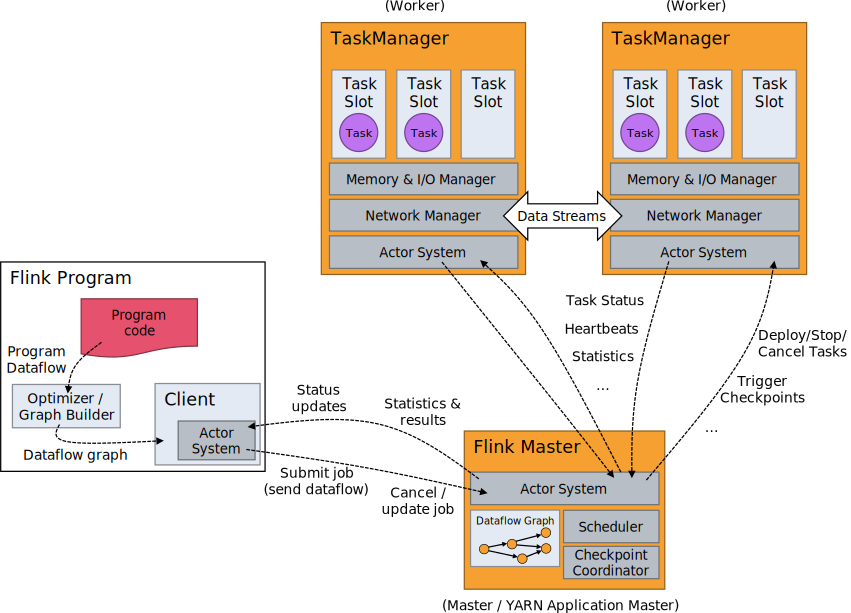
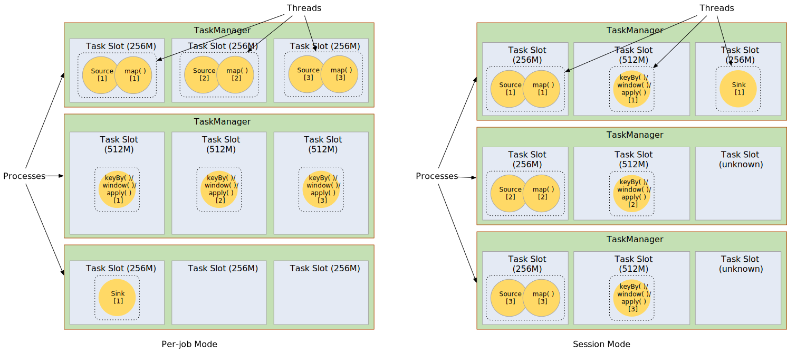

<!--
Licensed to the Apache Software Foundation (ASF) under one
or more contributor license agreements.  See the NOTICE file
distributed with this work for additional information
regarding copyright ownership.  The ASF licenses this file
to you under the Apache License, Version 2.0 (the
"License"); you may not use this file except in compliance
with the License.  You may obtain a copy of the License at

  http://www.apache.org/licenses/LICENSE-2.0

Unless required by applicable law or agreed to in writing,
software distributed under the License is distributed on an
"AS IS" BASIS, WITHOUT WARRANTIES OR CONDITIONS OF ANY
KIND, either express or implied.  See the License for the
specific language governing permissions and limitations
under the License.
-->

* This will be replaced by the TOC
{:toc}

## Tasks and Operator Chains

For distributed execution, Flink *chains* operator subtasks together into *tasks*. Each task is executed by one thread.
Chaining operators together into tasks is a useful optimization: it reduces the overhead of thread-to-thread
handover and buffering, and increases overall throughput while decreasing latency.
The chaining behavior can be configured; see the [chaining docs](../dev/stream/operators/#task-chaining-and-resource-groups) for details.

The sample dataflow in the figure below is executed with five subtasks, and hence with five parallel threads.

In the original *chain* version, the operator after head must be *OneInputStreamOperator*. The operator structure in *chain* is linear or tree-like.
Currently as an extension, we support *TwoInputStreamOperator* at any position in *chain*. The operator structure in *chain* becomes a DAG.
This behavior also can be configured, see [chaining docs](../dev/stream/operators/#task-chaining-and-resource-groups).
The figure below describes a typical scenario.

**Attention**: the current implementation is not completed yet since there are some trial functions need to support better.
The main reason is that there is a conflict between *EXACTLY_ONCE* checkpoint mode and input dynamic selection of *TwoInputStreamOperator*.



## Job Managers, Task Managers, Clients

The Flink runtime consists of two types of processes:

  - The **JobManagers** (also called *masters*) coordinate the distributed execution. They schedule tasks, coordinate
    checkpoints, coordinate recovery on failures, etc.

    There is always at least one Job Manager. A high-availability setup will have multiple JobManagers, one of
    which is always the *leader*, and the others are *standby*.

  - The **TaskManagers** (also called *workers*) execute the *tasks* (or more specifically, the subtasks) of a dataflow,
    and buffer and exchange the data *streams*.

    There must always be at least one TaskManager.

The JobManagers and TaskManagers can be started in various ways: directly on the machines as a [standalone cluster](../ops/deployment/cluster_setup.html), in
containers, or managed by resource frameworks like [YARN](../ops/deployment/yarn_setup.html) or [Mesos](../ops/deployment/mesos.html).
TaskManagers connect to JobManagers, announcing themselves as available, and are assigned work.

The **client** is not part of the runtime and program execution, but is used to prepare and send a dataflow to the JobManager.
After that, the client can disconnect, or stay connected to receive progress reports. The client runs either as part of the
Java/Scala program that triggers the execution, or in the command line process `./bin/flink run ...`.



## Task Slots and Resources

Each worker (TaskManager) is a *JVM process*, and may execute one or more subtasks in separate threads.
To control how many tasks a worker accepts, a worker has so called **task slots** (at least one).

Each *task slot* represents a subset of resources of the TaskManager.
**Resource profiles** quantitatively describe the resources of each task slot: CPU cores, memory size (heap, direct, native, network and managed).
The resources of a task slot can be either defined at starting of the TaskManager (in *per-job* mode), or dynamically decided when scheduling tasks onto the slot (in *session* mode).
A special *unknown* resource profile is used for task slots whose resources could not (or not yet) be decided.

By adjusting the number of task slots and resource profile of each slot, users can define how subtasks are isolated from each other and the amount of resources they should use.
Having one slot per TaskManager means each task group runs in a separate JVM (which can be started in a separate container, for example).
Having multiple slots means more subtasks share the same JVM.
Tasks in the same JVM share TCP connections (via multiplexing) and heartbeat messages.
They may also share data sets and data structures, thus reducing the per-task overhead.

In perjob mode, the TaskManagers are started on demand, and resources of both TaskManagers and slots are dynamically calculated on starting.
In session mode, the TaskManagers are started with configured resources at the very beginning, while the resources of slots remain *unknown* until allocated.
More details of resource management could be found in [TaskManager Resource](../internals/taskmanager_resource.html).

Note that while the quantitative resource management helps balancing workloads over TaskManagers, there is no resource isolation between tasks running on the same TaskManager.

In cases where the resources needed for running individual tasks can not be well estimated, a **slot sharing** based scheduling strategy can be used.
Flink allows subtasks to share slots even if they are subtasks of different tasks, so long as
they are from the same job. The result is that one slot may hold an entire pipeline of the
job. Allowing this *slot sharing* has two main benefits:

  - A Flink cluster needs exactly as many task slots as the highest parallelism used in the job.
    No need to calculate how many tasks (with varying parallelism) a program contains in total.

  - It is easier to get better resource utilization. Without slot sharing, the non-intensive
    *source/map()* subtasks would block as many resources as the resource intensive *window* subtasks.
    With slot sharing, increasing the base parallelism in our example from two to six yields full utilization of the
    slotted resources, while making sure that the heavy subtasks are fairly distributed among the TaskManagers.

The APIs also include a *[resource group](../dev/stream/operators/#task-chaining-and-resource-groups)* mechanism which can be used to prevent undesirable slot sharing.

As a rule-of-thumb, a good default number of task slots would be the number of CPU cores.
With hyper-threading, each slot then takes 2 or more hardware thread contexts.



## State Backends

The exact data structures in which the key/values indexes are stored depends on the chosen [state backend](../ops/state/state_backends.html). One state backend
stores data in an in-memory hash map, another state backend uses [RocksDB](http://rocksdb.org) as the key/value store.
In addition to defining the data structure that holds the state, the state backends also implement the logic to
take a point-in-time snapshot of the key/value state and store that snapshot as part of a checkpoint.



## Savepoints

Programs written in the Data Stream API can resume execution from a **savepoint**. Savepoints allow both updating your programs and your Flink cluster without losing any state.

[Savepoints](../ops/state/savepoints.html) are **manually triggered checkpoints**, which take a snapshot of the program and write it out to a state backend. They rely on the regular checkpointing mechanism for this. During execution programs are periodically snapshotted on the worker nodes and produce checkpoints. For recovery only the last completed checkpoint is needed and older checkpoints can be safely discarded as soon as a new one is completed.

Savepoints are similar to these periodic checkpoints except that they are **triggered by the user** and **don't automatically expire** when newer checkpoints are completed. Savepoints can be created from the [command line](../ops/cli.html#savepoints) or when cancelling a job via the [REST API](../monitoring/rest_api.html#cancel-job-with-savepoint).


