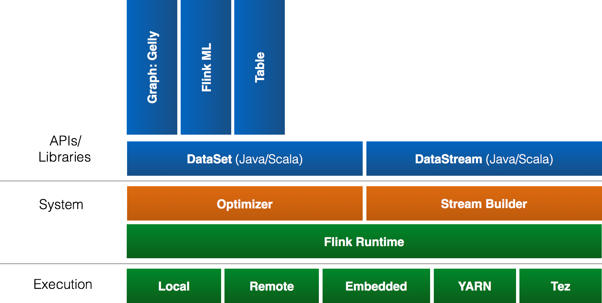

<!--
Licensed to the Apache Software Foundation (ASF) under one
or more contributor license agreements.  See the NOTICE file
distributed with this work for additional information
regarding copyright ownership.  The ASF licenses this file
to you under the Apache License, Version 2.0 (the
"License"); you may not use this file except in compliance
with the License.  You may obtain a copy of the License at

  http://www.apache.org/licenses/LICENSE-2.0

Unless required by applicable law or agreed to in writing,
software distributed under the License is distributed on an
"AS IS" BASIS, WITHOUT WARRANTIES OR CONDITIONS OF ANY
KIND, either express or implied.  See the License for the
specific language governing permissions and limitations
under the License.
-->

Apache Flink is a platform for efficient, distributed, general-purpose data processing.
It features powerful programming abstractions in Java and Scala, a high-performance runtime, and
automatic program optimization. It has native support for iterations, incremental iterations, and
programs consisting of large DAGs of operations.

If you quickly want to try out the system, please look at one of the available quickstarts. For
a thorough introduction of the Flink API please refer to the
[Programming Guide](apis/programming_guide.html).

## Stack

This is an overview of Flink's stack. Click on any component to go to the respective documentation.

<map name="overview-stack">
  <area shape="rect" coords="188,0,263,200" alt="Graph API: Gelly" href="libs/gelly_guide.html">
  <area shape="rect" coords="268,0,343,200" alt="Flink ML" href="libs/ml/">
  <area shape="rect" coords="348,0,423,200" alt="Table" href="libs/table.html">

  <area shape="rect" coords="188,205,538,260" alt="DataSet API (Java/Scala)" href="apis/programming_guide.html">
  <area shape="rect" coords="543,205,893,260" alt="DataStream API (Java/Scala)" href="apis/streaming_guide.html">

  <!-- <area shape="rect" coords="188,275,538,330" alt="Optimizer" href="optimizer.html"> -->
  <!-- <area shape="rect" coords="543,275,893,330" alt="Stream Builder" href="streambuilder.html"> -->

  <area shape="rect" coords="188,335,893,385" alt="Flink Runtime" href="internals/general_arch.html">

  <area shape="rect" coords="188,405,328,455" alt="Local" href="apis/local_execution.html">
  <area shape="rect" coords="333,405,473,455" alt="Remote" href="apis/cluster_execution.html">
  <area shape="rect" coords="478,405,638,455" alt="Embedded" href="apis/local_execution.html">
  <area shape="rect" coords="643,405,765,455" alt="YARN" href="setup/yarn_setup.html">
  <area shape="rect" coords="770,405,893,455" alt="Tez" href="setup/flink_on_tez.html">
</map>

## Download

This documentation is for Apache Flink version {{ site.version }}, which is the current development version of the next upcoming major release of Apache Flink.

You can download the latest pre-built snapshot version from the [downloads]({{ site.download_url }}#latest) page of the [project website]({{ site.website_url }}).

The Scala API uses Scala {{ site.scala_version }}. Please make sure to use a compatible version.
