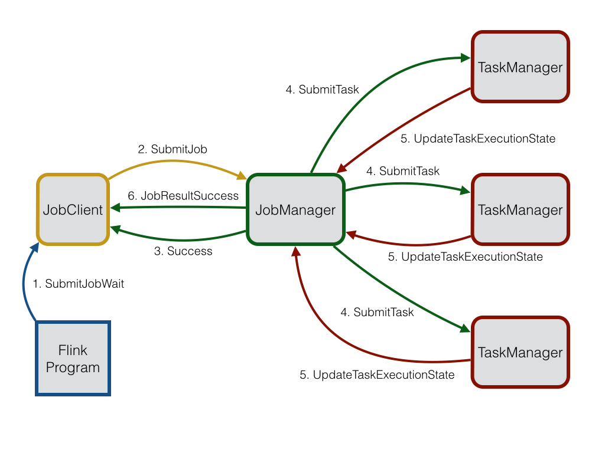

<!--
Licensed to the Apache Software Foundation (ASF) under one
or more contributor license agreements.  See the NOTICE file
distributed with this work for additional information
regarding copyright ownership.  The ASF licenses this file
to you under the Apache License, Version 2.0 (the
"License"); you may not use this file except in compliance
with the License.  You may obtain a copy of the License at

  http://www.apache.org/licenses/LICENSE-2.0

Unless required by applicable law or agreed to in writing,
software distributed under the License is distributed on an
"AS IS" BASIS, WITHOUT WARRANTIES OR CONDITIONS OF ANY
KIND, either express or implied.  See the License for the
specific language governing permissions and limitations
under the License.
-->

This page discusses the implementation of Flink's distributed communication
via Akka (http://akka.io), which has been adopted in version 0.9.
With Akka, all remote procedure calls are now realized as asynchronous messages.
This mainly affects the components `JobManager`, `TaskManager` and `JobClient`.
In the future, it is likely that even more components will be transformed into an actor, allowing
them to send and process asynchronous messages.

## Akka and the Actor Model

[Akka](http://akka.io/) is a framework to develop concurrent, fault-tolerant and scalable applications.
It is an implementation of the [actor model](http://en.wikipedia.org/wiki/Actor_model) and thus similar to Erlang's concurrency model.
In the context of the actor model, all acting entities are considered independent actors.
Actors communicate with other actors by sending asynchronous messages to each other.
The strength of the actor model arises from this asynchronism.
It is also possible to explicitly wait for a response which allows you to perform 
synchronous operations.
Synchronous messages are strongly discouraged, though, because they limit the scalability of the system.
Each actor has a mailbox in which the received messages are stored.
Furthermore, each actor maintains its own isolated state.
An example network of several actors is given below.

An actor has a single processing thread which polls the actor's mailbox and processes the received messages successively.
As a result of a processed message, the actor can change its internal state, send new messages or spawn new actors.
If the internal state of an actor is exclusively manipulated from within its processing thread, then there is no need to make the actor's state thread safe.
Even though an individual actor is sequential by nature, a system consisting of several actors is highly concurrent and scalable, 
because the processing threads are shared among all actors.
This sharing is also the reason why one should never call blocking calls from within an actor thread.
Such a call would block the thread from being used by other actors to process their own messages.

## Actor Systems

An actor system is the container in which all actors live.
It provides shared services such as scheduling, configuration and logging.
The actor system also contains the thread pool from where all actor threads are recruited.
Multiple actor system can coexist on a single machine.
If the actor system is started with a `RemoteActorRefProvider`, then it can be reached from another actor system possibly residing on a remote machine.
The actor system automatically recognises whether actor messages are addressed to an actor living in the same actor system or in a remote actor system.
In case of local communication, the message is efficiently transmitted using shared memory.
In case of remote communication, the message is sent through the network stack.

All actors are organized in a hierarchy.
Each newly created actor gets its creating actor as parent assigned.
The hierarchy is used for supervision.
Each parent is responsible for the supervision of its children.
If an error occurs in one of its children, then he gets notified.
If the actor can resolve the problem, then he can resume or restart his child.
In case of a problem which is out of his scope to deal with, he can escalate the error to his own parent.
Escalating an error simply means that a hierarchy layer above the current one is now responsible for resolving the problem.
Details about Akka's supervision and monitoring can be found [here](http://doc.akka.io/docs/akka/snapshot/general/supervision.html).

The first actors created by the system are supervised by the guardian actor `/user` which is provided by the system.
The actor hierarchy is explained in depth [here](http://doc.akka.io/docs/akka/snapshot/general/addressing.html).
For more information about actor systems in general look [here](http://doc.akka.io/docs/akka/snapshot/general/actor-systems.html#actor-systems).

## Actors in Flink

An actor is itself a container for state and behaviour.
It's actor thread sequentially processes the incoming messages.
It alleviates the user from the error prone task of locking and thread management because only one thread at a time is active for one actor.
However, one must make sure that the internal state of an actor is only accessed from this actor thread.
The behaviour of an actor is defined by a receive function which contains for each message some logic which is executed upon receiving this message.

The Flink system consists of three distributed components which have to communicate: The `JobClient`, the `JobManager` and the `TaskManager`.
The `JobClient` takes a Flink job from the user and submits it to the `JobManager`.
The `JobManager` is then responsible for orchestrating the job execution.
First of all, it allocates the required amount of resources.
This mainly includes the execution slots on the `TaskManager`s.

After resource allocation, the `JobManager` deploys the individual tasks of the job to the respective `TaskManagers`
Upon receiving a task, the `TaskManager` spawns a thread which executes the task.
State changes such as starting the calculation or finishing it are sent back to the `JobManager`.
Based on these state updates, the `JobManager` will steer the job execution until it is finished.
Once the job is finished, the result of it will be sent back to the `JobClient` which tells the user about it.
The job execution process is depicted in the figure below.

### JobManager & TaskManager

The JobManager is the central control unit which is responsible for executing a Flink job.
As such it governs the resource allocation, task scheduling and state reporting.

Before any Flink job can be executed, one JobManager and one or more TaskManager have to be started.
The TaskManager then registers at the JobManager by sending a `RegisterTaskManager` message to the JobManager.
The JobManager acknowledges a successful registration with a `AcknowledgeRegistration` message.
In case that the TaskManager is already registered at the JobManager, because there were multiple `RegisterTaskManager` messages sent,
an `AlreadyRegistered` message is returned by the JobManager.
If the registration is refused, then the JobManager will respond with a `RefuseRegistration` message.

A job is submitted to the JobManager by sending a `SubmitJob` message with the corresponding `JobGraph` to it.
Upon receiving the `JobGraph`, the JobManager creates an `ExecutionGraph` out of the `JobGraph` which serves as the logical representation of the distributed execution.
The `ExecutionGraph` contains the information about the tasks which have to be deployed to the TaskManager in order to be executed.

The JobManager's scheduler is responsible for allocating execution slots on the available TaskManagers.
After allocating an execution slot on a TaskManager, a `SubmitTask` message with all necessary information to execute the task is sent to the respective TaskManager.
A successful task deployment is acknowledged by `TaskOperationResult`.
Once the sources of the submitted job are deployed and running, also the job submission is considered successful.
The JobManager informs the JobClient about this state by sending a `Success` message with the corresponding job id.

State updates of the individual task running on the TaskManagers are sent back to the JobManager via `UpdateTaskExecutionState` messages.
With these update messages, the `ExecutionGraph` can be updated to reflect the current state of the execution.

The JobManager also acts as the input split assigner for data sources.
It is responsible for distributing the work across all TaskManager such that data locality is preserved where possible.
In order to dynamically balance the load, the `Task`s request a new input split after they have finished processing the old one.
This request is realized by sending a `RequestNextInputSplit` to the JobManager.
The JobManager responds with a `NextInputSplit` message.
If there are no more input splits, then the input split contained in the message is `null`.

The `Task`s are deployed lazily to the TaskManagers.
This means that tasks which consume data are only deployed after one of its producers has finished producing some data.
Once the producer has done so, it sends a `ScheduleOrUpdateConsumers` message to the JobManager.
This messages says that the consumer can now read the newly produced data.
If the consuming task is not yet running, it will be deployed to a TaskManager.

### JobClient

The JobClient represents the user facing component of the distributed system.
It is used to communicate with the JobManager and as such it is responsible for submitting Flink jobs,
querying the state of the submitted jobs and receiving status messages of the currently running job.

The JobClient is also an actor with which you communicate via messages.
There exist two messages related to job submission: `SubmitJobDetached` and `SubmitJobWait`.
The first message submits a job and de-registers from receiving any status messages and the final job result.
The detached mode is useful if you want to submit your job to a Flink cluster in a fire and forget manner.

The `SubmitJobWait` message submits a job to the JobManager and registers to receive status messages for this job.
Internally this is done by spawning a helper actor which is used as the receiver of the status messages.
Once the job has terminated, a `JobResultSuccess` with the duration and the accumulator results is 
sent to the spawned helper actor by the JobManager.
Upon receiving this message, the helper actor forwards the message to the client which issued the 
`SubmitJobWait` message initially and then terminates.

### Asynchronous vs. Synchronous Messages

Wherever possible, Flink tries to use asynchronous messages and to handle responses as futures.
Futures and the few existing blocking calls have a timeout after which the operation is considered failed.
This prevents the system from getting deadlocked in case a message gets lost or a distributed component crashes.
However, if you happen to have a really large cluster or a slow network, timeouts might be triggered
wrongly.
Therefore, the timeout for these operations can be specified via `akka.ask.timeout` in the configuration.

Before an actor can talk to another actor it has to retrieve an `ActorRef` for it.
The lookup for this operation requires also a timeout.
In order to make the system fail fast if an actor is not started, the lookup timeout is set to a
smaller value than the regular timeout.
In case that you experience lookup timeouts, you can increase the lookup time via `akka.lookup.timeout` in the configuration.

Another peculiarity of Akka is that it sets a limit for the maximum message size it can send.
The reason for this is that it reserves a serialization buffer of the same size and does not want to waste memory.
If you should ever encounter a transmission error because the message exceeded the maximum size,
you can increase the framesize via `akka.framesize` in the configuration.

## Failure Detection

Failure detection in a distributed system is crucial for its robustness.
When running on a commodity cluster, it can always happen that some of the components fail or are no longer reachable.
The reasons for such a failure are polymorphic and can reach from hardware breakdown to network outages.
A robust distributed system should be able to detect failed components and recover from it.

Flink detects failed components by using Akka's DeathWatch mechanism.
DeathWatch allows actors to watch other actors even though they are not supervised by this actor or even living in 
a different actor system.
Once a watched actor dies or is no longer reachable, a `Terminated` message is sent to the watching actor.
Consequently, upon receiving such a message, the system can take steps against it.
Internally, the DeathWatch is realized as heartbeat and a failure detector which, based on the
heartbeat-interval, hearbeat-pause and failure threshold, estimates when an actor is likely to be dead.
The heartbeat-interval can be controlled by setting the `akka.watch.heartbeat.interval` value in the configuration.
The acceptable heartbeat-pause can be specified via `akka.watch.heartbeat.pause`.
The heartbeat-pause should be a multiple of the heartbeat-interval, otherwise a lost heartbeat directly
triggers the DeathWatch.
The failure threshold can be specified via `akka.watch.threshold` and it effectively controls the
sensitivity of the failure detector.
More details about the DeathWatch mechanism and the failure detector can be found 
[here](http://doc.akka.io/docs/akka/snapshot/scala/remoting.html#watching-remote-actors).

In Flink, the JobManager watches all registered TaskManagers and the TaskManagers watch the JobManager.
This way, both components know when the other component is no longer reachable.
The JobManager reacts by marking the respective TaskManager as dead which prevents that future tasks are deployed to it.
Moreover, it fails all tasks which are currently running on this task manager and reschedules their execution
on a different TaskManager.
In case that the TaskManager was only marked dead because of a temporary connection loss, then it 
can simply re-register itself at the JobManager once the connection has been re-established.

The TaskManager also watches the JobManager.
This monitoring allows the TaskManager to enter a clean state by failing all currently running tasks
when it detects a failed JobManager.
Additionally, the TaskManager will try to reconnect to the JobManager in case that the triggered death
was only caused by network congestion or a connection loss.

## Future Development

At the moment, only three components, the JobClient, JobManager and TaskManager, are implemented as actors.
In order to better exploit concurrency while improving scalability, it is conceivable to realize more components
as actors.
A promising candidate could be the `ExecutionGraph` whose individual `ExecutionVertices` or even the 
associated `Execution` object could be implemented as an actor.
Such a fine-grained actor model would have the advantage that the state updates could be directly sent
to the respective `Execution` object.
This way, the JobManager would be noticeably relieved from being a single point of communication.

## Configuration

- `akka.ask.timeout`: Timeout used for all futures and blocking Akka calls. If Flink fails due to timeouts then you should try to increase this value. Timeouts can be caused by slow machines or a congested network. The timeout value requires a time-unit specifier (ms/s/min/h/d) (DEFAULT: **100 s**).
- `akka.lookup.timeout`: Timeout used for the lookup of the JobManager. The timeout value has to contain a time-unit specifier (ms/s/min/h/d) (DEFAULT: **10 s**).
- `akka.framesize`: Maximum size of messages which are sent between the JobManager and the TaskManagers. If Flink fails because messages exceed this limit, then you should increase it. The message size requires a size-unit specifier (DEFAULT: **10485760b**).
- `akka.watch.heartbeat.interval`: Heartbeat interval for Akka's DeathWatch mechanism to detect dead TaskManagers. If TaskManagers are wrongly marked dead because of lost or delayed heartbeat messages, then you should increase this value. A thorough description of Akka's DeathWatch can be found [here](http://doc.akka.io/docs/akka/snapshot/scala/remoting.html#failure-detector) (DEFAULT: **akka.ask.timeout/10**).
- `akka.watch.heartbeat.pause`: Acceptable heartbeat pause for Akka's DeathWatch mechanism. A low value does not allow a irregular heartbeat. A thorough description of Akka's DeathWatch can be found [here](http://doc.akka.io/docs/akka/snapshot/scala/remoting.html#failure-detector) (DEFAULT: **akka.ask.timeout**).
- `akka.watch.threshold`: Threshold for the DeathWatch failure detector. A low value is prone to false positives whereas a high value increases the time to detect a dead TaskManager. A thorough description of Akka's DeathWatch can be found [here](http://doc.akka.io/docs/akka/snapshot/scala/remoting.html#failure-detector) (DEFAULT: **12**).
- `akka.transport.heartbeat.interval`: Heartbeat interval for Akka's transport failure detector. Since Flink uses TCP, the detector is not necessary. Therefore, the detector is disabled by setting the interval to a very high value. In case you should need the transport failure detector, set the interval to some reasonable value. The interval value requires a time-unit specifier (ms/s/min/h/d) (DEFAULT: **1000 s**).
- `akka.transport.heartbeat.pause`: Acceptable heartbeat pause for Akka's transport failure detector. Since Flink uses TCP, the detector is not necessary. Therefore, the detector is disabled by setting the pause to a very high value. In case you should need the transport failure detector, set the pause to some reasonable value. The pause value requires a time-unit specifier (ms/s/min/h/d) (DEFAULT: **6000 s**).
- `akka.transport.threshold`: Threshold for the transport failure detector. Since Flink uses TCP, the detector is not necessary and, thus, the threshold is set to a high value (DEFAULT: **300**).
- `akka.tcp.timeout`: Timeout for all outbound connections. If you should experience problems with connecting to a TaskManager due to a slow network, you should increase this value (DEFAULT: **akka.ask.timeout**).
- `akka.throughput`: Number of messages that are processed in a batch before returning the thread to the pool. Low values denote a fair scheduling whereas high values can increase the performance at the cost of unfairness (DEFAULT: **15**).
- `akka.log.lifecycle.events`: Turns on the Akka's remote logging of events. Set this value to 'on' in case of debugging (DEFAULT: **off**).
- `akka.startup-timeout`: Timeout after which the startup of a remote component is considered being failed (DEFAULT: **akka.ask.timeout**).

---

*This documentation is maintained by the contributors of the individual components.
We kindly ask anyone that adds and changes components to eventually provide a patch
or pull request that updates these documents as well.*
