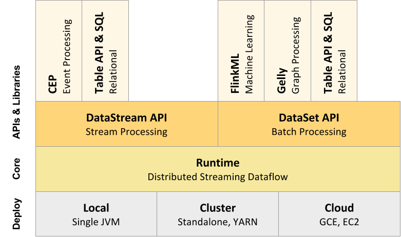

<!--
Licensed to the Apache Software Foundation (ASF) under one
or more contributor license agreements.  See the NOTICE file
distributed with this work for additional information
regarding copyright ownership.  The ASF licenses this file
to you under the Apache License, Version 2.0 (the
"License"); you may not use this file except in compliance
with the License.  You may obtain a copy of the License at

  http://www.apache.org/licenses/LICENSE-2.0

Unless required by applicable law or agreed to in writing,
software distributed under the License is distributed on an
"AS IS" BASIS, WITHOUT WARRANTIES OR CONDITIONS OF ANY
KIND, either express or implied.  See the License for the
specific language governing permissions and limitations
under the License.
-->

* This will be replaced by the TOC
{:toc}

## The Processes

When the Flink system is started, it bring up the *JobManager* and one or more *TaskManagers*. The JobManager
is the coordinator of the Flink system, while the TaskManagers are the workers that execute parts of the
parallel programs. When starting the system in *local* mode, a single JobManager and TaskManager are brought
up within the same JVM.

When a program is submitted, a client is created that performs the pre-processing and turns the program
into the parallel data flow form that is executed by the JobManager and TaskManagers. The figure below
illustrates the different actors in the system and their interactions.

## Component Stack

As a software stack, Flink is a layered system. The different layers of the stack build on
top of each other and raise the abstraction level of the program representations they accept:

- The **runtime** layer receives a program in the form of a *JobGraph*. A JobGraph is a generic parallel
data flow with arbitrary tasks that consume and produce data streams.

- Both the **DataStream API** and the **DataSet API** generate JobGraphs through separate compilation
processes. The DataSet API uses an optimizer to determine the optimal plan for the program, while
the DataStream API uses a stream builder.

- The JobGraph is executed according to a variety of deployment options available in Flink (e.g., local,
remote, YARN, etc)

- Libraries and APIs that are bundled with Flink generate DataSet or DataStream API programs. These are
Table for queries on logical tables, FlinkML for Machine Learning, and Gelly for graph processing.

You can click on the components in the figure to learn more.

  

<map name="overview-stack">
<area id="lib-datastream-cep" title="CEP: Complex Event Processing" href="{{ site.baseurl }}/apis/streaming/libs/cep.html" shape="rect" coords="63,0,143,177" />
<area id="lib-datastream-table" title="Table: Relational DataStreams" href="{{ site.baseurl }}/apis/batch/libs/table.html" shape="rect" coords="143,0,223,177" />
<area id="lib-dataset-ml" title="FlinkML: Machine Learning" href="{{ site.baseurl }}/apis/batch/libs/ml/index.html" shape="rect" coords="382,2,462,176" />
<area id="lib-dataset-gelly" title="Gelly: Graph Processing" href="{{ site.baseurl }}/apis/batch/libs/gelly.html" shape="rect" coords="461,0,541,177" />
<area id="lib-dataset-table" title="Table: Relational DataSets" href="{{ site.baseurl }}/apis/batch/libs/table.html" shape="rect" coords="544,0,624,177" />
<area id="datastream" title="DataStream API" href="{{ site.baseurl }}/apis/streaming/index.html" shape="rect" coords="64,177,379,255" />
<area id="dataset" title="DataSet API" href="{{ site.baseurl }}/apis/batch/index.html" shape="rect" coords="382,177,697,255" />
<area id="runtime" title="Runtime" href="{{ site.baseurl }}/internals/general_arch.html" shape="rect" coords="63,257,700,335" />
<area id="local" title="Local" href="{{ site.baseurl }}/setup/local_setup.html" shape="rect" coords="62,337,275,414" />
<area id="cluster" title="Cluster" href="{{ site.baseurl }}/setup/cluster_setup.html" shape="rect" coords="273,336,486,413" />
<area id="cloud" title="Cloud" href="{{ site.baseurl }}/setup/gce_setup.html" shape="rect" coords="485,336,700,414" />
</map>

## Projects and Dependencies

The Flink system code is divided into multiple sub-projects. The goal is to reduce the number of
dependencies that a project implementing a Flink progam needs, as well as to faciltate easier testing
of smaller sub-modules.

The individual projects and their dependencies are shown in the figure below.

In addition to the projects listed in the figure above, Flink currently contains the following sub-projects:

- `flink-dist`: The *distribution* project. It defines how to assemble the compiled code, scripts, and other resources
into the final folder structure that is ready to use.

- `flink-quickstart`: Scripts, maven archetypes, and example programs for the quickstarts and tutorials.

- `flink-contrib`: A series of projects that are in an early version and useful tools contributed by users. The code for the latter is maintained mainly by external contributors. The requirements for code being accepted into `flink-contrib` are lower compared to the rest of the code.

