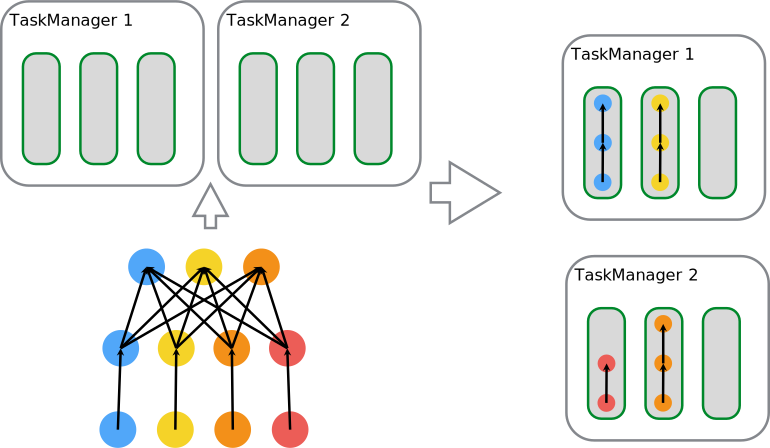
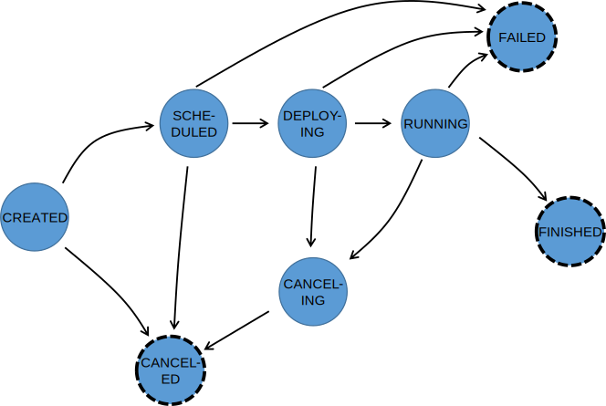

<!--
Licensed to the Apache Software Foundation (ASF) under one
or more contributor license agreements.  See the NOTICE file
distributed with this work for additional information
regarding copyright ownership.  The ASF licenses this file
to you under the Apache License, Version 2.0 (the
"License"); you may not use this file except in compliance
with the License.  You may obtain a copy of the License at

  http://www.apache.org/licenses/LICENSE-2.0

Unless required by applicable law or agreed to in writing,
software distributed under the License is distributed on an
"AS IS" BASIS, WITHOUT WARRANTIES OR CONDITIONS OF ANY
KIND, either express or implied.  See the License for the
specific language governing permissions and limitations
under the License.
-->

This document briefly describes how Flink schedules jobs and 
how it represents and tracks job status on the JobManager.

* This will be replaced by the TOC
{:toc}

## Scheduling

Execution resources in Flink are defined through _Task Slots_. Each TaskManager will have one or more task slots,
each of which can run one pipeline of parallel tasks. A pipeline consists of multiple successive tasks, such as the
*n-th* parallel instance of a MapFunction together with the *n-th* parallel instance of a ReduceFunction.
Note that Flink often executes successive tasks concurrently: For Streaming programs, that happens in any case,
but also for batch programs, it happens frequently.

The figure below illustrates that. Consider a program with a data source, a *MapFunction*, and a *ReduceFunction*.
The source and MapFunction are executed with a parallelism of 4, while the ReduceFunction is executed with a
parallism of 3. A pipeline consists of the sequence Source - Map - Reduce. On a cluster with 2 TaskManagers with
3 slots each, the program will be executed as described below.

Internally, Flink defines through  
and 
which tasks may share a slot (permissive), respectively which tasks must be strictly placed into the same slot.

## JobManager Data Structures

During job execution, the JobManager keeps track of distributed tasks, decides when to schedule the next task (or set of tasks),
and reacts to finished tasks or execution failures.

The JobManager receives the ,
which is a representation of the data flow consisting of operators ()
and intermediate results ().
Each operator has properies, like the parallelism and the code that it executes.
In addition, the JobGraph has a set of attached libraries, that are neccessary to execute the code of the operators.

The JobManager transforms the JobGraph into an .
The ExecutionGraph is a parallel version of the JobGraph: For each JobVertex, it contains an  per parallel subtask. An operator with a parallelism of 100 will have one JobVertex and 100 ExecutionVertices.
The ExecutionVertex tracks the state of execution of a particular subtask. All ExecutionVertices from one JobVertex are held in an
,
which tracks the status of the operator as a whole. 
Besides the vertices, the ExecutionGraph also contains the  and the . The former tracks the state of the *IntermediateDataSet*, the latter the state of each of its partitions.

During its execution, each parallel task goes through multiple stages, from *created* to *finished* or *failed*. The diagram below illustrates the 
states and possible transitions between them. A task may be executed multiple times (for example in the course of failure recovery).
For that reason, the execution of an ExecutionVertex is tracked in an . Each ExecutionVertex has a current Execution, and prior Executions.

