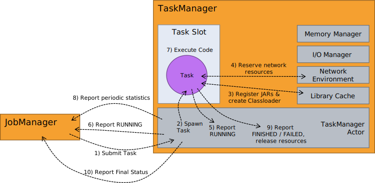
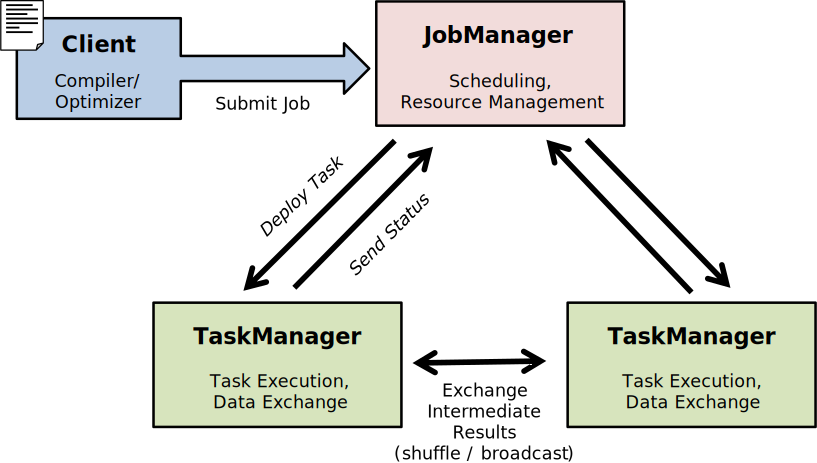

<!--
Licensed to the Apache Software Foundation (ASF) under one
or more contributor license agreements.  See the NOTICE file
distributed with this work for additional information
regarding copyright ownership.  The ASF licenses this file
to you under the Apache License, Version 2.0 (the
"License"); you may not use this file except in compliance
with the License.  You may obtain a copy of the License at

  http://www.apache.org/licenses/LICENSE-2.0

Unless required by applicable law or agreed to in writing,
software distributed under the License is distributed on an
"AS IS" BASIS, WITHOUT WARRANTIES OR CONDITIONS OF ANY
KIND, either express or implied.  See the License for the
specific language governing permissions and limitations
under the License.
-->

This page explains what happens when you execute a Flink program (streaming or streaming).
It covers the complete life cycle, from <emph>client-side pre-flight</emph>, to <emph>JobManager</emph>,
and <emph>TaskManager</emph>.

Please refer to the [Overview Page](../index.html) for a high-level overview of the processes and the stack.

* This will be replaced by the TOC
{:toc}

## Batch API: DataSets to JobGraph

## Streaming API: DataStreams to JobGraph

## Client: Submitting a Job, Receiving Statistics & Results

## JobManager: Receiving and Starting a Job

parallel operator instance

execution attempts

## TaskManager: Running Tasks

The **
is the worker process in Flink. It runs the **,
which execute a parallel operator instance.

The TaskManager itself is an Akka actor and has many utility components, such as:

 - The **, which takes care of all data exchanges (streamed and batched) between TaskManagers. Cached data sets in Flink are also cached streams, to the network environment is responsible for that as well.

 - The **, which governs the memory for sorting, hashing, and in-operator data caching.

 - The **, which governs the memory for sorting, hashing, and in-operator data caching.

 - The **, which gives access to JAR files needed by tasks.

When the TaskManager runs tasks, it does not know anything about the task's role in the dataflow. The TaskManager only knows the tasks itself and streams that the task interacts with.
Any form of cross-task coordination must go through the JobManager.

The execution of a Task begins when the TaskManager receives the *SubmitTask* message. The message contains the
**. This descriptor defines everything
a task needs to know:

 - The unique task .
 - The name of the executable code class of the task (batch operator, stream operator, iterative operator, ...)
 - The IDs of the streams that the task reads. If not all streams are ready yet, some are set to "pending".
 - The IDs of the streams that the task produces.
 - The configuration of the executable code. This contains the actual operator type (mapper, join, stream window, ...) and the user code, as a serialized closure (MapFunction, JoinFunction, ...)
 - The hashes if the libraries (JAR files) that the code needs.
 - ...

The TaskManager creates the *Task object* from the deployment descriptor, registers the task internally under its ID, and spawns a thread that will execute the task.
After that, the TaskManager is done, and the Task runs by itself, reporting its status to the TaskManager as it progresses or fails.

The Task executes in the following stages:

 1. It takes the hashes of the required JAR files and makes sure these files are in the library cache. If they are not yet there, the library cache downloads them from the JobManager's BLOB server. This operation may take a while, if the JAR files are very large (many libraries). Note that this only needs to be done for the first Task of a program on each TaskManager. All successive Tasks should find the JAR files cached.

 2. It creates a classloader from these JAR files. The classloader is called the *user-code classloader* and is used to resolve all classes that can be user-defined.

 3. It registers its consumed and produces data streams (input and output) at the network environment. This reserves resources for the Task by creating the buffer pools that are used for data exchange.

 4. In case the task uses state of a checkpoint (a streaming task that is restarted after a failure), it restores this state. This may involve fetching the state from remote storage, depending on where the state was stored.

 5. The Task switches to *"RUNNING"* and notifies the TaskManager of that progress. The TaskManager in turn sends a  actor message to the JobManager, to notify it of the progress.

 6. The Task invokes the executable code that was configured. This code is usually generic and only differentiates between coarse classes of operations (e.g.,  , , or ). Internally, these generic operators instantiate the specific operator code (e.g., map task, join task, window reducer, ...) and the user functions and executes them.

 7. If the Task was deployed before all iof its inputs were available (early deployment), the Task receives updates on those newly available streams.

 8. The Task execution updates *accumulators*. These accumulators track system statistics (number of processed records) or user-defined statistics (created in a user-defined function). Periodically, these are reported to the JobManager in a heartbeat fashion, via actor messages.

 9. When the executable code finishes, or hits an error, the task cleans up after itself, and notifies the TaskManager via a message of its final state.

 10. The TaskManager unregisters the Task and forwards the Task's final state to the JobManager, via the  actor message.

This diagram gives a coarse overview of the steps of a Task Execution:

  

## JobManager: Task Updates and Scheduling Tasks

<!--
When the Flink system is started, it bring up the *JobManager* and one or more *TaskManagers*. The JobManager
is the coordinator of the Flink system, while the TaskManagers are the workers that execute parts of the
parallel programs. When starting the system in *local* mode, a single JobManager and TaskManager are brought
up within the same JVM.

When a program is submitted, a client is created that performs the pre-processing and turns the program
into the parallel data flow form that is executed by the JobManager and TaskManagers. The figure below
illustrates the different actors in the system very coarsely.

## Component Stack

An alternative view on the system is given by the stack below. The different layers of the stack build on
top of each other and raise the abstraction level of the program representations they accept:

- The **runtime** layer receives a program in the form of a *JobGraph*. A JobGraph is a generic parallel
data flow with arbitrary tasks that consume and produce data streams.

- The **optimizer** and **common api** layer takes programs in the form of operator DAGs. The operators are
specific (e.g., Map, Join, Filter, Reduce, ...), but are data type agnostic. The concrete types and their
interaction with the runtime is specified by the higher layers.

- The **API layer** implements multiple APIs that create operator DAGs for their programs. Each API needs
to provide utilities (serializers, comparators) that describe the interaction between its data types and
the runtime.

## Projects and Dependencies

The Flink system code is divided into multiple sub-projects. The goal is to reduce the number of
dependencies that a project implementing a Flink progam needs, as well as to faciltate easier testing
of smaller sub-modules.

The individual projects and their dependencies are shown in the figure below.

In addition to the projects listed in the figure above, Flink currently contains the following sub-projects:

- `flink-dist`: The *distribution* project. It defines how to assemble the compiled code, scripts, and other resources
into the final folder structure that is ready to use.

- `flink-staging`: A series of projects that are in an early version. Currently contains
among other things projects for YARN support, JDBC data sources and sinks, hadoop compatibility,
graph specific operators, and HBase connectors.

- `flink-quickstart`: Scripts, maven archetypes, and example programs for the quickstarts and tutorials.

- `flink-contrib`: Useful tools contributed by users. The code is maintained mainly by external contributors. The requirements for code being accepted into `flink-contrib` are lower compared to the rest of the code.

-->

