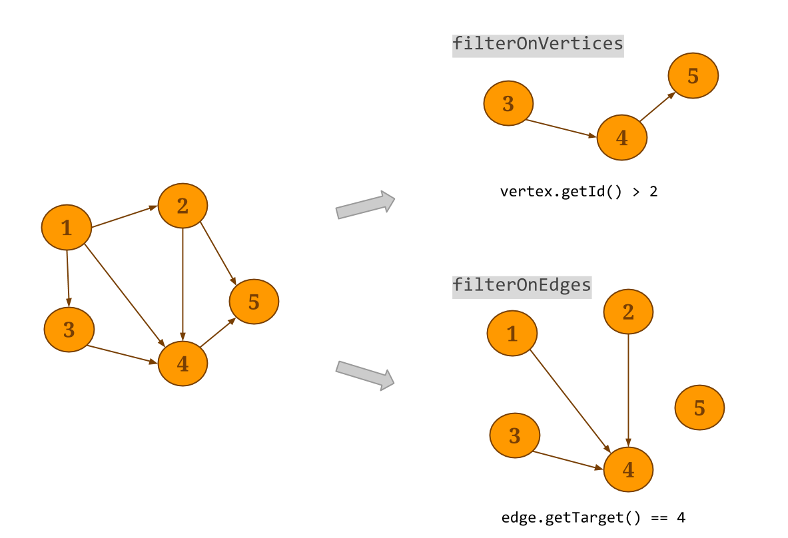
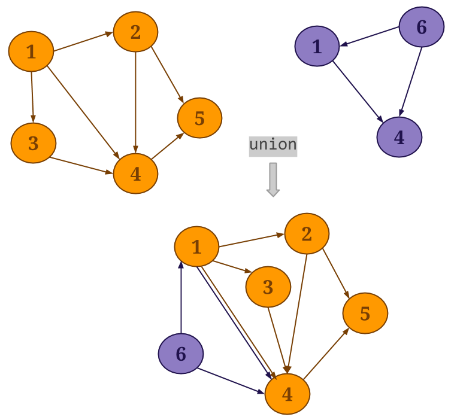
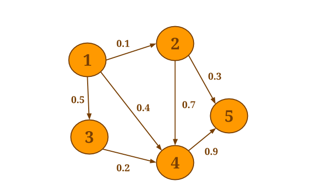
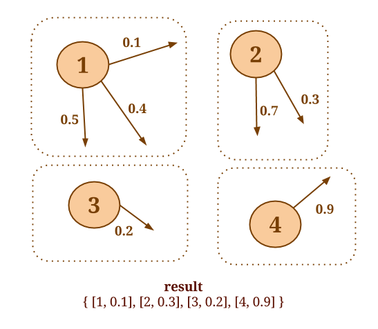
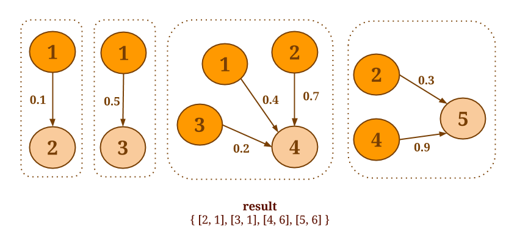
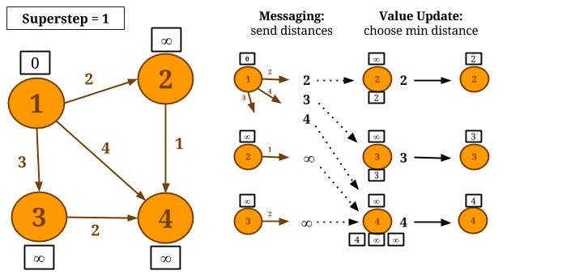
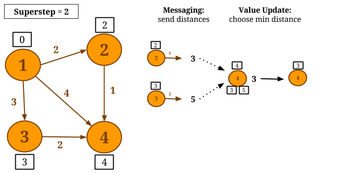
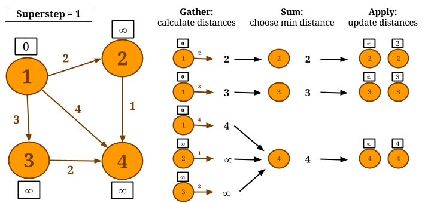
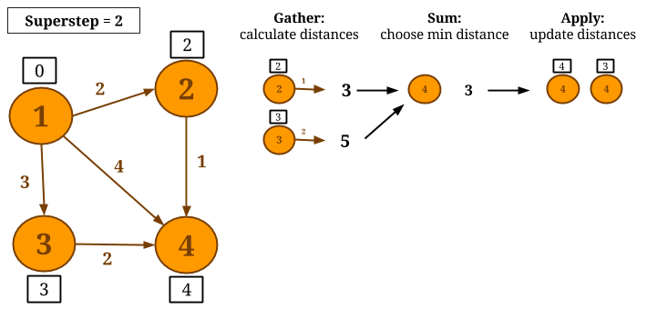
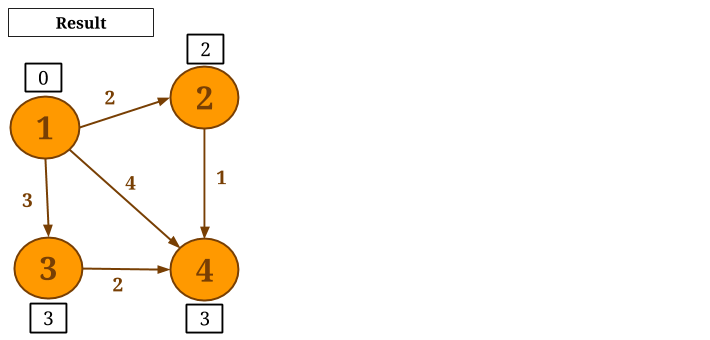

<!--
Licensed to the Apache Software Foundation (ASF) under one
or more contributor license agreements.  See the NOTICE file
distributed with this work for additional information
regarding copyright ownership.  The ASF licenses this file
to you under the Apache License, Version 2.0 (the
"License"); you may not use this file except in compliance
with the License.  You may obtain a copy of the License at

  http://www.apache.org/licenses/LICENSE-2.0

Unless required by applicable law or agreed to in writing,
software distributed under the License is distributed on an
"AS IS" BASIS, WITHOUT WARRANTIES OR CONDITIONS OF ANY
KIND, either express or implied.  See the License for the
specific language governing permissions and limitations
under the License.
-->

Gelly is a Graph API for Flink. It contains a set of methods and utilities which aim to simplify the development of graph analysis applications in Flink. In Gelly, graphs can be transformed and modified using high-level functions similar to the ones provided by the batch processing API. Gelly provides methods to create, transform and modify graphs, as well as a library of graph algorithms.

* This will be replaced by the TOC
{:toc}

Using Gelly
-----------

Gelly is currently part of the *staging* Maven project. All relevant classes are located in the *org.apache.flink.graph* package.

Add the following dependency to your `pom.xml` to use Gelly.


<dependency>
    <groupId>org.apache.flink</groupId>
    <artifactId>flink-gelly</artifactId>
    <version>{{site.version}}</version>
</dependency>



<dependency>
    <groupId>org.apache.flink</groupId>
    <artifactId>flink-gelly-scala</artifactId>
    <version>{{site.version}}</version>
</dependency>


Note that Gelly is currently not part of the binary distribution. See linking with it for cluster execution [here](../apis/cluster_execution.html#linking-with-modules-not-contained-in-the-binary-distribution).

The remaining sections provide a description of available methods and present several examples of how to use Gelly and how to mix it with the Flink DataSet API. After reading this guide, you might also want to check the .

Graph Representation
-----------

In Gelly, a `Graph` is represented by a `DataSet` of vertices and a `DataSet` of edges.

The `Graph` nodes are represented by the `Vertex` type. A `Vertex` is defined by a unique ID and a value. `Vertex` IDs should implement the `Comparable` interface. Vertices without value can be represented by setting the value type to `NullValue`.


// create a new vertex with a Long ID and a String value
Vertex<Long, String> v = new Vertex<Long, String>(1L, "foo");

// create a new vertex with a Long ID and no value
Vertex<Long, NullValue> v = new Vertex<Long, NullValue>(1L, NullValue.getInstance());



// create a new vertex with a Long ID and a String value
val v = new Vertex(1L, "foo")

// create a new vertex with a Long ID and no value
val v = new Vertex(1L, NullValue.getInstance())


The graph edges are represented by the `Edge` type. An `Edge` is defined by a source ID (the ID of the source `Vertex`), a target ID (the ID of the target `Vertex`) and an optional value. The source and target IDs should be of the same type as the `Vertex` IDs. Edges with no value have a `NullValue` value type.


Edge<Long, Double> e = new Edge<Long, Double>(1L, 2L, 0.5);

// reverse the source and target of this edge
Edge<Long, Double> reversed = e.reverse();

Double weight = e.getValue(); // weight = 0.5



val e = new Edge(1L, 2L, 0.5)

// reverse the source and target of this edge
val reversed = e.reverse

val weight = e.getValue // weight = 0.5


[Back to top](#top)

Graph Creation
-----------

You can create a `Graph` in the following ways:

* from a `DataSet` of edges and an optional `DataSet` of vertices:


ExecutionEnvironment env = ExecutionEnvironment.getExecutionEnvironment();

DataSet<Vertex<String, Long>> vertices = ...

DataSet<Edge<String, Double>> edges = ...

Graph<String, Long, Double> graph = Graph.fromDataSet(vertices, edges, env);



val env = ExecutionEnvironment.getExecutionEnvironment

val vertices: DataSet[Vertex[String, Long]] = ...

val edges: DataSet[Edge[String, Double]] = ...

val graph = Graph.fromDataSet(vertices, edges, env)


* from a `DataSet` of `Tuple3` and an optional `DataSet` of `Tuple2`. In this case, Gelly will convert each `Tuple3` to an `Edge`, where the first field will be the source ID, the second field will be the target ID and the third field will be the edge value. Equivalently, each `Tuple2` will be converted to a `Vertex`, where the first field will be the vertex ID and the second field will be the vertex value:


ExecutionEnvironment env = ExecutionEnvironment.getExecutionEnvironment();

DataSet<Tuple2<String, Long>> vertexTuples = env.readCsvFile("path/to/vertex/input");

DataSet<Tuple3<String, String, Double>> edgeTuples = env.readCsvFile("path/to/edge/input");

Graph<String, Long, Double> graph = Graph.fromTupleDataSet(vertexTuples, edgeTuples, env);


* from a CSV file of Edge data and an optional CSV file of Vertex data. In this case, Gelly will convert each row from the Edge CSV file to an `Edge`, where the first field will be the source ID, the second field will be the target ID and the third field (if present) will be the edge value. Equivalently, each row from the optional Vertex CSV file will be converted to a `Vertex`, where the first field will be the vertex ID and the second field (if present) will be the vertex value. In order to get a `Graph` from a `GraphCsvReader` one has to specify the types, using one of the following methods:

- `types(Class<K> vertexKey, Class<VV> vertexValue,Class<EV> edgeValue)`: both vertex and edge values are present.
- `edgeTypes(Class<K> vertexKey, Class<EV> edgeValue)`: the Graph has edge values, but no vertex values.
- `vertexTypes(Class<K> vertexKey, Class<VV> vertexValue)`: the Graph has vertex values, but no edge values.
- `keyType(Class<K> vertexKey)`: the Graph has no vertex values and no edge values.


ExecutionEnvironment env = ExecutionEnvironment.getExecutionEnvironment();

// create a Graph with String Vertex IDs, Long Vertex values and Double Edge values
Graph<String, Long, Double> graph = Graph.fromCsvReader("path/to/vertex/input", "path/to/edge/input", env)
					.types(String.class, Long.class, Double.class);

// create a Graph with no Vertex or Edge values
Graph<Long, NullValue, NullValue> simpleGraph = Graph.fromCsvReader("path/to/edge/input", env).keyType(Long.class);



val env = ExecutionEnvironment.getExecutionEnvironment

val vertexTuples = env.readCsvFile[String, Long]("path/to/vertex/input")

val edgeTuples = env.readCsvFile[String, String, Double]("path/to/edge/input")

val graph = Graph.fromTupleDataSet(vertexTuples, edgeTuples, env)


* from a `Collection` of edges and an optional `Collection` of vertices:


ExecutionEnvironment env = ExecutionEnvironment.getExecutionEnvironment();

List<Vertex<Long, Long>> vertexList = new ArrayList...

List<Edge<Long, String>> edgeList = new ArrayList...

Graph<Long, Long, String> graph = Graph.fromCollection(vertexList, edgeList, env);


If no vertex input is provided during Graph creation, Gelly will automatically produce the `Vertex` `DataSet` from the edge input. In this case, the created vertices will have no values. Alternatively, you can provide a `MapFunction` as an argument to the creation method, in order to initialize the `Vertex` values:


ExecutionEnvironment env = ExecutionEnvironment.getExecutionEnvironment();

// initialize the vertex value to be equal to the vertex ID
Graph<Long, Long, String> graph = Graph.fromCollection(edgeList, 
				new MapFunction<Long, Long>() {
					public Long map(Long value) { 
						return value; 
					} 
				}, env);



val env = ExecutionEnvironment.getExecutionEnvironment

val vertexList = List(...)

val edgeList = List(...)

val graph = Graph.fromCollection(vertexList, edgeList, env)


If no vertex input is provided during Graph creation, Gelly will automatically produce the `Vertex` `DataSet` from the edge input. In this case, the created vertices will have no values. Alternatively, you can provide a `MapFunction` as an argument to the creation method, in order to initialize the `Vertex` values:


val env = ExecutionEnvironment.getExecutionEnvironment

// initialize the vertex value to be equal to the vertex ID
val graph = Graph.fromCollection(edgeList, env,
    new MapFunction[Long, Long] {
       def map(id: Long): Long = id
    })


[Back to top](#top)

Graph Properties
------------

Gelly includes the following methods for retrieving various Graph properties and metrics:


// get the Vertex DataSet
DataSet<Vertex<K, VV>> getVertices()

// get the Edge DataSet
DataSet<Edge<K, EV>> getEdges()

// get the IDs of the vertices as a DataSet
DataSet<K> getVertexIds()

// get the source-target pairs of the edge IDs as a DataSet
DataSet<Tuple2<K, K>> getEdgeIds() 

// get a DataSet of <vertex ID, in-degree> pairs for all vertices
DataSet<Tuple2<K, Long>> inDegrees() 

// get a DataSet of <vertex ID, out-degree> pairs for all vertices
DataSet<Tuple2<K, Long>> outDegrees()

// get a DataSet of <vertex ID, degree> pairs for all vertices, where degree is the sum of in- and out- degrees
DataSet<Tuple2<K, Long>> getDegrees()

// get the number of vertices
long numberOfVertices()

// get the number of edges
long numberOfEdges()

// get a DataSet of Triplets<srcVertex, trgVertex, edge>
DataSet<Triplet<K, VV, EV>> getTriplets()




// get the Vertex DataSet
getVertices: DataSet[Vertex[K, VV]]

// get the Edge DataSet
getEdges: DataSet[Edge[K, EV]]

// get the IDs of the vertices as a DataSet
getVertexIds: DataSet[K]

// get the source-target pairs of the edge IDs as a DataSet
getEdgeIds: DataSet[(K, K)]

// get a DataSet of <vertex ID, in-degree> pairs for all vertices
inDegrees: DataSet[(K, Long)]

// get a DataSet of <vertex ID, out-degree> pairs for all vertices
outDegrees: DataSet[(K, Long)]

// get a DataSet of <vertex ID, degree> pairs for all vertices, where degree is the sum of in- and out- degrees
getDegrees: DataSet[(K, Long)]

// get the number of vertices
numberOfVertices: Long

// get the number of edges
numberOfEdges: Long

// get a DataSet of Triplets<srcVertex, trgVertex, edge>
getTriplets: DataSet[Triplet[K, VV, EV]]



[Back to top](#top)

Graph Transformations
-----------------

* <strong>Map</strong>: Gelly provides specialized methods for applying a map transformation on the vertex values or edge values. `mapVertices` and `mapEdges` return a new `Graph`, where the IDs of the vertices (or edges) remain unchanged, while the values are transformed according to the provided user-defined map function. The map functions also allow changing the type of the vertex or edge values.


ExecutionEnvironment env = ExecutionEnvironment.getExecutionEnvironment();
Graph<Long, Long, Long> graph = Graph.fromDataSet(vertices, edges, env);

// increment each vertex value by one
Graph<Long, Long, Long> updatedGraph = graph.mapVertices(
				new MapFunction<Vertex<Long, Long>, Long>() {
					public Long map(Vertex<Long, Long> value) {
						return value.getValue() + 1;
					}
				});



val env = ExecutionEnvironment.getExecutionEnvironment
val graph = Graph.fromDataSet(vertices, edges, env)

// increment each vertex value by one
val updatedGraph = graph.mapVertices(v => v.getValue + 1)


* <strong>Filter</strong>: A filter transformation applies a user-defined filter function on the vertices or edges of the `Graph`. `filterOnEdges` will create a sub-graph of the original graph, keeping only the edges that satisfy the provided predicate. Note that the vertex dataset will not be modified. Respectively, `filterOnVertices` applies a filter on the vertices of the graph. Edges whose source and/or target do not satisfy the vertex predicate are removed from the resulting edge dataset. The `subgraph` method can be used to apply a filter function to the vertices and the edges at the same time.


Graph<Long, Long, Long> graph = ...

graph.subgraph(
		new FilterFunction<Vertex<Long, Long>>() {
			   	public boolean filter(Vertex<Long, Long> vertex) {
					// keep only vertices with positive values
					return (vertex.getValue() > 0);
			   }
		   },
		new FilterFunction<Edge<Long, Long>>() {
				public boolean filter(Edge<Long, Long> edge) {
					// keep only edges with negative values
					return (edge.getValue() < 0);
				}
		})



val graph: Graph[Long, Long, Long] = ...

// keep only vertices with positive values
// and only edges with negative values
graph.subgraph((vertex => vertex.getValue > 0), (edge => edge.getValue < 0))


    

* <strong>Join</strong>: Gelly provides specialized methods for joining the vertex and edge datasets with other input datasets. `joinWithVertices` joins the vertices with a `Tuple2` input data set. The join is performed using the vertex ID and the first field of the `Tuple2` input as the join keys. The method returns a new `Graph` where the vertex values have been updated according to a provided user-defined map function.
Similarly, an input dataset can be joined with the edges, using one of three methods. `joinWithEdges` expects an input `DataSet` of `Tuple3` and joins on the composite key of both source and target vertex IDs. `joinWithEdgesOnSource` expects a `DataSet` of `Tuple2` and joins on the source key of the edges and the first attribute of the input dataset and `joinWithEdgesOnTarget` expects a `DataSet` of `Tuple2` and joins on the target key of the edges and the first attribute of the input dataset. All three methods apply a map function on the edge and the input data set values.
Note that if the input dataset contains a key multiple times, all Gelly join methods will only consider the first value encountered.


Graph<Long, Double, Double> network = ...

DataSet<Tuple2<Long, Long>> vertexOutDegrees = network.outDegrees();

// assign the transition probabilities as the edge weights
Graph<Long, Double, Double> networkWithWeights = network.joinWithEdgesOnSource(vertexOutDegrees,
				new MapFunction<Tuple2<Double, Long>, Double>() {
					public Double map(Tuple2<Double, Long> value) {
						return value.f0 / value.f1;
					}
				});



val network: Graph[Long, Double, Double] = ...

val vertexOutDegrees: DataSet[(Long, Long)] = network.outDegrees

// assign the transition probabilities as the edge weights
val networkWithWeights = network.joinWithEdgesOnSource(vertexOutDegrees, (v1: Double, v2: Long) => v1 / v2)


* <strong>Reverse</strong>: the `reverse()` method returns a new `Graph` where the direction of all edges has been reversed.

* <strong>Undirected</strong>: In Gelly, a `Graph` is always directed. Undirected graphs can be represented by adding all opposite-direction edges to a graph. For this purpose, Gelly provides the `getUndirected()` method.

* <strong>Union</strong>: Gelly's `union()` method performs a union operation on the vertex and edge sets of the specified graph and current graph. Duplicate vertices are removed from the resulting `Graph`, while if duplicate edges exists, these will be maintained.

    

* <strong>Difference</strong>: Gelly's `difference()` method performs a difference on the vertex and edge sets of the current graph and specified graph.

-[Back to top](#top)

Graph Mutations
-----------

Gelly includes the following methods for adding and removing vertices and edges from an input `Graph`:


// adds a Vertex to the Graph. If the Vertex already exists, it will not be added again.
Graph<K, VV, EV> addVertex(final Vertex<K, VV> vertex)

// adds a list of vertices to the Graph. If the vertices already exist in the graph, they will not be added once more.
Graph<K, VV, EV> addVertices(List<Vertex<K, VV>> verticesToAdd)

// adds an Edge to the Graph. If the source and target vertices do not exist in the graph, they will also be added.
Graph<K, VV, EV> addEdge(Vertex<K, VV> source, Vertex<K, VV> target, EV edgeValue)

// adds a list of edges to the Graph. When adding an edge for a non-existing set of vertices, the edge is considered invalid and ignored.
Graph<K, VV, EV> addEdges(List<Edge<K, EV>> newEdges)

// removes the given Vertex and its edges from the Graph.
Graph<K, VV, EV> removeVertex(Vertex<K, VV> vertex)

// removes the given list of vertices and their edges from the Graph
Graph<K, VV, EV> removeVertices(List<Vertex<K, VV>> verticesToBeRemoved)

// removes *all* edges that match the given Edge from the Graph.
Graph<K, VV, EV> removeEdge(Edge<K, EV> edge)

// removes *all* edges that match the edges in the given list
Graph<K, VV, EV> removeEdges(List<Edge<K, EV>> edgesToBeRemoved)



// adds a Vertex to the Graph. If the Vertex already exists, it will not be added again.
addVertex(vertex: Vertex[K, VV])

// adds a list of vertices to the Graph. If the vertices already exist in the graph, they will not be added once more.
addVertices(verticesToAdd: List[Vertex[K, VV]])

// adds an Edge to the Graph. If the source and target vertices do not exist in the graph, they will also be added.
addEdge(source: Vertex[K, VV], target: Vertex[K, VV], edgeValue: EV)

// adds a list of edges to the Graph. When adding an edge for a non-existing set of vertices, the edge is considered invalid and ignored.
addEdges(edges: List[Edge[K, EV]])

// removes the given Vertex and its edges from the Graph.
removeVertex(vertex: Vertex[K, VV])

// removes the given list of vertices and their edges from the Graph
removeVertices(verticesToBeRemoved: List[Vertex[K, VV]])

// removes *all* edges that match the given Edge from the Graph.
removeEdge(edge: Edge[K, EV])

// removes *all* edges that match the edges in the given list
removeEdges(edgesToBeRemoved: List[Edge[K, EV]])


Neighborhood Methods
-----------

Neighborhood methods allow vertices to perform an aggregation on their first-hop neighborhood.
`reduceOnEdges()` can be used to compute an aggregation on the values of the neighboring edges of a vertex and `reduceOnNeighbors()` can be used to compute an aggregation on the values of the neighboring vertices. These methods assume associative and commutative aggregations and exploit combiners internally, significantly improving performance.
The neighborhood scope is defined by the `EdgeDirection` parameter, which takes the values `IN`, `OUT` or `ALL`. `IN` will gather all in-coming edges (neighbors) of a vertex, `OUT` will gather all out-going edges (neighbors), while `ALL` will gather all edges (neighbors).

For example, assume that you want to select the minimum weight of all out-edges for each vertex in the following graph:

    

The following code will collect the out-edges for each vertex and apply the `SelectMinWeight()` user-defined function on each of the resulting neighborhoods:


Graph<Long, Long, Double> graph = ...

DataSet<Tuple2<Long, Double>> minWeights = graph.reduceOnEdges(new SelectMinWeight(), EdgeDirection.OUT);

// user-defined function to select the minimum weight
static final class SelectMinWeight implements ReduceEdgesFunction<Double> {

		@Override
		public Double reduceEdges(Double firstEdgeValue, Double secondEdgeValue) {
			return Math.min(firstEdgeValue, secondEdgeValue);
		}
}



val graph: Graph[Long, Long, Double] = ...

val minWeights = graph.reduceOnEdges(new SelectMinWeight, EdgeDirection.OUT)

// user-defined function to select the minimum weight
final class SelectMinWeight extends ReduceEdgesFunction[Double] {
	override def reduceEdges(firstEdgeValue: Double, secondEdgeValue: Double): Double = {
		Math.min(firstEdgeValue, secondEdgeValue)
	}
 }


    

Similarly, assume that you would like to compute the sum of the values of all in-coming neighbors, for every vertex. The following code will collect the in-coming neighbors for each vertex and apply the `SumValues()` user-defined function on each neighborhood:


Graph<Long, Long, Double> graph = ...

DataSet<Tuple2<Long, Long>> verticesWithSum = graph.reduceOnNeighbors(new SumValues(), EdgeDirection.IN);

// user-defined function to sum the neighbor values
static final class SumValues implements ReduceNeighborsFunction<Long> {

	    	@Override
	    	public Long reduceNeighbors(Long firstNeighbor, Long secondNeighbor) {
		    	return firstNeighbor + secondNeighbor;
	  	}
}



val graph: Graph[Long, Long, Double] = ...

val verticesWithSum = graph.reduceOnNeighbors(new SumValues, EdgeDirection.IN)

// user-defined function to sum the neighbor values
final class SumValues extends ReduceNeighborsFunction[Long] {
   	override def reduceNeighbors(firstNeighbor: Long, secondNeighbor: Long): Long = {
    	firstNeighbor + secondNeighbor
    }
}


    

When the aggregation function is not associative and commutative or when it is desirable to return more than one values per vertex, one can use the more general
`groupReduceOnEdges()` and `groupReduceOnNeighbors()` methods.
These methods return zero, one or more values per vertex and provide access to the whole neighborhood.

For example, the following code will output all the vertex pairs which are connected with an edge having a weight of 0.5 or more:


Graph<Long, Long, Double> graph = ...

DataSet<Tuple2<Vertex<Long, Long>, Vertex<Long, Long>>> vertexPairs = graph.groupReduceOnNeighbors(new SelectLargeWeightNeighbors(), EdgeDirection.OUT);

// user-defined function to select the neighbors which have edges with weight > 0.5
static final class SelectLargeWeightNeighbors implements NeighborsFunctionWithVertexValue<Long, Long, Double, 
		Tuple2<Vertex<Long, Long>, Vertex<Long, Long>>> {

		@Override
		public void iterateNeighbors(Vertex<Long, Long> vertex,
				Iterable<Tuple2<Edge<Long, Double>, Vertex<Long, Long>>> neighbors,
				Collector<Tuple2<Vertex<Long, Long>, Vertex<Long, Long>>> out) {

			for (Tuple2<Edge<Long, Double>, Vertex<Long, Long>> neighbor : neighbors) {
				if (neighbor.f0.f2 > 0.5) {
					out.collect(new Tuple2<Vertex<Long, Long>, Vertex<Long, Long>>(vertex, neighbor.f1));
				}
			}
		}
}



val graph: Graph[Long, Long, Double] = ...

val vertexPairs = graph.groupReduceOnNeighbors(new SelectLargeWeightNeighbors, EdgeDirection.OUT)

// user-defined function to select the neighbors which have edges with weight > 0.5
final class SelectLargeWeightNeighbors extends NeighborsFunctionWithVertexValue[Long, Long, Double, 
  (Vertex[Long, Long], Vertex[Long, Long])] {

	override def iterateNeighbors(vertex: Vertex[Long, Long],
		neighbors: Iterable[(Edge[Long, Double], Vertex[Long, Long])],
		out: Collector[(Vertex[Long, Long], Vertex[Long, Long])]) = {

			for (neighbor <- neighbors) {
				if (neighbor._1.getValue() > 0.5) {
					out.collect(vertex, neighbor._2);
				}
			}
		}
   }


When the aggregation computation does not require access to the vertex value (for which the aggregation is performed), it is advised to use the more efficient `EdgesFunction` and `NeighborsFunction` for the user-defined functions. When access to the vertex value is required, one should use `EdgesFunctionWithVertexValue` and `NeighborsFunctionWithVertexValue` instead.

[Back to top](#top)

Iterative Graph Processing
-----------
Gelly exploits Flink's efficient iteration operators to support large-scale iterative graph processing. Currently, we provide implementations of the popular vertex-centric iterative model and a variation of Gather-Sum-Apply. In the following sections, we describe these models and show how you can use them in Gelly.

### Vertex-centric Iterations
The vertex-centric model, also known as "think like a vertex" model, expresses computation from the perspective of a vertex in the graph. The computation proceeds in synchronized iteration steps, called supersteps. In each superstep, a vertex produces messages for other vertices and updates its value based on the messages it receives. To use vertex-centric iterations in Gelly, the user only needs to define how a vertex behaves in each superstep:

* <strong>Messaging</strong>:  produce the messages that a vertex will send to other vertices.
* <strong>Value Update</strong>: update the vertex value using the received messages.

Gelly provides methods for vertex-centric iterations. The user only needs to implement two functions, corresponding to the phases above: a `VertexUpdateFunction`, which defines how a vertex will update its value based on the received messages and a `MessagingFunction`, which allows a vertex to send out messages for the next superstep.
These functions and the maximum number of iterations to run are given as parameters to Gelly's `runVertexCentricIteration`. This method will execute the vertex-centric iteration on the input Graph and return a new Graph, with updated vertex values.

A vertex-centric iteration can be extended with information such as the total number of vertices, the in degree and out degree.
Additionally, the  neighborhood type (in/out/all) over which to run the vertex-centric iteration can be specified. By default, the updates from the in-neighbors are used to modify the current vertex's state and messages are sent to out-neighbors.

Let us consider computing Single-Source-Shortest-Paths with vertex-centric iterations on the following graph and let vertex 1 be the source. In each superstep, each vertex sends a candidate distance message to all its neighbors. The message value is the sum of the current value of the vertex and the edge weight connecting this vertex with its neighbor. Upon receiving candidate distance messages, each vertex calculates the minimum distance and, if a shorter path has been discovered, it updates its value. If a vertex does not change its value during a superstep, then it does not produce messages for its neighbors for the next superstep. The algorithm converges when there are no value updates.

    

    

 
// read the input graph
Graph<Long, Double, Double> graph = ...

// define the maximum number of iterations
int maxIterations = 10;

// Execute the vertex-centric iteration
Graph<Long, Double, Double> result = graph.runVertexCentricIteration(
			new VertexDistanceUpdater(), new MinDistanceMessenger(), maxIterations);

// Extract the vertices as the result
DataSet<Vertex<Long, Double>> singleSourceShortestPaths = result.getVertices();

// - - -  UDFs - - - //

// messaging
public static final class MinDistanceMessenger extends MessagingFunction<Long, Double, Double, Double> {

	public void sendMessages(Vertex<Long, Double> vertex) {
		for (Edge<Long, Double> edge : getEdges()) {
			sendMessageTo(edge.getTarget(), vertex.getValue() + edge.getValue());
		}
	}
}

// vertex update
public static final class VertexDistanceUpdater extends VertexUpdateFunction<Long, Double, Double> {

	public void updateVertex(Vertex<Long, Double> vertex, MessageIterator<Double> inMessages) {
		Double minDistance = Double.MAX_VALUE;

		for (double msg : inMessages) {
			if (msg < minDistance) {
				minDistance = msg;
			}
		}

		if (vertex.getValue() > minDistance) {
			setNewVertexValue(minDistance);
		}
	}
}



 
// read the input graph
val graph: Graph[Long, Double, Double] = ...

// define the maximum number of iterations
val maxIterations = 10

// Execute the vertex-centric iteration
val result = graph.runVertexCentricIteration(new VertexDistanceUpdater, new MinDistanceMessenger, maxIterations)

// Extract the vertices as the result
val singleSourceShortestPaths = result.getVertices

// - - -  UDFs - - - //

// messaging
final class MinDistanceMessenger extends MessagingFunction[Long, Double, Double, Double] {

	override def sendMessages(vertex: Vertex[Long, Double]) = {
		for (edge: Edge[Long, Double] <- getEdges) {
			sendMessageTo(edge.getTarget, vertex.getValue + edge.getValue)
		}
	}
}

// vertex update
final class VertexDistanceUpdater extends VertexUpdateFunction[Long, Double, Double] {

	override def updateVertex(vertex: Vertex[Long, Double], inMessages: MessageIterator[Double]) = {
		var minDistance = Double.MaxValue

		while (inMessages.hasNext) {
		  val msg = inMessages.next
		  if (msg < minDistance) {
			minDistance = msg
		  }
		}

		if (vertex.getValue > minDistance) {
		  setNewVertexValue(minDistance)
		}
	}
}


[Back to top](#top)

### Configuring a Vertex-Centric Iteration
A vertex-centric iteration can be configured using a `VertexCentricConfiguration` object.
Currently, the following parameters can be specified:

* <strong>Name</strong>: The name for the vertex-centric iteration. The name is displayed in logs and messages 
and can be specified using the `setName()` method.

* <strong>Parallelism</strong>: The parallelism for the iteration. It can be set using the `setParallelism()` method.	

* <strong>Solution set in unmanaged memory</strong>: Defines whether the solution set is kept in managed memory (Flink's internal way of keeping objects in serialized form) or as a simple object map. By default, the solution set runs in managed memory. This property can be set using the `setSolutionSetUnmanagedMemory()` method.

* <strong>Aggregators</strong>: Iteration aggregators can be registered using the `registerAggregator()` method. An iteration aggregator combines
all aggregates globally once per superstep and makes them available in the next superstep. Registered aggregators can be accessed inside the user-defined `VertexUpdateFunction` and `MessagingFunction`.

* <strong>Broadcast Variables</strong>: DataSets can be added as [Broadcast Variables]({{site.baseurl}}/apis/programming_guide.html#broadcast-variables) to the `VertexUpdateFunction` and `MessagingFunction`, using the `addBroadcastSetForUpdateFunction()` and `addBroadcastSetForMessagingFunction()` methods, respectively.

* <strong>Number of Vertices</strong>: Accessing the total number of vertices within the iteration. This property can be set using the `setOptNumVertices()` method.
The number of vertices can then be accessed in the vertex update function and in the messaging function using the `getNumberOfVertices()` method. If the option is not set in the configuration, this method will return -1.

* <strong>Degrees</strong>: Accessing the in/out degree for a vertex within an iteration. This property can be set using the `setOptDegrees()` method.
The in/out degrees can then be accessed in the vertex update function and in the messaging function, per vertex using the `getInDegree()` and `getOutDegree()` methods.
If the degrees option is not set in the configuration, these methods will return -1.

* <strong>Messaging Direction</strong>: By default, a vertex sends messages to its out-neighbors and updates its value based on messages received from its in-neighbors. This configuration option allows users to change the messaging direction to either `EdgeDirection.IN`, `EdgeDirection.OUT`, `EdgeDirection.ALL`. The messaging direction also dictates the update direction which would be `EdgeDirection.OUT`, `EdgeDirection.IN` and `EdgeDirection.ALL`, respectively. This property can be set using the `setDirection()` method.



Graph<Long, Double, Double> graph = ...

// configure the iteration
VertexCentricConfiguration parameters = new VertexCentricConfiguration();

// set the iteration name
parameters.setName("Gelly Iteration");

// set the parallelism
parameters.setParallelism(16);

// register an aggregator
parameters.registerAggregator("sumAggregator", new LongSumAggregator());

// run the vertex-centric iteration, also passing the configuration parameters
Graph<Long, Double, Double> result = 
			graph.runVertexCentricIteration(
			new VertexUpdater(), new Messenger(), maxIterations, parameters);

// user-defined functions
public static final class VertexUpdater extends VertexUpdateFunction {

	LongSumAggregator aggregator = new LongSumAggregator();

	public void preSuperstep() {
	
		// retrieve the Aggregator
		aggregator = getIterationAggregator("sumAggregator");
	}

	public void updateVertex(Vertex<Long, Long> vertex, MessageIterator inMessages) {
		
		//do some computation
		Long partialValue = ...

		// aggregate the partial value
		aggregator.aggregate(partialValue);

		// update the vertex value
		setNewVertexValue(...);
	}
}

public static final class Messenger extends MessagingFunction {...}





val graph: Graph[Long, Double, Double] = ...

val parameters = new VertexCentricConfiguration

// set the iteration name
parameters.setName("Gelly Iteration")

// set the parallelism
parameters.setParallelism(16)

// register an aggregator
parameters.registerAggregator("sumAggregator", new LongSumAggregator)

// run the vertex-centric iteration, also passing the configuration parameters
val result = graph.runVertexCentricIteration(new VertexUpdater, new Messenger, maxIterations, parameters)

// user-defined functions
final class VertexUpdater extends VertexUpdateFunction {

	var aggregator = new LongSumAggregator

	override def preSuperstep {
	
		// retrieve the Aggregator
		aggregator = getIterationAggregator("sumAggregator")
	}

	override def updateVertex(vertex: Vertex[Long, Long], inMessages: MessageIterator[Long]) {
		
		//do some computation
		val partialValue = ...

		// aggregate the partial value
		aggregator.aggregate(partialValue)

		// update the vertex value
		setNewVertexValue(...)
	}
}

final class Messenger extends MessagingFunction {...}



The following example illustrates the usage of the degree as well as the number of vertices options.



Graph<Long, Double, Double> graph = ...

// configure the iteration
VertexCentricConfiguration parameters = new VertexCentricConfiguration();

// set the number of vertices option to true
parameters.setOptNumVertices(true);

// set the degree option to true
parameters.setOptDegrees(true);

// run the vertex-centric iteration, also passing the configuration parameters
Graph<Long, Double, Double> result =
			graph.runVertexCentricIteration(
			new VertexUpdater(), new Messenger(), maxIterations, parameters);

// user-defined functions
public static final class VertexUpdater {
	...
	// get the number of vertices
	long numVertices = getNumberOfVertices();
	...
}

public static final class Messenger {
	...
	// retrieve the vertex out-degree
	outDegree = getOutDegree();
	...
}





val graph: Graph[Long, Double, Double] = ...

// configure the iteration
val parameters = new VertexCentricConfiguration

// set the number of vertices option to true
parameters.setOptNumVertices(true)

// set the degree option to true
parameters.setOptDegrees(true)

// run the vertex-centric iteration, also passing the configuration parameters
val result = graph.runVertexCentricIteration(new VertexUpdater, new Messenger, maxIterations, parameters)

// user-defined functions
final class VertexUpdater {
	...
	// get the number of vertices
	val numVertices = getNumberOfVertices
	...
}

final class Messenger {
	...
	// retrieve the vertex out-degree
	val outDegree = getOutDegree
	...
}



The following example illustrates the usage of the edge direction option. Vertices update their values to contain a list of all their in-neighbors.


Graph<Long, HashSet<Long>, Double> graph = ...

// configure the iteration
VertexCentricConfiguration parameters = new VertexCentricConfiguration();

// set the messaging direction
parameters.setDirection(EdgeDirection.IN);

// run the vertex-centric iteration, also passing the configuration parameters
DataSet<Vertex<Long, HashSet<Long>>> result =
			graph.runVertexCentricIteration(
			new VertexUpdater(), new Messenger(), maxIterations, parameters)
			.getVertices();

// user-defined functions
public static final class VertexUpdater {...}

public static final class Messenger {...}




val graph: Graph[Long, HashSet[Long], Double] = ...

// configure the iteration
val parameters = new VertexCentricConfiguration

// set the messaging direction
parameters.setDirection(EdgeDirection.IN)

// run the vertex-centric iteration, also passing the configuration parameters
val result = graph.runVertexCentricIteration(new VertexUpdater, new Messenger, maxIterations, parameters)
			.getVertices

// user-defined functions
final class VertexUpdater {...}

final class Messenger {...}



[Back to top](#top)

### Gather-Sum-Apply Iterations
Like in the vertex-centric model, Gather-Sum-Apply also proceeds in synchronized iterative steps, called supersteps. Each superstep consists of the following three phases:

* <strong>Gather</strong>: a user-defined function is invoked in parallel on the edges and neighbors of each vertex, producing a partial value.
* <strong>Sum</strong>: the partial values produced in the Gather phase are aggregated to a single value, using a user-defined reducer.
* <strong>Apply</strong>:  each vertex value is updated by applying a function on the current value and the aggregated value produced by the Sum phase.

Let us consider computing Single-Source-Shortest-Paths with GSA on the following graph and let vertex 1 be the source. During the `Gather` phase, we calculate the new candidate distances, by adding each vertex value with the edge weight. In `Sum`, the candidate distances are grouped by vertex ID and the minimum distance is chosen. In `Apply`, the newly calculated distance is compared to the current vertex value and the minimum of the two is assigned as the new value of the vertex.

    

    

Notice that, if a vertex does not change its value during a superstep, it will not calculate candidate distance during the next superstep. The algorithm converges when no vertex changes value.
The resulting graph after the algorithm converges is shown below.

    

To implement this example in Gelly GSA, the user only needs to call the `runGatherSumApplyIteration` method on the input graph and provide the `GatherFunction`, `SumFunction` and `ApplyFunction` UDFs. Iteration synchronization, grouping, value updates and convergence are handled by the system:


// read the input graph
Graph<Long, Double, Double> graph = ...

// define the maximum number of iterations
int maxIterations = 10;

// Execute the GSA iteration
Graph<Long, Double, Double> result = graph.runGatherSumApplyIteration(
				new CalculateDistances(), new ChooseMinDistance(), new UpdateDistance(), maxIterations);

// Extract the vertices as the result
DataSet<Vertex<Long, Double>> singleSourceShortestPaths = result.getVertices();

// - - -  UDFs - - - //

// Gather
private static final class CalculateDistances extends GatherFunction<Double, Double, Double> {

	public Double gather(Neighbor<Double, Double> neighbor) {
		return neighbor.getNeighborValue() + neighbor.getEdgeValue();
	}
}

// Sum
private static final class ChooseMinDistance extends SumFunction<Double, Double, Double> {

	public Double sum(Double newValue, Double currentValue) {
		return Math.min(newValue, currentValue);
	}
}

// Apply
private static final class UpdateDistance extends ApplyFunction<Long, Double, Double> {

	public void apply(Double newDistance, Double oldDistance) {
		if (newDistance < oldDistance) {
			setResult(newDistance);
		}
	}
}




// read the input graph
val graph: Graph[Long, Double, Double] = ...

// define the maximum number of iterations
val maxIterations = 10

// Execute the GSA iteration
val result = graph.runGatherSumApplyIteration(new CalculateDistances, new ChooseMinDistance, new UpdateDistance, maxIterations)

// Extract the vertices as the result
val singleSourceShortestPaths = result.getVertices

// - - -  UDFs - - - //

// Gather
final class CalculateDistances extends GatherFunction[Double, Double, Double] {

	override def gather(neighbor: Neighbor[Double, Double]): Double = {
		neighbor.getNeighborValue + neighbor.getEdgeValue
	}
}

// Sum
final class ChooseMinDistance extends SumFunction[Double, Double, Double] {

	override def sum(newValue: Double, currentValue: Double): Double = {
		Math.min(newValue, currentValue)
	}
}

// Apply
final class UpdateDistance extends ApplyFunction[Long, Double, Double] {

	override def apply(newDistance: Double, oldDistance: Double) = {
		if (newDistance < oldDistance) {
			setResult(newDistance)
		}
	}
}



Note that `gather` takes a `Neighbor` type as an argument. This is a convenience type which simply wraps a vertex with its neighboring edge.

For more examples of how to implement algorithms with the Gather-Sum-Apply model, check the  and  library methods of Gelly.

[Back to top](#top)

### Configuring a Gather-Sum-Apply Iteration
A GSA iteration can be configured using a `GSAConfiguration` object.
Currently, the following parameters can be specified:

* <strong>Name</strong>: The name for the GSA iteration. The name is displayed in logs and messages and can be specified using the `setName()` method.

* <strong>Parallelism</strong>: The parallelism for the iteration. It can be set using the `setParallelism()` method.

* <strong>Solution set in unmanaged memory</strong>: Defines whether the solution set is kept in managed memory (Flink's internal way of keeping objects in serialized form) or as a simple object map. By default, the solution set runs in managed memory. This property can be set using the `setSolutionSetUnmanagedMemory()` method.

* <strong>Aggregators</strong>: Iteration aggregators can be registered using the `registerAggregator()` method. An iteration aggregator combines all aggregates globally once per superstep and makes them available in the next superstep. Registered aggregators can be accessed inside the user-defined `GatherFunction`, `SumFunction` and `ApplyFunction`.

* <strong>Broadcast Variables</strong>: DataSets can be added as [Broadcast Variables]({{site.baseurl}}/apis/programming_guide.html#broadcast-variables) to the `GatherFunction`, `SumFunction` and `ApplyFunction`, using the methods `addBroadcastSetForGatherFunction()`, `addBroadcastSetForSumFunction()` and `addBroadcastSetForApplyFunction` methods, respectively.

* <strong>Number of Vertices</strong>: Accessing the total number of vertices within the iteration. This property can be set using the `setOptNumVertices()` method.
The number of vertices can then be accessed in the gather, sum and/or apply functions by using the `getNumberOfVertices()` method. If the option is not set in the configuration, this method will return -1.

* <strong>Neighbor Direction</strong>: By default values are gathered from the out neighbors of the Vertex. This can be modified
using the `setDirection()` method.

The following example illustrates the usage of the number of vertices option.



Graph<Long, Double, Double> graph = ...

// configure the iteration
GSAConfiguration parameters = new GSAConfiguration();

// set the number of vertices option to true
parameters.setOptNumVertices(true);

// run the gather-sum-apply iteration, also passing the configuration parameters
Graph<Long, Long, Long> result = graph.runGatherSumApplyIteration(
				new Gather(), new Sum(), new Apply(),
			    maxIterations, parameters);

// user-defined functions
public static final class Gather {
	...
	// get the number of vertices
	long numVertices = getNumberOfVertices();
	...
}

public static final class Sum {
	...
    // get the number of vertices
    long numVertices = getNumberOfVertices();
    ...
}

public static final class Apply {
	...
    // get the number of vertices
    long numVertices = getNumberOfVertices();
    ...
}





val graph: Graph[Long, Double, Double] = ...

// configure the iteration
val parameters = new GSAConfiguration

// set the number of vertices option to true
parameters.setOptNumVertices(true)

// run the gather-sum-apply iteration, also passing the configuration parameters
val result = graph.runGatherSumApplyIteration(new Gather, new Sum, new Apply, maxIterations, parameters)

// user-defined functions
final class Gather {
	...
	// get the number of vertices
	val numVertices = getNumberOfVertices
	...
}

final class Sum {
	...
    // get the number of vertices
    val numVertices = getNumberOfVertices
    ...
}

final class Apply {
	...
    // get the number of vertices
    val numVertices = getNumberOfVertices
    ...
}



The following example illustrates the usage of the edge direction option.



Graph<Long, HashSet<Long>, Double> graph = ...

// configure the iteration
GSAConfiguration parameters = new GSAConfiguration();

// set the messaging direction
parameters.setDirection(EdgeDirection.IN);

// run the gather-sum-apply iteration, also passing the configuration parameters
DataSet<Vertex<Long, HashSet<Long>>> result =
			graph.runGatherSumApplyIteration(
			new Gather(), new Sum(), new Apply(), maxIterations, parameters)
			.getVertices();




val graph: Graph[Long, HashSet[Long], Double] = ...

// configure the iteration
val parameters = new GSAConfiguration

// set the messaging direction
parameters.setDirection(EdgeDirection.IN)

// run the gather-sum-apply iteration, also passing the configuration parameters
val result = graph.runGatherSumApplyIteration(new Gather, new Sum, new Apply, maxIterations, parameters)
			.getVertices()


[Back to top](#top)

### Vertex-centric and GSA Comparison
As seen in the examples above, Gather-Sum-Apply iterations are quite similar to vertex-centric iterations. In fact, any algorithm which can be expressed as a GSA iteration can also be written in the vertex-centric model.
The messaging phase of the vertex-centric model is equivalent to the Gather and Sum steps of GSA: Gather can be seen as the phase where the messages are produced and Sum as the phase where they are routed to the target vertex. Similarly, the value update phase corresponds to the Apply step.

The main difference between the two implementations is that the Gather phase of GSA parallelizes the computation over the edges, while the messaging phase distributes the computation over the vertices. Using the SSSP examples above, we see that in the first superstep of the vertex-centric case, vertices 1, 2 and 3 produce messages in parallel. Vertex 1 produces 3 messages, while vertices 2 and 3 produce one message each. In the GSA case on the other hand, the computation is parallelized over the edges: the three candidate distance values of vertex 1 are produced in parallel. Thus, if the Gather step contains "heavy" computation, it might be a better idea to use GSA and spread out the computation, instead of burdening a single vertex. Another case when parallelizing over the edges might prove to be more efficient is when the input graph is skewed (some vertices have a lot more neighbors than others).

Another difference between the two implementations is that the vertex-centric implementation uses a `coGroup` operator internally, while GSA uses a `reduce`. Therefore, if the function that combines neighbor values (messages) requires the whole group of values for the computation, vertex-centric should be used. If the update function is associative and commutative, then the GSA's reducer is expected to give a more efficient implementation, as it can make use of a combiner.

Another thing to note is that GSA works strictly on neighborhoods, while in the vertex-centric model, a vertex can send a message to any vertex, given that it knows its vertex ID, regardless of whether it is a neighbor.
Finally, in Gelly's vertex-centric implementation, one can choose the messaging direction, i.e. the direction in which updates propagate. GSA does not support this yet, so each vertex will be updated based on the values of its in-neighbors only.

Graph Validation
-----------

Gelly provides a simple utility for performing validation checks on input graphs. Depending on the application context, a graph may or may not be valid according to certain criteria. For example, a user might need to validate whether their graph contains duplicate edges or whether its structure is bipartite. In order to validate a graph, one can define a custom `GraphValidator` and implement its `validate()` method. `InvalidVertexIdsValidator` is Gelly's pre-defined validator. It checks that the edge set contains valid vertex IDs, i.e. that all edge IDs
also exist in the vertex IDs set.


ExecutionEnvironment env = ExecutionEnvironment.getExecutionEnvironment();

// create a list of vertices with IDs = {1, 2, 3, 4, 5}
List<Vertex<Long, Long>> vertices = ...

// create a list of edges with IDs = {(1, 2) (1, 3), (2, 4), (5, 6)}
List<Edge<Long, Long>> edges = ...

Graph<Long, Long, Long> graph = Graph.fromCollection(vertices, edges, env);

// will return false: 6 is an invalid ID
graph.validate(new InvalidVertexIdsValidator<Long, Long, Long>()); 




val env = ExecutionEnvironment.getExecutionEnvironment

// create a list of vertices with IDs = {1, 2, 3, 4, 5}
val vertices: List[Vertex[Long, Long]] = ...

// create a list of edges with IDs = {(1, 2) (1, 3), (2, 4), (5, 6)}
val edges: List[Edge[Long, Long]] = ...

val graph = Graph.fromCollection(vertices, edges, env)

// will return false: 6 is an invalid ID
graph.validate(new InvalidVertexIdsValidator[Long, Long, Long])



[Back to top](#top)

Library Methods
-----------
Gelly has a growing collection of graph algorithms for easily analyzing large-scale Graphs. So far, the following library methods are implemented:

* PageRank
* Single-Source Shortest Paths
* Label Propagation
* Simple Community Detection
* Connected Components
* GSA PageRank
* GSA Connected Components
* GSA Single-Source Shortest Paths
* GSA Triangle Count

Gelly's library methods can be used by simply calling the `run()` method on the input graph:


ExecutionEnvironment env = ExecutionEnvironment.getExecutionEnvironment();

Graph<Long, Long, NullValue> graph = ...

// run Label Propagation for 30 iterations to detect communities on the input graph
DataSet<Vertex<Long, Long>> verticesWithCommunity = graph.run(
				new LabelPropagation<Long>(30)).getVertices();

// print the result
verticesWithCommunity.print();

env.execute();



val env = ExecutionEnvironment.getExecutionEnvironment

val graph: Graph[Long, Long, NullValue] = ...

// run Label Propagation for 30 iterations to detect communities on the input graph
val verticesWithCommunity = graph.run(new LabelPropagation[Long](30)).getVertices

// print the result
verticesWithCommunity.print

env.execute


[Back to top](#top)
