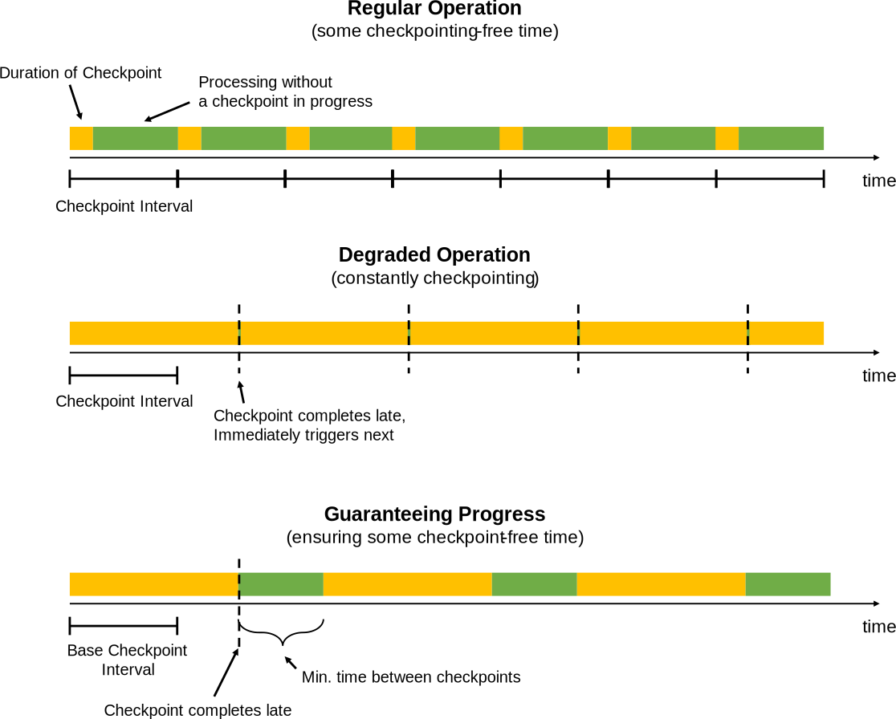

<!--
Licensed to the Apache Software Foundation (ASF) under one
or more contributor license agreements.  See the NOTICE file
distributed with this work for additional information
regarding copyright ownership.  The ASF licenses this file
to you under the Apache License, Version 2.0 (the
"License"); you may not use this file except in compliance
with the License.  You may obtain a copy of the License at

  http://www.apache.org/licenses/LICENSE-2.0

Unless required by applicable law or agreed to in writing,
software distributed under the License is distributed on an
"AS IS" BASIS, WITHOUT WARRANTIES OR CONDITIONS OF ANY
KIND, either express or implied.  See the License for the
specific language governing permissions and limitations
under the License.
-->

This page gives a guide how to configure and tune applications that use large state.

* ToC
{:toc}

## Overview

For Flink applications to run reliably at large scale, two conditions must be fulfilled:

  - The application needs to be able to take checkpoints reliably

  - The resources need to be sufficient catch up with the input data streams after a failure

The first sections discuss how to get well performing checkpoints at scale.
The last section explains some best practices concerning planning how many resources to use.

## Monitoring State and Checkpoints

The easiest way to monitor checkpoint behavior is via the UI's checkpoint section. The documentation
for [checkpoint monitoring](checkpoint_monitoring.html) shows how to access the available checkpoint
metrics.

The two numbers that are of particular interest when scaling up checkpoints are:

  - The time until operators start their checkpoint: This time is currently not exposed directly, but corresponds
    to:
    
    `checkpoint_start_delay = end_to_end_duration - synchronous_duration - asynchronous_duration`

    When the time to trigger the checkpoint is constantly very high, it means that the *checkpoint barriers* need a long
    time to travel from the source to the operators. That typically indicates that the system is operating under a
    constant backpressure.

  - The amount of data buffered during alignments. For exactly-once semantics, Flink *aligns* the streams at
    operators that receive multiple input streams, buffering some data for that alignment.
    The buffered data volume is ideally low - higher amounts means that checkpoint barriers are reveived at
    very different times from the different input streams.

Note that when the here indicated numbers can be occasionally high in the presence of transient backpressure, data skew,
or network issues. However, if the numbers are constantly very high, it means that Flink puts many resources into checkpointing.

## Tuning Checkpointing

Checkpoints are triggered at regular intervals that applications can configure. When a checkpoint takes longer
to complete than the checkpoint interval, the next checkpoint is not triggered before the in-progress checkpoint
completes. By default the next checkpoint will then be triggered immediately once the ongoing checkpoint completes.

When checkpoints end up frequently taking longer than the base interval (for example because state
grew larger than planned, or the storage where checkpoints are stored is temporarily slow),
the system is constantly taking checkpoints (new ones are started immediately once ongoing once finish).
That can mean that too many resources are constantly tied up in checkpointing and that the operators make too
little progress. This behavior has less impact on streaming applications that use asynchronously checkpointed state,
but may still have an impact on overall application performance.

To prevent such a situation, applications can define a *minimum duration between checkpoints*:

`StreamExecutionEnvironment.getCheckpointConfig().setMinPauseBetweenCheckpoints(milliseconds)`

This duration is the minimum time interval that must pass between the end of the latest checkpoint and the beginning
of the next. The figure below illustrates how this impacts checkpointing.

*Note:* Applications can be configured (via the `CheckpointConfig`) to allow multiple checkpoints to be in progress at
the same time. For applications with large state in Flink, this often ties up too many resources into the checkpointing.
When a savepoint is manually triggered, it may be in process concurrently with an ongoing checkpoint.

## Tuning Network Buffers

The number of network buffers is a parameter that can currently have an effect on checkpointing at large scale.
The Flink community is working on eliminating that parameter in the next versions of Flink.

The number of network buffers defines how much data a TaskManager can hold in-flight before back-pressure kicks in.
A very high number of network buffers means that a lot of data may be in the stream network channels when a checkpoint
is started. Because the checkpoint barriers travel with that data (see [description of how checkpointing works](../internals/stream_checkpointing.html)),
a lot of in-flight data means that the barriers have to wait for that data to be transported/processed before arriving
at the target operator.

Having a lot of data in-flight also does not speed up the data processing as a whole. It only means that data is picked up faster
from the data source (log, files, message queue) and buffered longer in Flink. Having fewer network buffers means that
data is picked up from the source more immediately before it is actually being processed, which is generally desirable.
The number of network buffers should hence not be set arbitrarily large, but to a low multiple (such as 2x) of the
minimum number of required buffers.

## Make state checkpointing Asynchronous where possible

When state is *asynchronously* snapshotted, the checkpoints scale better than when the state is *synchronously* snapshotted.
Especially in more complex streaming applications with multiple joins, Co-functions, or windows, this may have a profound
impact.

To get state to be snapshotted asynchronously, applications have to do two things:

  1. Use state that is [managed by Flink](../dev/stream/state.html): Managed state means that Flink provides the data
     structure in which the state is stored. Currently, this is true for *keyed state*, which is abstracted behind the
     interfaces like `ValueState`, `ListState`, `ReducingState`, ...

  2. Use a state backend that supports asynchronous snapshots. In Flink 1.2, only the RocksDB state backend uses
     fully asynchronous snapshots.

The above two points imply that (in Flink 1.2) large state should generally be kept as keyed state, not as operator state.
This is subject to change with the planned introduction of *managed operator state*.

## Tuning RocksDB

The state storage workhorse of many large scale Flink streaming applications is the *RocksDB State Backend*.
The backend scales well beyond main memory and reliably stores large [keyed state](../dev/stream/state.html).

Unfortunately, RocksDB's performance can vary with configuration, and there is little documentation on how to tune
RocksDB properly. For example, the default configuration is tailored towards SSDs and performs suboptimal
on spinning disks.

**Passing Options to RocksDB**


RocksDBStateBackend.setOptions(new MyOptions());

public class MyOptions implements OptionsFactory {

    @Override
    public DBOptions createDBOptions() {
        return new DBOptions()
            .setIncreaseParallelism(4)
            .setUseFsync(false)
            .setDisableDataSync(true);
    }

    @Override
    public ColumnFamilyOptions createColumnOptions() {

        return new ColumnFamilyOptions()
            .setTableFormatConfig(
                new BlockBasedTableConfig()
                    .setBlockCacheSize(256 * 1024 * 1024)  // 256 MB
                    .setBlockSize(128 * 1024));            // 128 KB
    }
}


**Predefined Options**

Flink provides some predefined collections of option for RocksDB for different settings, which can be set for example via
`RocksDBStateBacked.setPredefinedOptions(PredefinedOptions.SPINNING_DISK_OPTIMIZED_HIGH_MEM)`.

We expect to accumulate more such profiles over time. Feel free to contribute such predefined option profiles when you
found a set of options that work well and seem representative for certain workloads.

**Important:** RocksDB is a native library, whose allocated memory not from the JVM, but directly from the process'
native memory. Any memory you assign to RocksDB will have to be accounted for, typically by decreasing the JVM heap size
of the TaskManagers by the same amount. Not doing that may result in YARN/Mesos/etc terminating the JVM processes for
allocating more memory than configures.

## Capacity Planning

This section discusses how to decide how many resources should be used for a Flink job to run reliably.
The basic rules of thumb for capacity planning are:

  - Normal operation should have enough capacity to not operate under constant *back pressure*.
    See [back pressure monitoring](back_pressure.html) for details on how to check whether the application runs under back pressure.

  - Provision some extra resources on top of the resources needed to run the program back-pressure-free during failure-free time.
    These resources are needed to "catch up" with the input data that accumulated during the time the application
    was recovering.
    How much that should be depends on how long recovery operations usually take (which depends on the size of the state
    that needs to be loaded into the new TaskManagers on a failover) and how fast the scenario requires failures to recover.

    *Important*: The base line should to be established with checkpointing activated, because checkpointing ties up
    some amount of resources (such as network bandwidth).

  - Temporary back pressure is usually okay, and an essential part of execution flow control during load spikes,
    during catch-up phases, or when external systems (that are written to in a sink) exhibit temporary slowdown.

  - Certain operations (like large windows) result in a spiky load for their downstream operators: 
    In the case of windows, the downstream operators may have little to do while the window is being built,
    and have a load to do when the windows are emitted.
    The planning for the downstream parallelism needs to take into account how much the windows emit and how
    fast such a spike needs to be processed.

**Important:** In order to allow for adding resources later, make sure to set the *maximum parallelism* of the
data stream program to a reasonable number. The maximum parallelism defines how high you can set the programs
parallelism when re-scaling the program (via a savepoint).

Flink's internal bookkeeping tracks parallel state in the granularity of max-parallelism-many *key groups*.
Flink's design strives to make it efficient to have a very high value for the maximum parallelism, even if
executing the program with a low parallelism. 

