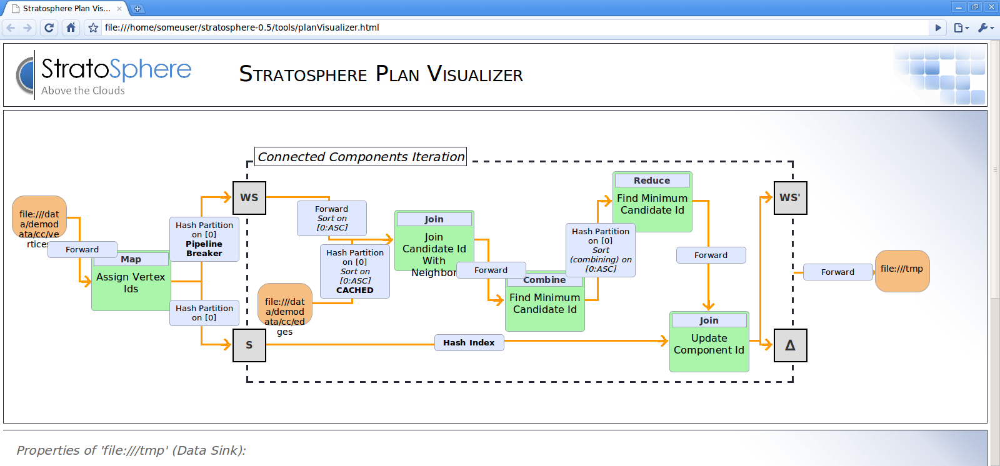

* This will be replaced by the TOC
{:toc}


<a href="#top"></a>

Introduction
------------

Analysis programs in Flink are regular programs that implement transformations on data sets
(e.g., filtering, mapping, joining, grouping). The data sets are initially created from certain
sources (e.g., by reading files, or from collections). Results are returned via sinks, which may for
example write the data to (distributed) files, or to standard output (for example the command line
terminal). Flink programs run in a variety of contexts, standalone, or embedded in other programs.
The execution can happen in a local JVM, or on clusters of many machines.

In order to create your own Flink program, we encourage you to start with the
[program skeleton](#program-skeleton) and gradually add your own
[transformations](#transformations). The remaining sections act as references for additional
operations and advanced features.


Example Program
---------------

The following program is a complete, working example of WordCount. You can copy &amp; paste the code
to run it locally. You only have to include the correct Flink's library into your project
(see Section [Linking with Flink](#linking-with-flink)) and specify the imports. Then you are ready
to go!

<div class="codetabs" markdown="1">
<div data-lang="java" markdown="1">


public class WordCountExample {
    public static void main(String[] args) throws Exception {
        final ExecutionEnvironment env = ExecutionEnvironment.getExecutionEnvironment();

	    DataSet<String> text = env.fromElements(
            "Who's there?",
            "I think I hear them. Stand, ho! Who's there?");

        DataSet<Tuple2<String, Integer>> wordCounts = text
            .flatMap(new LineSplitter())
            .groupBy(0)
            .sum(1);

        wordCounts.print();

        env.execute("Word Count Example");
    }

    public static class LineSplitter implements FlatMapFunction<String, Tuple2<String, Integer>> {
        @Override
        public void flatMap(String line, Collector<Tuple2<String, Integer>> out) {
            for (String word : line.split(" ")) {
                out.collect(new Tuple2<String, Integer>(word, 1));
            }
        }
    }
}


</div>

<div data-lang="scala" markdown="1">

object WordCount {
  def main(args: Array[String]) {

    val env = ExecutionEnvironment.getExecutionEnvironment
    val text = env.fromElements(
      "Who's there?",
      "I think I hear them. Stand, ho! Who's there?")

    val counts = text.flatMap { _.toLowerCase.split("\\W+") filter { _.nonEmpty } }
      .map { (_, 1) }
      .groupBy(0)
      .sum(1)

    counts.print()

    env.execute("Scala WordCount Example")
  }
}

</div>

</div>

[Back to top](#top)


Linking with Flink
------------------

To write programs with Flink, you need to include the Flink library corresponding to
your programming language in your project.

The simplest way to do this is to use one of the quickstart scripts: either for
[Java](java_api_quickstart.html) or for [Scala](scala_api_quickstart.html). They
create a blank project from a template (a Maven Archetype), which sets up everything for you. To
manually create the project, you can use the archetype and create a project by calling:

<div class="codetabs" markdown="1">
<div data-lang="java" markdown="1">

mvn archetype:generate /
    -DarchetypeGroupId=org.apache.flink/
    -DarchetypeArtifactId=flink-quickstart-java /
    -DarchetypeVersion={{site.FLINK_VERSION_STABLE }}

</div>
<div data-lang="scala" markdown="1">

mvn archetype:generate /
    -DarchetypeGroupId=org.apache.flink/
    -DarchetypeArtifactId=flink-quickstart-scala /
    -DarchetypeVersion={{site.FLINK_VERSION_STABLE }}

</div>
</div>

If you want to add Flink to an existing Maven project, add the following entry to your
*dependencies* section in the *pom.xml* file of your project:

<div class="codetabs" markdown="1">
<div data-lang="java" markdown="1">

<dependency>
  <groupId>org.apache.flink</groupId>
  <artifactId>flink-java</artifactId>
  <version>{{site.FLINK_VERSION_STABLE }}</version>
</dependency>
<dependency>
  <groupId>org.apache.flink</groupId>
  <artifactId>flink-clients</artifactId>
  <version>{{site.FLINK_VERSION_STABLE }}</version>
</dependency>

</div>
<div data-lang="scala" markdown="1">

<dependency>
  <groupId>org.apache.flink</groupId>
  <artifactId>flink-scala</artifactId>
  <version>{{site.FLINK_VERSION_STABLE }}</version>
</dependency>
<dependency>
  <groupId>org.apache.flink</groupId>
  <artifactId>flink-clients</artifactId>
  <version>{{site.FLINK_VERSION_STABLE }}</version>
</dependency>

</div>
</div>

If you are using Flink together with Hadoop, the version of the dependency may vary depending on the
version of Hadoop (or more specifically, HDFS) that you want to use Flink with. Please refer to the
[downloads page]({{site.baseurl}}/downloads.html) for a list of available versions, and instructions
on how to link with custom versions of Hadoop.

In order to link against the latest SNAPSHOT versions of the code, please follow
[this guide]({{site.baseurl}}/downloads.html#nightly).

The *flink-clients* dependency is only necessary to invoke the Flink program locally (for example to
run it standalone for testing and debugging).  If you intend to only export the program as a JAR
file and [run it on a cluster](cluster_execution.html), you can skip that dependency.

[Back to top](#top)

Program Skeleton
----------------

<div class="codetabs" markdown="1">
<div data-lang="java" markdown="1">

As we already saw in the example, Flink programs look like regular Java
programs with a `main()` method. Each program consists of the same basic parts:

1. Obtain an `ExecutionEnvironment`,
2. Load/create the initial data,
3. Specify transformations on this data,
4. Specify where to put the results of your computations, and
5. Execute your program.

We will now give an overview of each of those steps but please refer to the respective sections for
more details. Note that all

are found in the package `org.apache.flink.api.java`.

The `ExecutionEnvironment` is the basis for all Flink programs. You can
obtain one using these static methods on class `ExecutionEnvironment`:


getExecutionEnvironment()

createLocalEnvironment()
createLocalEnvironment(int degreeOfParallelism)

createRemoteEnvironment(String host, int port, String... jarFiles)
createRemoteEnvironment(String host, int port, int degreeOfParallelism, String... jarFiles)


Typically, you only need to use `getExecutionEnvironment()`, since this
will do the right thing depending on the context: if you are executing
your program inside an IDE or as a regular Java program it will create
a local environment that will execute your program on your local machine. If
you created a JAR file from you program, and invoke it through the [command line](cli.html)
or the [web interface](web_client.html),
the Flink cluster manager will
execute your main method and `getExecutionEnvironment()` will return
an execution environment for executing your program on a cluster.

For specifying data sources the execution environment has several methods
to read from files using various methods: you can just read them line by line,
as CSV files, or using completely custom data input formats. To just read
a text file as a sequence of lines, you can use:


final ExecutionEnvironment env = ExecutionEnvironment.getExecutionEnvironment();

DataSet<String> text = env.readTextFile("file:///path/to/file");


This will give you a DataSet on which you can then apply transformations. For
more information on data sources and input formats, please refer to
[Data Sources](#data_sources).

Once you have a DataSet you can apply transformations to create a new
DataSet which you can then write to a file, transform again, or
combine with other DataSets. You apply transformations by calling
methods on DataSet with your own custom transformation function. For example,
a map transformation looks like this:


DataSet<String> input = ...;

DataSet<Integer> tokenized = text.map(new MapFunction<String, Integer>() {
    @Override
    public Integer map(String value) {
        return Integer.parseInt(value);
    }
});


This will create a new DataSet by converting every String in the original
set to an Integer. For more information and a list of all the transformations,
please refer to [Transformations](#transformations).

Once you have a DataSet that needs to be written to disk you call one
of these methods on DataSet:


writeAsText(String path)
writeAsCsv(String path)
write(FileOutputFormat<T> outputFormat, String filePath)

print()


The last method is only useful for developing/debugging on a local machine,
it will output the contents of the DataSet to standard output. (Note that in
a cluster, the result goes to the standard out stream of the cluster nodes and ends
up in the *.out* files of the workers).
The first two do as the name suggests, the third one can be used to specify a
custom data output format. Please refer
to [Data Sinks](#data_sinks) for more information on writing to files and also
about custom data output formats.

Once you specified the complete program you need to call `execute` on
the `ExecutionEnvironment`. This will either execute on your local
machine or submit your program for execution on a cluster, depending on
how you created the execution environment.

</div>
<div data-lang="scala" markdown="1">

As we already saw in the example, Flink programs look like regular Scala
programs with a `main()` method. Each program consists of the same basic parts:

1. Obtain an `ExecutionEnvironment`,
2. Load/create the initial data,
3. Specify transformations on this data,
4. Specify where to put the results of your computations, and
5. Execute your program.

We will now give an overview of each of those steps but please refer to the respective sections for
more details. Note that all core classes of the Scala API are found in the package 
.


The `ExecutionEnvironment` is the basis for all Flink programs. You can
obtain one using these static methods on class `ExecutionEnvironment`:


def getExecutionEnvironment

def createLocalEnvironment(degreeOfParallelism: Int = Runtime.getRuntime.availableProcessors()))

def createRemoteEnvironment(host: String, port: String, jarFiles: String*)
def createRemoteEnvironment(host: String, port: String, degreeOfParallelism: Int, jarFiles: String*)


Typically, you only need to use `getExecutionEnvironment()`, since this
will do the right thing depending on the context: if you are executing
your program inside an IDE or as a regular Scala program it will create
a local environment that will execute your program on your local machine. If
you created a JAR file from you program, and invoke it through the [command line](cli.html)
or the [web interface](web_client.html),
the Flink cluster manager will
execute your main method and `getExecutionEnvironment()` will return
an execution environment for executing your program on a cluster.

For specifying data sources the execution environment has several methods
to read from files using various methods: you can just read them line by line,
as CSV files, or using completely custom data input formats. To just read
a text file as a sequence of lines, you can use:


val env = ExecutionEnvironment.getExecutionEnvironment()

val text = env.readTextFile("file:///path/to/file")


This will give you a DataSet on which you can then apply transformations. For
more information on data sources and input formats, please refer to
[Data Sources](#data_sources).

Once you have a DataSet you can apply transformations to create a new
DataSet which you can then write to a file, transform again, or
combine with other DataSets. You apply transformations by calling
methods on DataSet with your own custom transformation function. For example,
a map transformation looks like this:


val input: DataSet[String] = ...

val mapped = text.map { x => x.toInt }


This will create a new DataSet by converting every String in the original
set to an Integer. For more information and a list of all the transformations,
please refer to [Transformations](#transformations).

Once you have a DataSet that needs to be written to disk you can call one
of these methods on DataSet:


def writeAsText(path: String, writeMode: WriteMode = WriteMode.NO_OVERWRITE)
def writeAsCsv(
    filePath: String,
    rowDelimiter: String = "\n",
    fieldDelimiter: String = ',',
    writeMode: WriteMode = WriteMode.NO_OVERWRITE)
def write(outputFormat: FileOutputFormat[T],
    path: String,
    writeMode: WriteMode = WriteMode.NO_OVERWRITE)

def print()


The last method is only useful for developing/debugging on a local machine,
it will output the contents of the DataSet to standard output. (Note that in
a cluster, the result goes to the standard out stream of the cluster nodes and ends
up in the *.out* files of the workers).
The first two do as the name suggests, the third one can be used to specify a
custom data output format. Please refer
to [Data Sinks](#data_sinks) for more information on writing to files and also
about custom data output formats.

Once you specified the complete program you need to call `execute` on
the `ExecutionEnvironment`. This will either execute on your local
machine or submit your program for execution on a cluster, depending on
how you created the execution environment.

</div>
</div>


[Back to top](#top)


Lazy Evaluation
---------------

All Flink programs are executed lazily: When the program's main method is executed, the data loading
and transformations do not happen directly. Rather, each operation is created and added to the
program's plan. The operations are actually executed when one of the `execute()` methods is invoked
on the ExecutionEnvironment object. Whether the program is executed locally or on a cluster depends
on the environment of the program.

The lazy evaluation lets you construct sophisticated programs that Flink executes as one
holistically planned unit.

[Back to top](#top)


Transformations
---------------

Data transformations transform one or more DataSets into a new DataSet. Programs can combine
multiple transformations into sophisticated assemblies.

This section gives a brief overview of the available transformations. The [transformations
documentation](dataset_transformations.html) has a full description of all transformations with
examples.

<div class="codetabs" markdown="1">
<div data-lang="java" markdown="1">

<br />

<table class="table table-bordered">
  <thead>
    <tr>
      <th class="text-left" style="width: 20%">Transformation</th>
      <th class="text-center">Description</th>
    </tr>
  </thead>

  <tbody>
    <tr>
      <td><strong>Map</strong></td>
      <td>
        <p>Takes one element and produces one element.</p>

data.map(new MapFunction<String, Integer>() {
  public Integer map(String value) { return Integer.parseInt(value); }
});

      </td>
    </tr>

    <tr>
      <td><strong>FlatMap</strong></td>
      <td>
        <p>Takes one element and produces zero, one, or more elements. </p>

data.flatMap(new FlatMapFunction<String, String>() {
  public void flatMap(String value, Collector<String> out) {
    for (String s : value.split(" ")) {
      out.collect(s);
    }
  }
});

      </td>
    </tr>

    <tr>
      <td><strong>MapPartition</strong></td>
      <td>
        <p>Transforms a parallel partition in a single function call. The function get the partition
        as an `Iterable` stream and can produce an arbitrary number of result values. The number of
        elements in each partition depends on the degree-of-parallelism and previous operations.</p>

data.mapPartition(new MapPartitionFunction<String, Long>() {
  public void mapPartition(Iterable<String> values, Collector<Long> out) {
    long c = 0;
    for (String s : values) {
      c++;
    }
    out.collect(c);
  }
});

      </td>
    </tr>

    <tr>
      <td><strong>Filter</strong></td>
      <td>
        <p>Evaluates a boolean function for each element and retains those for which the function
        returns true.</p>

data.filter(new FilterFunction<Integer>() {
  public boolean filter(Integer value) { return value > 1000; }
});

      </td>
    </tr>

    <tr>
      <td><strong>Reduce</strong></td>
      <td>
        <p>Combines a group of elements into a single element by repeatedly combining two elements
        into one. Reduce may be applied on a full data set, or on a grouped data set.</p>

data.reduce(new ReduceFunction<Integer> {
  public Integer reduce(Integer a, Integer b) { return a + b; }
});

      </td>
    </tr>

    <tr>
      <td><strong>ReduceGroup</strong></td>
      <td>
        <p>Combines a group of elements into one or more elements. ReduceGroup may be applied on a
        full data set, or on a grouped data set.</p>

data.reduceGroup(new GroupReduceFunction<Integer, Integer> {
  public void reduceGroup(Iterable<Integer> values, Collector<Integer> out) {
    int prefixSum = 0;
    for (Integer i : values) {
      prefixSum += i;
      out.collect(prefixSum);
    }
  }
});

      </td>
    </tr>

    <tr>
      <td><strong>Aggregate</strong></td>
      <td>
        <p>Aggregates a group of values into a single value. Aggregation functions can be thought of
        as built-in reduce functions. Aggregate may be applied on a full data set, or on a grouped
        data set.</p>

Dataset<Tuple3<Integer, String, Double>> input = // [...]
DataSet<Tuple3<Integer, String, Double>> output = input.aggregate(SUM, 0).and(MIN, 2);

	<p>You can also use short-hand syntax for minimum, maximum, and sum aggregations.</p>
	
	Dataset<Tuple3<Integer, String, Double>> input = // [...]
DataSet<Tuple3<Integer, String, Double>> output = input.sum(0).andMin(2);
	
      </td>
    </tr>

    </tr>
      <td><strong>Join</strong></td>
      <td>
        Joins two data sets by creating all pairs of elements that are equal on their keys.
        Optionally uses a JoinFunction to turn the pair of elements into a single element, or a
        FlatJoinFunction to turn the pair of elements into arbitararily many (including none)
        elements. See <a href="#specifying-keys">keys</a> on how to define join keys.

result = input1.join(input2)
               .where(0)       // key of the first input (tuple field 0)
               .equalTo(1);    // key of the second input (tuple field 1)

      </td>
    </tr>

    <tr>
      <td><strong>CoGroup</strong></td>
      <td>
        <p>The two-dimensional variant of the reduce operation. Groups each input on one or more
        fields and then joins the groups. The transformation function is called per pair of groups.
        See <a href="#specifying-keys">keys</a> on how to define coGroup keys.</p>

data1.coGroup(data2)
     .where(0)
     .equalTo(1)
     .with(new CoGroupFunction<String, String, String>() {
         public void coGroup(Iterable<String> in1, Iterable<String> in2, Collector<String> out) {
           out.collect(...);
         }
      });

      </td>
    </tr>

    <tr>
      <td><strong>Cross</strong></td>
      <td>
        <p>Builds the Cartesian product (cross product) of two inputs, creating all pairs of
        elements. Optionally uses a CrossFunction to turn the pair of elements into a single
        element</p>

DataSet<Integer> data1 = // [...]
DataSet<String> data2 = // [...]
DataSet<Tuple2<Integer, String>> result = data1.cross(data2);

      </td>
    </tr>
    <tr>
      <td><strong>Union</strong></td>
      <td>
        <p>Produces the union of two data sets. This operation happens implicitly if more than one
        data set is used for a specific function input.</p>

DataSet<String> data1 = // [...]
DataSet<String> data2 = // [...]
DataSet<String> result = data1.union(data2);

      </td>
    </tr>
    <tr>
      <td><strong>Rebalance</strong></td>
      <td>
        <p>Evenly rebalances the parallel partitions of a data set to eliminate data skew. Only Map-like transformations may follow a rebalance transformation. (Java API Only)</p>

DataSet<String> in = // [...]
DataSet<String> result = in.rebalance()
                           .map(new Mapper());

      </td>
    </tr>
    <tr>
      <td><strong>Hash-Partition</strong></td>
      <td>
        <p>Hash-partitions a data set on a given key. Keys can be specified as key-selector functions or field position keys.</p>

DataSet<Tuple2<String,Integer>> in = // [...]
DataSet<Integer> result = in.partitionByHash(0)
                            .mapPartition(new PartitionMapper());

      </td>
    </tr>
    <tr>
      <td><strong>First-n</strong></td>
      <td>
        <p>Returns the first n (arbitrary) elements of a data set. First-n can be applied on a regular data set, a grouped data set, or a grouped-sorted data set. Grouping keys can be specified as key-selector functions or field position keys.</p>

DataSet<Tuple2<String,Integer>> in = // [...]
// regular data set
DataSet<Tuple2<String,Integer>> result1 = in.first(3);
// grouped data set
DataSet<Tuple2<String,Integer>> result2 = in.groupBy(0)
                                            .first(3);
// grouped-sorted data set
DataSet<Tuple2<String,Integer>> result3 = in.groupBy(0)
                                            .sortGroup(1, Order.ASCENDING)
                                            .first(3);

      </td>
    </tr>
  </tbody>
</table>

----------

The following transformations are available on data sets of Tuples:

<table class="table table-bordered">
  <thead>
    <tr>
      <th class="text-left" style="width: 20%">Transformation</th>
      <th class="text-center">Description</th>
    </tr>
  </thead>
  <tbody>
   <tr>
      <td><strong>Project</strong></td>
      <td>
        <p>Selects a subset of fields from the tuples</p>

DataSet<Tuple3<Integer, Double, String>> in = // [...]
DataSet<Tuple2<String, Integer>> out = in.project(2,0).types(String.class, Integer.class);

      </td>
    </tr>
  </tbody>
</table>

</div>
<div data-lang="scala" markdown="1">
<br />

<table class="table table-bordered">
  <thead>
    <tr>
      <th class="text-left" style="width: 20%">Transformation</th>
      <th class="text-center">Description</th>
    </tr>
  </thead>

  <tbody>
    <tr>
      <td><strong>Map</strong></td>
      <td>
        <p>Takes one element and produces one element.</p>

data.map { x => x.toInt }

      </td>
    </tr>

    <tr>
      <td><strong>FlatMap</strong></td>
      <td>
        <p>Takes one element and produces zero, one, or more elements. </p>

data.flatMap { str => str.split(" ") }

      </td>
    </tr>

    <tr>
      <td><strong>MapPartition</strong></td>
      <td>
        <p>Transforms a parallel partition in a single function call. The function get the partition
        as a `TraversableOnce` and can produce an arbitrary number of result values. The number of
        elements in each partition depends on the degree-of-parallelism and previous operations.</p>

data.mapPartition { in => in map { (_, 1) } }

      </td>
    </tr>

    <tr>
      <td><strong>Filter</strong></td>
      <td>
        <p>Evaluates a boolean function for each element and retains those for which the function
        returns true.</p>

data.filter { _ > 1000 }

      </td>
    </tr>

    <tr>
      <td><strong>Reduce</strong></td>
      <td>
        <p>Combines a group of elements into a single element by repeatedly combining two elements
        into one. Reduce may be applied on a full data set, or on a grouped data set.</p>

data.reduce { _ + _ }

      </td>
    </tr>

    <tr>
      <td><strong>ReduceGroup</strong></td>
      <td>
        <p>Combines a group of elements into one or more elements. ReduceGroup may be applied on a
        full data set, or on a grouped data set.</p>

data.reduceGroup { elements => elements.sum }

      </td>
    </tr>

    <tr>
      <td><strong>Aggregate</strong></td>
      <td>
        <p>Aggregates a group of values into a single value. Aggregation functions can be thought of
        as built-in reduce functions. Aggregate may be applied on a full data set, or on a grouped
        data set.</p>

val input: DataSet[(Int, String, Double)] = // [...]
val output: DataSet[(Int, String, Doublr)] = input.aggregate(SUM, 0).aggregate(MIN, 2);

  <p>You can also use short-hand syntax for minimum, maximum, and sum aggregations.</p>

val input: DataSet[(Int, String, Double)] = // [...]
val output: DataSet[(Int, String, Doublr)] = input.sum(0).min(2)

      </td>
    </tr>

    </tr>
      <td><strong>Join</strong></td>
      <td>
        Joins two data sets by creating all pairs of elements that are equal on their keys.
        Optionally uses a JoinFunction to turn the pair of elements into a single element, or a
        FlatJoinFunction to turn the pair of elements into arbitararily many (including none)
        elements. See <a href="#specifying-keys">keys</a> on how to define join keys.

// In this case tuple fields are used as keys. "0" is the join field on the first tuple
// "1" is the join field on the second tuple.
val result = input1.join(input2).where(0).equalTo(1)

      </td>
    </tr>

    <tr>
      <td><strong>CoGroup</strong></td>
      <td>
        <p>The two-dimensional variant of the reduce operation. Groups each input on one or more
        fields and then joins the groups. The transformation function is called per pair of groups.
        See <a href="#specifying-keys">keys</a> on how to define coGroup keys.</p>

data1.coGroup(data2).where(0).equalTo(1)

      </td>
    </tr>

    <tr>
      <td><strong>Cross</strong></td>
      <td>
        <p>Builds the Cartesian product (cross product) of two inputs, creating all pairs of
        elements. Optionally uses a CrossFunction to turn the pair of elements into a single
        element</p>

val data1: DataSet[Int] = // [...]
val data2: DataSet[String] = // [...]
val result: DataSet[(Int, String)] = data1.cross(data2)

      </td>
    </tr>
    <tr>
      <td><strong>Union</strong></td>
      <td>
        <p>Produces the union of two data sets.</p>

data.union(data2)

      </td>
    </tr>
    <tr>
      <td><strong>Hash-Partition</strong></td>
      <td>
        <p>Hash-partitions a data set on a given key. Keys can be specified as key-selector functions, tuple positions
        or case class fields.</p>

val in: DataSet[(Int, String)] = // [...]
val result = in.partitionByHash(0).mapPartition { ... }

      </td>
    </tr>
    <tr>
      <td><strong>First-n</strong></td>
      <td>
        <p>Returns the first n (arbitrary) elements of a data set. First-n can be applied on a regular data set, a grouped data set, or a grouped-sorted data set. Grouping keys can be specified as key-selector functions,
        tuple positions or case class fields.</p>

val in: DataSet[(Int, String)] = // [...]
// regular data set
val result1 = in.first(3)
// grouped data set
val result2 = in.groupBy(0).first(3)
// grouped-sorted data set
val result3 = in.groupBy(0).sortGroup(1, Order.ASCENDING).first(3)

      </td>
    </tr>
  </tbody>
</table>

</div>
</div>

The [parallelism](#parallelism) of a transformation can be defined by `setParallelism(int)` while
`name(String)` assigns a custom name to a transformation which is helpful for debugging. The same is
possible for [Data Sources](#data_sources) and [Data Sinks](#data_sinks).

[Back to Top](#top)


Specifying Keys
-------------

<div class="codetabs" markdown="1">
<div data-lang="java" markdown="1">

Some transformations (join, coGroup) require that a key is defined on
its argument DataSets, and other transformations (Reduce, GroupReduce,
Aggregate) allow that the DataSet is grouped on a key before they are
applied.

A DataSet is grouped as

DataSet<...> input = // [...]
DataSet<...> reduced = input
	.groupBy(/*define key here*/)
	.reduceGroup(/*do something*/);


The data model of Flink is not based on key-value pairs. Therefore,
you do not need to physically pack the data set types into keys and
values. Keys are "virtual": they are defined as functions over the
actual data to guide the grouping operator.

### Define keys for Tuples
{:.no_toc}

The simplest case is grouping a data set of Tuples on one or more
fields of the Tuple:

DataSet<Tuple3<Integer,String,Long>> input = // [...]
DataSet<Tuple3<Integer,String,Long> grouped = input
	.groupBy(0)
	.reduceGroup(/*do something*/);


The data set is grouped on the first field of the tuples (the one of
Integer type). The GroupReduceFunction will thus receive groups of tuples with
the same value in the first field.


DataSet<Tuple3<Integer,String,Long>> input = // [...]
DataSet<Tuple3<Integer,String,Long> grouped = input
	.groupBy(0,1)
	.reduce(/*do something*/);


The data set is grouped on the composite key consisting of the first and the
second fields, therefore the GroupReduceFuntion will receive groups
with the same value for both fields.

A note on nested Tuples: If you have a DataSet with a nested tuple, such as:

DataSet<Tuple3<Tuple2<Integer, Float>,String,Long>> ds;

Specifying `groupBy(0)` will cause the system to use the full `Tuple2` as a key (with the Integer and Float being the key). If you want to "navigate" into the nested `Tuple2`, you have to use a string-based expression, as explained below. For this particular example, you would have to specfiy `f0.f0`.

### Define key using a String Expression
{:.no_toc}

Starting from release 0.7-incubating, you can use String-based key expressions to select keys.

The String expressions allow to specify the name of the field in a class you want to group by.

In the example below, we have a `WC` POJO with two fields "word" and "count". To group by the field "word", we just pass this name to the `groupBy()` function.

// some ordinary POJO (Plain old Java Object)
public class WC {
  public String word; 
  public int count;
}
DataSet<WC> words = // [...]
DataSet<WC> wordCounts = words.groupBy("word").reduce(/*do something*/);


**Conditions** for a class to be treated as a POJO by Flink:

- The class must be public
- It must have a public constructor without arguments
- All fields either have to be public or there must be getters and setters for all non-public fields. If the field name is `foo` the getter and setters must be called `getFoo()` and `setFoo()`.

**Valid Expressions**:

- You can select POJO fields by their field name
- You can select Tuple fields by their field name as well. For example `f0` or `f5`.
- You can select nested fields in POJOs and Tuples. Expressions like `user.zip` or `user.groupId` are valid. Flink also supports POJOs inside Tuples: `f1.user.zip`.
- You can select all fields at each level. To select all fields, specify `*`. This also works for the nested case: `user.*`.

**Example for nested POJO**


public static class WC {
  public ComplexNestedClass complex; //nested POJO
  private int count;
  // getter / setter for private field (count)
  public int getCount() {
    return count;
  }
  public void setCount(int c) {
    this.count = c;
  }
}
public static class ComplexNestedClass {
  public Integer someNumber;
  public float someFloat;
  public Tuple3<Long, Long, String> word;
  public IntWritable hadoopCitizen;
}


These are valid expressions for the example POJO above:

- `count`: The count field in the `WC` class.
- `complex.*`: Selects all fields in the `ComplexNestedClass`.
- `complex.word.f2`: Selects the last field in the Tuple3.
- `complex.hadoopCitizen`: Selects a Hadoop-`Writable` type as a key.

Please note that you can only use types inside POJOs that Flink is able to serialize. Currently, we are using [Avro](http://avro.apache.org) to serialize arbitrary objects (such as `Date`).

### Define key using a Key Selector Function
{:.no_toc}

An additional way to define keys are "key selector" functions, which
takes as argument one dataset element and returns a key of an
arbitrary data type by performing an arbitrary computation on this
element. For example:

// some ordinary POJO
public class WC {public String word; public int count;}
DataSet<WC> words = // [...]
DataSet<WC> wordCounts = words
                         .groupBy(
                           new KeySelector<WC, String>() {
                             public String getKey(WC wc) { return wc.word; }
                           })
                         .reduce(/*do something*/);


Remember that keys are not only used for grouping, but also joining and matching data sets:

// some POJO
public class Rating {
  public String name;
  public String category;
  public int points;
}
DataSet<Rating> ratings = // [...]
DataSet<Tuple2<String, Double>> weights = // [...]
DataSet<Tuple2<String, Double>>
            weightedRatings =
            ratings.join(weights)

                   // key of the first input
                   .where(new KeySelector<Rating, String>() {
                            public String getKey(Rating r) { return r.category; }
                          })

                   // key of the second input
                   .equalTo(new KeySelector<Tuple2<String, Double>, String>() {
                              public String getKey(Tuple2<String, Double> t) { return t.f0; }
                            });


</div>

<div data-lang="scala" markdown="1">
Some transformations (join, coGroup) require that a key is defined on
its argument DataSets, and other transformations (Reduce, GroupReduce,
Aggregate) allow that the DataSet is grouped on a key before they are
applied.

A DataSet is grouped as

val input: DataSet[...] = // [...]
val reduced = input
  .groupBy(/*define key here*/)
  .reduceGroup(/*do something*/)


The data model of Flink is not based on key-value pairs. Therefore,
you do not need to physically pack the data set types into keys and
values. Keys are "virtual": they are defined as functions over the
actual data to guide the grouping operator.

### Define keys for Tuples
{:.no_toc}

The simplest case is grouping a data set of Tuples on one or more
fields of the Tuple:

val input: DataSet[(Int, String, Long)] = // [...]
val grouped = input
  .groupBy(0)
  .reduceGroup(/*do something*/)


The data set is grouped on the first field of the tuples (the one of
Integer type). The group-reduce function will thus receive groups of tuples with
the same value in the first field.


val input: DataSet[(Int, String, Long)] = // [...]
val grouped = input
  .groupBy(0,1)
  .reduce(/*do something*/)


The data set is grouped on the composite key consisting of the first and the
second fields, therefore the group-reduce function will receive groups
with the same value for both fields.

A note on nested Tuples: If you have a DataSet with a nested tuple, such as:

val ds: DataSet[((Int, Float), String, Long)]


Specifying `groupBy(0)` will cause the system to use the full `Tuple2` as a key (with the Int and
Float being the key). If you want to "navigate" into the nested `Tuple2`, you have to use a
string-based expression, as explained below. For this particular example, you would have to specfiy
`"_1._1"`.

### Define key using a String Expression
{:.no_toc}

Starting from release 0.7-incubating, you can use String-based key expressions to select keys.

The String expressions allow to specify the name of the field in a class you want to group by.

In the example below, we have a `WC` POJO with two fields "word" and "count". To group by the field
"word", we just pass this name to the `groupBy()` function.


// some ordinary POJO (Plain old Java Object)
class WC(var word: String, var count: Int) {
  def this() { this("", 0L) }
}
val words: DataSet[WC] = // [...]
val wordCounts = words.groupBy("word").reduce(/*do something*/)

// or, as a case class, which is less typing
case class WC(word: String, count: Int)
val words: DataSet[WC] = // [...]
val wordCounts = words.groupBy("word").reduce(/*do something*/)


**Conditions** for a class to enable using field selection expressions:

- The class must be public
- It must have a public constructor without arguments or be a case class.
- All fields either have to be public or there must be getters and setters for all non-public
 fields. If the field name is `foo` the getter and setters must be called `foo` and `foo_=`. This
 is what normally gets generated when you hava a `var foo` in your class. This also automatically
 applies to case classes since the getters and setters are automatically generated.

**Valid Expressions**:

- You can select POJO fields by their field name
- You can select Tuple fields by their field name as well. For example `_1` or `_6`.
- You can select nested fields in POJOs and Tuples. Expressions like `user.zip` or `user.groupId`
  are valid. Flink also supports POJOs inside Tuples: `_2.user.zip`.
- You can select all fields at each level. To select all fields, specify `*`. This also works for
  the nested case: `user.*`.

**Example for nested POJO**


class WC(var complex: ComplexNestedClass, var count: Int) {
  def this() { this(null, 0) }
}
class ComplexNestedClass(
    var someNumber: Int,
    someFloat: Float,
    word: (Long, Long, String),
    hadoopCitizen: IntWritable) {
  def this() { this(0, 0, (0, 0, ""), new IntWritable(0)) }
}


These are valid expressions for the example POJO above:

- `count`: The count field in the `WC` class.
- `complex.*`: Selects all fields in the `ComplexNestedClass`.
- `complex.word._3`: Selects the last field in the Tuple3.
- `complex.hadoopCitizen`: Selects a Hadoop-`Writable` type as a key.

Please note that you can only use types inside POJOs that Flink is able to serialize. Currently,
we are using [Avro](http://avro.apache.org) to serialize arbitrary objects (such as `Date`).

### Define key using a Key Selector Function
{:.no_toc}

An additional way to define keys are "key selector" functions, which
takes as argument one dataset element and returns a key of an
arbitrary data type by performing an arbitrary computation on this
element. For example:

// some ordinary case class
case class WC(word: String, count: Int)
val words: DataSet[WC] = // [...]
val wordCounts = words
  .groupBy( _.word ).reduce(/*do something*/)


Remember that keys are not only used for grouping, but also joining and matching data sets:

// some case class
case class Rating(name: String, category: String, points: Int)

val ratings: DataSet[Rating] = // [...]
val weights: DataSet[(String, Double)] = // [...]
val weightedRatings = ratings.join(weights).where("category").equalTo("_1")

</div>
</div>


[Back to top](#top)


Passing Functions to Flink
--------------------------

Operations require user-defined functions. This section lists several ways for doing this.

<div class="codetabs" markdown="1">
<div data-lang="java" markdown="1">

#### Implementing an interface

The most basic way is to implement one of the provided interfaces:


class MyMapFunction implements MapFunction<String, Integer> {
  public Integer map(String value) { return Integer.parseInt(value); }
});
data.map (new MyMapFunction());


#### Anonymous classes

You can pass a function as an anonmymous class:

data.map(new MapFunction<String, Integer> () {
  public Integer map(String value) { return Integer.parseInt(value); }
});


#### Java 8 Lambdas

Flink also supports Java 8 Lambdas in the Java API. Please see the full [Java 8 Guide](java8_programming_guide.html).


DataSet<String> data = // [...]
data.filter(s -> s.startsWith("http://"));



DataSet<Integer> data = // [...]
data.reduce((i1,i2) -> i1 + i2);


#### Rich functions

All transformations that take as argument a user-defined function can
instead take as argument a *rich* function. For example, instead of


class MyMapFunction implements MapFunction<String, Integer> {
  public Integer map(String value) { return Integer.parseInt(value); }
});


you can write


class MyMapFunction extends RichMapFunction<String, Integer> {
  public Integer map(String value) { return Integer.parseInt(value); }
});


and pass the function as usual to a `map` transformation:


data.map(new MyMapFunction());


Rich functions can also be defined as an anonymous class:

data.map (new RichMapFunction<String, Integer>() {
  public Integer map(String value) { return Integer.parseInt(value); }
});


</div>
<div data-lang="scala" markdown="1">


#### Lambda Functions

As already seen in previous examples all operations accept lambda functions for describing
the operation:

val data: DataSet[String] = // [...]
data.filter { _.startsWith("http://") }



val data: DataSet[Int] = // [...]
data.reduce { (i1,i2) => i1 + i2 }
// or
data.reduce { _ + _ }


#### Rich functions

All transformations that take as argument a lambda function can
instead take as argument a *rich* function. For example, instead of


data.map { x => x.toInt }


you can write


class MyMapFunction extends RichMapFunction[String, Int] {
  def map(in: String):Int = { in.toInt }
})


and pass the function to a `map` transformation:


data.map(new MyMapFunction())


Rich functions can also be defined as an anonymous class:

data.map (new RichMapFunction[String, Int] {
  def map(in: String):Int = { in.toInt }
})

</div>

</div>

Rich functions provide, in addition to the user-defined function (map,
reduce, etc), four methods: `open`, `close`, `getRuntimeContext`, and
`setRuntimeContext`. These are useful for creating and finalizing
local state, accessing broadcast variables (see
[Broadcast Variables](#broadcast_variables), and for accessing runtime
information such as accumulators and counters (see
[Accumulators and Counters](#accumulators_counters), and information
on iterations (see [Iterations](#iterations)).

In particular for the `reduceGroup` transformation, using a rich
function is the only way to define an optional `combine` function. See
the
[transformations documentation](dataset_transformations.html)
for a complete example.

[Back to top](#top)


Data Types
----------

Flink places some restrictions on the type of elements that are used in DataSets and as results
of transformations. The reason for this is that the system analyzes the types to determine
efficient execution strategies.

There are four different categories of data types, which are treated slightly different when it
to [specifying keys](#specifying-keys):

1. **General Types and POJOs**
2. **Tuples**/**Case Classes**
3. **Values**
4. **Hadoop Writables**


#### General Types

Out of the box, Flink supports all primitive types of your programming language of choice.

Furthermore, you can use the vast majority of custom classes. Restrictions apply to classes
containing fields that cannot be serialized, like File pointers, I/O streams, or other native
resources. Classes that follow the Java Beans conventions work well in general. The following
defines a simple example class to illustrate how you can use custom classes:

<div class="codetabs" markdown="1">
<div data-lang="java" markdown="1">

public class WordWithCount {

    public String word;
    public int count;

    public WordCount() {}

    public WordCount(String word, int count) {
        this.word = word;
        this.count = count;
    }
}

</div>
<div data-lang="scala" markdown="1">

class WordWithCount(val word: String, val count: Int) {
    def this() {
      this(null, -1)
    }
}

</div>
</div>

You can use all of those types to parameterize DataSet and function implementations, e.g.
`DataSet` or a `MapFunction`.

<div class="codetabs" markdown="1">
<div data-lang="java" markdown="1">

// using a basic data type
DataSet<String> numbers = env.fromElements("1", "2");

numbers.map(new MapFunction<String, Integer>() {
    @Override
    public String map(String value) throws Exception {
        return Integer.parseInt(value);
    }
});

// using a custom class
DataSet<WordCount> wordCounts = env.fromElements(
    new WordCount("hello", 1),
    new WordCount("world", 2));

wordCounts.map(new MapFunction<WordCount, Integer>() {
    @Override
    public String map(WordCount value) throws Exception {
        return value.count;
    }
});

</div>
<div data-lang="scala" markdown="1">

// using a primitive data type
// Note that the type ascription "DataSet[String]" can be omitted in Scala
// it is just given to clarify the type of numbers
val numbers: DataSet[String] = env.fromElements("1", "2")

numbers.map(new MapFunction[String, Int]() {
    def map(in: String): Int = {
      in.toInt
    }
})

// using a custom class
val wordCounts = env.fromElements(
  new WordCount("hello", 1),
  new WordCount("world", 2))

wordCounts.map { _.count }

</div>
</div>


When working with operators that require a Key for grouping or matching records
you can select the key using a key expression (see
[Specifying Keys](#specifying-keys)).

<div class="codetabs" markdown="1">
<div data-lang="java" markdown="1">

wordCounts.groupBy("word").reduce(new MyReduceFunction());

</div>
<div data-lang="scala" markdown="1">

wordCounts groupBy { _.word } reduce(new MyReduceFunction())

</div>
</div>


#### Tuples/Case Classes

<div class="codetabs" markdown="1">
<div data-lang="java" markdown="1">

You can use the Tuple classes for composite types. Tuples contain a fix number of fields of
various types. The Java API provides classes from `Tuple1` up to `Tuple25`. Every field of a tuple
can be an arbitrary Flink type - including further tuples, resulting in nested tuples. Fields of a
Tuple can be accessed directly using the fields `tuple.f4`, or using the generic getter method
`tuple.getField(int position)`. The field numbering starts with 0. Note that this stands in contrast
to the Scala tuples, but it is more consistent with Java's general indexing.


DataSet<Tuple2<String, Integer>> wordCounts = env.fromElements(
    new Tuple2<String, Integer>("hello", 1),
    new Tuple2<String, Integer>("world", 2));

wordCounts.map(new MapFunction<Tuple2<String, Integer>, Integer>() {
    @Override
    public String map(Tuple2<String, Integer> value) throws Exception {
        return value.f1;
    }
});


When working with operators that require a Key for grouping or matching records,
Tuples let you simply specify the positions of the fields to be used as key. You can specify more
than one position to use composite keys (see [Section Data Transformations](#transformations)).


wordCounts
    .groupBy(0) // also valid .groupBy("f0")
    .reduce(new MyReduceFunction());

Also, you can "navigate" into nested tuples using (String) key expressions.

In order to access fields more intuitively and to generate more readable code, it is also possible
to extend a subclass of Tuple. You can add getters and setters with custom names that delegate to
the field positions. See this
 for an
illustration how to make use of that mechanism.

Note that if you are extending from a Tuple and add fields to your class, it will be treated as a POJO.

</div>
<div data-lang="scala" markdown="1">

Flink has special support for Scala's Case Classes and Tuples. When using working with an operator
that required a key for grouping or matching records this key can be specified using tuple field
positions or field names: 


case class WordCount(word: String, count: Int)
val input = env.fromElements(
    WordCount("hello", 1),
    WordCount("world", 2))

input.groupBy("word").reduce(...)

val input2 = env.fromElements(("hello", 1), ("world", 2))

input2.groupBy(0, 1).reduce(...)


Both variants allow specifying more than one key field name or key field position. See
[specifying keys](#specifying-keys) for more details.

</div>
</div>

#### Values

*Value* types describe their serialization and deserialization manually. Instead of going through a
general purpose serialization framework, they provide custom code for those operations by means of
implementing the `org.apache.flinktypes.Value` interface with the methods `read` and `write`. Using
a Value type is reasonable when general purpose serialization would be highly inefficient. An
example would be a data type that implements a sparse vector of elements as an array. Knowing that
the array is mostly zero, one can use a special encoding for the non-zero elements, while the
general purpose serialization would simply write all array elements.

The `org.apache.flinktypes.CopyableValue` interface supports manual internal cloning logic in a
similar way.

Flink comes with pre-defined Value types that correspond to basic data types. (`ByteValue`,
`ShortValue`, `IntValue`, `LongValue`, `FloatValue`, `DoubleValue`, `StringValue`, `CharValue`,
`BooleanValue`). These Value types act as mutable variants of the basic data types: Their value can
be altered, allowing programmers to reuse objects and take pressure off the garbage collector.


#### Hadoop Writables

You can use types that implement the `org.apache.hadoop.Writable` interface. The serialization logic
defined in the `write()`and `readFields()` methods will be used for serialization.


#### Type Erasure & Type Inferrence

*Note: This Section is only relevant for Java.*

The Java compiler throws away much of the generic type information after compilation. This is
known as *type erasure* in Java. It means that at runtime, an instance of an object does not know
its generic type any more. For example, instances of `DataSet<String>` and `DataSet<Long>` look the
same to the JVM.

Flink requires type information at the time when it prepares the program for execution (when the
main method of the program is called). The Flink Java API tries to reconstruct the type information
that was thrown away in various ways and store it explicitly in the data sets and operators. You can
retrieve the type via `DataSet.getType()`. The method returns an instance of `TypeInformation`,
which is Flink's internal way of representing types.

The type inference has its limits and needs the "cooperation" of the programmer in some cases.
Examples for that are methods that create data sets from collections, such as
`ExecutionEnvironment.fromCollection(),` where you can pass an argument that describes the type. But
also generic functions like `MapFunction<I, O>` may need extra type information.

The

interface can be implemented by input formats and functions to tell the API
explicitly about their return type. The *input types* that the functions are invoked with can
usually be inferred by the result types of the previous operations.

[Back to top](#top)


Data Sources
------------

<div class="codetabs" markdown="1">
<div data-lang="java" markdown="1">

Data sources create the initial data sets, such as from files or from Java collections. The general
mechanism of of creating data sets is abstracted behind an
.
Flink comes
with several built-in formats to create data sets from common file formats. Many of them have
shortcut methods on the *ExecutionEnvironment*.

File-based:

- `readTextFile(path)` / `TextInputFormat` - Reads files line wise and returns them as Strings.
- `readTextFileWithValue(path)` / `TextValueInputFormat` - Reads files line wise and returns them as
  StringValues. StringValues are mutable strings.
- `readCsvFile(path)` / `CsvInputFormat` - Parses files of comma (or another char) delimited fields.
  Returns a DataSet of tuples. Supports the basic java types and their Value counterparts as field
  types.

Collection-based:

- `fromCollection(Collection)` - Creates a data set from the Java Java.util.Collection. All elements
  in the collection must be of the same type.
- `fromCollection(Iterator, Class)` - Creates a data set from an iterator. The class specifies the
  data type of the elements returned by the iterator.
- `fromElements(T ...)` - Creates a data set from the given sequence of objects. All objects must be
  of the same type.
- `fromParallelCollection(SplittableIterator, Class)` - Creates a data set from an iterator, in
  parallel. The class specifies the data type of the elements returned by the iterator.
- `generateSequence(from, to)` - Generates the squence of numbers in the given interval, in
  parallel.

Generic:

- `readFile(inputFormat, path)` / `FileInputFormat` - Accepts a file input format.
- `createInput(inputFormat)` / `InputFormat` - Accepts a generic input format.

**Examples**


ExecutionEnvironment env = ExecutionEnvironment.getExecutionEnvironment();

// read text file from local files system
DataSet<String> localLines = env.readTextFile("file:///path/to/my/textfile");

// read text file from a HDFS running at nnHost:nnPort
DataSet<String> hdfsLines = env.readTextFile("hdfs://nnHost:nnPort/path/to/my/textfile");

// read a CSV file with three fields
DataSet<Tuple3<Integer, String, Double>> csvInput = env.readCsvFile("hdfs:///the/CSV/file")
	                       .types(Integer.class, String.class, Double.class);

// read a CSV file with five fields, taking only two of them
DataSet<Tuple2<String, Double>> csvInput = env.readCsvFile("hdfs:///the/CSV/file")
                               .includeFields("10010")  // take the first and the fourth field
	                       .types(String.class, Double.class);

// create a set from some given elements
DataSet<String> value = env.fromElements("Foo", "bar", "foobar", "fubar");

// generate a number sequence
DataSet<Long> numbers = env.generateSequence(1, 10000000);

// Read data from a relational database using the JDBC input format
DataSet<Tuple2<String, Integer> dbData = 
    env.createInput(
      // create and configure input format
      JDBCInputFormat.buildJDBCInputFormat()
                     .setDrivername("org.apache.derby.jdbc.EmbeddedDriver")
                     .setDBUrl("jdbc:derby:memory:persons")
                     .setQuery("select name, age from persons")
                     .finish(),
      // specify type information for DataSet
      new TupleTypeInfo(Tuple2.class, STRING_TYPE_INFO, INT_TYPE_INFO)
    );

// Note: Flink's program compiler needs to infer the data types of the data items which are returned
// by an InputFormat. If this information cannot be automatically inferred, it is necessary to
// manually provide the type information as shown in the examples above.


</div>
<div data-lang="scala" markdown="1">

Data sources create the initial data sets, such as from files or from Java collections. The general
mechanism of of creating data sets is abstracted behind an
.
Flink comes
with several built-in formats to create data sets from common file formats. Many of them have
shortcut methods on the *ExecutionEnvironment*.

File-based:

- `readTextFile(path)` / `TextInputFormat` - Reads files line wise and returns them as Strings.
- `readTextFileWithValue(path)` / `TextValueInputFormat` - Reads files line wise and returns them as
  StringValues. StringValues are mutable strings.
- `readCsvFile(path)` / `CsvInputFormat` - Parses files of comma (or another char) delimited fields.
  Returns a DataSet of tuples. Supports the basic java types and their Value counterparts as field
  types.

Collection-based:

- `fromCollection(Seq)` - Creates a data set from a Seq. All elements
  in the collection must be of the same type.
- `fromCollection(Iterator)` - Creates a data set from an Iterator. The class specifies the
  data type of the elements returned by the iterator.
- `fromElements(elements: _*)` - Creates a data set from the given sequence of objects. All objects
  must be of the same type.
- `fromParallelCollection(SplittableIterator)` - Creates a data set from an iterator, in
  parallel. The class specifies the data type of the elements returned by the iterator.
- `generateSequence(from, to)` - Generates the squence of numbers in the given interval, in
  parallel.

Generic:

- `readFile(inputFormat, path)` / `FileInputFormat` - Accepts a file input format.
- `createInput(inputFormat)` / `InputFormat` - Accepts a generic input format.

**Examples**


val env  = ExecutionEnvironment.getExecutionEnvironment

// read text file from local files system
val localLiens = env.readTextFile("file:///path/to/my/textfile")

// read text file from a HDFS running at nnHost:nnPort
val hdfsLines = env.readTextFile("hdfs://nnHost:nnPort/path/to/my/textfile")

// read a CSV file with three fields
val csvInput = env.readCsvFile[(Int, String, Double)]("hdfs:///the/CSV/file")

// read a CSV file with five fields, taking only two of them
val csvInput = env.readCsvFile[(String, Double)](
  "hdfs:///the/CSV/file",
  includedFields = Array(0, 3)) // take the first and the fourth field

// CSV input can also be used with Case Classes
case class MyInput(str: String, dbl: Double)
val csvInput = env.readCsvFile[MyInput](
  "hdfs:///the/CSV/file",
  includedFields = Array(0, 3)) // take the first and the fourth field

// create a set from some given elements
val values = env.fromElements("Foo", "bar", "foobar", "fubar")

// generate a number sequence
val numbers = env.generateSequence(1, 10000000);

</div>
</div>

[Back to top](#top)

Data Sinks
----------

<div class="codetabs" markdown="1">
<div data-lang="java" markdown="1">

Data sinks consume DataSets and are used to store or return them. Data sink operations are described
using an
.
Flink comes with a variety of built-in output formats that are encapsulated behind operations on the
DataSet:

- `writeAsText()` / `TextOuputFormat` - Writes elements line-wise as Strings. The Strings are
  obtained by calling the *toString()* method of each element.
- `writeAsFormattedText()` / `TextOutputFormat` - Write elements line-wise as Strings. The Strings
  are obtained by calling a user-defined *format()* method for each element.
- `writeAsCsv(...)` / `CsvOutputFormat` - Writes tuples as comma-separated value files. Row and field
  delimiters are configurable. The value for each field comes from the *toString()* method of the objects.
- `print()` / `printToErr()` - Prints the *toString()* value of each element on the
  standard out / strandard error stream.
- `write()` / `FileOutputFormat` - Method and base class for custom file outputs. Supports
  custom object-to-bytes conversion.
- `output()`/ `OutputFormat` - Most generic output method, for data sinks that are not file based
  (such as storing the result in a database).

A DataSet can be input to multiple operations. Programs can write or print a data set and at the
same time run additional transformations on them.

**Examples**

Standard data sink methods:


// text data 
DataSet<String> textData = // [...]

// write DataSet to a file on the local file system
textData.writeAsText("file:///my/result/on/localFS");

// write DataSet to a file on a HDFS with a namenode running at nnHost:nnPort
textData.writeAsText("hdfs://nnHost:nnPort/my/result/on/localFS");

// write DataSet to a file and overwrite the file if it exists
textData.writeAsText("file:///my/result/on/localFS", WriteMode.OVERWRITE);

// tuples as lines with pipe as the separator "a|b|c"
DataSet<Tuple3<String, Integer, Double>> values = // [...]
values.writeAsCsv("file:///path/to/the/result/file", "\n", "|");

// this writes tuples in the text formatting "(a, b, c)", rather than as CSV lines
values.writeAsText("file:///path/to/the/result/file");

// this wites values as strings using a user-defined TextFormatter object
values.writeAsFormattedText("file:///path/to/the/result/file",
    new TextFormatter<Tuple2<Integer, Integer>>() {
        public String format (Tuple2<Integer, Integer> value) {
            return value.f1 + " - " + value.f0;
        }
    });


Using a custom output format:


DataSet<Tuple3<String, Integer, Double>> myResult = [...]

// write Tuple DataSet to a relational database
myResult.output(
    // build and configure OutputFormat
    JDBCOutputFormat.buildJDBCOutputFormat()
                    .setDrivername("org.apache.derby.jdbc.EmbeddedDriver")
                    .setDBUrl("jdbc:derby:memory:persons")
                    .setQuery("insert into persons (name, age, height) values (?,?,?)")
                    .finish()
    );


</div>
<div data-lang="scala" markdown="1">
Data sinks consume DataSets and are used to store or return them. Data sink operations are described
using an
.
Flink comes with a variety of built-in output formats that are encapsulated behind operations on the
DataSet:

- `writeAsText()` / `TextOuputFormat` - Writes elements line-wise as Strings. The Strings are
  obtained by calling the *toString()* method of each element.
- `writeAsCsv(...)` / `CsvOutputFormat` - Writes tuples as comma-separated value files. Row and field
  delimiters are configurable. The value for each field comes from the *toString()* method of the objects.
- `print()` / `printToErr()` - Prints the *toString()* value of each element on the
  standard out / strandard error stream.
- `write()` / `FileOutputFormat` - Method and base class for custom file outputs. Supports
  custom object-to-bytes conversion.
- `output()`/ `OutputFormat` - Most generic output method, for data sinks that are not file based
  (such as storing the result in a database).

A DataSet can be input to multiple operations. Programs can write or print a data set and at the
same time run additional transformations on them.

**Examples**

Standard data sink methods:


// text data 
val textData: DataSet[String] = // [...]

// write DataSet to a file on the local file system
textData.writeAsText("file:///my/result/on/localFS")

// write DataSet to a file on a HDFS with a namenode running at nnHost:nnPort
textData.writeAsText("hdfs://nnHost:nnPort/my/result/on/localFS")

// write DataSet to a file and overwrite the file if it exists
textData.writeAsText("file:///my/result/on/localFS", WriteMode.OVERWRITE)

// tuples as lines with pipe as the separator "a|b|c"
val values: DataSet[(String, Int, Double)] = // [...]
values.writeAsCsv("file:///path/to/the/result/file", "\n", "|")

// this writes tuples in the text formatting "(a, b, c)", rather than as CSV lines
values.writeAsText("file:///path/to/the/result/file");

// this wites values as strings using a user-defined formatting
values map { tuple => tuple._1 + " - " + tuple._2 }
  .writeAsText("file:///path/to/the/result/file")


</div>
</div>

[Back to top](#top)

Debugging
---------

Before running a data analysis program on a large data set in a distributed cluster, it is a good
idea to make sure that the implemented algorithm works as desired. Hence, implementing data analysis
programs is usually an incremental process of checking results, debugging, and improving.

Flink provides a few nice features to significantly ease the development process of data analysis
programs by supporting local debugging from within an IDE, injection of test data, and collection of
result data. This section give some hints how to ease the development of Flink programs.

### Local Execution Environment

A `LocalEnvironment` starts a Flink system within the same JVM process it was created in. If you
start the LocalEnvironement from an IDE, you can set breakpoint in your code and easily debug your
program.

A LocalEnvironment is created and used as follows:

<div class="codetabs" markdown="1">
<div data-lang="java" markdown="1">

final ExecutionEnvironment env = ExecutionEnvironment.createLocalEnvironment();

DataSet<String> lines = env.readTextFile(pathToTextFile);
// build your program

env.execute();

</div>
<div data-lang="scala" markdown="1">


val env = ExecutionEnvironment.createLocalEnvironment()

val lines = env.readTextFile(pathToTextFile)
// build your program

env.execute();

</div>
</div>

### Collection Data Sources and Sinks

Providing input for an analysis program and checking its output is cumbersome when done by creating
input files and reading output files. Flink features special data sources and sinks which are backed
by Java collections to ease testing. Once a program has been tested, the sources and sinks can be
easily replaced by sources and sinks that read from / write to external data stores such as HDFS.

Collection data sources can be used as follows:

<div class="codetabs" markdown="1">
<div data-lang="java" markdown="1">

final ExecutionEnvironment env = ExecutionEnvironment.createLocalEnvironment();

// Create a DataSet from a list of elements
DataSet<Integer> myInts = env.fromElements(1, 2, 3, 4, 5);

// Create a DataSet from any Java collection
List<Tuple2<String, Integer>> data = ...
DataSet<Tuple2<String, Integer>> myTuples = env.fromCollection(data);

// Create a DataSet from an Iterator
Iterator<Long> longIt = ...
DataSet<Long> myLongs = env.fromCollection(longIt, Long.class);


A collection data sink is specified as follows:


DataSet<Tuple2<String, Integer>> myResult = ...

List<Tuple2<String, Integer>> outData = new ArrayList<Tuple2<String, Integer>>();
myResult.output(new LocalCollectionOutputFormat(outData));


**Note:** Currently, the collection data sink is restricted to local execution, as a debugging tool.

</div>
<div data-lang="scala" markdown="1">

val env = ExecutionEnvironment.createLocalEnvironment()

// Create a DataSet from a list of elements
val myInts = env.fromElements(1, 2, 3, 4, 5)

// Create a DataSet from any Collection
val data: Seq[(String, Int)] = ...
val myTuples = env.fromCollection(data)

// Create a DataSet from an Iterator
val longIt: Iterator[Long] = ...
val myLongs = env.fromCollection(longIt)

</div>
</div>

**Note:** Currently, the collection data source requires that data types and iterators implement
`Serializable`. Furthermore, collection data sources can not be executed in parallel (degree of
parallelism = 1).

[Back to top](#top)

Iteration Operators
-------------------

Iterations implement loops in Flink programs. The iteration operators encapsulate a part of the
program and execute it repeatedly, feeding back the result of one iteration (the partial solution)
into the next iteration. There are two types of iterations in Flink: **BulkIteration** and
**DeltaIteration**.

This section provides quick examples on how to use both operators. Check out the [Introduction to
Iterations](iterations.html) page for a more detailed introduction.

<div class="codetabs" markdown="1">
<div data-lang="java" markdown="1">

#### Bulk Iterations

To create a BulkIteration call the `iterate(int)` method of the DataSet the iteration should start
at. This will return an `IterativeDataSet`, which can be transformed with the regular operators. The
single argument to the iterate call specifies the maximum number of iterations.

To specify the end of an iteration call the `closeWith(DataSet)` method on the `IterativeDataSet` to
specify which transformation should be fed back to the next iteration. You can optionally specify a
termination criterion with `closeWith(DataSet, DataSet)`, which evaluates the second DataSet and
terminates the iteration, if this DataSet is empty. If no termination criterion is specified, the
iteration terminates after the given maximum number iterations.

The following example iteratively estimates the number Pi. The goal is to count the number of random
points, which fall into the unit circle. In each iteration, a random point is picked. If this point
lies inside the unit circle, we increment the count. Pi is then estimated as the resulting count
divided by the number of iterations multiplied by 4.


final ExecutionEnvironment env = ExecutionEnvironment.getExecutionEnvironment();

// Create initial IterativeDataSet
IterativeDataSet<Integer> initial = env.fromElements(0).iterate(10000);

DataSet<Integer> iteration = initial.map(new MapFunction<Integer, Integer>() {
    @Override
    public Integer map(Integer i) throws Exception {
        double x = Math.random();
        double y = Math.random();

        return i + ((x * x + y * y < 1) ? 1 : 0);
    }
});

// Iteratively transform the IterativeDataSet
DataSet<Integer> count = initial.closeWith(iteration);

count.map(new MapFunction<Integer, Double>() {
    @Override
    public Double map(Integer count) throws Exception {
        return count / (double) 10000 * 4;
    }
}).print();

env.execute("Iterative Pi Example");


You can also check out the
,
which uses a BulkIteration to cluster a set of unlabeled points.

#### Delta Iterations

Delta iterations exploit the fact that certain algorithms do not change every data point of the
solution in each iteration.

In addition to the partial solution that is fed back (called workset) in every iteration, delta
iterations maintain state across iterations (called solution set), which can be updated through
deltas. The result of the iterative computation is the state after the last iteration. Please refer
to the [Introduction to Iterations](iterations.html) for an overview of the basic principle of delta
iterations.

Defining a DeltaIteration is similar to defining a BulkIteration. For delta iterations, two data
sets form the input to each iteration (workset and solution set), and two data sets are produced as
the result (new workset, solution set delta) in each iteration.

To create a DeltaIteration call the `iterateDelta(DataSet, int, int)` (or `iterateDelta(DataSet,
int, int[])` respectively). This method is called on the initial solution set. The arguments are the
initial delta set, the maximum number of iterations and the key positions. The returned
`DeltaIteration` object gives you access to the DataSets representing the workset and solution set
via the methods `iteration.getWorket()` and `iteration.getSolutionSet()`.

Below is an example for the syntax of a delta iteration


// read the initial data sets
DataSet<Tuple2<Long, Double>> initialSolutionSet = // [...]

DataSet<Tuple2<Long, Double>> initialDeltaSet = // [...]

int maxIterations = 100;
int keyPosition = 0;

DeltaIteration<Tuple2<Long, Double>, Tuple2<Long, Double>> iteration = initialSolutionSet
    .iterateDelta(initialDeltaSet, maxIterations, keyPosition);

DataSet<Tuple2<Long, Double>> candidateUpdates = iteration.getWorkset()
    .groupBy(1)
    .reduceGroup(new ComputeCandidateChanges());

DataSet<Tuple2<Long, Double>> deltas = candidateUpdates
    .join(iteration.getSolutionSet())
    .where(0)
    .equalTo(0)
    .with(new CompareChangesToCurrent());

DataSet<Tuple2<Long, Double>> nextWorkset = deltas
    .filter(new FilterByThreshold());

iteration.closeWith(deltas, nextWorkset)
	.writeAsCsv(outputPath);


</div>
<div data-lang="scala" markdown="1">
#### Bulk Iterations

To create a BulkIteration call the `iterate(int)` method of the DataSet the iteration should start
at and also specify a step function. The step function gets the input DataSet for the current
iteration and must return a new DataSet. The parameter of the iterate call is the maximum number
of iterations after which to stop.

There is also the `iterateWithTermination(int)` function that accepts a step function that
returns two DataSets: The result of the iteration step and a termination criterion. The iterations
are stopped once the termination criterion DataSet is empty.

The following example iteratively estimates the number Pi. The goal is to count the number of random
points, which fall into the unit circle. In each iteration, a random point is picked. If this point
lies inside the unit circle, we increment the count. Pi is then estimated as the resulting count
divided by the number of iterations multiplied by 4.


val env = ExecutionEnvironment.getExecutionEnvironment()

// Create initial DataSet
val initial = env.fromElements(0)

val count = initial.iterate(10000) { iterationInput: DataSet[Int] =>
  val result = iterationInput.map { i => 
    val x = Math.random()
    val y = Math.randon()
    i + (if (x * x + y * y < 1) 1 else 0)
  }
  result
}

val result = count map { c => c / 10000.0 * 4 }

result.print()

env.execute("Iterative Pi Example");


You can also check out the
,
which uses a BulkIteration to cluster a set of unlabeled points.

#### Delta Iterations

Delta iterations exploit the fact that certain algorithms do not change every data point of the
solution in each iteration.

In addition to the partial solution that is fed back (called workset) in every iteration, delta
iterations maintain state across iterations (called solution set), which can be updated through
deltas. The result of the iterative computation is the state after the last iteration. Please refer
to the [Introduction to Iterations](iterations.html) for an overview of the basic principle of delta
iterations.

Defining a DeltaIteration is similar to defining a BulkIteration. For delta iterations, two data
sets form the input to each iteration (workset and solution set), and two data sets are produced as
the result (new workset, solution set delta) in each iteration.

To create a DeltaIteration call the `iterateDelta(initialWorkset, maxIterations, key)` on the
initial solution set. The step function takes two parameters: (solutionSet, workset), and must
return two values: (solutionSetDelta, newWorkset).

Below is an example for the syntax of a delta iteration


// read the initial data sets
val initialSolutionSet: DataSet[(Long, Double)] = // [...]

val initialWorkset: DataSet[(Long, Double)] = // [...]

val maxIterations = 100
val keyPosition = 0

val result = initialSolutionSet.iterateDelta(initialWorkset, maxIterations, Array(keyPosition)) {
  (solution, workset) =>
    val candidateUpdates = workset.groupBy(1).reduceGroup(new ComputeCandidateChanges())
    val deltas = candidateUpdates.join(solution).where(0).equalTo(0)(new CompareChangesToCurrent())

    val nextWorkset = deltas.filter(new FilterByThreshold())

    (deltas, nextWorkset)
}

result.writeAsCsv(outputPath)

env.execute()


</div>
</div>

[Back to top](#top)


Semantic Annotations
-----------

Semantic Annotations give hints about the behavior of a function by telling the system which fields
in the input are accessed and which are constant between input and output data of a function (copied
but not modified). Semantic annotations are a powerful means to speed up execution, because they
allow the system to reason about reusing sort orders or partitions across multiple operations. Using
semantic annotations may eventually save the program from unnecessary data shuffling or unnecessary
sorts.

Semantic annotations can be attached to functions through Annotations, or passed as arguments
when invoking a function on a DataSet. The following example illustrates that:

<div class="codetabs" markdown="1">
<div data-lang="java" markdown="1">

@ConstantFields("1")
public class DivideFirstbyTwo implements MapFunction<Tuple2<Integer, Integer>, Tuple2<Integer, Integer>> {
  @Override
  public Tuple2<Integer, Integer> map(Tuple2<Integer, Integer> value) {
    value.f0 /= 2;
    return value;
  }
}

</div>
<div data-lang="scala" markdown="1">

@ConstantFields("1")
class DivideFirstbyTwo extends MapFunction[(Int, Int), (Int, Int)]{
   def map(input: (Int, Int): (Int, Int) = {
    value.f0 /= 2;
    (input._1 / 2, input._2)
  }
}


</div>
</div>

The following annotations are currently available:

* `@ConstantFields`: Declares constant fields (forwarded/copied) for functions with a single input
  data set (Map, Reduce, Filter, ...).

* `@ConstantFieldsFirst`: Declares constant fields (forwarded/copied) for functions with a two input
  data sets (Join, CoGroup, ...), with respect to the first input data set.

* `@ConstantFieldsSecond`: Declares constant fields (forwarded/copied) for functions with a two
  input data sets (Join, CoGroup, ...), with respect to the first second data set.

* `@ConstantFieldsExcept`: Declares that all fields are constant, except for the specified fields.
  Applicable to functions with a single input data set.

* `@ConstantFieldsFirstExcept`: Declares that all fields of the first input are constant, except for
  the specified fields. Applicable to functions with a two input data sets.

* `@ConstantFieldsSecondExcept`: Declares that all fields of the second input are constant, except
  for the specified fields. Applicable to functions with a two input data sets.

*(Note: The system currently only evaluates annotations only Tuple DataSets.  This will be extended
in the next versions)*

**Note**: It is important to be conservative when providing annotations. Only annotate fields,
when they are always constant for every call to the function. Otherwise the system has incorrect
assumptions about the execution and the execution may produce wrong results. If the behavior of the
operator is not clearly predictable, no annotation should be provided.

[Back to top](#top)


Broadcast Variables
-------------------

Broadcast variables allow you to make a data set available to all parallel instances of an
operation, in addition to the regular input of the operation. This is useful for auxiliary data
sets, or data-dependent parameterization. The data set will then be accessible at the operator as a
Collection.

- **Broadcast**: broadcast sets are registered by name via `withBroadcastSet(DataSet, String)`, and
- **Access**: accessible via `getRuntimeContext().getBroadcastVariable(String)` at the target operator.

<div class="codetabs" markdown="1">
<div data-lang="java" markdown="1">

// 1. The DataSet to be broadcasted
DataSet<Integer> toBroadcast = env.fromElements(1, 2, 3);

DataSet<String> data = env.fromElements("a", "b");

data.map(new MapFunction<String, String>() {
    @Override
    public void open(Configuration parameters) throws Exception {
      // 3. Access the broadcasted DataSet as a Collection
      Collection<Integer> broadcastSet = getRuntimeContext().getBroadcastVariable("broadcastSetName");
    }


    @Override
    public String map(String value) throws Exception {
        ...
    }
}).withBroadcastSet(toBroadcast, "broadcastSetName"); // 2. Broadcast the DataSet


Make sure that the names (`broadcastSetName` in the previous example) match when registering and
accessing broadcasted data sets. For a complete example program, have a look at
.
</div>
<div data-lang="scala" markdown="1">


// 1. The DataSet to be broadcasted
val toBroadcast = env.fromElements(1, 2, 3)

val data = env.fromElements("a", "b")

data.map(new RichMapFunction[String, String]() {
    var broadcastSet: Traversable[String] = null

    override def open(config: Configuration): Unit = {
      // 3. Access the broadcasted DataSet as a Collection
      broadcastSet = getRuntimeContext().getBroadcastVariable[String]("broadcastSetName").asScala
    }

    def map(in: String): String = {
        ...
    }
}).withBroadcastSet(toBroadcast, "broadcastSetName") // 2. Broadcast the DataSet


Make sure that the names (`broadcastSetName` in the previous example) match when registering and
accessing broadcasted data sets. For a complete example program, have a look at
.
</div>
</div>

**Note**: As the content of broadcast variables is kept in-memory on each node, it should not become
too large. For simpler things like scalar values you can simply make parameters part of the closure
of a function, or use the `withParameters(...)` method to pass in a configuration.

[Back to top](#top)


Program Packaging & Distributed Execution
-----------------------------------------

As described in the [program skeleton](#skeleton) section, Flink programs can be executed on
clusters by using the `RemoteEnvironment`. Alternatively, programs can be packaged into JAR Files
(Java Archives) for execution. Packaging the program is a prerequisite to executing them through the
[command line interface](cli.html) or the [web interface](web_client.html).

#### Packaging Programs

To support execution from a packaged JAR file via the command line or web interface, a program must
use the environment obtained by `ExecutionEnvironment.getExecutionEnvironment()`. This environment
will act as the cluster's environment when the JAR is submitted to the command line or web
interface. If the Flink program is invoked differently than through these interfaces, the
environment will act like a local environment.

To package the program, simply export all involved classes as a JAR file. The JAR file's manifest
must point to the class that contains the program's *entry point* (the class with the public
`main` method). The simplest way to do this is by putting the *main-class* entry into the
manifest (such as `main-class: org.apache.flinkexample.MyProgram`). The *main-class* attribute is
the same one that is used by the Java Virtual Machine to find the main method when executing a JAR
files through the command `java -jar pathToTheJarFile`. Most IDEs offer to include that attribute
automatically when exporting JAR files.


#### Packaging Programs through Plans

Additionally, we support packaging programs as *Plans*. Instead of defining a progam in the main
method and calling
`execute()` on the environment, plan packaging returns the *Program Plan*, which is a description of
the program's data flow. To do that, the program must implement the
`org.apache.flink.api.common.Program` interface, defining the `getPlan(String...)` method. The
strings passed to that method are the command line arguments. The program's plan can be created from
the environment via the `ExecutionEnvironment#createProgramPlan()` method. When packaging the
program's plan, the JAR manifest must point to the class implementing the
`org.apache.flinkapi.common.Program` interface, instead of the class with the main method.


#### Summary

The overall procedure to invoke a packaged program is as follows:

1. The JAR's manifest is searched for a *main-class* or *program-class* attribute. If both
attributes are found, the *program-class* attribute takes precedence over the *main-class*
attribute. Both the command line and the web interface support a parameter to pass the entry point
class name manually for cases where the JAR manifest contains neither attribute.

2. If the entry point class implements the `org.apache.flinkapi.common.Program`, then the system
calls the `getPlan(String...)` method to obtain the program plan to execute. The
`getPlan(String...)` method was the only possible way of defining a program in the *Record API*
(see [0.4 docs](http://stratosphere.eu/docs/0.4/)) and is also supported in the new Java API.

3. If the entry point class does not implement the `org.apache.flinkapi.common.Program` interface,
the system will invoke the main method of the class.

[Back to top](#top)

Accumulators & Counters
---------------------------

Accumulators are simple constructs with an **add operation** and a **final accumulated result**,
which is available after the job ended.

The most straightforward accumulator is a **counter**: You can increment it using the
```Accumulator.add(V value)``` method. At the end of the job Flink will sum up (merge) all partial
results and send the result to the client. Accumulators are useful during debugging or if you
quickly want to find out more about your data.

Flink currently has the following **built-in accumulators**. Each of them implements the

interface.

- ,
  
  and : 
  See below for an example using a counter.
- :
  A histogram implementation for a discrete number of bins. Internally it is just a map from Integer
  to Integer. You can use this to compute distributions of values, e.g. the distribution of
  words-per-line for a word count program.

__How to use accumulators:__

First you have to create an accumulator object (here a counter) in the operator function where you
want to use it. Operator function here refers to the (anonymous inner) class implementing the user
defined code for an operator.


private IntCounter numLines = new IntCounter();


Second you have to register the accumulator object, typically in the ```open()``` method of the
operator function. Here you also define the name.


getRuntimeContext().addAccumulator("num-lines", this.numLines);


You can now use the accumulator anywhere in the operator function, including in the ```open()``` and
```close()``` methods.


this.numLines.add(1);


The overall result will be stored in the ```JobExecutionResult``` object which is returned when
running a job using the Java API (currently this only works if the execution waits for the
completion of the job).


myJobExecutionResult.getAccumulatorResult("num-lines")


All accumulators share a single namespace per job. Thus you can use the same accumulator in
different operator functions of your job. Flink will internally merge all accumulators with the same
name.

A note on accumulators and iterations: Currently the result of accumulators is only available after
the overall job ended. We plan to also make the result of the previous iteration available in the
next iteration. You can use

to compute per-iteration statistics and base the termination of iterations on such statistics.

__Custom accumulators:__

To implement your own accumulator you simply have to write your implementation of the Accumulator
interface. Feel free to create a pull request if you think your custom accumulator should be shipped
with Flink.

You have the choice to implement either

or .

```Accumulator<V,R>``` is most flexible: It defines a type ```V``` for the value to add, and a
result type ```R``` for the final result. E.g. for a histogram, ```V``` is a number and ```R``` i
 a histogram. ```SimpleAccumulator``` is for the cases where both types are the same, e.g. for counters.

[Back to top](#top)

Parallel Execution
------------------

This section describes how the parallel execution of programs can be configured in Flink. A Flink
program consists of multiple tasks (operators, data sources, and sinks). A task is split into
several parallel instances for execution and each parallel instance processes a subset of the task's
input data. The number of parallel instances of a task is called its *parallelism* or *degree of
parallelism (DOP)*.

The degree of parallelism of a task can be specified in Flink on different levels.

### Operator Level

The parallelism of an individual operator, data source, or data sink can be defined by calling its
`setParallelism()` method.  For example, the degree of parallelism of the `Sum` operator in the
[WordCount](#example) example program can be set to `5` as follows :


<div class="codetabs" markdown="1">
<div data-lang="java" markdown="1">

final ExecutionEnvironment env = ExecutionEnvironment.getExecutionEnvironment();

DataSet<String> text = [...]
DataSet<Tuple2<String, Integer>> wordCounts = text
    .flatMap(new LineSplitter())
    .groupBy(0)
    .sum(1).setParallelism(5);
wordCounts.print();

env.execute("Word Count Example");

</div>
<div data-lang="scala" markdown="1">

val env = ExecutionEnvironment.getExecutionEnvironment

val text = [...]
val wordCounts = text
    .flatMap{ _.split(" ") map { (_, 1) } }
    .groupBy(0)
    .sum(1).setParallelism(5)
wordCounts.print()

env.execute("Word Count Example")

</div>
</div>

### Execution Environment Level

Flink programs are executed in the context of an [execution environmentt](#program-skeleton). An
execution environment defines a default parallelism for all operators, data sources, and data sinks
it executes. Execution environment parallelism can be overwritten by explicitly configuring the
parallelism of an operator.

The default parallelism of an execution environment can be specified by calling the
`setDegreeOfParallelism()` method. To execute all operators, data sources, and data sinks of the
[WordCount](#example) example program with a parallelism of `3`, set the default parallelism of the
execution environment as follows:

<div class="codetabs" markdown="1">
<div data-lang="java" markdown="1">

final ExecutionEnvironment env = ExecutionEnvironment.getExecutionEnvironment();
env.setDegreeOfParallelism(3);

DataSet<String> text = [...]
DataSet<Tuple2<String, Integer>> wordCounts = [...]
wordCounts.print();

env.execute("Word Count Example");

</div>
<div data-lang="scala" markdown="1">

val env = ExecutionEnvironment.getExecutionEnvironment
env.setDegreeOfParallelism(3)

val text = [...]
val wordCounts = text
    .flatMap{ _.split(" ") map { (_, 1) } }
    .groupBy(0)
    .sum(1)
wordCounts.print()

env.execute("Word Count Example")

</div>
</div>

### System Level

A system-wide default parallelism for all execution environments can be defined by setting the
`parallelization.degree.default` property in `./conf/flink-conf.yaml`. See the
[Configuration]({{site.baseurl}}/config.html) documentation for details.

[Back to top](#top)

Execution Plans
---------------

Depending on various parameters such as data size or number of machines in the cluster, Flink's
optimizer automatically chooses an execution strategy for your program. In many cases, it can be
useful to know how exactly Flink will execute your program.

__Plan Visualization Tool__

Flink comes packaged with a visualization tool for execution plans. The HTML document containing
the visualizer is located under ```tools/planVisualizer.html```. It takes a JSON representation of
the job execution plan and visualizes it as a graph with complete annotations of execution
strategies.

The following code shows how to print the execution plan JSON from your program:

<div class="codetabs" markdown="1">
<div data-lang="java" markdown="1">

final ExecutionEnvironment env = ExecutionEnvironment.getExecutionEnvironment();

...

System.out.println(env.getExecutionPlan());

</div>
<div data-lang="scala" markdown="1">

val env = ExecutionEnvironment.getExecutionEnvironment

...

println(env.getExecutionPlan())

</div>
</div>


To visualize the execution plan, do the following:

1. **Open** ```planVisualizer.html``` with your web browser,
2. **Paste** the JSON string into the text field, and
3. **Press** the draw button.

After these steps, a detailed execution plan will be visualized.




__Web Interface__

Flink offers a web interface for submitting and executing jobs. If you choose to use this interface to submit your packaged program, you have the option to also see the plan visualization.

The script to start the webinterface is located under ```bin/start-webclient.sh```. After starting the webclient (per default on **port 8080**), your program can be uploaded and will be added to the list of available programs on the left side of the interface.

You are able to specify program arguments in the textbox at the bottom of the page. Checking the plan visualization checkbox shows the execution plan before executing the actual program.

[Back to top](#top)
