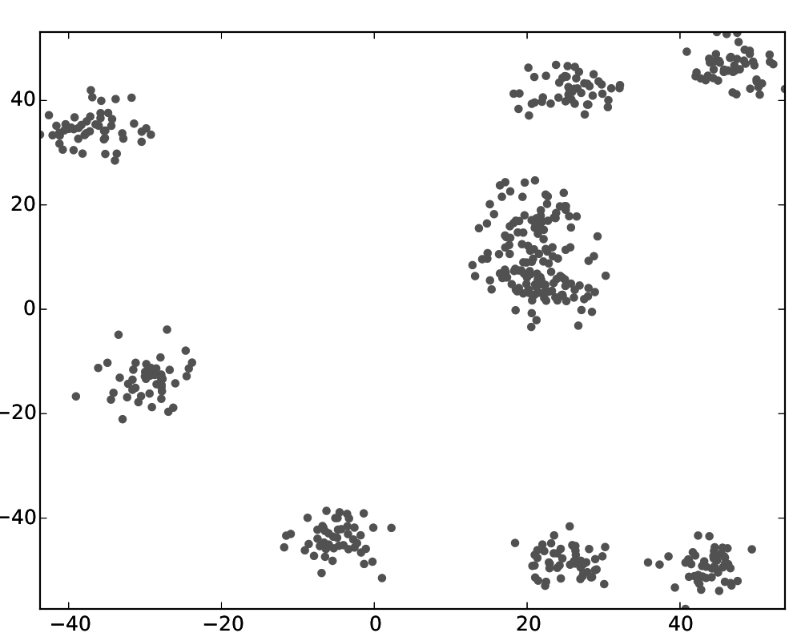
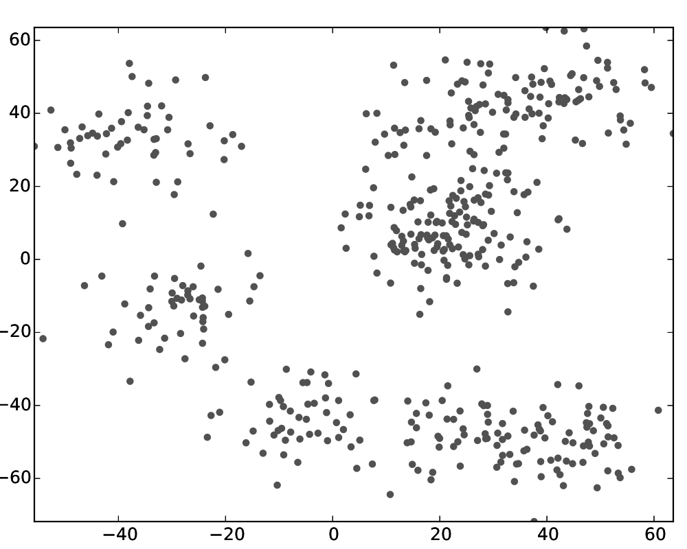
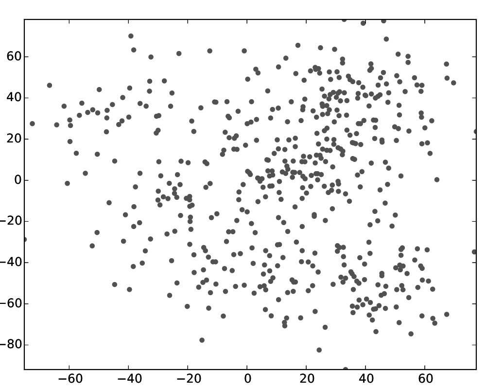
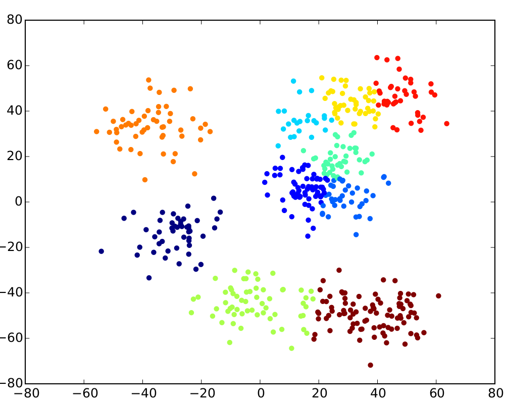
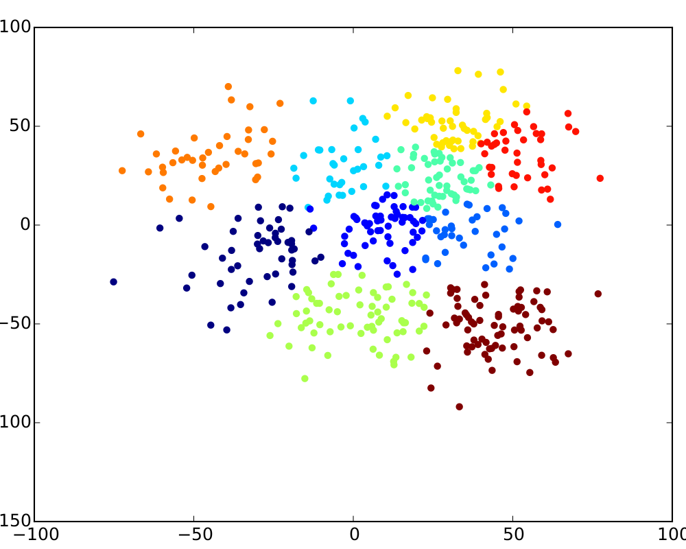

This guide will Peter demonstrate Stratosphere's features by example. You will see how you can leverage Stratosphere's Iteration-feature to find clusters in a dataset using [K-Means clustering](http://en.wikipedia.org/wiki/K-means_clustering). 
On the way, you will see the compiler, the status interface and the result of the algorithm.


#  Generate Input Data
Stratosphere contains a data generator for K-Means.

	# Download Stratosphere
	wget {{ site.FLINK_VERSION_STABLE_dl }}
	tar xzf stratosphere-*.tgz 
	cd stratosphere-*
	mkdir kmeans
	cd kmeans
	# Run data generator
	java -cp  ../examples/stratosphere-java-examples-{{ site.FLINK_VERSION_STABLE }}-KMeans.jar eu.stratosphere.example.java.clustering.util.KMeansDataGenerator 500 10 0.08
	cp /tmp/points .
	cp /tmp/centers .

The generator has the following arguments:

	KMeansDataGenerator <numberOfDataPoints> <numberOfClusterCenters> [<relative stddev>] [<centroid range>] [<seed>]

The _relative standard deviation_ is an interesting tuning parameter: it determines the closeness of the points to the centers.

The `kmeans/` directory should now contain two files: `centers` and `points`.


# Review Input Data
Use the `plotPoints.py` tool to review the result of the data generator. [Download Python Script](quickstart/plotPoints.py)
```bash
python2.7 plotPoints.py points points input
```


Note: You might have to install [matplotlib](http://matplotlib.org/) (`python-matplotlib` package on Ubuntu) to use the Python script.


The following overview presents the impact of the different standard deviations on the input data.

|relative stddev = 0.03|relative stddev = 0.08|relative stddev = 0.15|
|:--------------------:|:--------------------:|:--------------------:|
||||


# Run Clustering
We are using the generated input data to run the clustering using a Stratosphere job.

	# go to the Stratosphere-root directory
	cd stratosphere
	# start Stratosphere (use ./bin/start-cluster.sh if you're on a cluster)
	./bin/start-local.sh
	# Start Stratosphere web client
	./bin/start-webclient.sh

# Review Stratosphere Compiler
The Stratosphere webclient allows to submit Stratosphere programs using a graphical user interface.

<div class="row" style="padding-top:15px">
	<div class="col-md-6">
		<a data-lightbox="compiler" href="{{site.baseurl}}/img/quickstart-example/run-webclient.png" data-lightbox="example-1"></a>
	</div>
	<div class="col-md-6">
		1. <a href="http://localhost:8080/launch.html">Open webclient on localhost:8080</a> <br>
		2. Upload the file. 
			
			examples/stratosphere-java-examples-0.5-SNAPSHOT-KMeansIterative.jar
			 </br>
		3. Select it in the left box to see how the operators in the plan are connected to each other. <br>
		4. Enter the arguments in the lower left box:
			
			file://<pathToGenerated>points file://<pathToGenerated>centers file://<pathToGenerated>result 10
			
			For example:
			
			file:///tmp/stratosphere/kmeans/points file:///tmp/stratosphere/kmeans/centers file:///tmp/stratosphere/kmeans/result 20
			
	</div>
</div>
<hr>
<div class="row" style="padding-top:15px">
	<div class="col-md-6">
		<a data-lightbox="compiler" href="{{site.baseurl}}/img/quickstart-example/compiler-webclient-new.png" data-lightbox="example-1"></a>
	</div>

	<div class="col-md-6">
		1. Press the <b>RunJob</b> to see the optimzer plan. <br>
		2. Inspect the operators and see the properties (input sizes, cost estimation) determined by the optimizer.
	</div>
</div>
<hr>
<div class="row" style="padding-top:15px">
	<div class="col-md-6">
		<a data-lightbox="compiler" href="{{site.baseurl}}/img/quickstart-example/jobmanager-running-new.png" data-lightbox="example-1"></a>
	</div>
	<div class="col-md-6">
		1. Press the <b>Continue</b> button to start executing the job. <br>
		2. <a href="http://localhost:8080/launch.html">Open Stratosphere's monitoring interface</a> to see the job's progress.<br>
		3. Once the job has finished, you can analyize the runtime of the individual operators.
	</div>
</div>


# Analyze the Result

Use the [Python Script]({{site.baseurl}}/quickstart/plotPoints.py) again to visualize the result

```bash
python2.7 plotPoints.py result result result-pdf
```

The following three pictures show the results for the sample input above. Play around with the parameters (number of iterations, number of clusters) to see how they affect the result.


|relative stddev = 0.03|relative stddev = 0.08|relative stddev = 0.15|
|:--------------------:|:--------------------:|:--------------------:|
||||