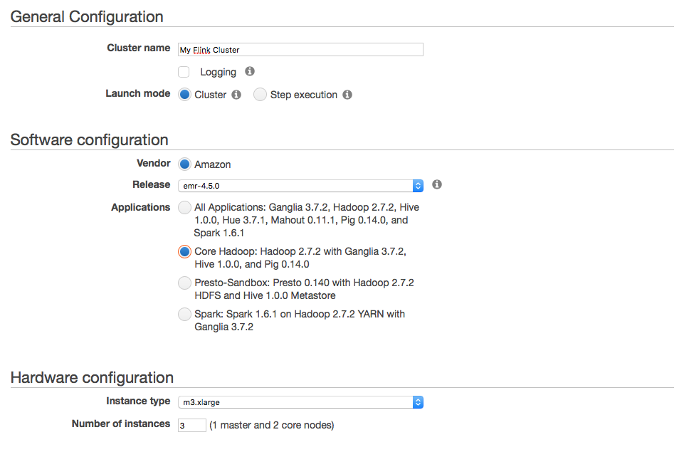

<!--
Licensed to the Apache Software Foundation (ASF) under one
or more contributor license agreements.  See the NOTICE file
distributed with this work for additional information
regarding copyright ownership.  The ASF licenses this file
to you under the Apache License, Version 2.0 (the
"License"); you may not use this file except in compliance
with the License.  You may obtain a copy of the License at

  http://www.apache.org/licenses/LICENSE-2.0

Unless required by applicable law or agreed to in writing,
software distributed under the License is distributed on an
"AS IS" BASIS, WITHOUT WARRANTIES OR CONDITIONS OF ANY
KIND, either express or implied.  See the License for the
specific language governing permissions and limitations
under the License.
-->

Amazon Web Services offers cloud computing services on which you can run Flink.

* ToC
{:toc}

## EMR: Elastic MapReduce

[Amazon Elastic MapReduce](https://aws.amazon.com/elasticmapreduce/) (Amazon EMR) is a web service that makes it easy to  quickly setup a Hadoop cluster. This is the **recommended way** to run Flink on AWS as it takes care of setting up everything.

### Create EMR Cluster

The EMR documentation contains [examples showing how to start an EMR cluster](http://docs.aws.amazon.com/ElasticMapReduce/latest/ManagementGuide/emr-gs-launch-sample-cluster.html). You can follow that guide and install any EMR release. You don't need to install *All Applications* part of the EMR release, but can stick to *Core Hadoop*:



When creating your cluster, make sure to setup [IAM roles](http://docs.aws.amazon.com/ElasticMapReduce/latest/ManagementGuide/emr-iam-roles.html) allowing you to access your S3 buckets if required.



### Install Flink on EMR Cluster

After creating your cluster, you can [connect to the master node](http://docs.aws.amazon.com/ElasticMapReduce/latest/ManagementGuide/emr-connect-master-node.html) and install Flink:

1. Go the the [Downloads Page]({{ download_url}}) and **download a binary version of Flink matching the Hadoop version** of your EMR cluster, e.g. Hadoop 2.7 for EMR releases 4.3.0, 4.4.0, or 4.5.0.
2. Extract the Flink distribution and you are ready to deploy [Flink jobs via YARN]({{ site.baseurl }}/setup/yarn_setup.html) after **setting the Hadoop config directory**:

```bash
HADOOP_CONF_DIR=/etc/hadoop/conf bin/flink run -m yarn-cluster examples/streaming/WordCount.jar
```



## S3: Simple Storage Service

[Amazon Simple Storage Service](http://aws.amazon.com/s3/) (Amazon S3) provides cloud object storage for a variety of use cases. You can use S3 with Flink for **reading** and **writing data** as well in conjunction with the [streaming **state backends**]({{ site.baseurl}}/apis/streaming/state_backends.html).

You can use S3 objects like regular files by specifying paths in the following format:

```
s3://<your-bucket>/<endpoint>
```

The endpoint can either be a single file or a directory, for example:

```java
// Read from S3 bucket
env.readTextFile("s3://<bucket>/<endpoint>");

// Write to S3 bucket
stream.writeAsText("s3://<bucket>/<endpoint>");

// Use S3 as FsStatebackend
env.setStateBackend(new FsStateBackend("s3://<your-bucket>/<endpoint>"));
```

Note that these examples are *not* exhaustive and you can use S3 in other places as well, including your [high availability setup]({{ site.baseurl }}/setup/jobmanager_high_availability.html) or the [RocksDBStateBackend]({{ site.baseurl }}/apis/streaming/state_backends.html#the-rocksdbstatebackend);  everywhere that Flink expects a FileSystem URI.

### Set S3 FileSystem



S3 is treated by Flink as a regular FileSystem. Interaction with S3 happens via a Hadoop [S3 FileSystem client](https://wiki.apache.org/hadoop/AmazonS3).

There are two popular S3 file system implementations available:

1. `S3AFileSystem` (**recommended**): file system for reading and writing regular files using Amazon's SDK internally. No maximum file size and works with IAM roles.
2. `NativeS3FileSystem`: file system for reading and writing regular files. Maximum object size is 5GB and does not work with IAM roles.

#### `S3AFileSystem` (Recommended)

This is the recommended S3 FileSystem implementation to use. It uses Amazon's SDK internally and works with IAM roles (see [Configure Access Credential](#configure-access-credentials)).

You need to point Flink to a valid Hadoop configuration, which contains the following property in `core-site.xml`:

```xml
<property>
  <name>fs.s3.impl</name>
  <value>org.apache.hadoop.fs.s3a.S3AFileSystem</value>
</property>
```

This registers `S3AFileSystem` as the default FileSystem for URIs with the `s3://` scheme.

#### `NativeS3FileSystem`

This file system is limited to files up to 5GB in size and it does not work IAM roles (see [Configure Access Credential](#configure-access-credentials)), meaning that you have to manually configure your AWS credentials in the Hadoop config file.

You need to point Flink to a valid Hadoop configuration, which contains the following property in `core-site.xml`:

```xml
<property>
  <name>fs.s3.impl</name>
  <value>org.apache.hadoop.fs.s3native.NativeS3FileSystem</value>
</property>
```

This registers `NativeS3FileSystem` as the default FileSystem for URIs with the `s3://` scheme.

#### Hadoop Configuration

You can specify the [Hadoop configuration]({{ site.baseurl }}/setup/config.html#hdfs) in various ways, for examples by configuring the path to the Hadoop configuration directory in `flink-conf.yaml`:

```
fs.hdfs.hadoopconf: /path/to/etc/hadoop
```

This registers `path/to/etc/hadoop` as Hadoop's configuration directory with Flink.



### Configure Access Credentials



After setting up the S3 FileSystem, you need to make sure that Flink is allowed to access your S3 buckets.

#### Identity and Access Management (IAM) (Recommended)

The recommended way of setting up credentials on AWS is via [Identity and Access Management (IAM)](http://docs.aws.amazon.com/IAM/latest/UserGuide/introduction.html). You can use IAM features to securely give Flink instances the credentials that they need in order to access S3 buckets. Details about how to do this are beyond the scope of this documentation. Please refer to the AWS user guide. What you are looking for are [IAM Roles](http://docs.aws.amazon.com/AWSEC2/latest/UserGuide/iam-roles-for-amazon-ec2.html).

If you set this up correctly, you can manage access to S3 within AWS and don't need to distribute any access keys to Flink.

Note that this only works with `S3AFileSystem` and not `NativeS3FileSystem`.



#### Access Keys (Discouraged)

Access to S3 can be granted via your **access and secret key pair**. Please note that this is discouraged since the [introduction of IAM roles](https://blogs.aws.amazon.com/security/post/Tx1XG3FX6VMU6O5/A-safer-way-to-distribute-AWS-credentials-to-EC2).

You need to configure both `fs.s3.awsAccessKeyId` and `fs.s3.awsSecretAccessKey`  in Hadoop's  `core-site.xml`:

```xml
<property>
  <name>fs.s3.awsAccessKeyId</name>
  <value></value>
</property>

<property>
  <name>fs.s3.awsSecretAccessKey</name>
  <value></value>
</property>
```



### Provide S3 FileSystem Dependency



Hadoop's S3 FileSystem clients are packaged in the `hadoop-aws`. This JAR and all its dependencies need to be added to Flink's classpath, i.e. the class path of both Job and TaskManagers. Depending on which FileSystem implementation and which Flink and Hadoop version you use, you need to provide different dependencies (see below).

There are multiple ways of adding JARs to Flink's class path, the easiest being simply to drop the JARs in Flink's `/lib` folder. You need to copy the `hadoop-aws` JAR with all its dependencies. You can also export the directory containing these JARs as part of the `HADOOP_CLASSPATH` environment variable on all machines.

#### Flink for Hadoop 2.7

Depending on which file system you use, please add the following dependencies. You can find these as part of the Hadoop binaries in `hadoop-2.7/share/hadoop/tools/lib`:

- `S3AFileSystem`:
  - `hadoop-aws-2.7.2.jar`
  - `aws-java-sdk-1.7.4.jar`
  - `httpcore-4.2.5.jar`
  - `httpclient-4.2.5.jar`

- `NativeS3FileSystem`:
  - `hadoop-aws-2.7.2.jar`
  - `guava-11.0.2.jar`

Note that `hadoop-common` is available as part of Flink, but Guava is shaded by Flink.

#### Flink for Hadoop 2.6

Depending on which file system you use, please add the following dependencies. You can find these as part of the Hadoop binaries in `hadoop-2.6/share/hadoop/tools/lib`:

- `S3AFileSystem`:
  - `hadoop-aws-2.6.4.jar`
  - `aws-java-sdk-1.7.4.jar`
  - `httpcore-4.2.5.jar`
  - `httpclient-4.2.5.jar`

- `NativeS3FileSystem`:
  - `hadoop-aws-2.6.4.jar`
  - `guava-11.0.2.jar`

Note that `hadoop-common` is available as part of Flink, but Guava is shaded by Flink.

#### Flink for Hadoop 2.4 and earlier

These Hadoop versions only have support for `NativeS3FileSystem`. This comes pre-packaged with Flink for Hadoop 2 as part of `hadoop-common`. You don't need to add anything to the classpath.



## Common Issues

The following sections lists common issues when working with Flink on AWS.

### Missing S3 FileSystem Configuration

If your job submission fails with an Exception message noting that `No file system found with scheme s3` this means that no FileSystem has been configured for S3. Please check out the [FileSystem Configuration section](#set-s3-filesystem) for details on how to configure this properly.

```
org.apache.flink.client.program.ProgramInvocationException: The program execution failed:
  Failed to submit job cd927567a81b62d7da4c18eaa91c3c39 (WordCount Example) [...]
Caused by: org.apache.flink.runtime.JobException: Creating the input splits caused an error:
  No file system found with scheme s3, referenced in file URI 's3://<bucket>/<endpoint>'. [...]
Caused by: java.io.IOException: No file system found with scheme s3,
  referenced in file URI 's3://<bucket>/<endpoint>'.
    at o.a.f.core.fs.FileSystem.get(FileSystem.java:296)
    at o.a.f.core.fs.Path.getFileSystem(Path.java:311)
    at o.a.f.api.common.io.FileInputFormat.createInputSplits(FileInputFormat.java:450)
    at o.a.f.api.common.io.FileInputFormat.createInputSplits(FileInputFormat.java:57)
    at o.a.f.runtime.executiongraph.ExecutionJobVertex.<init>(ExecutionJobVertex.java:156)
```



### AWS Access Key ID and Secret Access Key Not Specified

If you see your job failing with an Exception noting that the `AWS Access Key ID and Secret Access Key must be specified as the username or password`, your access credentials have not been set up properly. Please refer to the [access credential section](#configure-access-credentials) for details on how to configure this.

```
org.apache.flink.client.program.ProgramInvocationException: The program execution failed:
  Failed to submit job cd927567a81b62d7da4c18eaa91c3c39 (WordCount Example) [...]
Caused by: java.io.IOException: The given file URI (s3://<bucket>/<endpoint>) points to the
  HDFS NameNode at <bucket>, but the File System could not be initialized with that address:
  AWS Access Key ID and Secret Access Key must be specified as the username or password
  (respectively) of a s3n URL, or by setting the fs.s3n.awsAccessKeyId
  or fs.s3n.awsSecretAccessKey properties (respectively) [...]
Caused by: java.lang.IllegalArgumentException: AWS Access Key ID and Secret Access Key must
  be specified as the username or password (respectively) of a s3 URL, or by setting
  the fs.s3n.awsAccessKeyId or fs.s3n.awsSecretAccessKey properties (respectively) [...]
    at o.a.h.fs.s3.S3Credentials.initialize(S3Credentials.java:70)
    at o.a.h.fs.s3native.Jets3tNativeFileSystemStore.initialize(Jets3tNativeFileSystemStore.java:80)
    at sun.reflect.NativeMethodAccessorImpl.invoke0(Native Method)
    at sun.reflect.NativeMethodAccessorImpl.invoke(NativeMethodAccessorImpl.java:57)
    at sun.reflect.DelegatingMethodAccessorImpl.invoke(DelegatingMethodAccessorImpl.java:43)
    at java.lang.reflect.Method.invoke(Method.java:606)
    at o.a.h.io.retry.RetryInvocationHandler.invokeMethod(RetryInvocationHandler.java:187)
    at o.a.h.io.retry.RetryInvocationHandler.invoke(RetryInvocationHandler.java:102)
    at o.a.h.fs.s3native.$Proxy6.initialize(Unknown Source)
    at o.a.h.fs.s3native.NativeS3FileSystem.initialize(NativeS3FileSystem.java:330)
    at o.a.f.runtime.fs.hdfs.HadoopFileSystem.initialize(HadoopFileSystem.java:321)
```



### ClassNotFoundException: NativeS3FileSystem/S3AFileSystem Not Found

If you see this Exception, the S3 FileSystem is not part of the class path of Flink. Please refer to [S3 FileSystem dependency section](#provide-s3-filesystem-dependency) for details on how to configure this properly.

```
Caused by: java.lang.RuntimeException: java.lang.RuntimeException: java.lang.ClassNotFoundException: Class org.apache.hadoop.fs.s3native.NativeS3FileSystem not found
  at org.apache.hadoop.conf.Configuration.getClass(Configuration.java:2186)
  at org.apache.flink.runtime.fs.hdfs.HadoopFileSystem.getHadoopWrapperClassNameForFileSystem(HadoopFileSystem.java:460)
  at org.apache.flink.core.fs.FileSystem.getHadoopWrapperClassNameForFileSystem(FileSystem.java:352)
  at org.apache.flink.core.fs.FileSystem.get(FileSystem.java:280)
  at org.apache.flink.core.fs.Path.getFileSystem(Path.java:311)
  at org.apache.flink.api.common.io.FileInputFormat.createInputSplits(FileInputFormat.java:450)
  at org.apache.flink.api.common.io.FileInputFormat.createInputSplits(FileInputFormat.java:57)
  at org.apache.flink.runtime.executiongraph.ExecutionJobVertex.<init>(ExecutionJobVertex.java:156)
  ... 25 more
Caused by: java.lang.RuntimeException: java.lang.ClassNotFoundException: Class org.apache.hadoop.fs.s3native.NativeS3FileSystem not found
  at org.apache.hadoop.conf.Configuration.getClass(Configuration.java:2154)
  at org.apache.hadoop.conf.Configuration.getClass(Configuration.java:2178)
  ... 32 more
Caused by: java.lang.ClassNotFoundException: Class org.apache.hadoop.fs.s3native.NativeS3FileSystem not found
  at org.apache.hadoop.conf.Configuration.getClassByName(Configuration.java:2060)
  at org.apache.hadoop.conf.Configuration.getClass(Configuration.java:2152)
  ... 33 more
```



### IOException: `400: Bad Request`

If you you have configured everything properly, but get a `Bad Request` Exception **and** your S3 bucket is located in region `eu-central-1`, you might be running an S3 client, which does not support [Amazon's signature version 4](http://docs.aws.amazon.com/AmazonS3/latest/API/sig-v4-authenticating-requests.html).

Currently, this includes all Hadoop versions up to 2.7.2 running `NativeS3FileSystem`, which depend on `JetS3t 0.9.0` instead of a version [>= 0.9.4](http://www.jets3t.org/RELEASE_NOTES.html).

The only workaround is to change the bucket region.

```
[...]
Caused by: java.io.IOException: s3://<bucket-in-eu-central-1>/<endpoint> : 400 : Bad Request [...]
Caused by: org.jets3t.service.impl.rest.HttpException [...]
```


