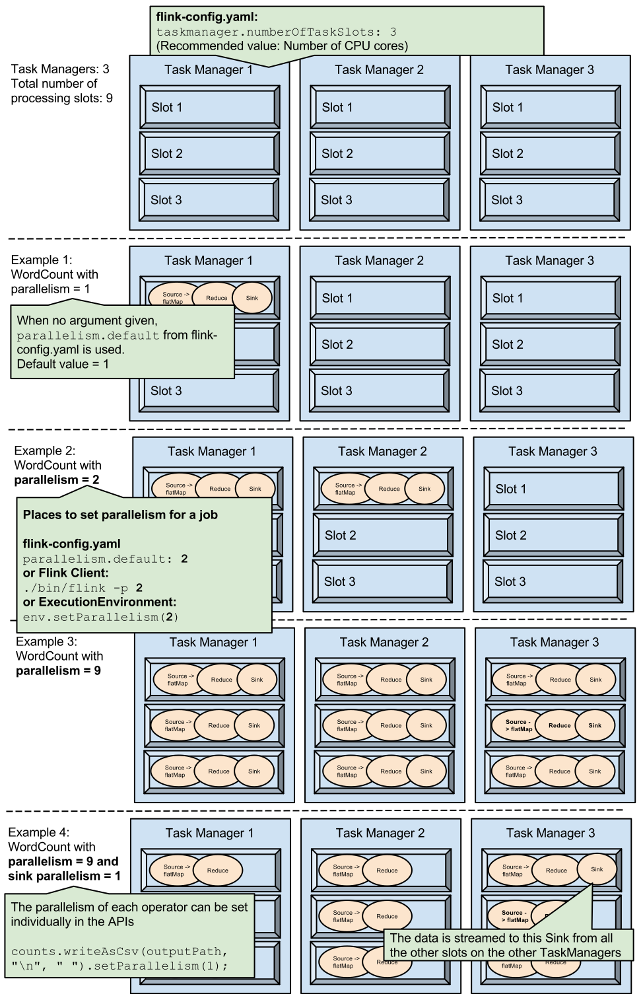

<!--
Licensed to the Apache Software Foundation (ASF) under one
or more contributor license agreements.  See the NOTICE file
distributed with this work for additional information
regarding copyright ownership.  The ASF licenses this file
to you under the Apache License, Version 2.0 (the
"License"); you may not use this file except in compliance
with the License.  You may obtain a copy of the License at

  http://www.apache.org/licenses/LICENSE-2.0

Unless required by applicable law or agreed to in writing,
software distributed under the License is distributed on an
"AS IS" BASIS, WITHOUT WARRANTIES OR CONDITIONS OF ANY
KIND, either express or implied.  See the License for the
specific language governing permissions and limitations
under the License.
-->

## Overview

The default configuration parameters allow Flink to run out-of-the-box
in single node setups.

This page lists the most common options that are typically needed to set
up a well performing (distributed) installation. In addition a full
list of all available configuration parameters is listed here.

All configuration is done in `conf/flink-conf.yaml`, which is expected to be
a flat collection of [YAML key value pairs](http://www.yaml.org/spec/1.2/spec.html)
with format `key: value`.

The system and run scripts parse the config at startup time. Changes to the configuration
file require restarting the Flink JobManager and TaskManagers.

The configuration files for the TaskManagers can be different, Flink does not assume 
uniform machines in the cluster.

* This will be replaced by the TOC
{:toc}

## Common Options

- `env.java.home`: The path to the Java installation to use (DEFAULT: system's
default Java installation, if found). Needs to be specified if the startup
scipts fail to automatically resolve the java home directory. Can be specified
to point to a specific java installation or version. If this option is not
specified, the startup scripts also evaluate the `$JAVA_HOME` environment variable.

- `jobmanager.rpc.address`: The IP address of the JobManager, which is the
master/coordinator of the distributed system (DEFAULT: localhost).

- `jobmanager.rpc.port`: The port number of the JobManager (DEFAULT: 6123).

- `jobmanager.heap.mb`: JVM heap size (in megabytes) for the JobManager. You may have to increase the heap size for the JobManager if you are running
very large applications (with many operators), or if you are keeping a long history of them.

- `taskmanager.heap.mb`: JVM heap size (in megabytes) for the TaskManagers,
which are the parallel workers of the system. In
contrast to Hadoop, Flink runs operators (e.g., join, aggregate) and
user-defined functions (e.g., Map, Reduce, CoGroup) inside the TaskManager
(including sorting/hashing/caching), so this value should be as
large as possible. If the cluster is exclusively running Flink,
the total amount of available memory per machine minus some memory for the 
operating system (maybe 1-2 GB) is a good value.
On YARN setups, this value is automatically configured to the size of 
the TaskManager's YARN container, minus a certain tolerance value.

- `taskmanager.numberOfTaskSlots`: The number of parallel operator or
user function instances that a single TaskManager can run (DEFAULT: 1).
If this value is larger than 1, a single TaskManager takes multiple instances of
a function or operator. That way, the TaskManager can utilize multiple CPU cores,
but at the same time, the available memory is divided between the different
operator or function instances.
This value is typically proportional to the number of physical CPU cores that
the TaskManager's machine has (e.g., equal to the number of cores, or half the
number of cores). [More about task slots](config.html#configuring-taskmanager-processing-slots).

- `parallelism.default`: The default parallelism to use for programs that have
no parallelism specified. (DEFAULT: 1). For setups that have no concurrent jobs
running, setting this value to NumTaskManagers * NumSlotsPerTaskManager will
cause the system to use all available execution resources for the program's
execution. **Note**: The default parallelism can be overwriten for an entire
job by calling `setParallelism(int parallelism)` on the `ExecutionEnvironment`
or by passing `-p <parallelism>` to the Flink Command-line frontend. It can be
overwritten for single transformations by calling `setParallelism(int
parallelism)` on an operator. See the [programming
guide]({{site.baseurl}}/apis/programming_guide.html#parallel-execution) for more information about the
parallelism.

- `fs.hdfs.hadoopconf`: The absolute path to the Hadoop File System's (HDFS)
configuration directory (OPTIONAL VALUE).
Specifying this value allows programs to reference HDFS files using short URIs
(`hdfs:///path/to/files`, without including the address and port of the NameNode
in the file URI). Without this option, HDFS files can be accessed, but require
fully qualified URIs like `hdfs://address:port/path/to/files`.
This option also causes file writers to pick up the HDFS's default values for block sizes
and replication factors. Flink will look for the "core-site.xml" and
"hdfs-site.xml" files in teh specified directory.

## Advanced Options

- `taskmanager.tmp.dirs`: The directory for temporary files, or a list of
directories separated by the systems directory delimiter (for example ':'
(colon) on Linux/Unix). If multiple directories are specified, then the temporary
files will be distributed across the directories in a round-robin fashion. The
I/O manager component will spawn one reading and one writing thread per
directory. A directory may be listed multiple times to have the I/O manager use
multiple threads for it (for example if it is physically stored on a very fast
disc or RAID) (DEFAULT: The system's tmp dir).

- `jobmanager.web.port`: Port of the JobManager's web interface (DEFAULT: 8081).

- `fs.overwrite-files`: Specifies whether file output writers should overwrite
existing files by default. Set to *true* to overwrite by default, *false* otherwise.
(DEFAULT: false)

- `fs.output.always-create-directory`: File writers running with a parallelism
larger than one create a directory for the output file path and put the different
result files (one per parallel writer task) into that directory. If this option
is set to *true*, writers with a parallelism of 1 will also create a directory
and place a single result file into it. If the option is set to *false*, the
writer will directly create the file directly at the output path, without
creating a containing directory. (DEFAULT: false)

- `taskmanager.network.numberOfBuffers`: The number of buffers available to the
network stack. This number determines how many streaming data exchange channels
a TaskManager can have at the same time and how well buffered the channels are.
If a job is rejected or you get a warning that the system has not enough buffers
available, increase this value (DEFAULT: 2048).

- `taskmanager.memory.size`: The amount of memory (in megabytes) that the task
manager reserves on the JVM's heap space for sorting, hash tables, and caching
of intermediate results. If unspecified (-1), the memory manager will take a fixed
ratio of the heap memory available to the JVM, as specified by
`taskmanager.memory.fraction`. (DEFAULT: -1)

- `taskmanager.memory.fraction`: The relative amount of memory that the task
manager reserves for sorting, hash tables, and caching of intermediate results.
For example, a value of 0.8 means that TaskManagers reserve 80% of the
JVM's heap space for internal data buffers, leaving 20% of the JVM's heap space
free for objects created by user-defined functions. (DEFAULT: 0.7)
This parameter is only evaluated, if `taskmanager.memory.size` is not set.

## Full Reference

### HDFS

These parameters configure the default HDFS used by Flink. Setups that do not
specify a HDFS configuration have to specify the full path to 
HDFS files (`hdfs://address:port/path/to/files`) Files will also be written
with default HDFS parameters (block size, replication factor).

- `fs.hdfs.hadoopconf`: The absolute path to the Hadoop configuration directory.
The system will look for the "core-site.xml" and "hdfs-site.xml" files in that
directory (DEFAULT: null).
- `fs.hdfs.hdfsdefault`: The absolute path of Hadoop's own configuration file
"hdfs-default.xml" (DEFAULT: null).
- `fs.hdfs.hdfssite`: The absolute path of Hadoop's own configuration file
"hdfs-site.xml" (DEFAULT: null).

### JobManager &amp; TaskManager

The following parameters configure Flink's JobManager and TaskManagers.

- `jobmanager.rpc.address`: The IP address of the JobManager, which is the
master/coordinator of the distributed system (DEFAULT: localhost).
- `jobmanager.rpc.port`: The port number of the JobManager (DEFAULT: 6123).
- `taskmanager.rpc.port`: The task manager's IPC port (DEFAULT: 6122).
- `taskmanager.data.port`: The task manager's port used for data exchange
operations (DEFAULT: 6121).
- `jobmanager.heap.mb`: JVM heap size (in megabytes) for the JobManager
(DEFAULT: 256).
- `taskmanager.heap.mb`: JVM heap size (in megabytes) for the TaskManagers,
which are the parallel workers of the system. In
contrast to Hadoop, Flink runs operators (e.g., join, aggregate) and
user-defined functions (e.g., Map, Reduce, CoGroup) inside the TaskManager
(including sorting/hashing/caching), so this value should be as
large as possible (DEFAULT: 512). On YARN setups, this value is automatically
configured to the size of the TaskManager's YARN container, minus a
certain tolerance value.
- `taskmanager.numberOfTaskSlots`: The number of parallel operator or
user function instances that a single TaskManager can run (DEFAULT: 1).
If this value is larger than 1, a single TaskManager takes multiple instances of
a function or operator. That way, the TaskManager can utilize multiple CPU cores,
but at the same time, the available memory is divided between the different
operator or function instances.
This value is typically proportional to the number of physical CPU cores that
the TaskManager's machine has (e.g., equal to the number of cores, or half the
number of cores).
- `taskmanager.tmp.dirs`: The directory for temporary files, or a list of
directories separated by the systems directory delimiter (for example ':'
(colon) on Linux/Unix). If multiple directories are specified, then the temporary
files will be distributed across the directories in a round robin fashion. The
I/O manager component will spawn one reading and one writing thread per
directory. A directory may be listed multiple times to have the I/O manager use
multiple threads for it (for example if it is physically stored on a very fast
disc or RAID) (DEFAULT: The system's tmp dir).
- `taskmanager.network.numberOfBuffers`: The number of buffers available to the
network stack. This number determines how many streaming data exchange channels
a TaskManager can have at the same time and how well buffered the channels are.
If a job is rejected or you get a warning that the system has not enough buffers
available, increase this value (DEFAULT: 2048).
- `taskmanager.network.bufferSizeInBytes`: The size of the network buffers, in
bytes (DEFAULT: 32768 (= 32 KiBytes)).
- `taskmanager.memory.size`: The amount of memory (in megabytes) that the task
manager reserves on the JVM's heap space for sorting, hash tables, and caching
of intermediate results. If unspecified (-1), the memory manager will take a fixed
ratio of the heap memory available to the JVM, as specified by
`taskmanager.memory.fraction`. (DEFAULT: -1)
- `taskmanager.memory.fraction`: The relative amount of memory that the task
manager reserves for sorting, hash tables, and caching of intermediate results.
For example, a value of 0.8 means that TaskManagers reserve 80% of the
JVM's heap space for internal data buffers, leaving 20% of the JVM's heap space
free for objects created by user-defined functions. (DEFAULT: 0.7)
This parameter is only evaluated, if `taskmanager.memory.size` is not set.
- `jobclient.polling.interval`: The interval (in seconds) in which the client
polls the JobManager for the status of its job (DEFAULT: 2).
- `taskmanager.runtime.max-fan`: The maximal fan-in for external merge joins and
fan-out for spilling hash tables. Limits the number of file handles per operator,
but may cause intermediate merging/partitioning, if set too small (DEFAULT: 128).
- `taskmanager.runtime.sort-spilling-threshold`: A sort operation starts spilling
when this fraction of its memory budget is full (DEFAULT: 0.8).
- `taskmanager.heartbeat-interval`: The interval in which the TaskManager sends
heartbeats to the JobManager.
- `jobmanager.max-heartbeat-delay-before-failure.msecs`: The maximum time that a
TaskManager hearbeat may be missing before the TaskManager is considered failed.

### Distributed Coordination (via Akka)

- `akka.ask.timeout`: Timeout used for all futures and blocking Akka calls. If Flink fails due to timeouts then you should try to increase this value. Timeouts can be caused by slow machines or a congested network. The timeout value requires a time-unit specifier (ms/s/min/h/d) (DEFAULT: **100 s**).
- `akka.lookup.timeout`: Timeout used for the lookup of the JobManager. The timeout value has to contain a time-unit specifier (ms/s/min/h/d) (DEFAULT: **10 s**).
- `akka.framesize`: Maximum size of messages which are sent between the JobManager and the TaskManagers. If Flink fails because messages exceed this limit, then you should increase it. The message size requires a size-unit specifier (DEFAULT: **10485760b**).
- `akka.watch.heartbeat.interval`: Heartbeat interval for Akka's DeathWatch mechanism to detect dead TaskManagers. If TaskManagers are wrongly marked dead because of lost or delayed heartbeat messages, then you should increase this value. A thorough description of Akka's DeathWatch can be found [here](http://doc.akka.io/docs/akka/snapshot/scala/remoting.html#failure-detector) (DEFAULT: **akka.ask.timeout/10**).
- `akka.watch.heartbeat.pause`: Acceptable heartbeat pause for Akka's DeathWatch mechanism. A low value does not allow a irregular heartbeat. A thorough description of Akka's DeathWatch can be found [here](http://doc.akka.io/docs/akka/snapshot/scala/remoting.html#failure-detector) (DEFAULT: **akka.ask.timeout**).
- `akka.watch.threshold`: Threshold for the DeathWatch failure detector. A low value is prone to false positives whereas a high value increases the time to detect a dead TaskManager. A thorough description of Akka's DeathWatch can be found [here](http://doc.akka.io/docs/akka/snapshot/scala/remoting.html#failure-detector) (DEFAULT: **12**).
- `akka.transport.heartbeat.interval`: Heartbeat interval for Akka's transport failure detector. Since Flink uses TCP, the detector is not necessary. Therefore, the detector is disabled by setting the interval to a very high value. In case you should need the transport failure detector, set the interval to some reasonable value. The interval value requires a time-unit specifier (ms/s/min/h/d) (DEFAULT: **1000 s**).
- `akka.transport.heartbeat.pause`: Acceptable heartbeat pause for Akka's transport failure detector. Since Flink uses TCP, the detector is not necessary. Therefore, the detector is disabled by setting the pause to a very high value. In case you should need the transport failure detector, set the pause to some reasonable value. The pause value requires a time-unit specifier (ms/s/min/h/d) (DEFAULT: **6000 s**).
- `akka.transport.threshold`: Threshold for the transport failure detector. Since Flink uses TCP, the detector is not necessary and, thus, the threshold is set to a high value (DEFAULT: **300**).
- `akka.tcp.timeout`: Timeout for all outbound connections. If you should experience problems with connecting to a TaskManager due to a slow network, you should increase this value (DEFAULT: **akka.ask.timeout**).
- `akka.throughput`: Number of messages that are processed in a batch before returning the thread to the pool. Low values denote a fair scheduling whereas high values can increase the performance at the cost of unfairness (DEFAULT: **15**).
- `akka.log.lifecycle.events`: Turns on the Akka's remote logging of events. Set this value to 'on' in case of debugging (DEFAULT: **off**).
- `akka.startup-timeout`: Timeout after which the startup of a remote component is considered being failed (DEFAULT: **akka.ask.timeout**).

### JobManager Web Frontend

- `jobmanager.web.port`: Port of the JobManager's web interface that displays
status of running jobs and execution time breakdowns of finished jobs
(DEFAULT: 8081). Setting this value to `-1` disables the web frontend.
- `jobmanager.web.history`: The number of latest jobs that the JobManager's web
front-end in its history (DEFAULT: 5).

### Webclient

These parameters configure the web interface that can be used to submit jobs and
review the compiler's execution plans.

- `webclient.port`: The port of the webclient server (DEFAULT: 8080).
- `webclient.tempdir`: The temp directory for the web server. Used for example
for caching file fragments during file-uploads (DEFAULT: The system's temp
directory).
- `webclient.uploaddir`: The directory into which the web server will store
uploaded programs (DEFAULT: ${webclient.tempdir}/webclient-jobs/).
- `webclient.plandump`: The directory into which the web server will dump
temporary JSON files describing the execution plans
(DEFAULT: ${webclient.tempdir}/webclient-plans/).

### File Systems

The parameters define the behavior of tasks that create result files.

- `fs.overwrite-files`: Specifies whether file output writers should overwrite
existing files by default. Set to *true* to overwrite by default, *false* otherwise.
(DEFAULT: false)
- `fs.output.always-create-directory`: File writers running with a parallelism
larger than one create a directory for the output file path and put the different
result files (one per parallel writer task) into that directory. If this option
is set to *true*, writers with a parallelism of 1 will also create a directory
and place a single result file into it. If the option is set to *false*, the
writer will directly create the file directly at the output path, without
creating a containing directory. (DEFAULT: false)

### Compiler/Optimizer

- `compiler.delimited-informat.max-line-samples`: The maximum number of line
samples taken by the compiler for delimited inputs. The samples are used to
estimate the number of records. This value can be overridden for a specific
input with the input format's parameters (DEFAULT: 10).
- `compiler.delimited-informat.min-line-samples`: The minimum number of line
samples taken by the compiler for delimited inputs. The samples are used to
estimate the number of records. This value can be overridden for a specific
input with the input format's parameters (DEFAULT: 2).
- `compiler.delimited-informat.max-sample-len`: The maximal length of a line
sample that the compiler takes for delimited inputs. If the length of a single
sample exceeds this value (possible because of misconfiguration of the parser),
the sampling aborts. This value can be overridden for a specific input with the
input format's parameters (DEFAULT: 2097152 (= 2 MiBytes)).

## YARN

- `yarn.heap-cutoff-ratio`: (Default 0.15) Percentage of heap space to remove from containers started by YARN.
When a user requests a certain amount of memory for each TaskManager container (for example 4 GB),
we can not pass this amount as the maximum heap space for the JVM (`-Xmx` argument) because the JVM
is also allocating memory outside the heap. YARN is very strict with killing containers which are using
more memory than requested.
Therefore, we remove a 15% of the memory from the requested heap as a safety margin.
- `yarn.heap-cutoff-min`: (Default 384 MB) Minimum amount of memory to cut off the requested heap size.

- `yarn.reallocate-failed` (Default 'true') Controls whether YARN should reallocate failed containers

- `yarn.maximum-failed-containers` (Default: number of requested containers). Maximum number of containers the system
is going to reallocate in case of a failure.

- `yarn.application-attempts` (Default: 1). Number of ApplicationMaster restarts. Note that that the entire Flink cluster
will restart and the YARN Client will loose the connection. Also, the JobManager address will change and you'll need
to set the JM host:port manually. It is recommended to leave this option at 1.

- `yarn.heartbeat-delay` (Default: 5 seconds). Time between heartbeats with the ResourceManager.

## Background

### Configuring the Network Buffers

Network buffers are a critical resource for the communication layers. They are
used to buffer records before transmission over a network, and to buffer
incoming data before dissecting it into records and handing them to the
application. A sufficient number of network buffers is critical to achieve a
good throughput.

In general, configure the task manager to have enough buffers that each logical
network connection on you expect to be open at the same time has a dedicated
buffer. A logical network connection exists for each point-to-point exchange of
data over the network, which typically happens at repartitioning- or
broadcasting steps. In those, each parallel task inside the TaskManager has to
be able to talk to all other parallel tasks. Hence, the required number of
buffers on a task manager is *total-degree-of-parallelism* (number of targets)
\* *intra-node-parallelism* (number of sources in one task manager) \* *n*.
Here, *n* is a constant that defines how many repartitioning-/broadcasting steps
you expect to be active at the same time.

Since the *intra-node-parallelism* is typically the number of cores, and more
than 4 repartitioning or broadcasting channels are rarely active in parallel, it
frequently boils down to *\#cores\^2\^* \* *\#machines* \* 4. To support for
example a cluster of 20 8-core machines, you should use roughly 5000 network
buffers for optimal throughput.

Each network buffer has by default a size of 32 KiBytes. In the above example, the
system would allocate roughly 300 MiBytes for network buffers.

The number and size of network buffers can be configured with the following
parameters:

- `taskmanager.network.numberOfBuffers`, and
- `taskmanager.network.bufferSizeInBytes`.

### Configuring Temporary I/O Directories

Although Flink aims to process as much data in main memory as possible,
it is not uncommon that more data needs to be processed than memory is
available. Flink's runtime is designed to write temporary data to disk
to handle these situations.

The `taskmanager.tmp.dirs` parameter specifies a list of directories into which
Flink writes temporary files. The paths of the directories need to be
separated by ':' (colon character). Flink will concurrently write (or
read) one temporary file to (from) each configured directory. This way,
temporary I/O can be evenly distributed over multiple independent I/O devices
such as hard disks to improve performance. To leverage fast I/O devices (e.g.,
SSD, RAID, NAS), it is possible to specify a directory multiple times.

If the `taskmanager.tmp.dirs` parameter is not explicitly specified,
Flink writes temporary data to the temporary directory of the operating
system, such as */tmp* in Linux systems.

### Configuring TaskManager processing slots

Flink executes a program in parallel by splitting it into subtasks and scheduling these subtasks to processing slots.

Each Flink TaskManager provides processing slots in the cluster. The number of slots
is typically proportional to the number of available CPU cores __of each__ TaskManager.
As a general recommendation, the number of available CPU cores is a good default for 
`taskmanager.numberOfTaskSlots`.

When starting a Flink application, users can supply the default number of slots to use for that job.
The command line value therefore is called `-p` (for parallelism). In addition, it is possible
to [set the number of slots in the programming APIs]({{site.baseurl}}/apis/programming_guide.html#parallel-execution) for 
the whole application and individual operators.

