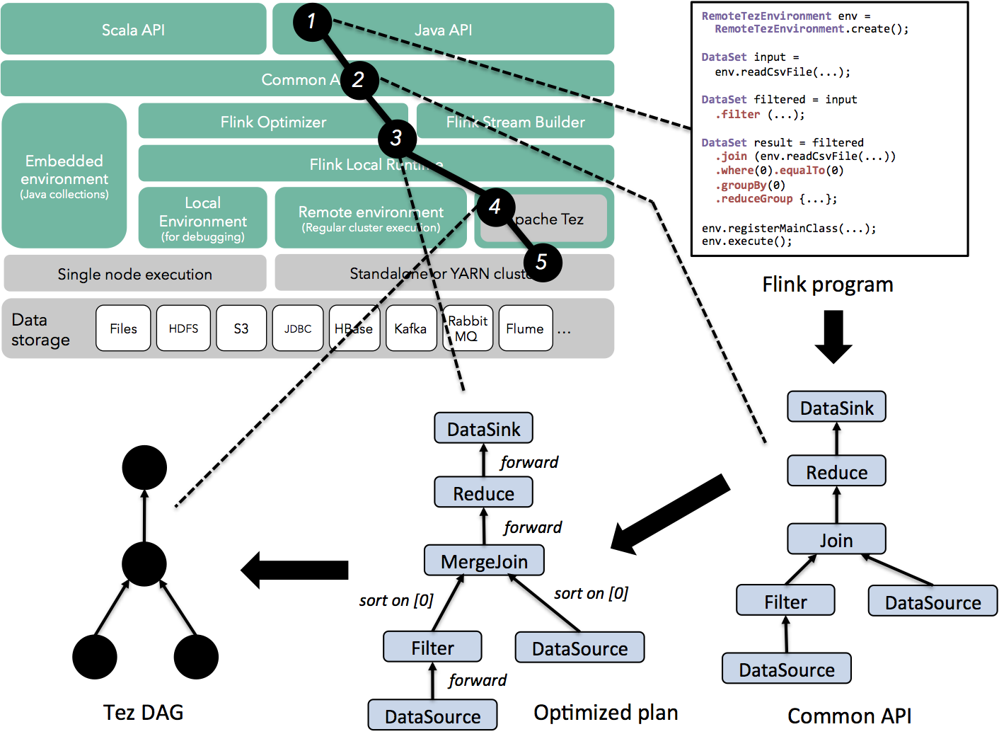
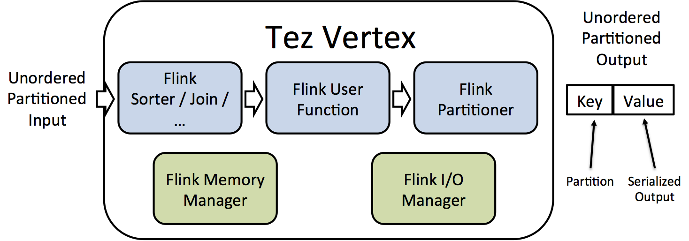

<!--
Licensed to the Apache Software Foundation (ASF) under one
or more contributor license agreements.  See the NOTICE file
distributed with this work for additional information
regarding copyright ownership.  The ASF licenses this file
to you under the Apache License, Version 2.0 (the
"License"); you may not use this file except in compliance
with the License.  You may obtain a copy of the License at

  http://www.apache.org/licenses/LICENSE-2.0

Unless required by applicable law or agreed to in writing,
software distributed under the License is distributed on an
"AS IS" BASIS, WITHOUT WARRANTIES OR CONDITIONS OF ANY
KIND, either express or implied.  See the License for the
specific language governing permissions and limitations
under the License.
-->

You can run Flink using Tez as an execution environment. Flink on Tez 
is currently included in *flink-staging* in alpha. All classes are
located in the *org.apache.flink.tez* package.

* This will be replaced by the TOC
{:toc}

## Why Flink on Tez

[Apache Tez](http://tez.apache.org) is a scalable data processing
platform. Tez provides an API for specifying a directed acyclic
graph (DAG), and functionality for placing the DAG vertices in YARN
containers, as well as data shuffling.  In Flink's architecture,
Tez is at about the same level as Flink's network stack. While Flink's
network stack focuses heavily on low latency in order to support 
pipelining, data streaming, and iterative algorithms, Tez
focuses on scalability and elastic resource usage.

Thus, by replacing Flink's network stack with Tez, users can get scalability
and elastic resource usage in shared clusters while retaining Flink's 
APIs, optimizer, and runtime algorithms (local sorts, hash tables, etc).

Flink programs can run almost unmodified using Tez as an execution
environment. Tez supports local execution (e.g., for debugging), and 
remote execution on YARN.

## Local execution

The `LocalTezEnvironment` can be used run programs using the local
mode provided by Tez. This example shows how WordCount can be run using the Tez local mode.
It is identical to a normal Flink WordCount, except that the `LocalTezEnvironment` is used.
To run in local Tez mode, you can simply run a Flink on Tez program
from your IDE (e.g., right click and run).
  

public class WordCountExample {
    public static void main(String[] args) throws Exception {
        final LocalTezEnvironment env = LocalTezEnvironment.create();

        DataSet<String> text = env.fromElements(
            "Who's there?",
            "I think I hear them. Stand, ho! Who's there?");

        DataSet<Tuple2<String, Integer>> wordCounts = text
            .flatMap(new LineSplitter())
            .groupBy(0)
            .sum(1);

        wordCounts.print();

        env.execute("Word Count Example");
    }

    public static class LineSplitter implements FlatMapFunction<String, Tuple2<String, Integer>> {
        @Override
        public void flatMap(String line, Collector<Tuple2<String, Integer>> out) {
            for (String word : line.split(" ")) {
                out.collect(new Tuple2<String, Integer>(word, 1));
            }
        }
    }
}


## YARN execution

### Setup

- Install Tez on your Hadoop 2 cluster following the instructions from the
  [Apache Tez website](http://tez.apache.org/install.html). If you are able to run 
  the examples that ship with Tez, then Tez has been successfully installed.
  
- Currently, you need to build Flink yourself to obtain Flink on Tez
  (the reason is a Hadoop version compatibility: Tez releases artifacts
  on Maven central with a Hadoop 2.6.0 dependency). Build Flink
  using `mvn -DskipTests clean package -Pinclude-tez -Dhadoop.version=X.X.X -Dtez.version=X.X.X`.
  Make sure that the Hadoop version matches the version that Tez uses.
  Obtain the jar file contained in the Flink distribution under
  `flink-staging/flink-tez/target/flink-tez-x.y.z-flink-fat-jar.jar` 
  and upload it to some directory in HDFS. E.g., to upload the file
  to the directory `/apps`, execute
  
  $ hadoop fs -put /path/to/flink-tez-x.y.z-flink-fat-jar.jar /apps
    
 
- Edit the tez-site.xml configuration file, adding an entry that points to the
  location of the file. E.g., assuming that the file is in the directory `/apps/`, 
  add the following entry to tez-site.xml:
    
<property>
  <name>tez.aux.uris</name>
  <value>${fs.default.name}/apps/flink-tez-x.y.z-flink-fat-jar.jar</value>
</property>
      
    
- At this point, you should be able to run the pre-packaged examples, e.g., run WordCount:
  
  $ hadoop jar /path/to/flink-tez-x.y.z-flink-fat-jar.jar wc hdfs:/path/to/text hdfs:/path/to/output
    

### Packaging your program

Application packaging is currently a bit different than in Flink standalone mode.
  Flink programs that run on Tez need to be packaged in a "fat jar"
  file that contain the Flink client. This jar can then be executed via the `hadoop jar` command.
  An easy way to do that is to use the provided `flink-tez-quickstart` maven archetype.
  Create a new project as
  
  
  $ mvn archetype:generate                             \
    -DarchetypeGroupId=org.apache.flink              \
    -DarchetypeArtifactId=flink-tez-quickstart           \
    -DarchetypeVersion={{site.version}}
  
  
  and specify the group id, artifact id, version, and package of your project. For example,
  let us assume the following options: `org.myorganization`, `flink-on-tez`, `0.1`, and `org.myorganization`.
  You should see the following output on your terminal:
  
  
  $ mvn archetype:generate -DarchetypeGroupId=org.apache.flink -DarchetypeArtifactId=flink-tez-quickstart
  [INFO] Scanning for projects...
  [INFO]
  [INFO] ------------------------------------------------------------------------
  [INFO] Building Maven Stub Project (No POM) 1
  [INFO] ------------------------------------------------------------------------
  [INFO]
  [INFO] >>> maven-archetype-plugin:2.2:generate (default-cli) > generate-sources @ standalone-pom >>>
  [INFO]
  [INFO] <<< maven-archetype-plugin:2.2:generate (default-cli) < generate-sources @ standalone-pom <<<
  [INFO]
  [INFO] --- maven-archetype-plugin:2.2:generate (default-cli) @ standalone-pom ---
  [INFO] Generating project in Interactive mode
  [INFO] Archetype [org.apache.flink:flink-tez-quickstart:0.9-SNAPSHOT] found in catalog local
  Define value for property 'groupId': : org.myorganization
  Define value for property 'artifactId': : flink-on-tez
  Define value for property 'version':  1.0-SNAPSHOT: : 0.1
  Define value for property 'package':  org.myorganization: :
  Confirm properties configuration:
  groupId: org.myorganization
  artifactId: flink-on-tez
  version: 0.1
  package: org.myorganization
   Y: : Y
  [INFO] ----------------------------------------------------------------------------
  [INFO] Using following parameters for creating project from Archetype: flink-tez-quickstart:0.9-SNAPSHOT
  [INFO] ----------------------------------------------------------------------------
  [INFO] Parameter: groupId, Value: org.myorganization
  [INFO] Parameter: artifactId, Value: flink-on-tez
  [INFO] Parameter: version, Value: 0.1
  [INFO] Parameter: package, Value: org.myorganization
  [INFO] Parameter: packageInPathFormat, Value: org/myorganization
  [INFO] Parameter: package, Value: org.myorganization
  [INFO] Parameter: version, Value: 0.1
  [INFO] Parameter: groupId, Value: org.myorganization
  [INFO] Parameter: artifactId, Value: flink-on-tez
  [INFO] project created from Archetype in dir: /Users/kostas/Dropbox/flink-tez-quickstart-test/flink-on-tez
  [INFO] ------------------------------------------------------------------------
  [INFO] BUILD SUCCESS
  [INFO] ------------------------------------------------------------------------
  [INFO] Total time: 44.130 s
  [INFO] Finished at: 2015-02-26T17:59:45+01:00
  [INFO] Final Memory: 15M/309M
  [INFO] ------------------------------------------------------------------------
  
  
  The project contains an example called `YarnJob.java` that provides the skeleton 
  for a Flink-on-Tez job. Program execution is currently done using Hadoop's `ProgramDriver`, 
  see the `Driver.java` class for an example. Create the fat jar using 
  `mvn -DskipTests clean package`. The resulting jar will be located in the `target/` directory. 
  You can now execute a job as follows:
  
  
$ mvn -DskipTests clean package
$ hadoop jar flink-on-tez/target/flink-on-tez-0.1-flink-fat-jar.jar yarnjob [command-line parameters]
  
  
  Flink programs that run on YARN using Tez as an execution engine need to use the `RemoteTezEnvironment` and 
  register the class that contains the `main` method with that environment:
  
  public class WordCountExample {
      public static void main(String[] args) throws Exception {
          final RemoteTezEnvironment env = RemoteTezEnvironment.create();
  
          DataSet<String> text = env.fromElements(
              "Who's there?",
              "I think I hear them. Stand, ho! Who's there?");
  
          DataSet<Tuple2<String, Integer>> wordCounts = text
              .flatMap(new LineSplitter())
              .groupBy(0)
              .sum(1);
  
          wordCounts.print();
      
          env.registerMainClass(WordCountExample.class);
          env.execute("Word Count Example");
      }
  
      public static class LineSplitter implements FlatMapFunction<String, Tuple2<String, Integer>> {
          @Override
          public void flatMap(String line, Collector<Tuple2<String, Integer>> out) {
              for (String word : line.split(" ")) {
                  out.collect(new Tuple2<String, Integer>(word, 1));
              }
          }
      }
  }
  

## How it works

Flink on Tez reuses the Flink APIs, the Flink optimizer,
and the Flink local runtime, including Flink's hash table and sort implementations. Tez
replaces Flink's network stack and control plan, and is responsible for scheduling and
network shuffles.

The figure below shows how a Flink program passes through the Flink stack and generates
a Tez DAG (instead of a JobGraph that would be created using normal Flink execution).

All local processing, including memory management, sorting, and hashing is performed by
Flink as usual. Local processing is encapsulated in Tez vertices, as seen in the figure
below. Tez vertices are connected by edges. Tez is currently based on a key-value data
model. In the current implementation, the elements that are processed by Flink operators
are wrapped inside Tez values, and the Tez key field is used to indicate the index of the target task
that the elements are destined to.

## Limitations

Currently, Flink on Tez does not support all features of the Flink API. We are working
to enable all of the missing features listed below. In the meantime, if your project depends on these features, we suggest
to use [Flink on YARN]({{site.baseurl}}/setup/yarn_setup.html) or [Flink standalone]({{site.baseurl}}/quickstart/setup_quickstart.html).

The following features are currently missing.

- Dedicated client: jobs need to be submitted via Hadoop's command-line client

- Self-joins: currently binary operators that receive the same input are not supported due to 
  [TEZ-1190](https://issues.apache.org/jira/browse/TEZ-1190).

- Iterative programs are currently not supported.

- Broadcast variables are currently not supported.

- Accummulators and counters are currently not supported.

- Performance: The current implementation has not been heavily tested for performance, and misses several optimizations,
  including task chaining.

- Streaming API: Streaming programs will not currently compile to Tez DAGs.

- Scala API: The current implementation has only been tested with the Java API.

