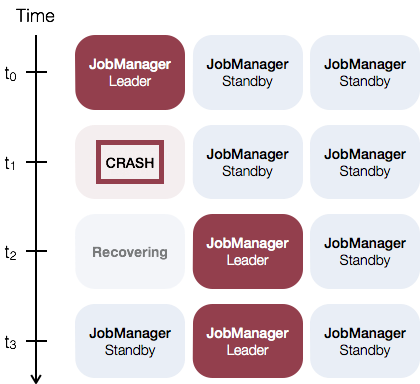

<!--
Licensed to the Apache Software Foundation (ASF) under one
or more contributor license agreements.  See the NOTICE file
distributed with this work for additional information
regarding copyright ownership.  The ASF licenses this file
to you under the Apache License, Version 2.0 (the
"License"); you may not use this file except in compliance
with the License.  You may obtain a copy of the License at

  http://www.apache.org/licenses/LICENSE-2.0

Unless required by applicable law or agreed to in writing,
software distributed under the License is distributed on an
"AS IS" BASIS, WITHOUT WARRANTIES OR CONDITIONS OF ANY
KIND, either express or implied.  See the License for the
specific language governing permissions and limitations
under the License.
-->

The JobManager is the coordinator of each Flink deployment. It is responsible for both *scheduling* and *resource management*.

By default, there is a single JobManager instance per Flink cluster. This creates a *single point of failure* (SPOF): if the JobManager crashes, no new programs can be submitted and running programs fail.

With JobManager High Availability, you can run multiple JobManager instances per Flink cluster and thereby circumvent the *SPOF*.

The general idea of JobManager high availability is that there is a **single leading JobManager** at any time and **multiple standby JobManagers** to take over leadership in case the leader fails. This guarantees that there is **no single point of failure** and programs can make progress as soon as a standby JobManager has taken leadership. There is no explicit distinction between standby and master JobManager instances. Each JobManager can take the role of master or standby.

As an example, consider the following setup with three JobManager instances:

## Configuration

To enable JobManager High Availability you have to set the **recovery mode** to *zookeeper*, configure a **ZooKeeper quorum** and set up a **masters file** with all JobManagers hosts and their web ui ports.

Flink leverages **[ZooKeeper](http://zookeeper.apache.org)** for  *distributed coordination* between all running JobManager instances. ZooKeeper is a separate service from Flink, which provides highly reliable distirbuted coordination via leader election and light-weight consistent state storage. Check out [ZooKeeper's Getting Started Guide](http://zookeeper.apache.org/doc/trunk/zookeeperStarted.html) for more information about ZooKeeper.

Setting Flink's **recovery mode** to *zookeeper* in `conf/flink-conf.yaml` *enables* high availability mode.

Additionally, you have to configure a **ZooKeeper quorum** in the same configuration file.

In high availabliity mode, all Flink components try to connect to a JobManager via coordination through ZooKeeper.

- **Recovery mode** (required): The *recovery mode* has to be set in `conf/flink-conf.yaml` to *zookeeper* in order to enable high availability mode. 
  
  <pre>recovery.mode: zookeeper</pre>

- **ZooKeeper quorum** (required): A *ZooKeeper quorum* is a replicated group of ZooKeeper servers, which provide the distributed coordination service.
  
  <pre>ha.zookeeper.quorum: address1:2181[,...],addressX:2181</pre>

  Each *addressX:port* refers to a ZooKeeper server, which is reachable by Flink at the given address and port.

- The following configuration keys are optional:

  - `ha.zookeeper.dir: /flink [default]`: ZooKeeper directory to use for coordination
  - TODO Add client configuration keys

## Starting an HA-cluster

In order to start an HA-cluster configure the *masters* file in `conf/masters`:

- **masters file**: The *masters file* contains all hosts, on which JobManagers are started, and the ports to which the web user interface binds.

  <pre>
jobManagerAddress1:webUIPort1
[...]
jobManagerAddressX:webUIPortX
  </pre>

After configuring the masters and the ZooKeeper quorum, you can use the provided cluster startup scripts as usual. They will start a HA-cluster. **Keep in mind that the ZooKeeper quorum has to be running when you call the scripts**.

## Running ZooKeeper

If you don't have a running ZooKeeper installation, you can use the helper scripts, which ship with Flink.

There is a ZooKeeper configuration template in `conf/zoo.cfg`. You can configure the hosts to run ZooKeeper on with the `server.X` entries, where X is a unique ID of each server:

<pre>
server.X=addressX:peerPort:leaderPort
[...]
server.Y=addressY:peerPort:leaderPort
</pre>

The script `bin/start-zookeeper-quorum.sh` will start a ZooKeeper server on each of the configured hosts. The started processes start ZooKeeper servers via a Flink wrapper, which reads the configuration from `conf/zoo.cfg` and makes sure to set some required configuration values for convenience. In production setups, it is recommended to manage your own ZooKeeper installation.

## Example: Start and stop a local HA-cluster with 2 JobManagers

1. **Configure recovery mode and ZooKeeper quorum** in `conf/flink.yaml`:
   
   <pre>
recovery.mode: zookeeper
ha.zookeeper.quorum: localhost</pre>

2. **Configure masters** in `conf/masters`:

   <pre>
localhost:8081
localhost:8082</pre>

3. **Configure ZooKeeper server** in `conf/zoo.cfg` (currently it's only possible to run a single ZooKeeper server per machine):

   <pre>server.0=localhost:2888:3888</pre>

4. **Start ZooKeeper quorum**:

   <pre>
$ bin/start-zookeeper-quorum.sh
Starting zookeeper daemon on host localhost.</pre>

5. **Start an HA-cluster**:
   
   <pre>
$ bin/start-cluster-streaming.sh
Starting HA cluster (streaming mode) with 2 masters and 1 peers in ZooKeeper quorum.
Starting jobmanager daemon on host localhost.
Starting jobmanager daemon on host localhost.
Starting taskmanager daemon on host localhost.</pre>

6. **Stop ZooKeeper quorum and cluster**:

   <pre>
$ bin/stop-cluster.sh
Stopping taskmanager daemon (pid: 7647) on localhost.
Stopping jobmanager daemon (pid: 7495) on host localhost.
Stopping jobmanager daemon (pid: 7349) on host localhost.
$ bin/stop-zookeeper-quorum.sh
Stopping zookeeper daemon (pid: 7101) on host localhost.</pre>
