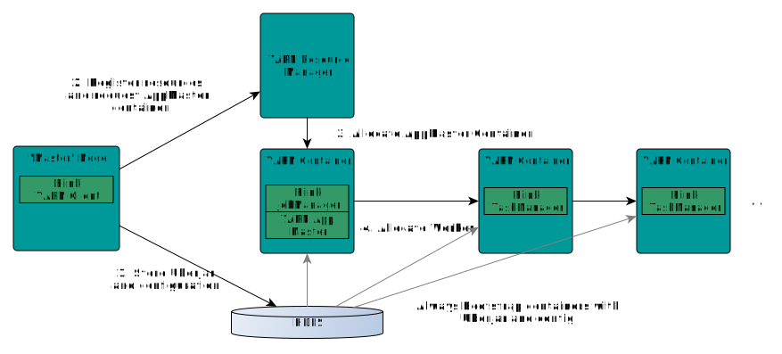

<!--
Licensed to the Apache Software Foundation (ASF) under one
or more contributor license agreements.  See the NOTICE file
distributed with this work for additional information
regarding copyright ownership.  The ASF licenses this file
to you under the Apache License, Version 2.0 (the
"License"); you may not use this file except in compliance
with the License.  You may obtain a copy of the License at

  http://www.apache.org/licenses/LICENSE-2.0

Unless required by applicable law or agreed to in writing,
software distributed under the License is distributed on an
"AS IS" BASIS, WITHOUT WARRANTIES OR CONDITIONS OF ANY
KIND, either express or implied.  See the License for the
specific language governing permissions and limitations
under the License.
-->

* This will be replaced by the TOC
{:toc}

## Quickstart: Start a long-running Flink cluster on YARN

Start a YARN session with 4 Task Managers (each with 4 GB of Heapspace):

~~~bash
# get the hadoop2 package from the Flink download page at
# {{ site.download_url }}
curl -O <flink_hadoop2_download_url>
tar xvzf flink-{{ site.version }}-bin-hadoop2.tgz
cd flink-{{ site.version }}/
./bin/yarn-session.sh -n 4 -jm 1024 -tm 4096
~~~

Specify the `-s` flag for the number of processing slots per Task Manager. We recommend to set the number of slots to the number of processors per machine.

Once the session has been started, you can submit jobs to the cluster using the `./bin/flink` tool.

## Quickstart: Run a Flink job on YARN

~~~bash
# get the hadoop2 package from the Flink download page at
# {{ site.download_url }}
curl -O <flink_hadoop2_download_url>
tar xvzf flink-{{ site.version }}-bin-hadoop2.tgz
cd flink-{{ site.version }}/
./bin/flink run -m yarn-cluster -yn 4 -yjm 1024 -ytm 4096 ./examples/WordCount.jar
~~~

## Apache Flink on Hadoop YARN using a YARN Session

Apache [Hadoop YARN](http://hadoop.apache.org/) is a cluster resource management framework. It allows to run various distributed applications on top of a cluster. Flink runs on YARN next to other applications. Users do not have to setup or install anything if there is already a YARN setup.

**Requirements**

- at least Apache Hadoop 2.2
- HDFS (Hadoop Distributed File System) (or another distributed file system supported by Hadoop)

If you have troubles using the Flink YARN client, have a look in the [FAQ section](http://flink.apache.org/faq.html#yarn-deployment).

### Start Flink Session

Follow these instructions to learn how to launch a Flink Session within your YARN cluster.

A session will start all required Flink services (JobManager and TaskManagers) so that you can submit programs to the cluster. Note that you can run multiple programs per session.

#### Download Flink for YARN

Download the YARN tgz package on the [download page]({{site.baseurl}}/downloads.html). It contains the required files.

Extract the package using:

~~~bash
tar xvzf flink-{{ site.version }}-bin-hadoop2.tgz
cd flink-{{site.version }}/
~~~

If you want to build the YARN .tgz file from sources, follow the [build instructions](building.html).
You can find the result of the build in `flink-dist/target/flink-{{ site.version }}-bin/flink-{{ site.version }}/` (*Note: The version might be different for you* ).

#### Start a Session

Use the following command to start a session

~~~bash
./bin/yarn-session.sh
~~~

This command will show you the following overview:

~~~bash
Usage:
   Required
     -n,--container <arg>   Number of YARN container to allocate (=Number of Task Managers)
   Optional
     -D <arg>                        Dynamic properties
     -d,--detached                   Start detached
     -jm,--jobManagerMemory <arg>    Memory for JobManager Container [in MB]
     -nm,--name                      Set a custom name for the application on YARN
     -q,--query                      Display available YARN resources (memory, cores)
     -qu,--queue <arg>               Specify YARN queue.
     -s,--slots <arg>                Number of slots per TaskManager
     -tm,--taskManagerMemory <arg>   Memory per TaskManager Container [in MB]

~~~

Please note that the Client requires the `YARN_CONF_DIR` or `HADOOP_CONF_DIR` environment variable to be set to read the YARN and HDFS configuration.

**Example:** Issue the following command to allocate 10 Task Managers, with 8 GB of memory and 32 processing slots each:

~~~bash
./bin/yarn-session.sh -n 10 -tm 8192 -s 32
~~~

The system will use the configuration in `conf/flink-config.yaml`. Please follow our [configuration guide](config.html) if you want to change something.

Flink on YARN will overwrite the following configuration parameters `jobmanager.rpc.address` (because the JobManager is always allocated at different machines), `taskmanager.tmp.dirs` (we are using the tmp directories given by YARN) and `parallelism.default` if the number of slots has been specified.

If you don't want to change the configuration file to set configuration parameters, there is the option to pass dynamic properties via the `-D` flag. So you can pass parameters this way: `-Dfs.overwrite-files=true -Dtaskmanager.network.numberOfBuffers=16368`.

The example invocation starts 11 containers, since there is one additional container for the ApplicationMaster and Job Manager.

Once Flink is deployed in your YARN cluster, it will show you the connection details of the Job Manager.

Stop the YARN session by stopping the unix process (using CTRL+C) or by entering 'stop' into the client.

#### Detached YARN session

If you do not want to keep the Flink YARN client running all the time, its also possible to start a *detached* YARN session.
The parameter for that is called `-d` or `--detached`.

In that case, the Flink YARN client will only submit Flink to the cluster and then close itself.
Note that in this case its not possible to stop the YARN session using Flink.

Use the YARN utilities (`yarn application -kill <appId`) to stop the YARN session.

### Submit Job to Flink

Use the following command to submit a Flink program to the YARN cluster:

~~~bash
./bin/flink
~~~

Please refer to the documentation of the [commandline client]({{ site.baseurl }}/apis/cli.html).

The command will show you a help menu like this:

~~~bash
[...]
Action "run" compiles and runs a program.

  Syntax: run [OPTIONS] <jar-file> <arguments>
  "run" action arguments:
     -c,--class <classname>           Class with the program entry point ("main"
                                      method or "getPlan()" method. Only needed
                                      if the JAR file does not specify the class
                                      in its manifest.
     -m,--jobmanager <host:port>      Address of the JobManager (master) to
                                      which to connect. Use this flag to connect
                                      to a different JobManager than the one
                                      specified in the configuration.
     -p,--parallelism <parallelism>   The parallelism with which to run the
                                      program. Optional flag to override the
                                      default value specified in the
                                      configuration
~~~

Use the *run* action to submit a job to YARN. The client is able to determine the address of the JobManager. In the rare event of a problem, you can also pass the JobManager address using the `-m` argument. The JobManager address is visible in the YARN console.

**Example**

~~~bash
wget -O LICENSE-2.0.txt http://www.apache.org/licenses/LICENSE-2.0.txt
hadoop fs -copyFromLocal LICENSE-2.0.txt hdfs:/// ...
./bin/flink run ./examples/WordCount.jar \
        hdfs:///..../LICENSE-2.0.txt hdfs:///.../wordcount-result.txt
~~~

If there is the following error, make sure that all TaskManagers started:

~~~bash
Exception in thread "main" org.apache.flink.compiler.CompilerException:
    Available instances could not be determined from job manager: Connection timed out.
~~~

You can check the number of TaskManagers in the JobManager web interface. The address of this interface is printed in the YARN session console.

If the TaskManagers do not show up after a minute, you should investigate the issue using the log files.

## Run a single Flink job on Hadoop YARN

The documentation above describes how to start a Flink cluster within a Hadoop YARN environment.
It is also possible to launch Flink within YARN only for executing a single job.

Please note that the client then expects the `-yn` value to be set (number of TaskManagers).

***Example:***

~~~bash
./bin/flink run -m yarn-cluster -yn 2 ./examples/WordCount.jar
~~~

The command line options of the YARN session are also available with the `./bin/flink` tool.
They are prefixed with a `y` or `yarn` (for the long argument options).

Note: You can use a different configuration directory per job by setting the environment variable `FLINK_CONF_DIR`.
To use this copy the `conf` directory from the Flink distribution and modify, for example, the logging settings on a per-job basis.

Note: It is possible to combine `-m yarn-cluster` with a detached YARN submission (`-yd`) to "fire and forget" a Flink job
to the YARN cluster. In this case, your application will not get any accumulator results or exceptions from the ExecutionEnvironment.execute() call!

## Recovery behavior of Flink on YARN

Flink's YARN client has the following configuration parameters to control how to behave in case of container failures. These parameters can be set either from the `conf/flink-conf.yaml` or when starting the YARN session, using `-D` parameters.

- `yarn.reallocate-failed`: This parameter controls whether Flink should reallocate failed TaskManager containers. Default: true
- `yarn.maximum-failed-containers`: The maximum number of failed containers the ApplicationMaster accepts until it fails the YARN session. Default: The number of initally requested TaskManagers (`-n`).
- `yarn.application-attempts`: The number of ApplicationMaster (+ its TaskManager containers) attempts. If this value is set to 1 (default), the entire YARN session will fail when the Application master fails. Higher values specify the number of restarts of the ApplicationMaster by YARN.

## Debugging a failed YARN session

There are many reasons why a Flink YARN session deployment can fail. A misconfigured Hadoop setup (HDFS permissions, YARN configuration), version incompatibilities (running Flink with vanilla Hadoop dependencies on Cloudera Hadoop) or other errors.

### Log Files

In cases where the Flink YARN session fails during the deployment itself, users have to rely on the logging capabilities of Hadoop YARN. The most useful feature for that is the [YARN log aggregation](http://hortonworks.com/blog/simplifying-user-logs-management-and-access-in-yarn/).
To enable it, users have to set the `yarn.log-aggregation-enable` property to `true` in the `yarn-site.xml` file.
Once that is enabled, users can use the following command to retrieve all log files of a (failed) YARN session.

~~~
yarn logs -applicationId <application ID>
~~~

Note that it takes a few seconds after the session has finished until the logs show up.

### YARN Client console & Webinterfaces

The Flink YARN client also prints error messages in the terminal if errors occur during runtime (for example if a TaskManager stops working after some time).

In addition to that, there is the YARN Resource Manager webinterface (by default on port 8088). The port of the Resource Manager web interface is determined by the `yarn.resourcemanager.webapp.address` configuration value.

It allows to access log files for running YARN applications and shows diagnostics for failed apps.

## Build YARN client for a specific Hadoop version

Users using Hadoop distributions from companies like Hortonworks, Cloudera or MapR might have to build Flink against their specific versions of Hadoop (HDFS) and YARN. Please read the [build instructions](building.html) for more details.

## Running Flink on YARN behind Firewalls

Some YARN clusters use firewalls for controlling the network traffic between the cluster and the rest of the network.
In those setups, Flink jobs can only be submitted to a YARN session from within the cluster's network (behind the firewall).
If this is not feasible for production use, Flink allows to configure a port range for all relevant services. With these 
ranges configured, users can also submit jobs to Flink crossing the firewall.

Currently, two services are needed to submit a job:

 * The JobManager (ApplicatonMaster in YARN)
 * The BlobServer running within the JobManager.
 
When submitting a job to Flink, the BlobServer will distribute the jars with the user code to all worker nodes (TaskManagers).
The JobManager receives the job itself and triggers the execution.

The two configuration parameters for specifying the ports are the following:

 * `yarn.application-master.port`
 * `blob.server.port`

These two configuration options accept single ports (for example: "50010"), ranges ("50000-50025"), or a combination of
both ("50010,50011,50020-50025,50050-50075").

(Hadoop is using a similar mechanism, there the configuration parameter is called `yarn.app.mapreduce.am.job.client.port-range`.)

## Background / Internals

This section briefly describes how Flink and YARN interact.

The YARN client needs to access the Hadoop configuration to connect to the YARN resource manager and to HDFS. It determines the Hadoop configuration using the following strategy:

* Test if `YARN_CONF_DIR`, `HADOOP_CONF_DIR` or `HADOOP_CONF_PATH` are set (in that order). If one of these variables are set, they are used to read the configuration.
* If the above strategy fails (this should not be the case in a correct YARN setup), the client is using the `HADOOP_HOME` environment variable. If it is set, the client tries to access `$HADOOP_HOME/etc/hadoop` (Hadoop 2) and `$HADOOP_HOME/conf` (Hadoop 1).

When starting a new Flink YARN session, the client first checks if the requested resources (containers and memory) are available. After that, it uploads a jar that contains Flink and the configuration to HDFS (step 1).

The next step of the client is to request (step 2) a YARN container to start the *ApplicationMaster* (step 3). Since the client registered the configuration and jar-file as a resource for the container, the NodeManager of YARN running on that particular machine will take care of preparing the container (e.g. downloading the files). Once that has finished, the *ApplicationMaster* (AM) is started.

The *JobManager* and AM are running in the same container. Once they successfully started, the AM knows the address of the JobManager (its own host). It is generating a new Flink configuration file for the TaskManagers (so that they can connect to the JobManager). The file is also uploaded to HDFS. Additionally, the *AM* container is also serving Flink's web interface. The ports Flink is using for its services are the standard ports configured by the user + the application id as an offset. This allows users to execute multiple Flink YARN sessions in parallel.

After that, the AM starts allocating the containers for Flink's TaskManagers, which will download the jar file and the modified configuration from the HDFS. Once these steps are completed, Flink is set up and ready to accept Jobs.

