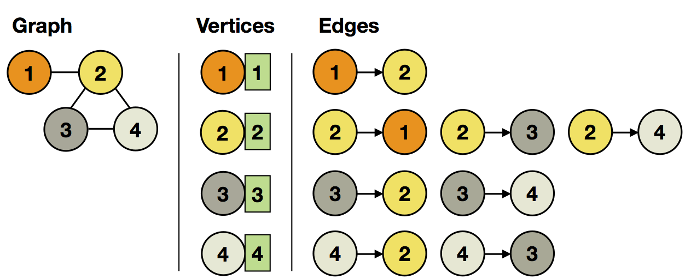

Spargel
=======

Spargel is our [Giraph](http://giraph.apache.org) like **graph processing** Java API. It supports basic graph computations, which are run as a sequence of [supersteps](iterations.html#supersteps). Spargel and Giraph both implement the [Bulk Synchronous Parallel (BSP)](https://en.wikipedia.org/wiki/Bulk_Synchronous_Parallel) programming model, propsed by Google's [Pregel](http://googleresearch.blogspot.de/2009/06/large-scale-graph-computing-at-google.html).

The API provides a **vertex-centric** view on graph processing with two basic operations per superstep:

  1. **Send messages** to other vertices, and
  2. **Receive messages** from other vertices and **update own vertex state**.

This vertex-centric view makes it easy to express a large class of graph problems efficiently. We will list all *relevant interfaces* of the **Spargel API** to implement and walk through an **example Spargel program**.

Spargel API
-----------

The Spargel API is part of the *addons* Maven project. All relevant classes are located in the *eu.stratosphere.spargel.java* package.

Add the following dependency to your `pom.xml` to use the Spargel.

```xml
<dependency>
	<groupId>eu.stratosphere</groupId>
	<artifactId>spargel</artifactId>
	<version>{{site.current_stable}}</version>
</dependency>
```

Extend **VertexUpdateFunction&lt;***VertexKeyType*, *VertexValueType*, *MessageType***&gt;** to implement your *custom vertex update logic*.

Extend **MessagingFunction&lt;***VertexKeyType*, *VertexValueType*, *MessageType*, *EdgeValueType***&gt;** to implement your *custom message logic*.

Create a **SpargelIteration** operator to include Spargel in your data flow.

Example: Propagate Minimum Vertex ID in Graph
---------------------------------------------

The Spargel operator **SpargelIteration** includes Spargel graph processing into your data flow. As usual, it can be combined with other operators like *map*, *reduce*, *join*, etc.

```java
FileDataSource vertices = new FileDataSource(...);
FileDataSource edges = new FileDataSource(...);

SpargelIteration iteration = new SpargelIteration(new MinMessager(), new MinNeighborUpdater());
iteration.setVertexInput(vertices);
iteration.setEdgesInput(edges);
iteration.setNumberOfIterations(maxIterations);

FileDataSink result = new FileDataSink(...);
result.setInput(iteration.getOutput());

new Plan(result);
```

Besides the **program logic** of vertex updates in *MinNeighborUpdater* and messages in *MinMessager*, you have to specify the **initial vertex** and **edge input**. Every vertex has a **key** and **value**. In each superstep, it **receives messages** from other vertices and updates its state:

  - **Vertex** input: **(id**: *VertexKeyType*, **value**: *VertexValueType***)**
  - **Edge** input: **(source**: *VertexKeyType*, **target**: *VertexKeyType*[, **value**: *EdgeValueType*])

For our example, we set the vertex ID as both *id and value* (initial minimum) and *leave out the edge values* as we don't need them:

<p class="text-center">
    
</p>

In order to **propagate the minimum vertex ID**, we iterate over all received messages (which contain the neighboring IDs) and update our value, if we found a new minimum:

```java
public class MinNeighborUpdater extends VertexUpdateFunction<IntValue, IntValue, IntValue> {
	
	@Override
	public void updateVertex(IntValue id, IntValue currentMin, Iterator<IntValue> messages) {
		int min = Integer.MAX_VALUE;

		// iterate over all received messages
		while (messages.hasNext()) {
			int next = messages.next().getValue();
			min = next < min ? next : min;
		}

		// update vertex value, if new minimum
		if (min < currentMin.getValue()) {
			setNewVertexValue(new IntValue(min));
		}
	}
}
```

The **messages in each superstep** consist of the **current minimum ID** seen by the vertex:

```java
public class MinMessager extends MessagingFunction<IntValue, IntValue, IntValue, NullValue> {
	
	@Override
	public void sendMessages(IntValue id, IntValue currentMin) {
		// send current minimum to neighbors
		sendMessageToAllNeighbors(currentMin);
    }
}
```

The **API-provided method** `sendMessageToAllNeighbors(MessageType)` sends the message to all neighboring vertices. It is also possible to address specific vertices with `sendMessageTo(VertexKeyType, MessageType)`.

If the value of a vertex does not change during a superstep, it will **not send** any messages in the superstep. This allows to do incremental updates to the **hot (changing) parts** of the graph, while leaving **cold (steady) parts** untouched.

The computation **terminates** after a specified *maximum number of supersteps* **-OR-** the *vertex states stop changing*.

<p class="text-center">
    
</p>