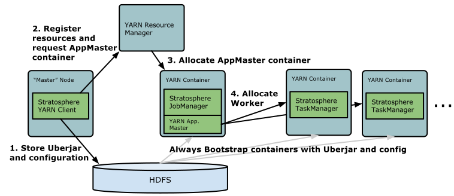

# In a Nutshell

Start YARN session with 4 Taskmanagers (each with 4 GB of Heapspace):

```bash
wget {{ site.FLINK_DOWNLOAD_URL_YARN_STABLE }}
tar xvzf stratosphere-dist-{{ site.FLINK_VERSION_STABLE }}-yarn.tar.gz
cd stratosphere-yarn-{{ site.FLINK_VERSION_STABLE }}/
./bin/yarn-session.sh -n 4 -jm 1024 -tm 4096
```

# Introducing YARN

Apache [Hadoop YARN](http://hadoop.apache.org/) is a cluster resource management framework. It allows to run various distributed applications on top of a cluster. Stratosphere runs on YARN next to other applications. Users do not have to setup or install anything if there is already a YARN setup.

**Requirements**

- Apache Hadoop 2.2
- HDFS

If you have troubles using the Stratosphere YARN client, have a look in the [FAQ section]({{site.baseurl}}/docs/0.5/general/faq.html).

## Start Stratosphere Session

Follow these instructions to learn how to launch a Stratosphere Session within your YARN cluster.

A session will start all required Stratosphere services (JobManager and TaskManagers) so that you can submit programs to the cluster. Note that you can run multiple programs per session.

### Download Stratosphere for YARN

Download the YARN tgz package on the [download page]({{site.baseurl}}/downloads/#nightly). It contains the required files.


If you want to build the YARN .tgz file from sources, follow the build instructions. Make sure to use the `-Dhadoop.profile=2` profile. You can find the file in `stratosphere-dist/target/stratosphere-dist-{{site.docs_05_stable}}-yarn.tar.gz` (*Note: The version might be different for you* ).

Extract the package using:

```bash
tar xvzf stratosphere-dist-{{site.FLINK_VERSION_STABLE }}-yarn.tar.gz
cd stratosphere-yarn-{{site.FLINK_VERSION_STABLE }}/
```

### Start a Session

Use the following command to start a session

```bash
./bin/yarn-session.sh
```

This command will show you the following overview:

```bash
Usage:
   Required
     -n,--container <arg>   Number of Yarn container to allocate (=Number of TaskTrackers)
   Optional
     -jm,--jobManagerMemory <arg>    Memory for JobManager Container [in MB]
     -q,--query                      Display available YARN resources (memory, cores)
     -qu,--queue <arg>               Specify YARN queue.
     -tm,--taskManagerMemory <arg>   Memory per TaskManager Container [in MB]
     -tmc,--taskManagerCores <arg>   Virtual CPU cores per TaskManager
     -v,--verbose                    Verbose debug mode
```

Please note that the Client requires the `HADOOP_HOME` (or `YARN_CONF_DIR` or `HADOOP_CONF_DIR`) environment variable to be set to read the YARN and HDFS configuration.

**Example:** Issue the following command to allocate 10 TaskTrackers, with 8 GB of memory each:

```bash
./bin/yarn-session.sh -n 10 -tm 8192
```

The system will use the configuration in `conf/stratosphere-config.yaml`. Please follow our [configuration guide](config.html) if you want to change something. Stratosphere on YARN will overwrite the following configuration parameters `jobmanager.rpc.address` (because the JobManager is always allocated at different machines) and `taskmanager.tmp.dirs` (we are using the tmp directories given by YARN).

The example invocation starts 11 containers, since there is one additional container for the ApplicationMaster and JobTracker.

Once Stratosphere is deployed in your YARN cluster, it will show you the connection details of the JobTracker.

The client has to remain open to keep the deployment running. We suggest to use `screen`, which will start a detachable shell:

1. Open `screen`,
2. Start Stratosphere on YARN,
3. Use `CTRL+a`, then press `d` to detach the screen session,
4. Use `screen -r` to resume again.

# Submit Job to Stratosphere

Use the following command to submit a Stratosphere program to the YARN cluster:

```bash
./bin/stratosphere
```

Please refer to the documentation of the [commandline client](cli.html).

The command will show you a help menu like this:

```bash
[...]
Action "run" compiles and submits a Stratosphere program.
  "run" action arguments:
     -a,--arguments <programArgs>   Program arguments
     -c,--class <classname>         Program class
     -j,--jarfile <jarfile>         Stratosphere program JAR file
     -m,--jobmanager <host:port>    Jobmanager to which the program is submitted
     -w,--wait                      Wait for program to finish
[...]
```

Use the *run* action to submit a job to YARN. The client is able to determine the address of the JobManager. In the rare event of a problem, you can also pass the JobManager address using the `-m` argument. The JobManager address is visible in the YARN console.

**Example**

```bash
wget -O apache-license-v2.txt http://www.apache.org/licenses/LICENSE-2.0.txt

./bin/stratosphere run -j ./examples/stratosphere-java-examples-{{site.FLINK_VERSION_STABLE }}-WordCount.jar \
                       -a 1 file://`pwd`/apache-license-v2.txt file://`pwd`/wordcount-result.txt 
```

If there is the following error, make sure that all TaskManagers started:

```bash
Exception in thread "main" eu.stratosphere.compiler.CompilerException:
    Available instances could not be determined from job manager: Connection timed out.
```

You can check the number of TaskManagers in the JobManager web interface. The address of this interface is printed in the YARN session console.

If the TaskManagers do not show up after a minute, you should investigate the issue using the log files.

# Build Stratosphere for a specific Hadoop Version

This section covers building Stratosphere for a specific Hadoop version. Most users do not need to do this manually.
The problem is that Stratosphere uses HDFS and YARN which are both from Apache Hadoop. There exist many different builds of Hadoop (from both the upstream project and the different Hadoop distributions). Typically errors arise with the RPC services. An error could look like this:

```
ERROR: The job was not successfully submitted to the nephele job manager:
    eu.stratosphere.nephele.executiongraph.GraphConversionException: Cannot compute input splits for TSV:
    java.io.IOException: Failed on local exception: com.google.protobuf.InvalidProtocolBufferException:
    Protocol message contained an invalid tag (zero).; Host Details :
```

**Example**

```
mvn -Dhadoop.profile=2 -Pcdh-repo -Dhadoop.version=2.2.0-cdh5.0.0-beta-2 -DskipTests package
```

The commands in detail:

*  `-Dhadoop.profile=2` activates the Hadoop YARN profile of Stratosphere. This will enable all components of Stratosphere that are compatible with Hadoop 2.2
*  `-Pcdh-repo` activates the Cloudera Hadoop dependencies. If you want other vendor's Hadoop dependencies (not in maven central) add the repository to your local maven configuration in `~/.m2/`.
* `-Dhadoop.version=2.2.0-cdh5.0.0-beta-2` sets a special version of the Hadoop dependencies. Make sure that the specified Hadoop version is compatible with the profile you activated.

If you want to build HDFS for Hadoop 2 without YARN, use the following parameter:

```
-P!include-yarn
```

Some Cloudera versions (such as `2.0.0-cdh4.2.0`) require this, since they have a new HDFS version with the old YARN API.

Please post to the _Stratosphere mailinglist_(dev@flink.incubator.apache.org) or create an issue on [Jira]({{site.FLINK_ISSUES_URL}}), if you have issues with your YARN setup and Stratosphere.

# Background

This section briefly describes how Stratosphere and YARN interact. 



The YARN client needs to access the Hadoop configuration to connect to the YARN resource manager and to HDFS. It determines the Hadoop configuration using the following strategy:

* Test if `YARN_CONF_DIR`, `HADOOP_CONF_DIR` or `HADOOP_CONF_PATH` are set (in that order). If one of these variables are set, they are used to read the configuration.
* If the above strategy fails (this should not be the case in a correct YARN setup), the client is using the `HADOOP_HOME` environment variable. If it is set, the client tries to access `$HADOOP_HOME/etc/hadoop` (Hadoop 2) and `$HADOOP_HOME/conf` (Hadoop 1).

When starting a new Stratosphere YARN session, the client first checks if the requested resources (containers and memory) are available. After that, it uploads a jar that contains Stratosphere and the configuration to HDFS (step 1).

The next step of the client is to request (step 2) a YARN container to start the *ApplicationMaster* (step 3). Since the client registered the configuration and jar-file as a resource for the container, the NodeManager of YARN running on that particular machine will take care of preparing the container (e.g. downloading the files). Once that has finished, the *ApplicationMaster* (AM) is started.

The *JobManager* and AM are running in the same container. Once they successfully started, the AM knows the address of the JobManager (its own host). It is generating a new Stratosphere configuration file for the TaskManagers (so that they can connect to the JobManager). The file is also uploaded to HDFS. Additionally, the *AM* container is also serving Stratosphere's web interface.

After that, the AM starts allocating the containers for Stratosphere's TaskManagers, which will download the jar file and the modified configuration from the HDFS. Once these steps are completed, Stratosphere is set up and ready to accept Jobs.